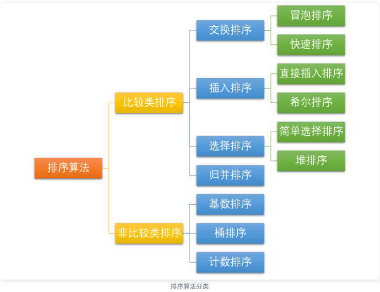
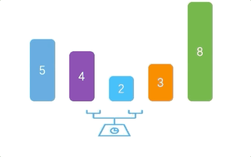
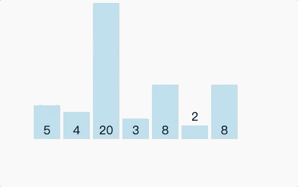

<!-- START doctoc generated TOC please keep comment here to allow auto update -->
<!-- DON'T EDIT THIS SECTION, INSTEAD RE-RUN doctoc TO UPDATE -->
**Table of Contents**  *generated with [DocToc](https://github.com/thlorenz/doctoc)*

- [排序算法分类](#%E6%8E%92%E5%BA%8F%E7%AE%97%E6%B3%95%E5%88%86%E7%B1%BB)
  - [1. 冒泡排序](#1-%E5%86%92%E6%B3%A1%E6%8E%92%E5%BA%8F)
  - [2. 快速排序](#2-%E5%BF%AB%E9%80%9F%E6%8E%92%E5%BA%8F)
    - [3. 插入排序 (Insertion Sort)](#3-%E6%8F%92%E5%85%A5%E6%8E%92%E5%BA%8F-insertion-sort)
  - [sort包分析](#sort%E5%8C%85%E5%88%86%E6%9E%90)
    - [sort.Search](#sortsearch)
  - [参考](#%E5%8F%82%E8%80%83)

<!-- END doctoc generated TOC please keep comment here to allow auto update -->

# 排序算法分类


我们常见的排序算法可以分为两大类：

- 比较类排序：通过比较来决定元素间的相对次序，由于其时间复杂度不能突破O(nlogn)，因此也称为非线性时间比较类排序。
- 非比较类排序：不通过比较来决定元素间的相对次序，它可以突破基于比较排序的时间下界，以线性时间运行，因此也称为线性时间非比较类排序。

```css
排序算法	时间复杂度(平均)	时间复杂度(最坏)	时间复杂度(最优)	空间复杂度           稳定性

冒泡排序	O(𝑛2)	        O(𝑛2)	        O(𝑛)	        O(1)                稳定
快速排序	O(nlogn)        O(𝑛2)	        O(nlogn)        O(nlogn)～O(n)      不稳定
插入排序	O(𝑛2)	        O(𝑛2)	        O(𝑛)	        O(1)                稳定
希尔排序	O(nlogn)~O(𝑛2)	O(𝑛2)	        O(𝑛1.3)	        O(1)                不稳定
选择排序	O(𝑛2)	        O(𝑛2)	        O(𝑛2)	        O(1)                稳定
堆排序	O(nlogn)        O(nlogn)        O(nlogn)        O(1)                不稳定
归并排序	O(nlogn)        O(nlogn)        O(nlogn)        O(n)	            稳定
计数排序	O(n+k)          O(n+k)          O(n+k)          O(k)                稳定
桶排序	O(n+k)          O(𝑛2)           O(𝑛2)           O(n+k)              稳定
基数排序	O(n*k)]         O(n*k)          O(n*k)          O(n+k)              稳定
```


常见的快速排序、归并排序、堆排序以及冒泡排序等都属于比较类排序算法。比较类排序是通过比较来决定元素间的相对次序，由于其时间复杂度不能突破 O(nlogn)，因此也称为非线性时间比较类排序。

在冒泡排序之类的排序中，问题规模为 n，又因为需要比较 n 次，所以平均时间复杂度为 O(n²)。
在归并排序、快速排序之类的排序中，问题规模通过分治法消减为 logn 次，所以时间复杂度平均 O(nlogn)。
比较类排序的优势是，适用于各种规模的数据，也不在乎数据的分布，都能进行排序。可以说，比较排序适用于一切需要排序的情况。

而计数排序、基数排序、桶排序则属于非比较类排序算法。非比较排序不通过比较来决定元素间的相对次序，而是通过确定每个元素之前，应该有多少个元素来排序。
由于它可以突破基于比较排序的时间下界，以线性时间运行，因此称为线性时间非比较类排序。 
非比较排序只要确定每个元素之前的已有的元素个数即可，所有一次遍历即可解决。算法时间复杂度 O(n)。

非比较排序时间复杂度低，但由于非比较排序需要占用空间来确定唯一位置。所以对数据规模和数据分布有一定的要求。


## 1. 冒泡排序
它重复地遍历要排序的序列，依次比较两个元素，如果它们的顺序错误就把它们交换过来。遍历序列的工作是重复地进行直到没有再需要交换为止，此时说明该序列已经排序完成。

这个算法的名字由来是因为越小的元素会经由交换慢慢 “浮” 到数列的顶端




步骤

1. 比较相邻的元素。如果第一个比第二个大，就交换他们两个。
2. 对每一对相邻元素作同样的工作，从开始第一对到结尾的最后一对。这步做完后，最后的元素会是最大的数。
3. 针对所有的元素重复以上的步骤，除了最后一个。
4. 持续每次对越来越少的元素重复上面的步骤，直到没有任何一对数字需要比较

## 2. 快速排序


通过一趟排序将待排记录分隔成独立的两部分，其中一部分的关键字比另一部分的关键字小

步骤

1. 从数列中挑出一个元素，称为 “基准”（pivot）;
2. 重新排序数列，所有元素比基准值小的摆放在基准前面，所有元素比基准值大的摆在基准的后面（相同的数可以到任一边）。在这个分区退出之后，该基准就处于数列的中间位置。这个称为分区（partition）操作；
3. 递归地（recursive）把小于基准值元素的子数列和大于基准值元素的子数列排序；


### 3. 插入排序 (Insertion Sort)


对于未排序数据，在已排序序列中从后向前扫描，找到相应位置并插入。

## sort包分析
```go
// go1.18/src/sort/slice.go
func Slice(x any, less func(i, j int) bool) {
	rv := reflectValueOf(x)
	swap := reflectSwapper(x)
	length := rv.Len()
	quickSort_func(lessSwap{less, swap}, 0, length, maxDepth(length))
}
```
go1.18: 名义上叫快速排序（quicksort），但其实质是混合排序算法（hybrid sorting algorithm），它们虽然在大部分情况下会使用快速排序算法，但是也会在不同情况下切换到其他排序算法。

Golang中 sort包内部实现了四种基本的排序算法

1. 插入排序 insertionSort: 对于未排序数据，在已排序序列由后向前扫描，找到相应位置并插入。
```go
// 插入排序
func insertionSort(data Interface, a, b int) {
	for i := a + 1; i < b; i++ {
		for j := i; j > a && data.Less(j, j-1); j-- {
			data.Swap(j, j-1)
		}
	}
}

```

2. 归并排序 symMerge


```go
// 归并排序
func symMerge(data Interface, a, m, b int) {
	// Avoid unnecessary recursions of symMerge
	// by direct insertion of data[a] into data[m:b]
	// if data[a:m] only contains one element.
	if m-a == 1 {
		// Use binary search to find the lowest index i
		// such that data[i] >= data[a] for m <= i < b.
		// Exit the search loop with i == b in case no such index exists.
		i := m
		j := b
		for i < j {
			h := int(uint(i+j) >> 1)
			if data.Less(h, a) {
				i = h + 1
			} else {
				j = h
			}
		}
		// Swap values until data[a] reaches the position before i.
		for k := a; k < i-1; k++ {
			data.Swap(k, k+1)
		}
		return
	}

	// Avoid unnecessary recursions of symMerge
	// by direct insertion of data[m] into data[a:m]
	// if data[m:b] only contains one element.
	if b-m == 1 {
		// Use binary search to find the lowest index i
		// such that data[i] > data[m] for a <= i < m.
		// Exit the search loop with i == m in case no such index exists.
		i := a
		j := m
		for i < j {
			h := int(uint(i+j) >> 1)
			if !data.Less(m, h) {
				i = h + 1
			} else {
				j = h
			}
		}
		// Swap values until data[m] reaches the position i.
		for k := m; k > i; k-- {
			data.Swap(k, k-1)
		}
		return
	}

	mid := int(uint(a+b) >> 1)
	n := mid + m
	var start, r int
	if m > mid {
		start = n - b
		r = mid
	} else {
		start = a
		r = m
	}
	p := n - 1

	for start < r {
		c := int(uint(start+r) >> 1)
		if !data.Less(p-c, c) {
			start = c + 1
		} else {
			r = c
		}
	}

	end := n - start
	if start < m && m < end {
		rotate(data, start, m, end)
	}
	if a < start && start < mid {
		symMerge(data, a, start, mid)
	}
	if mid < end && end < b {
		symMerge(data, mid, end, b)
	}
}
```

3. 堆排序 heapSort: 利用堆这种数据结构所设计的一种排序算法
```go
// 堆排序
func heapSort(data Interface, a, b int) {
	first := a
	lo := 0
	hi := b - a

	// Build heap with greatest element at top.
	for i := (hi - 1) / 2; i >= 0; i-- {
		siftDown(data, i, hi, first)
	}

	// Pop elements, largest first, into end of data.
	for i := hi - 1; i >= 0; i-- {
		data.Swap(first, first+i)
		siftDown(data, lo, i, first)
	}
}
```

4. 快速排序 quickSort
```go
// go1.18/src/sort/zfuncversion.go
func quickSort_func(data lessSwap, a, b, maxDepth int)
```


sort包内置的四种排序方法是不公开的，只能被用于sort包内部使用。因此，对数据集合排序时， 不必考虑应当选择哪一种，只需要实现sort.Interface接口定义三个接口即可
```go
type Interface interface{
    Len() int //返回集合中的元素个数
    Less(i,j int) bool//i>j 返回索引i的元素是否比索引j的元素小
    Swap(i,j int)//交换i和j的值
}
```
这里其实隐含要求这个容器或数据集合是slice类型或Array类型。否则，没法按照索引号取值
逆序:sort包提供了Reverse()方法，允许将数据按Less()定义的排序方式逆序排序，而无需修改Less()代码。

Note：Go的sort包已经为基本数据类型都实现了sort功能，其函数名的最后一个字母是s，表示sort之意。比如：Ints, Float64s, Strings，等等。

### sort.Search
该函数使用二分查找的方法，会从[0, n)中取出一个值index，index为[0, n)中最小的使函数f(index)为True的值，并且f(index+1)也为True

```go
func Search(n int, f func(int) bool) int {
	// Define f(-1) == false and f(n) == true.
	// Invariant: f(i-1) == false, f(j) == true.
	i, j := 0, n
	for i < j {
		// uint是无符号的int，范围是2^32即0到4294967295。使用uint可以避免因为i+j太大而造成的溢出
		//这里使用了移位操作， 向后移动一位，其结果与(i+j)/2一样
		h := int(uint(i+j) >> 1) // avoid overflow when computing h
		// i ≤ h < j
        // 如果f(h)返回false，说明从i到h中没有目标值。这时更新i为h+1 从原先的i到现在的i之间的数就不会再次扫描了 
        //相反的，如果f(h)返回true，说明从i到h中有目标值。这时更新j为 h
		if !f(h) {
			i = h + 1 // preserves f(i-1) == false
		} else {
			j = h // preserves f(j) == true
		}
	}
	// i == j, f(i-1) == false, and f(j) (= f(i)) == true  =>  answer is i.
	// 当 i==j 时，说明找到了（或者找完了但是没有找到，这时返回的是数组长度）
	return i
}
```

## 参考

- 使用 pdqsort 提案:https://github.com/golang/go/issues/50154