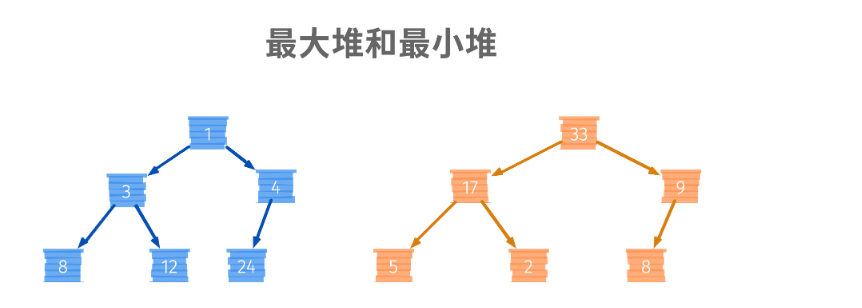
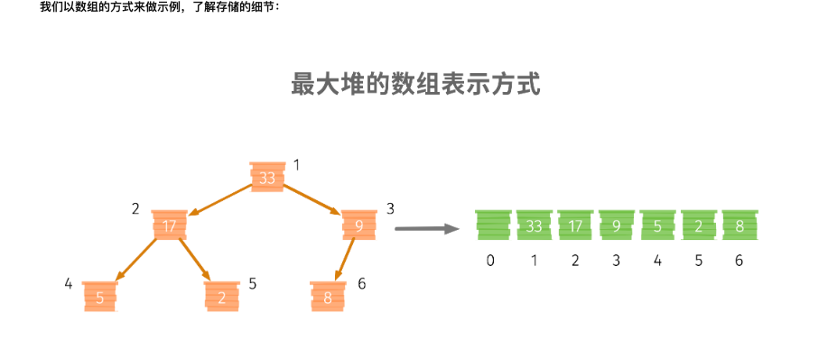
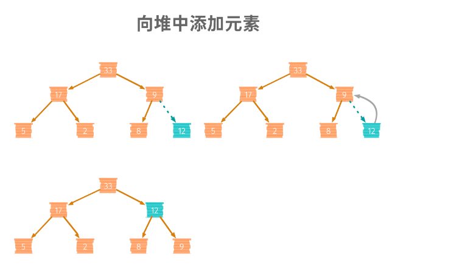
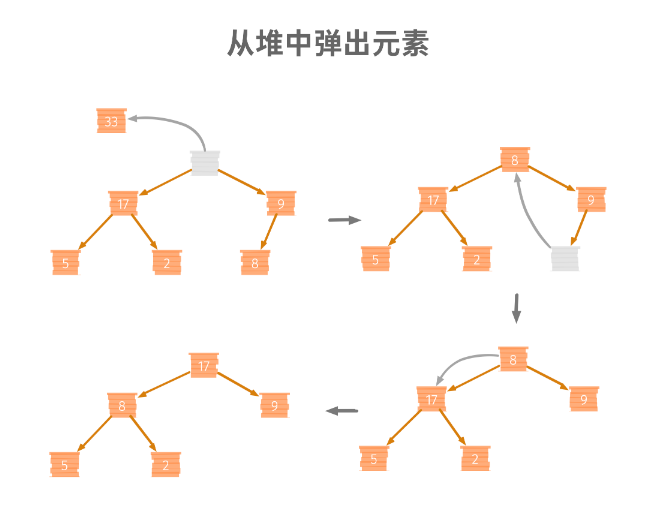

<!-- START doctoc generated TOC please keep comment here to allow auto update -->
<!-- DON'T EDIT THIS SECTION, INSTEAD RE-RUN doctoc TO UPDATE -->
**Table of Contents**  *generated with [DocToc](https://github.com/thlorenz/doctoc)*

- [container/heap](#containerheap)
  - [heap 的应用](#heap-%E7%9A%84%E5%BA%94%E7%94%A8)
  - [完全二叉树的存储方式](#%E5%AE%8C%E5%85%A8%E4%BA%8C%E5%8F%89%E6%A0%91%E7%9A%84%E5%AD%98%E5%82%A8%E6%96%B9%E5%BC%8F)
  - [最大堆图解操作](#%E6%9C%80%E5%A4%A7%E5%A0%86%E5%9B%BE%E8%A7%A3%E6%93%8D%E4%BD%9C)
  - [container/heap 包](#containerheap-%E5%8C%85)

<!-- END doctoc generated TOC please keep comment here to allow auto update -->

# container/heap

堆一般指二叉堆。是使用完全二叉树这种数据结构构建的一种实际应用。通过它的特性，分为最大堆和最小堆两种。



- 最小堆就是在这颗二叉树中，任何一个节点的值比其所在子树的任意一个节点都要小。所以，根节点就是 heap 中最小的值.

- 最大堆就是在这颗二叉树中，任何一个节点的值都比起所在子树的任意一个节点值都要大。


首先要将所有的元素构建为一个完全二叉树。完全二叉树是指除叶子节点，所有层级是满节点，叶子节点从左向右排列填满。

在一个完全二叉树中，将数据重新按照堆的的特性排列，就可以将完全二叉树变成一个堆。这个过程叫做“堆化”。

在堆中，我们要删除一个元素一般从堆顶删除（可以取到最大值/最小值）。
删除之后，数据集就不能算作一个堆了，因为最顶层的元素没有了，数据集不符合完全二叉树的定义。这时，我们需要将堆的数据进行重新排列，也就是重新“堆化”。
同样的，在堆中新添加一个元素也需要重新做“堆化”的操作，来将数据集恢复到满足堆定义的状态。

## heap 的应用
- 定时器
- 优先级队列：比如kubernetes中的实现，FIFO-PriorityQueue
- heap排序

## 完全二叉树的存储方式

对于二叉树来说，存储方式有2种，一种使用数组的形式来存储，一种使用链表的方式存储。
同样的，这两种方式继承了这两种数据结构的坏处和好处。
- 链表的方式相对浪费存储空间，因为要存储左右子树的指针，但扩缩容方便。
- 而数组更加节省空间，更加方便定位节点，缺点则是扩缩容不便。


## 最大堆图解操作


这 index= 1开始, 0 没有存储数据，左节点 2 * i, 右节点 2*i +1, 父节点就是 i/2


一个最大堆，【插入】和【弹出】这两个能力，就需要做“堆化”，使得堆满足定义

1 添加元素: 从下到上堆化


```go
func (h *Heap) downToUpHeapify(pos int) {
    for pos / 2 > 0 && h.data[pos/2].Less(h.data[pos]) { // 如果存在父节点 & 值大于父节点
        h.swap(pos, pos/2) // 交换两个值的位置
        pos = pos /2 // 将操作节点变为父节点的位置
    }
}
```

2 拿出元素: 堆顶向下堆化


```go
// 从上到下堆化
func (h *Heap) upToDownHeapify() {
    max := h.len
    i := 1
    pos := i
    for {
        if i * 2 <= max && h.data[i].Less(h.data[i*2]) { // 如果有左子树，且自己小于左子树
            pos = i*2 
        }

        if i *2 +1 <= max && h.data[pos].Less(h.data[i*2+1]) { // 如果有右子树，且自己小于右子树
            pos = i*2+1
        }
        if pos == i { // 如果位置没有变化，说明堆化结束
            break
        }

        h.swap(i, pos) // 交换当前位置和下一个位置的内容
        i = pos // 操作下一个位置
    }
}

```


## container/heap 包
Golang 的实现中，索引 0 是存储了数据的。 左节点 2 * i+1, 右节点 2*i +2 。可以实现最小堆和最大堆，通过Less实现。


初始化
```go
func Init(h Interface) {
	// heapify
	n := h.Len()
	for i := n/2 - 1; i >= 0; i-- {
		down(h, i, n)
	}
}
```


