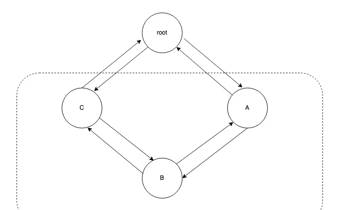

<!-- START doctoc generated TOC please keep comment here to allow auto update -->
<!-- DON'T EDIT THIS SECTION, INSTEAD RE-RUN doctoc TO UPDATE -->
**Table of Contents**  *generated with [DocToc](https://github.com/thlorenz/doctoc)*

- [container/list](#containerlist)
  - [源码](#%E6%BA%90%E7%A0%81)
    - [基础链表操作](#%E5%9F%BA%E7%A1%80%E9%93%BE%E8%A1%A8%E6%93%8D%E4%BD%9C)

<!-- END doctoc generated TOC please keep comment here to allow auto update -->

# container/list 

container/list 封装了双向链表 doubly linked list 的实现


## 源码

元素 Element

```go
// go1.20/src/container/list/list.go
// Element is an element of a linked list.
type Element struct {
    // To simplify the implementation, internally a list l is implemented
    // as a ring, such that &l.root is both the next element of the last
    // list element (l.Back()) and the previous element of the first list
    // element (l.Front()).
	next, prev *Element // 分别代表指向后一个元素和前一个元素的指针；
	
	list *List // 当前元素所属的 List；
	
	Value any // 存储在当前元素的值
}

```
> // To simplify the implementation, internally a list l is implemented
// as a ring, such that &l.root is both the next element of the last
// list element (l.Back()) and the previous element of the first list
// element (l.Front()).
> 
> container/list 中的 List 本质是个环形结构（ring），包含的 root 节点，既是双向链表中最后一个元素的 next，也是第一个元素的 prev。

 
本质是个 sentinel node，或者叫【哨兵节点】,虚线框里的东西是真正存储数据的【节点】，root 不存放数据，只用于辅助我们实现这个双向链表。

```go
// Next returns the next list element or nil.
func (e *Element) Next() *Element {
	if p := e.next; e.list != nil && p != &e.list.root {
		return p
	}
	return nil
}

// Prev returns the previous list element or nil.
func (e *Element) Prev() *Element {
	if p := e.prev; e.list != nil && p != &e.list.root {
		return p
	}
	return nil
}
```
当我们实现 Next() 方法时需要校验，如果某个节点的 next 是 root，说明它就是最后一个了，所以应该返回 nil（使用者是感知不到 root 的），Prev() 方法也是同理。


链表结构 list 

```go
// List represents a doubly linked list.
// The zero value for List is an empty list ready to use.
type List struct {
	root Element // sentinel list element, only &root, root.prev, and root.next are used
	len  int     // 链表的长度不包括 sentinel element
}

// Init initializes or clears list l.
func (l *List) Init() *List {
	l.root.next = &l.root
	l.root.prev = &l.root
	l.len = 0
	return l
}

```

获取头尾结点
```go
// Front returns 【头结点】
func (l *List) Front() *Element {
	if l.len == 0 {
		return nil
	}
	return l.root.next
}

// Back returns 【尾结点】
func (l *List) Back() *Element {
	if l.len == 0 {
		return nil
	}
	return l.root.prev
}
```

### 基础链表操作

插入数据
```go
func (l *List) InsertBefore(v any, mark *Element) *Element {
	if mark.list != l {
		return nil
	}
	// see comment in List.Remove about initialization of l
	return l.insertValue(v, mark.prev)
}

// insert inserts e after at, increments l.len, and returns e.
// insert 方法接收 e, at 两个 Element 指针入参，它的语义是将 e 元素挂在 at 元素之后。
func (l *List) insert(e, at *Element) *Element {
	// 调整 e 的前驱和后继
	e.prev = at
	e.next = at.next
	// 调整 at 和 at 的 next 的指针，让 e 作为中间节点
	e.prev.next = e
	e.next.prev = e
	// 将当前的 List 赋值给 e 的 list，调整长度即可
	e.list = l
	l.len++
	return e
}

// insertValue is a convenience wrapper for insert(&Element{Value: v}, at).
func (l *List) insertValue(v any, at *Element) *Element {
	return l.insert(&Element{Value: v}, at)
}

```


删除数据 

```go
func (l *List) Remove(e *Element) any {
	if e.list == l {
		// if e.list == l, l must have been initialized when e was inserted
		// in l or l == nil (e is a zero Element) and l.remove will crash
		l.remove(e)
	}
	return e.Value
}


// remove removes e from its list, decrements l.len
func (l *List) remove(e *Element) {
	e.prev.next = e.next
	e.next.prev = e.prev
	// 按照 GC 语言的特性，虽然逻辑上这个双向链表已经没有 e 了，但你没有把 e 的 next 和 prev 指针清空，就会导致随后它们指向的元素有可能不会被垃圾回收，导致出现内存泄漏。
	e.next = nil // avoid memory leaks
	e.prev = nil // avoid memory leaks
	e.list = nil
	l.len--
}
```

