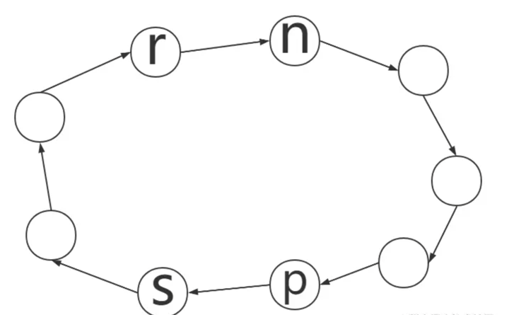
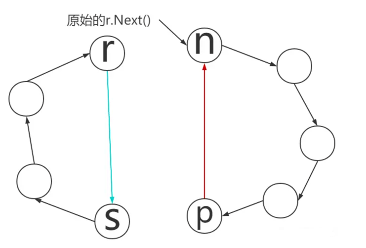

<!-- START doctoc generated TOC please keep comment here to allow auto update -->
<!-- DON'T EDIT THIS SECTION, INSTEAD RE-RUN doctoc TO UPDATE -->
**Table of Contents**  *generated with [DocToc](https://github.com/thlorenz/doctoc)*

- [ring](#ring)
  - [应用](#%E5%BA%94%E7%94%A8)
  - [使用](#%E4%BD%BF%E7%94%A8)
    - [基础方法](#%E5%9F%BA%E7%A1%80%E6%96%B9%E6%B3%95)
    - [初始化](#%E5%88%9D%E5%A7%8B%E5%8C%96)
    - [环的合并与拆分](#%E7%8E%AF%E7%9A%84%E5%90%88%E5%B9%B6%E4%B8%8E%E6%8B%86%E5%88%86)
    - [环的遍历](#%E7%8E%AF%E7%9A%84%E9%81%8D%E5%8E%86)
  - [参考](#%E5%8F%82%E8%80%83)

<!-- END doctoc generated TOC please keep comment here to allow auto update -->

# ring

ring 和之前介绍的双向链表对比,一个最大的不同是ring是一个环，没有开始位置和结束位置。所以代码实现上双向链表有区别：

- 因为没有开始和结束位置，就没有在开始和结束之间插入哨兵位置
- 没有维护列表级的信息，只有一个元素的结构体。
- 长度信息没有保存，获取列表长度需要每次算出来。Ring 的 Len 方法的算法复杂度是 O(N)，而 List 的 Len 算法复杂度是 O(1)
- 对元素的引用就相当于对整个列表的引用。

## 应用

Ring数据结构的应用场景
- 构造定长环回队列，如保存固定长度的数据等
- 用作固定长度的对象缓冲区

## 使用
将ring的方法主要分为四类
- 初始化方法
- 基础方法
- 环的合并与拆分
- 环的遍历
```go
func New(n int) *Ring               // 用于创建一个新的 Ring, 接收一个整形参数，用于初始化 Ring 的长度 
func (r *Ring) Len() int            // 环长度

func (r *Ring) Next() *Ring         // 返回当前元素的下个元素
func (r *Ring) Prev() *Ring         // 返回当前元素的上个元素
func (r *Ring) Move(n int) *Ring    // 指针从当前元素开始向后移动或者向前(n 可以为负数)

// Link & Unlink 组合起来可以对多个链表进行管理
func (r *Ring) Link(s *Ring) *Ring  // 将环s合并到环r中，使得r.Next()指向s，返回原来的r.Next()。要求r不能为空
func (r *Ring) Unlink(n int) *Ring  // 从r.Next()元素开始，从环中移除n个元素。实际上调用了Link()方法。返回被移除的子环。要求r不能为空。

func (r *Ring) Do(f func(interface{}))  // Do 会依次将每个节点的 Value 当作参数调用这个函数 f, 实际上这是策略方法的引用，通过传递不同的函数以在同一个 ring 上实现多种不同的操作
```


### 基础方法
求长度

```go
func (r *Ring) Len() int {
	n := 0
	if r != nil {
		n = 1
		for p := r.Next(); p != r; p = p.next {
			n++
		}
	}
	return n
}
```

### 初始化

```go
// go1.21.5/src/container/ring/ring.go

// 一个Ring是一个环形链表的元素，对于环而言，并不存在起始点或者终止点。
type Ring struct {
	next, prev *Ring // // 分别指向下一个元素与上一个元素
	Value      any // 该元素内实际存储的数据
}

```

```go
func New(n int) *Ring {
	if n <= 0 { // 保证大小 >0
		return nil
	}
	r := new(Ring)
	p := r
	for i := 1; i < n; i++ {// 创建 n-1 个实例,并连接
		p.next = &Ring{prev: p}
		p = p.next
	}
	// 首尾连接
	p.next = r
	r.prev = p
	return r
}
```


### 环的合并与拆分


环的原始状态: 两个元素节点分别是r与s，r.Next()为n节点，s.Prev()为p节点。为了方便理解，我们仅画出了next指针的线条，prev与next刚好相反

```go
func (r *Ring) Link(s *Ring) *Ring {
	n := r.Next()
	if s != nil {
		p := s.Prev()
		r.next = s
		s.prev = r
		n.prev = p
		p.next = n
	}
	return n
}

// Unlink removes n % r.Len() elements from the ring r, starting
// at r.Next(). If n % r.Len() == 0, r remains unchanged.
// The result is the removed subring. r must not be empty.
func (r *Ring) Unlink(n int) *Ring {
	if n <= 0 {
		return nil
	}
	return r.Link(r.Move(n + 1))
}
```


执行完Link()方法合并后，环的状态:节点r与节点s组成的新环已经移除了两个节点之间的其他节点。而被移除的节点形成了一个新的子环，由于返回的节点是原始的r.Next()，因此返回的节点指向新的子环


### 环的遍历

```go
func (r *Ring) Do(f func(any)) {
	if r != nil {
		f(r.Value)
		for p := r.Next(); p != r; p = p.next {
			f(p.Value)
		}
	}
}

```

## 参考

- [ring的介绍与使用](https://juejin.cn/post/6962482687986630686)