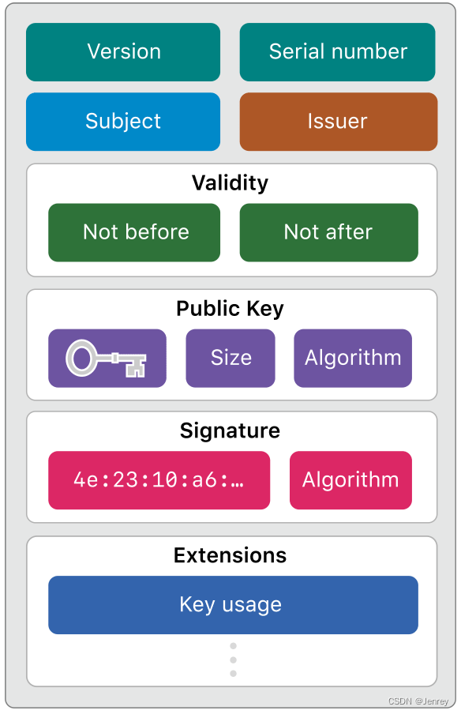
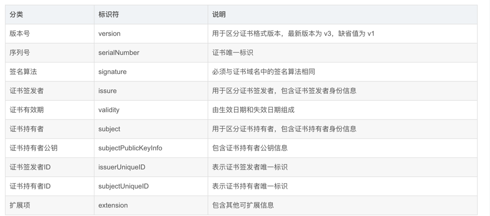
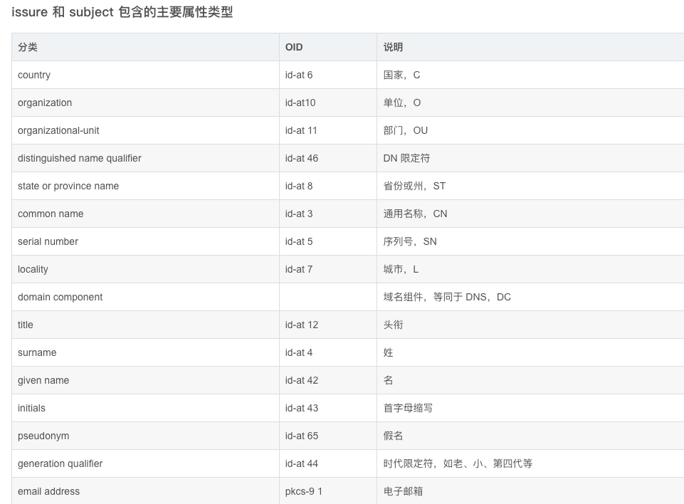

<!-- START doctoc generated TOC please keep comment here to allow auto update -->
<!-- DON'T EDIT THIS SECTION, INSTEAD RE-RUN doctoc TO UPDATE -->
**Table of Contents**  *generated with [DocToc](https://github.com/thlorenz/doctoc)*

- [X.509 标准](#x509-%E6%A0%87%E5%87%86)
  - [crypto/x509 包](#cryptox509-%E5%8C%85)
    - [类型定义](#%E7%B1%BB%E5%9E%8B%E5%AE%9A%E4%B9%89)
    - [x509 包函数](#x509-%E5%8C%85%E5%87%BD%E6%95%B0)
  - [参考资料](#%E5%8F%82%E8%80%83%E8%B5%84%E6%96%99)

<!-- END doctoc generated TOC please keep comment here to allow auto update -->

# X.509 标准

X.509标准是Public Key Certificates的格式标准。X.509 证书己应用在包括TLS/SSL（WWW万维网安全浏览的基石）在内的众多 Internet协议里，同时它也有很多非在线的应用场景，比如电子签名服务。

而所谓Public Key Certificates又被称为Digital Certificate 或 Identity Certificate。

X.509证书含有公钥和标识（主机名、组织或个人），并由证书颁发机构（CA）签名（或自签名）。对于一份经由可信的证书签发机构签名（或者可以通过其它方式验证）的证书，证书的拥有者就可以用证书及相应的私钥来创建安全的通信，以及对文档进行数字签名。
X.509证书的结构是用ASN.1(Abstract Syntax Notation One：抽象语法标记)来描述其数据结构，并使用ASN1语法进行编码。

X.509 标准主要内容：证书的作用、证书文件的结构、证书管理方式、证书校验方式、证书的撤销等。

Internet工程任务组（IETF）建立了公钥基础设施X.509（Public Key Infrastructure X.509，PKIX）工作组，扩展X.509标准的基本思想，指定Internet世界中如何部署数字证书。

X.509 标准定义了证书应该包含的内容，而为了让机器和人更好地理解和组织 X.509 标准，可以采用 ASN.1标准来描述 X.509 标准（或者说证书），ASN.1 类似于伪代码，是一种可理解的数据结构。


X.509 v3数字证书的结构如下：
```
Certificate:
    Data:
        Version: 3 (0x2)
        Serial Number:
            10:e6:fc:62:b7:41:8a:d5:00:5e:45:b6
    Signature Algorithm: sha256WithRSAEncryption
        Issuer: C=BE, O=GlobalSign nv-sa, CN=GlobalSign Organization Validation CA - SHA256 - G2
        Validity
            Not Before: Nov 21 08:00:00 2016 GMT
            Not After : Nov 22 07:59:59 2017 GMT
        Subject: C=US, ST=California, L=San Francisco, O=Wikimedia Foundation, Inc., CN=*.wikipedia.org
        Subject Public Key Info:
            Public Key Algorithm: id-ecPublicKey
                Public-Key: (256 bit)
                pub: 
                    04:c9:22:69:31:8a:d6:6c:ea:da:c3:7f:2c:ac:a5:
                    af:c0:02:ea:81:cb:65:b9:fd:0c:6d:46:5b:c9:1e:
                    ed:b2:ac:2a:1b:4a:ec:80:7b:e7:1a:51:e0:df:f7:
                    c7:4a:20:7b:91:4b:20:07:21:ce:cf:68:65:8c:c6:
                    9d:3b:ef:d5:c1
                ASN1 OID: prime256v1
                NIST CURVE: P-256
        X509v3 extensions:
            X509v3 Key Usage: critical
                Digital Signature, Key Agreement
            Authority Information Access: 
                CA Issuers - URI:http://secure.globalsign.com/cacert/gsorganizationvalsha2g2r1.crt
                OCSP - URI:http://ocsp2.globalsign.com/gsorganizationvalsha2g2
 
            X509v3 Certificate Policies: 
                Policy: 1.3.6.1.4.1.4146.1.20
                  CPS: https://www.globalsign.com/repository/
                Policy: 2.23.140.1.2.2
 
            X509v3 Basic Constraints: 
                CA:FALSE
            X509v3 CRL Distribution Points: 
 
                Full Name:
                  URI:http://crl.globalsign.com/gs/gsorganizationvalsha2g2.crl
 
            X509v3 Subject Alternative Name: 
                DNS:*.wikipedia.org, DNS:*.m.mediawiki.org, DNS:*.m.wikibooks.org, DNS:*.m.wikidata.org, DNS:*.m.wikimedia.org, DNS:*.m.wikimediafoundation.org, DNS:*.m.wikinews.org, DNS:*.m.wikipedia.org, DNS:*.m.wikiquote.org, DNS:*.m.wikisource.org, DNS:*.m.wikiversity.org, DNS:*.m.wikivoyage.org, DNS:*.m.wiktionary.org, DNS:*.mediawiki.org, DNS:*.planet.wikimedia.org, DNS:*.wikibooks.org, DNS:*.wikidata.org, DNS:*.wikimedia.org, DNS:*.wikimediafoundation.org, DNS:*.wikinews.org, DNS:*.wikiquote.org, DNS:*.wikisource.org, DNS:*.wikiversity.org, DNS:*.wikivoyage.org, DNS:*.wiktionary.org, DNS:*.wmfusercontent.org, DNS:*.zero.wikipedia.org, DNS:mediawiki.org, DNS:w.wiki, DNS:wikibooks.org, DNS:wikidata.org, DNS:wikimedia.org, DNS:wikimediafoundation.org, DNS:wikinews.org, DNS:wikiquote.org, DNS:wikisource.org, DNS:wikiversity.org, DNS:wikivoyage.org, DNS:wiktionary.org, DNS:wmfusercontent.org, DNS:wikipedia.org
            X509v3 Extended Key Usage: 
                TLS Web Server Authentication, TLS Web Client Authentication
            X509v3 Subject Key Identifier: 
                28:2A:26:2A:57:8B:3B:CE:B4:D6:AB:54:EF:D7:38:21:2C:49:5C:36
            X509v3 Authority Key Identifier: 
                keyid:96:DE:61:F1:BD:1C:16:29:53:1C:C0:CC:7D:3B:83:00:40:E6:1A:7C
 
    Signature Algorithm: sha256WithRSAEncryption
         8b:c3:ed:d1:9d:39:6f:af:40:72:bd:1e:18:5e:30:54:23:35:
         ...
```
证书中各个字段的含义如下：

- 证书版本（Version）：表示证书的版本号。
- 序列号（Serial Number）：表示证书的唯一序列号。
- 签名算法（Signature Algorithm）：表示证书的签名算法，例如 RSA、DSA 或 ECDSA 等。
- 证书颁发机构（Issuer）：表示颁发该证书的可信的第三方机构的名称。
- 有效期（Validity）：表示证书的有效期，包括证书生效日期（Not Before）和证书失效日期（Not After）。
- 使用者（Subject）：表示证书所有者的名称。
- 公钥信息（Subject Public Key Info）：表示证书所有者的公钥以及公钥的算法。
- 扩展（Extensions）：表示证书的扩展信息，包括：
  - 密钥用法扩展（Key Usage Extension）：表示证书所有者的密钥可用于哪些操作，例如数字签名、密钥加密等。
  - 扩展密钥用法扩展（Extended Key Usage Extension）：表示证书所有者的密钥可用于哪些扩展的操作，例如 TLS Web Server Authentication、TLS Web Client Authentication 等。
  - 基本约束扩展（Basic Constraints Extension）：表示证书所有者是否是证书颁发机构的下级机构，以及是否允许其作为证书颁发机构颁发其他证书。
  - 主体密钥表示扩展（Authority Key Identifier）：包含一个或多个唯一的标识符，用于表示证书颁发机构的密钥。这些标识符可以是证书颁发机构的公钥哈希值，也可以是证书颁发机构的证书序列号。该扩展用于验证证书的合法性，例如在验证证书链时，用于验证证书颁发机构是否为可信的机构。这个扩展字段是可选的，但在许多情况下都会被使用。
  - 主体替代名称扩展（Subject Alternative Name Extension）：表示证书所有者的其他名称，例如域名、IP 地址、电子邮件地址等。



证书颁发机构（Issuer） 和 使用者（Subject）主要属性 


Note：对于所有的版本，同一个CA颁发的证书序列号都必须是唯一的。


## crypto/x509 包
- crypto/x509 主要用于解析 X.509 编码的密钥和证书.

- crypto/x509/pkix 包含用于 X.509 证书，CRL 和 OCSP 的 ASN.1 解析和序列化的共享低级结构

### 类型定义
```go
// certificates 证书的集合
type CertPool struct {
    // contains filtered or unexported fields
}

// X509 证书
type Certificate struct {
    // 证书的 subject 信息,包含 CN,O,L,S,C等字段
    Subject pkix.Name
    // contains filtered or unexported fields
}
// key 的扩展用法
type ExtKeyUsage int
// Key 的用法
type KeyUsage int

// 证书签署请求
type CertificateRequest struct {
    // 签名
    Signature          []byte
    // 签名算法
    SignatureAlgorithm SignatureAlgorithm
    // 私钥算法
    PublicKeyAlgorithm PublicKeyAlgorithm
    // 私钥
    PublicKey          interface{}
    // 证书签署请求的 subject
    Subject pkix.Name
    // contains filtered or unexported fields
}

// 验证的选项
type VerifyOptions struct {
    DNSName       string
    Intermediates *CertPool
    Roots         *CertPool // 默认使用系统根证书
    CurrentTime   time.Time // 当前时间
    KeyUsages []ExtKeyUsage
    MaxConstraintComparisions int
}
```

公钥算法
```go
// /Users/python/go/go1.18/src/crypto/x509/x509.go


// 公钥算法
const (
    UnknownPublicKeyAlgorithm PublicKeyAlgorithm = iota
    RSA
    DSA
    ECDSA
    Ed25519
)
// 签名算法
const (
    UnknownSignatureAlgorithm SignatureAlgorithm = iota
    MD2WithRSA
    MD5WithRSA
    SHA1WithRSA
    SHA256WithRSA
    SHA384WithRSA
    SHA512WithRSA
    DSAWithSHA1
    DSAWithSHA256
    ECDSAWithSHA1
    ECDSAWithSHA256
    ECDSAWithSHA384
    ECDSAWithSHA512
    SHA256WithRSAPSS
    SHA384WithRSAPSS
    SHA512WithRSAPSS
    PureEd25519
)
// 扩展 Key 用法
const (
    ExtKeyUsageAny ExtKeyUsage = iota
    ExtKeyUsageServerAuth
    ExtKeyUsageClientAuth
    ExtKeyUsageCodeSigning
    ExtKeyUsageEmailProtection
    ExtKeyUsageIPSECEndSystem
    ExtKeyUsageIPSECTunnel
    ExtKeyUsageIPSECUser
    ExtKeyUsageTimeStamping
    ExtKeyUsageOCSPSigning
    ExtKeyUsageMicrosoftServerGatedCrypto
    ExtKeyUsageNetscapeServerGatedCrypto
    ExtKeyUsageMicrosoftCommercialCodeSigning
    ExtKeyUsageMicrosoftKernelCodeSigning
)
// key 用法
const (
    KeyUsageDigitalSignature KeyUsage = 1 << iota
    KeyUsageContentCommitment
    KeyUsageKeyEncipherment
    KeyUsageDataEncipherment
    KeyUsageKeyAgreement
    KeyUsageCertSign
    KeyUsageCRLSign
    KeyUsageEncipherOnly
    KeyUsageDecipherOnly
)
```

### x509 包函数
```go
// 基于 template 创建一个新的由 parent 签署的 X509 v3 证书.返回 DER 编码的证书
// 如果 parent=template,则该证书是自签证书.
// 如果是自签证书生成证书的 AuthorityKeyId 会从父级的 SubjectKeyId 中获取,否则使用 template 中的值
// pub,priv 分别为签署人的公钥和私钥, priv 必须是实现 `crypto.Signal` 接口的 `PrivateKey` 类型.当前支持的类型为 *rsa.PublicKey,*ecdsa.PublicKey 和 *ed25519.PublicKey.
func CreateCertificate(rand io.Reader, template, parent *Certificate, pub, priv interface{}) (cert []byte, err error)
// 基于 template 创建一个证书签署请求
// priv 是用于签署 CSR 的私钥,并将其公钥放在 CSR 中,priv 必须实现 `crypto.Signal` 接口
func CreateCertificateRequest(rand io.Reader, template *CertificateRequest, priv interface{}) (csr []byte, err error)

// 在使用openssl进行私钥生成的时候，openssl需要我提供私钥的访问密码
// 使用 password 对 PEM 块进行解密,返回 DER 编码的字节切片
func DecryptPEMBlock(b *pem.Block, password []byte) ([]byte, error)
// 使用指定 alg 和 password 对给定 DER 编码的 data 进行加密.返回加密后的 PEM 块
func EncryptPEMBlock(rand io.Reader, blockType string, data, password []byte, alg PEMCipher) (*pem.Block, error)

// 判断 PEM 块是否使用密码加密
func IsEncryptedPEMBlock(b *pem.Block) bool

// 返回一个空的 CertPool
func NewCertPool() *CertPool
// 返回系统证书池的副本.CertPool 的任何变动都不会写入磁盘
func SystemCertPool() (*CertPool, error)

// 从 ASN.1 数据中解析证书.返回证书或证书列表
func ParseCertificate(asn1Data []byte) (*Certificate, error)
func ParseCertificates(asn1Data []byte) ([]*Certificate, error)
```

CertPool 结构体方法

```go
// /Users/python/go/go1.18/src/crypto/x509/cert_pool.go
// 向证书池中添加证书
func (s *CertPool) AddCert(cert *Certificate)
// 尝试解析 PEM 编码的证书,并将其添加到证书池中
func (s *CertPool) AppendCertsFromPEM(pemCerts []byte) (ok bool)
// 返回证书池中所有证书的 DER 编码的 subject 的列表
func (s *CertPool) Subjects() [][]byte
```

Certificate 结构体方法
```go
// 检查 crl 中签名是否来自 c
func (c *Certificate) CheckCRLSignature(crl *pkix.CertificateList) error
// 使用指定签名算法 algo 验证 signature 是否是通过 c 的私钥签署了 signed 签名
func (c *Certificate) CheckSignature(algo SignatureAlgorithm, signed, signature []byte) error
// 验证 c 上的签名是否是来自 parent 的有效签名
func (c *Certificate) CheckSignatureFrom(parent *Certificate) error
// 返回证书签名的 DER 编码的 CRL 证书吊销列表,包含指定的的吊销证书列表
func (c *Certificate) CreateCRL(rand io.Reader, priv interface{}, revokedCerts []pkix.RevokedCertificate, now, expiry time.Time) (crlBytes []byte, err error)
// 使用 opts.Roots 中的证书,验证 c
func (c *Certificate) Verify(opts VerifyOptions) (chains [][]*Certificate, err error)
// 验证 c 是否是指定主机的有效证书
func (c *Certificate) VerifyHostname(h string) error
```


## 参考资料
1. x509证书介绍及使用