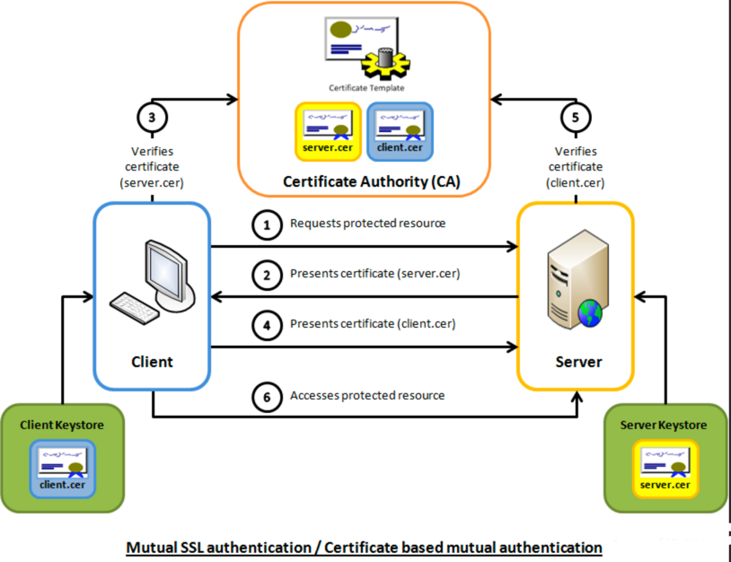

# 证书

## 证书相关概念
- 证书吊销列表 (Certificate Revocation List ，简称： CRL) 是 PKI 系统中的一个结构化数据文件，该文件包含了证书颁发机构 (CA) 已经吊销的证书的序列号及其吊销日期
- CA(Certificate Authority) 是证书的签发机构，它是公钥基础设施（Public Key Infrastructure，PKI）的核心。
  任何个体/组织都可以扮演 CA 的角色，只不过难以得到客户端的信任，能够受浏览器默认信任的 CA 大厂商有很多，其中 TOP5 是 Symantec、Comodo、Godaddy、GolbalSign 和 Digicert


## 证书种类
证书分为根证书、服务器证书、客户端证书。根证书文件（ca.crt）和根证书对应的私钥文件（ca.key）由 CA（证书授权中心，国际认可）生成和保管。那么服务器如何获得证书呢？向 CA 申请！步骤如下：

1. 服务器生成自己的公钥（server.pub）和私钥（server.key）。后续通信过程中，客户端使用该公钥加密通信数据，服务端使用对应的私钥解密接收到的客户端的数据；

2. 服务器使用公钥生成请求文件（server.req），请求文件中包含服务器的相关信息，比如域名、公钥、组织机构等

3. 服务器将 server.req 发送给 CA。CA 验证服务器合法后，使用 ca.key 和 server.req 生成证书文件（server.crt）——使用私钥生成证书的签名数据；

4. CA 将证书文件（server.crt）发送给服务器。

由于ca.key 和 ca.crt 是一对，ca.crt 文件中包含公钥，因此 ca.crt 可以验证 server.crt是否合法——使用公钥验证证书的签名。

### 服务器证书分类


- DV（Domain Validation），面向个体用户，安全体系相对较弱，验证方式就是向 whois 信息中的邮箱发送邮件，按照邮件内容进行验证即可通过；
- OV（Organization Validation），面向企业用户，证书在 DV 证书验证的基础上，还需要公司的授权，CA 通过拨打信息库中公司的电话来确认；
- EV（Extended Validation），打开 Github 的网页，你会看到 URL 地址栏展示了注册公司的信息，这会让用户产生更大的信任，这类证书的申请除了以上两个确认外，还需要公司提供金融机构的开户许可证，要求十分严格

## 自建CA

OpenSSL 是一个免费开源的库，它提供了构建数字证书的命令行工具，其中一些可以用来自建 Root CA。

很多网站都希望用户知道他们建立的网络通道是安全的，所以会想 CA 机构购买证书来验证 domain，所以我们也可以在很多 HTTPS 的网页地址栏看到一把小绿锁。

然而在一些情况下，我们没必要去 CA 机构购买证书，比如在内网的测试环境中，为了验证 HTTPS 下的一些问题，我们不需要部署昂贵的证书，这个时候自建 Root CA，给自己颁发证书就显得很有价值了

扮演 CA 角色，就意味着要管理大量的 pair 对，而原始的一对 pair 对叫做 root pair，它包含了 root key（ca.key.pen）和 root certificate（ca.cert.pem）。
通常情况下，root CA 不会直接为服务器或者客户端签证，它们会先为自己生成几个中间 CA（intermediate CAs），这几个中间 CA 作为 root CA 的代表为服务器和客户端签证

### 创建 root pair
1. 创建 root key
```shell
➜  ca git:(feature/asm) ✗ openssl genrsa -aes256 -out private/ca.key.pem 4096
Generating RSA private key, 4096 bit long modulus
........................................++
.........................................................................................................................................................................................++
e is 65537 (0x10001)
Enter pass phrase for private/ca.key.pem:
4299916844:error:28FFF065:lib(40):CRYPTO_internal:result too small:/AppleInternal/Library/BuildRoots/20d6c351-ee94-11ec-bcaf-7247572f23b4/Library/Caches/com.apple.xbs/Sources/libressl/libressl-2.8/crypto/ui/ui_lib.c:830:You must type in 4 to 1023 characters
Enter pass phrase for private/ca.key.pem:
Verifying - Enter pass phrase for private/ca.key.pem:

```
2. 创建 root cert 签发证书
```shell
➜  ca git:(feature/asm) ✗ wget -O ./openssl.cnf raw.githubusercontent.com/barretlee/autocreate-ca/master/cnf/root-ca  
--2022-09-03 14:28:39--  http://raw.githubusercontent.com/barretlee/autocreate-ca/master/cnf/root-ca
正在解析主机 raw.githubusercontent.com (raw.githubusercontent.com)... 185.199.109.133, 185.199.111.133, 185.199.110.133, ...
正在连接 raw.githubusercontent.com (raw.githubusercontent.com)|185.199.109.133|:80... 已连接。
已发出 HTTP 请求，正在等待回应... 301 Moved Permanently
位置：https://raw.githubusercontent.com/barretlee/autocreate-ca/master/cnf/root-ca [跟随至新的 URL]
--2022-09-03 14:28:39--  https://raw.githubusercontent.com/barretlee/autocreate-ca/master/cnf/root-ca
正在连接 raw.githubusercontent.com (raw.githubusercontent.com)|185.199.109.133|:443... 已连接。
已发出 HTTP 请求，正在等待回应... 200 OK
长度：4195 (4.1K) [text/plain]
正在保存至: “./openssl.cnf”

./openssl.cnf                                               100%[========================================================================================================================================>]   4.10K  --.-KB/s  用时 0.004s  

2022-09-03 14:28:40 (967 KB/s) - 已保存 “./openssl.cnf” [4195/4195])

```
```shell
➜  ca git:(feature/asm) ✗ openssl req -config openssl.cnf \
      -key private/ca.key.pem \
      -new -x509 -days 7300 -sha256 -extensions v3_ca \
      -out certs/ca.cert.pem
Enter pass phrase for private/ca.key.pem:
You are about to be asked to enter information that will be incorporated
into your certificate request.
What you are about to enter is what is called a Distinguished Name or a DN.
There are quite a few fields but you can leave some blank
For some fields there will be a default value,
If you enter '.', the field will be left blank.
-----
Country Name (2 letter code) [GB]:CN
State or Province Name [England]:Shanghai
Locality Name []:
Organization Name [Alice Ltd]:Dannt Ltd
Organizational Unit Name []:Devops
Common Name []:Danny Common CA
Email Address []:540021730@qq.com

```
其中，ca.key.pem 是我们CA的私钥，ca.cert.pem 是我们CA的证书

3. 验证证书
```shell
➜  ca git:(feature/asm) ✗ openssl x509 -noout -text -in certs/ca.cert.pem

Certificate:
    Data:
        Version: 3 (0x2)
        Serial Number: 11249006341064191018 (0x9c1c7faadb3f6c2a)
    Signature Algorithm: sha256WithRSAEncryption
        Issuer: C=CN, ST=Shanghai, O=Dannt Ltd, OU=Devops, CN=Danny Common CA/emailAddress=540021730@qq.com
        Validity
            Not Before: Sep  3 06:31:56 2022 GMT
            Not After : Aug 29 06:31:56 2042 GMT
        Subject: C=CN, ST=Shanghai, O=Dannt Ltd, OU=Devops, CN=Danny Common CA/emailAddress=540021730@qq.com
        Subject Public Key Info:
            Public Key Algorithm: rsaEncryption
                Public-Key: (4096 bit)
                Modulus:
                    00:9f:87:7b:99:2b:29:50:9f:8c:ff:9f:1a:47:3c:
                    5e:db:b0:21:c2:8c:a6:e1:f5:9d:ab:34:31:f2:04:
                    e9:32:2b:bb:eb:a5:c9:12:0e:7b:39:4a:26:30:6d:
                    82:9c:9a:f4:df:99:07:9d:c7:55:e7:df:8d:1e:f5:
                    88:20:ae:1b:91:85:13:78:0c:21:f3:21:1b:fe:1e:
                    2d:ee:c5:c7:6b:1a:8b:4f:a4:5e:05:6f:50:8c:08:
                    92:f0:2a:26:91:5d:2a:1b:c5:ea:06:b2:76:ad:f4:
                    61:3e:30:55:65:92:84:1d:84:a3:e8:42:48:41:0f:
                    11:7c:e4:33:5c:f7:7b:02:2f:a0:9e:8d:82:de:ff:
                    ca:ad:0e:40:e0:9f:eb:d4:7e:ca:62:81:63:4b:17:
                    ce:16:e3:49:a0:64:be:54:b1:32:c3:95:f7:db:bc:
                    6b:b6:4c:49:49:4b:e8:07:f5:6a:b7:f7:2f:cf:09:
                    cc:da:09:be:b6:d1:ee:01:4b:20:23:4e:02:61:5f:
                    89:57:4d:5d:15:7b:c6:bc:bb:c7:89:4c:26:df:99:
                    97:97:bf:97:35:fa:39:a4:01:7b:85:cc:98:5b:cc:
                    20:df:7c:ca:60:cf:a5:5c:73:db:b2:2d:99:43:d8:
                    22:66:05:ef:12:4a:e2:ad:d1:11:7f:33:1e:33:06:
                    d4:af:6f:87:17:36:bf:f2:24:ff:2d:07:30:a6:bb:
                    97:05:60:ea:a6:3a:51:75:5a:57:61:4e:b6:b0:a1:
                    44:1b:b5:40:d2:00:70:13:61:6e:56:99:12:09:a4:
                    b7:dc:ea:82:16:22:88:3d:68:56:7b:e3:bb:61:9a:
                    0c:93:2a:a2:39:84:c3:1f:bb:6e:6f:bc:8d:22:f9:
                    ef:e9:55:4c:f7:a6:7e:e5:fc:eb:cc:80:12:4c:19:
                    b4:98:c5:64:4a:5b:d9:2b:33:cb:2f:75:d2:7f:17:
                    18:be:ab:06:bc:9b:d1:af:28:a2:12:a6:4e:b3:aa:
                    f6:18:69:bd:e0:9b:e3:ed:07:6c:af:ff:c1:3f:d1:
                    fe:0a:68:c2:e7:69:30:c4:2c:0f:ff:48:71:dd:51:
                    c0:4b:d7:29:c8:26:f7:11:d5:26:a7:44:15:da:55:
                    a9:56:cb:ee:c1:c9:0c:79:05:8b:30:6d:13:90:0f:
                    a2:e1:d3:fd:a6:b2:ff:3c:f9:96:0f:0b:6c:4d:ad:
                    1e:5e:07:cc:f8:6d:1e:1b:30:96:6f:b9:4c:59:b3:
                    da:d7:a7:4b:f0:67:f6:27:23:9b:33:c9:df:c5:92:
                    b3:17:5e:c7:22:42:b6:ae:b8:d7:25:d4:f9:5c:30:
                    3d:50:fb:c3:1a:25:87:33:e6:80:9c:cb:32:a3:aa:
                    03:5c:e1
                Exponent: 65537 (0x10001)
        X509v3 extensions:
            X509v3 Subject Key Identifier: 
                2F:31:A4:00:DB:20:9F:9E:9C:87:D3:64:DB:00:C8:30:42:04:85:C6
            X509v3 Authority Key Identifier: 
                keyid:2F:31:A4:00:DB:20:9F:9E:9C:87:D3:64:DB:00:C8:30:42:04:85:C6

            X509v3 Basic Constraints: critical
                CA:TRUE
            X509v3 Key Usage: critical
                Digital Signature, Certificate Sign, CRL Sign
    Signature Algorithm: sha256WithRSAEncryption
         05:8e:18:88:d4:dd:e7:7a:86:cd:ed:ef:b2:f6:fb:39:b9:3b:
         91:42:67:cd:b2:7a:73:0d:9e:09:9f:11:6f:54:06:1b:96:0d:
         7e:39:6c:a1:e2:72:b9:08:1c:54:d4:97:86:2c:0d:61:78:b8:
         5e:78:a8:d9:ec:52:e3:95:8c:10:ec:c0:13:a2:3e:16:c4:75:
         47:d7:41:ac:30:f3:74:dc:ab:6e:68:bf:d3:64:bd:4b:c5:1f:
         cd:65:ca:e8:a0:3e:6f:93:ae:a3:8f:56:ce:82:19:d4:2c:74:
         be:34:4c:8b:2e:82:eb:61:56:54:20:3f:e7:76:00:e9:d5:f4:
         7c:ac:95:98:e3:a1:14:1d:2a:bf:be:b9:19:2e:c2:31:6b:80:
         97:bc:9e:58:dd:97:3a:2e:35:de:d6:ac:03:c0:0b:75:32:45:
         cf:89:46:80:86:c0:22:22:aa:f5:eb:dd:9e:ce:69:8b:76:2d:
         0f:ee:e6:28:d6:53:6a:7b:41:86:a7:03:84:a4:ae:0f:75:a9:
         cc:09:99:8b:f1:15:00:99:28:5c:e6:bb:2c:a5:2a:af:4c:2f:
         fc:d8:ca:08:04:70:97:0e:c7:d8:4b:12:9f:6a:a3:28:b2:e5:
         33:9d:0b:96:5c:5e:3b:2a:bc:60:9a:70:b1:e7:94:ea:d3:0e:
         90:28:80:7c:af:4e:26:0b:23:b4:51:30:2f:45:e9:60:ec:cb:
         1a:5e:7f:f2:af:68:dc:66:57:ca:dd:62:25:22:32:ab:86:d9:
         d8:29:b2:50:2d:66:45:39:3a:46:58:00:2d:e5:5d:da:f4:76:
         02:b6:b4:6e:9c:f7:d5:97:30:bd:85:ed:94:3d:b7:2f:d6:f1:
         9b:1f:86:c8:f6:e0:dc:24:da:3c:7d:04:02:96:35:65:54:71:
         c1:9e:c8:26:29:4a:da:48:c7:ae:f4:26:4c:91:50:c6:31:c3:
         fc:ad:62:2f:b1:0d:20:71:84:81:99:16:06:b4:ac:33:e2:1d:
         01:7d:27:d8:76:aa:f6:67:d8:e1:29:fb:13:31:d3:ee:f4:a1:
         ff:3a:26:ff:3f:64:de:77:d8:bb:9f:ba:ad:73:58:01:b7:ff:
         5d:43:46:66:92:68:13:fa:87:e9:f0:02:c3:49:22:ca:5a:0c:
         16:9c:26:0e:21:3a:3b:d4:be:86:d5:2b:af:10:5b:e1:85:c4:
         0f:ce:b3:45:bb:38:f8:09:c2:ac:82:bb:66:dc:63:32:a8:86:
         db:29:65:69:2c:9c:0f:5c:fc:6e:f1:86:86:0b:8a:50:81:ea:
         ff:35:ce:e9:37:34:89:85:fe:9e:86:89:13:e4:e1:93:f5:f2:
         b0:d4:d0:0b:9f:d5:a7:84

```
- 数字签名（Signature Algorithm）
- 有效时间（Validity）
- 主体（Issuer）
- 公钥（Public Key）
- X509v3 扩展，openssl config 中配置了 v3_ca，所以会生成此项


2. 创建 root cert 签发证书
```shell
[test1280@test1280 https-server]$ openssl genrsa -out server.key 2048
Generating RSA private key, 2048 bit long modulus
.+++
.+++
e is 65537 (0x10001)
[test1280@test1280 https-server]$ openssl req -new -key server.key -out server.csr
You are about to be asked to enter information that will be incorporated
into your certificate request.
What you are about to enter is what is called a Distinguished Name or a DN.
There are quite a few fields but you can leave some blank
For some fields there will be a default value,
If you enter '.', the field will be left blank.
-----
Country Name (2 letter code) [XX]:
State or Province Name (full name) []:
Locality Name (eg, city) [Default City]:
Organization Name (eg, company) [Default Company Ltd]:
Organizational Unit Name (eg, section) []:
Common Name (eg, your name or your server's hostname) []:test1280
Email Address []:

Please enter the following 'extra' attributes
to be sent with your certificate request
A challenge password []:
An optional company name []:
[test1280@test1280 https-server]$ openssl x509 -req -in server.csr -CA rootCA.pem -CAkey rootCA.key -CAcreateserial -out server.crt -days 365
Signature ok
subject=/C=XX/L=Default City/O=Default Company Ltd/CN=test1280
Getting CA Private Key

```

其中，server.key是服务端私钥，server.crt是由自建CA签名发布的证书。

Note:在生成server.csr(Certificate Signing Request)时，主机名填写的是test1280（后续客户端访问将用到）


## 验证方式


验证方式分为单向验证和双向验证。


### 单向验证

单向验证是指通信双方中一方验证另一方是否合法。通常是指客户端验证服务器。

客户端需要：ca.crt

服务器需要：server.crt，server.key


PS：我们平时使用 PC 上网时使用的就是单向验证的方式。即，我们验证我们要访问的网站的合法性。
PC 中的浏览器（火狐、IE、chrome等）已经包含了很多 CA 的根证书（ca.crt）。当我们访问某个网站（比如：https://www.baidu.com）时，网站会将其证书（server.crt）发送给浏览器，浏览器会使用 ca.crt 验证 server.crt 是否合法。如果发现访问的是不合法网站，浏览器会给出提示

现实中，有的公司会使用自签发证书，即公司自己生成根证书（ca.crt）。如果我们信任此网站，那么需要手动将其证书添加到系统中。


### 双向验证

双向验证是指通信双方需要互相验证对方是否合法。服务器验证客户端，客户端验证服务器。

服务器需要：ca.crt，server.crt，server.key

客户端需要：ca.crt，client.crt，client.key


双向验证通常用于支付系统中，比如支付宝。我们在使用支付宝时必须下载数字证书，该证书就是支付宝颁发给针对我们这台机器的证书，我们只能使用这台机器访问支付宝。如果换了机器，那么需要重新申请证书


## 参考链接
1. [CA证书签发过程及无 SNI 支持问题](https://www.barretlee.com/blog/2016/04/24/detail-about-ca-and-certs/)