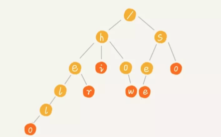

<!-- START doctoc generated TOC please keep comment here to allow auto update -->
<!-- DON'T EDIT THIS SECTION, INSTEAD RE-RUN doctoc TO UPDATE -->
**Table of Contents**  *generated with [DocToc](https://github.com/thlorenz/doctoc)*

- [Trie前缀树 或 字典树](#trie%E5%89%8D%E7%BC%80%E6%A0%91-%E6%88%96-%E5%AD%97%E5%85%B8%E6%A0%91)
  - [Trie的复杂度](#trie%E7%9A%84%E5%A4%8D%E6%9D%82%E5%BA%A6)
  - [应用](#%E5%BA%94%E7%94%A8)

<!-- END doctoc generated TOC please keep comment here to allow auto update -->

# Trie前缀树 或 字典树

Trie 树的本质，就是利用字符串之间的公共前缀，将重复的前缀合并在一起，比如我们有["hello","her","hi","how","see","so"] 这个字符串集合，可以将其构建成下面这棵 Trie 树：

每个节点表示一个字符串中的字符，从根节点到红色节点的一条路径表示一个字符串（红色节点表示是某个单词的结束字符，但不一定都是叶子节点）。

这样，我们就可以通过遍历这棵树来检索是否存在待匹配的字符串了，比如我们要在这棵 Trie 树中查询 her，只需从 h 开始，依次往下匹配，在子节点中找到 e，
然后继续匹配子节点，在 e 的子节点中找到 r，则表示匹配成功，否则匹配失败。通常，我们可以通过 Trie 树来构建敏感词或关键词匹配系统。

## Trie的复杂度
构建 Trie 树的过程比较耗时，对于有 n 个字符的字符串集合而言，需要遍历所有字符，对应的时间复杂度是 O(n)，但是一旦构建之后，查询效率很高，
如果匹配串的长度是 k，那只需要匹配 k 次即可，与原来的主串没有关系，所以对应的时间复杂度是 O(k)，基本上是个常量级的数字

## 应用
适用于那些查找前缀匹配的字符串，比如敏感词过滤和搜索框联想功能。