# Map

map 的设计也被称为 “The dictionary problem”，它的任务是设计一种数据结构用来维护一个集合的数据，并且可以同时对集合进行增删查改的操作。

## 最主要的数据结构有两种：哈希查找表（Hashtable）、 搜索树（Searchtree）

### 1. 哈希查找表（Hashtable）

哈希查找表用一个哈希函数将 key 分配到不同的桶（bucket，也就是数组的不同 index）。这样，开销主要在哈希函数的计算以及数组的常数访问时间。
在很多场景下，哈希查找表的性能很高。

> Hash: 翻译为散列，哈希，主要指压缩映射，它将一个比较大的域空间映射到一个比较小的域空间。 简单的说就是把任意长度的消息压缩到某一固定长度的消息摘要的函数。
> Hash 算法虽然是一种算法，但更像一种思想，没有一个固定的公式，只要符合这种思想的算法都称 Hash 算法

哈希查找表一般会存在“碰撞”的问题，就是说不同的 key 被哈希到了同一个 bucket。一般有两种应对方法：链表法(拉链法) 和 开放定址法(线性探测法实际开发中较少)。

- 链表法将一个 bucket 实现成一个链表，落在同一个 bucket 中的 key 都会插入这个链表。
- 开放定址法则是碰撞发生后，通过一定的规律，在数组的后面挑选“空位”，用来放置新的 key。

### 2. 搜索树法

一般采用自平衡搜索树，包括：AVL 树，红黑树。

### 对比


| Algorithm            | Action | Average Time Complexity | Worst Time Complexity |
| -------------------- | ------ | ----------------------- | --------------------- |
| Hash                 | Insert | O(1)                    | O(N)                  |
| Hash                 | Delete | O(1)                    | O(N)                  |
| Hash                 | Update | O(1)                    | O(N)                  |
| Hash                 | Get    | O(1)                    | O(N)                  |
| Balanced Binary Tree | Insert | O(logN)                 | O(logN)               |
| Balanced Binary Tree | Delete | O(logN)                 | O(logN)               |
| Balanced Binary Tree | Update | O(logN)                 | O(logN)               |
| Balanced Binary Tree | Get    | O(logN)                 | O(logN)               |

自平衡搜索树法的最差搜索效率是 O(logN)，而哈希查找表最差是 O(N)。当然，哈希查找表的平均查找效率是 O(1)，
如果哈希函数设计的很好，最坏的情况基本不会出现。
还有一点，遍历自平衡搜索树，返回的 key 序列，一般会按照从小到大的顺序；而哈希查找表则是乱序的。

## map哈希表源码解析(1.18)

Go 语言采用的是哈希查找表，并且使用链表解决哈希冲突。

```
恒等式 hash % 2^k = hash & (2^k-1)，表示截断二进制的位数，保留后面的 k 位

哈希表数组长度 len=8，
存在一个哈希值 hash=165，二进制表示为 1010 0101

所以： 

165 % 8 
= 165 % 2^3
= 165 & (2^3-1)
= 165 & 7
= 1010 0101 & 0000 0111 
= 0000 0000 0101 
= 5
```

实际上 hash(key) % len 的分布是和 len 有关的，一组均匀分布的 hash(key) 在 len 是素数时才能做到均匀。

### 名词解释

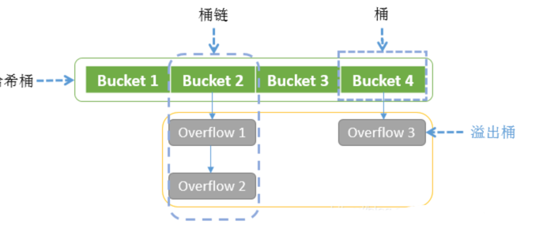

哈希查找的速度快，主要是利用空间换时间的优点。如果哈希表的数组特别大特别大，那么哈希冲突的几率就会降低。然而哈希表中的数组太大或太小都不行，太大浪费了空间，太小则哈希冲突太严重，所以需要对哈希表中的数组进行缩容和扩容。

#### 哈希桶

指整个哈希数组，数组内每个元素是一个桶。

#### 桶链

哈希桶的一个桶以及该桶下挂着的所有溢出桶。

#### 桶（bucket）

一个bmap结构，与溢出桶的区别在于它是哈希桶数组上的一个元素。

#### 溢出桶（overflow bucket）

一个bmap结构，与桶区别是，它不是哈希桶数组的元素，而是挂在哈希桶数组上或挂在其它溢出桶上。

#### 负载因子(load factor)

表示平均每个哈希桶的元素个数（注意是哈希桶，不包括溢出桶）。

```
负载因子 = 已添加到哈希表中的键值对数量/bucket数量
```

如当前map中总共有20个元素，哈希桶长度为4，则负载因子为5。负载因子主要是来判断当前map是否需要扩容。

负载因子与扩容、迁移等重新散列（rehash）行为有直接关系：

- 在程序运行时，会不断地进行插入、删除等，会导致 bucket 不均，内存利用率低，需要迁移。
- 在程序运行时，出现负载因子过大，需要做扩容，解决 bucket 过大的问题。

负载因子是哈希表中的一个重要指标，在各种版本的哈希表实现中都有类似的东西，主要目的是为了平衡 buckets 的存储空间大小和查找元素时的性能高低。

```go
// /Users/python/go/go1.18/src/runtime/map.go
//  loadFactor    %overflow  bytes/entry     hitprobe    missprobe
//        4.00         2.13        20.77         3.00         4.00
//        4.50         4.05        17.30         3.25         4.50
//        5.00         6.85        14.77         3.50         5.00
//        5.50        10.55        12.94         3.75         5.50
//        6.00        15.27        11.67         4.00         6.00
//        6.50        20.90        10.79         4.25         6.50
//        7.00        27.14        10.15         4.50         7.00
//        7.50        34.03         9.73         4.75         7.50
//        8.00        41.10         9.40         5.00         8.00
//
```

- loadFactor：负载因子，也有叫装载因子。
- %overflow：溢出率，有溢出 bukcet 的百分比。
- bytes/entry：每对 key/elem 的开销字节数.
- hitprobe：查找一个存在的 key 时，要查找的平均个数。
- missprobe：查找一个不存在的 key 时，要查找的平均个数

> Go 官方发现：（too large and we have lots of overflow buckets, too small and we waste a lot of space）
> 负载因子太大了，会有很多溢出的桶。太小了，就会浪费很多空间

根据负载因子进行扩容和缩容。

```go
const (
    // Maximum average load of a bucket that triggers growth is 6.5.
    // Represent as loadFactorNum/loadFactorDen, to allow integer math.
    loadFactorNum = 13
    loadFactorDen = 2
)
// Golang的map中，负载因子是6.5，这是写在代码里的。
```

每个哈希表的实现对负载因子容忍程度不同，比如Redis实现中负载因子大于1时就会触发rehash，而Go则在在负载因子达到6.5时才会触发rehash，因为Redis的每个bucket只能存1个键值对，而Go的bucket可能存8个键值对，所以Go可以容忍更高的负载因子

#### 新、旧哈希桶

新、旧哈希桶的概念只存在于map扩容阶段，在哈希桶扩容时，会申请一个新的哈希桶，原来的哈希桶变成了旧哈希桶，然后会分步将旧哈希桶的元素迁移到新桶上，当旧哈希桶所有元素都迁移完成时，旧哈希桶会被释放掉

### 文件组成

map的源代码都在src/runtime目录下，主要由4个文件组成：

- map.go:主体实现都在map.go文件中，其它三个文件分别对特点类型的key做了优化。
- map_fast32.go，针对key类型为int32\uint32做了优化
- map_fast64.go，针对key类型为int\int64\uint64\pointer做了优化
- map_faststr.go，针对key类型为string做了优化

### 1. map 的结构体是 hmap，它是 hashmap 的“缩写”：

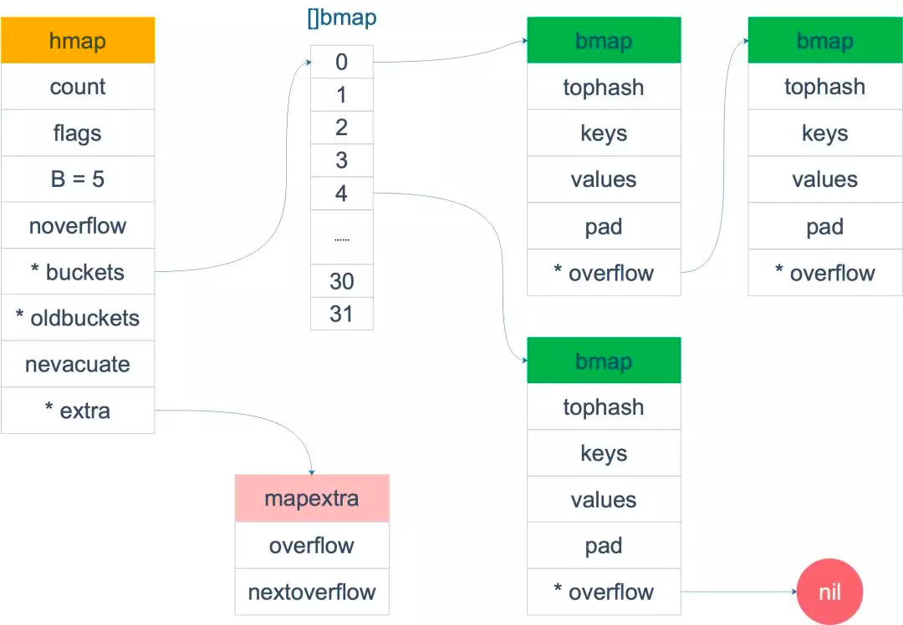
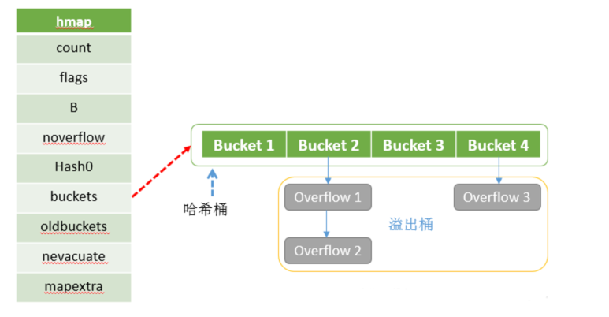

```go
const(
    // flags
    iterator     = 1 // buckets正在被使用
    oldIterator  = 2 // toldbuckets正在被使用
    hashWriting  = 4 // 哈希正在被写入
    sameSizeGrow = 8 // 哈希是等量扩容
)

//src/runtime/map.go
type hmap struct {
    // 元素个数，调用 len(map) 时，直接返回此值
    count     int    // 表示当前哈希表中元素的数量
  
    flags     uint8  // 表示读、写、扩容、迭代等标记, 1表示buckets正在被使用 2表示oldbuckets正在被使用 4表示哈希正在被写入 8表示哈希是等量扩容
  
    // 存放当前map存放的bucket数组长度的对数 log_2,即len(buckets) == 2^B
    B         uint8  // 可以最多容纳 6.5 * 2 ^ B 个元素，6.5为装载因子 // loadFactor:= count / (2^B）
    noverflow uint16 // 溢出的个数,当溢出桶个数过多时，这个值是一个近似值
  
    //  计算 key 的哈希的时候会传入哈希函数,，保证一个key在不同map中存放的位置是随机的
    hash0     uint32 // 哈希种子
  
    // 指向 buckets 数组，大小为 2^B
    // 如果元素个数为0，就为 ni
    buckets    unsafe.Pointer // 桶的地址
  
    oldbuckets unsafe.Pointer // 旧桶的地址，用于扩容
  
    nevacuate  uintptr        // 搬迁进度，小于nevacuate的已经搬迁
    extra *mapextra // 扩展字段，不一定每个map都需要
}

 /*
    B是 buckets 数组的长度的对数，也就是说 buckets 数组的长度就是 2^B。
    其中，overflow是一个指针，指向一个元素个数为2的数组，数组的类型是一个指针，指向一个slice，slice的元素是桶(bmap)的地址，这些桶都是溢出桶；
    为什么有两个？因为Go map在hash冲突过多时，会发生扩容操作，为了不全量搬迁数据，使用了增量搬迁，[0]表示当前使用的溢出桶集合，
    [1]是在发生扩容时，保存了旧的溢出桶集合；overflow存在的意义在于防止溢出桶被gc。
  */
 

```


bucket 里面存储了 key 和 value,最终它指向的是一个结构体

#### bmap(bucket map)，描述一个桶，即可以是哈希桶也可以是溢出桶。

编译前的 bmap :结构体只含有一个tophash，用于桶内快速查找，并没有存K/V的地方。


```go
// /Users/python/go/go1.18/src/runtime/map.go
const (
    // Maximum number of key/elem pairs a bucket can hold.
    bucketCntBits = 3
    bucketCnt     = 1 << bucketCntBits
)

// 桶结构体
type bmap struct {
    // 每个元素hash值的高8位，如果tophash[0] < minTopHash，表示这个桶的搬迁状态
    tophash [bucketCnt]uint8
	
    // 接下来是8个key、8个value，但是我们不能直接看到；为了优化对齐，go采用了key放在一起，value放在一起的存储方式，
	
    // 再接下来是hash冲突发生时，下一个溢出桶的地址
}

```
两个Followed定义可以看出，其实bmap只给出了部分字段的描述，
- 一块存K/V的内存
- 一个指向溢出桶的指针。

之所以不给出全部描述，是因为K/V的内存块大小会随着K/V的类型不断变化，无法固定写死，在使用时也只能通过指针偏移的方式去取用。


不过在实际编译期间，Go语言的bmap会经过反射生成真正的bmap类型 :真实描述（伪代码）

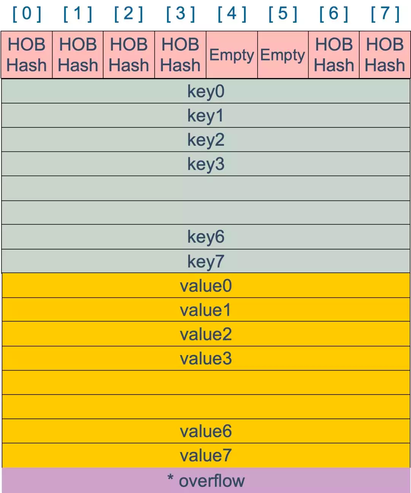

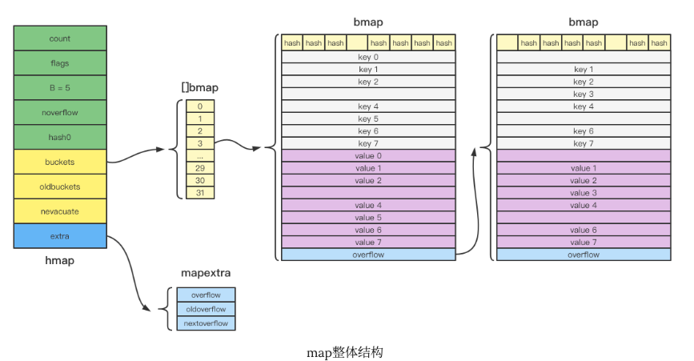

上图就是 bucket 的内存模型， HOBHash 指的就是 top hash。

```go
//	tophash的存在是为了快速试错，毕竟只有8位，比较起来会快一点。
//  桶的结构到底是怎样的？
//	桶的结构体并不是上面提到的tophash [8]uint8,因为go是不支持泛型的，所以在编译过程中才会根据具体的类型确定,实际上桶的结构可以表示为
type bmap struct {
    topbits  [8]uint8
    keys     [8]keytype
    values   [8]valuetype
    pad      uintptr
    overflow uintptr
} 
// 从定义可以看出，不同于STL中map以红黑树实现的方式，Golang采用了HashTable的实现，解决冲突采用的是链地址法。也就是说，使用数组+链表来实现map
```

bmap 就是我们常说的“桶”，桶里面会最多装 8 个 key，这些 key 之所以会落入同一个桶，是因为它们经过哈希计算后，哈希结果是“一类”的。在桶内，
又会根据 key 计算出来的 hash 值的高 8 位来决定 key 到底落入桶内的哪个位置（一个桶内最多有8个位置）。

当 map 的 key 和 value 都不是指针，并且 size 都小于 128 字节的情况下，会把 bmap 标记为不含指针，这样可以避免 gc 时扫描整个 hmap。

但是，我们看 bmap 其实有一个 overflow 的字段，是指针类型的，破坏了 bmap 不含指针的设想，这时会把 overflow 移动到 hmap的 extra 字段来

```go
// mapextra holds fields that are not present on all maps.
type mapextra struct {

    overflow    *[]*bmap
    oldoverflow *[]*bmap
  
    nextOverflow *bmap
}
```

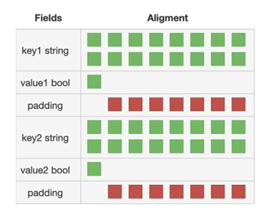

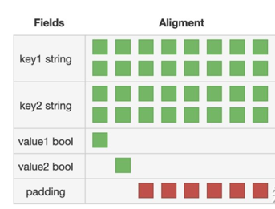

注意到 key 和 value 是各自放在一起的，并不是 key/value/key/value/... 这样的形式。
源码里说明这样的好处是在某些情况下可以省略掉 padding 字段，节省内存空间。

例如，有这样一个类型的 map：

```go
map[int64]int8
```

如果按照 key/value/key/value/... 这样的模式存储，那在每一个 key/value 对之后都要额外 padding 7 个字节；而将所有的 key，value 分别绑定到一起，

这种形式 key/key/.../value/value/...，则只需要在最后添加 padding。

每个 bucket 设计成最多只能放 8 个 key-value 对，如果有第 9 个 key-value 落入当前的 bucket，那就需要再构建一个 bucket ，通过 overflow 指针连接起来

### 2. 初始化 

```go
package main

import "fmt"

func main() {
	m1 := make(map[int]int)
	//指定长度
	m2 := make(map[int]int, 10) // 创建map支持传递一个参数，表示初始大小

	fmt.Println(m1, m2)
}

//  go tool compile -S main.go
```
Note:
```go
var ageMap3 map[string]int // ageMap 为nil，不能向其添加元素，会直接panic
```

```shell
(⎈ |test-ctx:ansible)➜  05_map_assem git:(feature/algorithm) ✗ go tool compile -S main.go
"".main STEXT size=160 args=0x0 locals=0x58 funcid=0x0 align=0x0
        0x0000 00000 (main.go:5)        TEXT    "".main(SB), ABIInternal, $96-0
        0x0000 00000 (main.go:5)        MOVD    16(g), R16
        0x0004 00004 (main.go:5)        PCDATA  $0, $-2
        0x0004 00004 (main.go:5)        MOVD    RSP, R17
        0x0008 00008 (main.go:5)        CMP     R16, R17
        0x000c 00012 (main.go:5)        BLS     140
        0x0010 00016 (main.go:5)        PCDATA  $0, $-1
        0x0010 00016 (main.go:5)        MOVD.W  R30, -96(RSP)
        0x0014 00020 (main.go:5)        MOVD    R29, -8(RSP)
        0x0018 00024 (main.go:5)        SUB     $8, RSP, R29
        0x001c 00028 (main.go:5)        FUNCDATA        ZR, gclocals·69c1753bd5f81501d95132d08af04464(SB)
        0x001c 00028 (main.go:5)        FUNCDATA        $1, gclocals·d527b79a98f329c2ba624a68e7df03d6(SB)
        0x001c 00028 (main.go:5)        FUNCDATA        $2, "".main.stkobj(SB)
        0x001c 00028 (main.go:6)        PCDATA  $1, ZR
        0x001c 00028 (main.go:6)        CALL    runtime.makemap_small(SB)
        0x0020 00032 (main.go:6)        MOVD    R0, "".m1-40(SP)
        0x0024 00036 (main.go:7)        MOVD    $10, R1
        0x0028 00040 (main.go:7)        MOVD    ZR, R2
        0x002c 00044 (main.go:7)        MOVD    $type.map[int]int(SB), R0
        0x0034 00052 (main.go:7)        PCDATA  $1, $1
        0x0034 00052 (main.go:7)        CALL    runtime.makemap(SB)
        0x0038 00056 (main.go:9)        STP     (ZR, ZR), ""..autotmp_12-32(SP)
        0x003c 00060 (main.go:9)        STP     (ZR, ZR), ""..autotmp_12-16(SP)
        0x0040 00064 (main.go:9)        MOVD    $type.map[int]int(SB), R1
        0x0048 00072 (main.go:9)        MOVD    R1, ""..autotmp_12-32(SP)
        0x004c 00076 (main.go:9)        MOVD    "".m1-40(SP), R2
        0x0050 00080 (main.go:9)        MOVD    R2, ""..autotmp_12-24(SP)
        0x0054 00084 (main.go:9)        MOVD    R1, ""..autotmp_12-16(SP)
        0x0058 00088 (main.go:9)        MOVD    R0, ""..autotmp_12-8(SP)
// ....
```

通过汇编语言可以看到，看出make对应的底层实现出现了两种不同的结果,runtime.makemap_small和runtime.makemap
- make(map[int]int) 对应 runtime.makemap_small
- make(map[int]int, 10) 对应 runtime.makemap

扩展一下，当map做为传参时，实际传入的是一个hmap指针。了解这一点，就能理解为什么在被调用方法里面对map做修改时，会在调用者里map也会改变。
```go
// makemap_small implements Go map creation for make(map[k]v) and
// make(map[k]v, hint) when hint is known to be at most bucketCnt
// at compile time and the map needs to be allocated on the heap.
func makemap_small() *hmap {
	h := new(hmap)
	h.hash0 = fastrand()
	return h
}
```
当编译期能够确定map的长度不大于bucketCnt（也就是8），将会对应到底层的runtime.makemap_small实现。makemap_small只是简单创建了hmap的结构体并没有初始化buckets。

```go
// makemap implements Go map creation for make(map[k]v, hint).
// 如果编译器发现map或者它第一个bucket能够被分配在栈上，则传入的h参数将不为空。 .
// If h != nil, the map can be created directly in h.
// If h.buckets != nil, bucket pointed to can be used as the first bucket.
func makemap(t *maptype, hint int, h *hmap) *hmap {
  // 计算内存空间和判断是否内存溢出
  mem, overflow := math.MulUintptr(uintptr(hint), t.bucket.size)
  if overflow || mem > maxAlloc {
      hint = 0
  }

  // 1. 创建hmap，并初始化
  if h == nil {
      h = new(hmap)
  }
  // 2. 获取一个随机种子，保证同一个key在不同map的hash值不一样（安全考量
  h.hash0 = fastrand()

  //3. 计算出指数B,那么桶的数量表示2^B
  B := uint8(0)
  for overLoadFactor(hint, B) {
      B++
  }
  h.B = B

  // 如果B == 0，则Buckets数组将会延迟初始化，直到调用mapassign给该map存值
  if h.B != 0 {
      var nextOverflow *bmap
      //根据B去创建对应的桶和溢出桶
      h.buckets, nextOverflow = makeBucketArray(t, h.B, nil)
      if nextOverflow != nil {
          h.extra = new(mapextra)
          h.extra.nextOverflow = nextOverflow
      }
  }

  return h
}

//a. 计算出需要的内存空间并且判断内存是否溢出
//b. hmap没有的情况进行初始化，并设置hash0表示hash因子
//c. 计算出指数B,桶的数量表示为2^B,通过makeBucketArray去创建对应的桶和溢出桶
```


从Go的源码中也发现另外一个runtime.makemap64函数，这是当传入的初始长度类型为int64时候会调用
```go
func makemap64(t *maptype, hint int64, h *hmap) *hmap {
	if int64(int(hint)) != hint {
		hint = 0
	}
	return makemap(t, int(hint), h)
}
```

#### 哈希桶初始大小

在创建map时，当没有指定size大小或size为0时，不会创建哈希桶，会在插入元素时创建，避免只申请不使用导致的效率和内存浪费。
当size不为0时，会根据size大小计算出哈希桶的大小，具体计算算法如下：

```go
func overLoadFactor(count int, B uint8) bool {
	return count > bucketCnt && uintptr(count) > loadFactorNum*(bucketShift(B)/loadFactorDen)
}

```


#### 哈希函数

map 的一个关键点在于，哈希函数的选择。在程序启动时，会检测 cpu 是否支持 aes，如果支持，则使用 aes hash，否则使用 memhash。

```go
// /Users/python/go/go1.18/src/runtime/alg.go
func alginit() {
	// Install AES hash algorithms if the instructions needed are present.
	if (GOARCH == "386" || GOARCH == "amd64") &&
		cpu.X86.HasAES && // AESENC
		cpu.X86.HasSSSE3 && // PSHUFB
		cpu.X86.HasSSE41 { // PINSR{D,Q}
		initAlgAES()
		return
	}
	if GOARCH == "arm64" && cpu.ARM64.HasAES {
		initAlgAES()
		return
	}
	getRandomData((*[len(hashkey) * goarch.PtrSize]byte)(unsafe.Pointer(&hashkey))[:])
	hashkey[0] |= 1 // make sure these numbers are odd
	hashkey[1] |= 1
	hashkey[2] |= 1
	hashkey[3] |= 1
}
```

类型的结构体 _type
```go
type _type struct {
	size       uintptr
	ptrdata    uintptr // size of memory prefix holding all pointers
	hash       uint32
	tflag      tflag
	align      uint8
	fieldAlign uint8
	kind       uint8
	// function for comparing objects of this type
	// (ptr to object A, ptr to object B) -> ==?
	equal func(unsafe.Pointer, unsafe.Pointer) bool
	// gcdata stores the GC type data for the garbage collector.
	// If the KindGCProg bit is set in kind, gcdata is a GC program.
	// Otherwise it is a ptrmask bitmap. See mbitmap.go for details.
	gcdata    *byte
	str       nameOff
	ptrToThis typeOff
}

```
- hash 函数计算类型的哈希值
- equal 函数则计算两个类型是否“哈希相等”

对于 string 类型，它的 hash、equal 函数如下：

```shell
/ func strhash(p unsafe.Pointer, h uintptr) uintptr
TEXT runtime·strhash(SB),NOSPLIT|NOFRAME,$0-24
	MOVB	runtime·useAeshash(SB), R0
	CBZ	R0, noaes
	MOVD	p+0(FP), R10 // string pointer
	LDP	(R10), (R0, R1) //string data/ length
	MOVD	h+8(FP), R3
	MOVD	$ret+16(FP), R2 // return adddress
	B	aeshashbody<>(SB)
noaes:
	B	runtime·strhashFallback(SB)

```

```go
func strequal(p, q unsafe.Pointer) bool {
	return *(*string)(p) == *(*string)(q)
}
```
### 3. 读取 mapaccess
map的访问即通过给定的key在map中寻找其对应value，它的大致步骤如下：
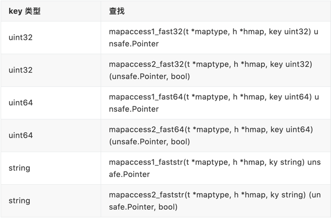

1. 以64位操作系统为例，原始的key通过Hash函数映射成64位二进制。
2. 末尾B位对应bmap的位置，从[]bmap中找到对应的bmap。
3. 首8位对应该key的tophash，从步骤2所定位的bmap开始检索。首先会比较bmap顶层的tophash与原始key的tophash是否相同，若不相同则直接跳过比较下一个；若相同则进一步比较key是否相同。
4. 若当前的bmap中比较完，没有匹配到目标key，且overflow不为空，则继续从overflow指向的下一个bmap继续比较

如果 B = 5，那么桶的数量，也就是 buckets 数组的长度是 2^5 = 32。
例如，现在有一个 key 经过哈希函数计算后，得到的哈希结果是：

```shell
10010111|000011110110110010001111001010100010010110010101010│01010
```

用最后的 5 个 bit 位，也就是 01010，值为 10，也就是 10 号桶。这个操作实际上就是取余操作，但是取余开销太大，所以代码实现上用的位操作代替。

再用哈希值的高 8 位，找到此 key 在 bucket 中的位置，这是在寻找已有的 key。最开始桶内还没有 key，新加入的 key 会找到第一个空位，放入。

buckets 编号就是桶编号，当两个不同的 key 落在同一个桶中，也就是发生了哈希冲突。冲突的解决手段是用链表法：在 bucket 中，从前往后找到第一个空位。
这样，在查找某个 key 时，先找到对应的桶，再去遍历 bucket 中的 key。

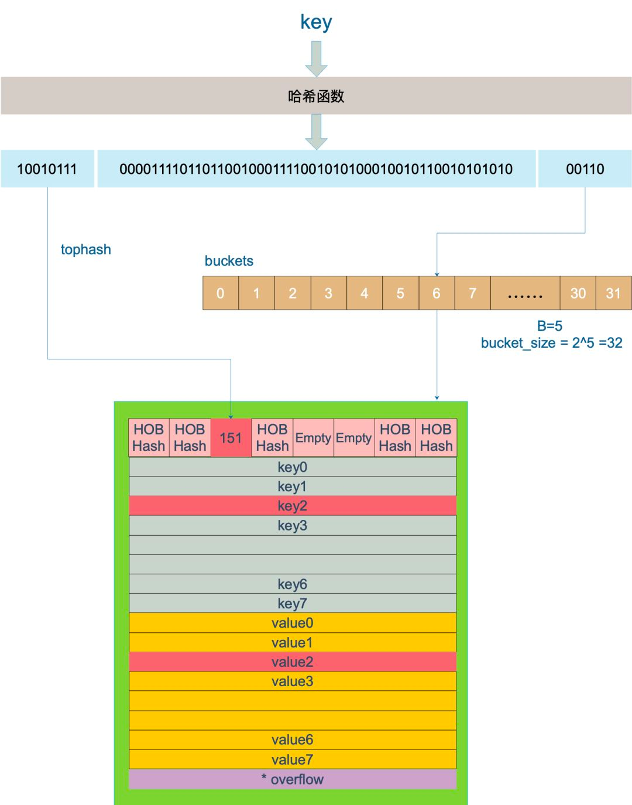

上图中，假定 B = 5，所以 bucket 总数就是 2^5 = 32。首先计算出待查找 key 的哈希，使用低 5 位 00110，找到对应的 6 号 bucket，
使用高 8 位 10010111，对应十进制 151， 在 6 号 bucket 中寻找 tophash 值（HOB hash）为 151 的 key， 找到了 2 号槽位，这样整个查找过程就结束了。
如果在 bucket 中没找到，并且 overflow 不为空，还要继续去 overflow bucket 中寻找，直到找到或是所有的 key 槽位都找遍了，包括所有的 overflow bucket。


1. tophash是什么?

tophash是用来快速定位key和value的位置的,在查找或删除过程如果高8位hash都不相等，那么就没必要再去比较key值是否相等了，效率相对会高一些。

2. 如何定位到哪个桶执行插入?

例如哈希表对应2^4个桶,即B是4,某个key的hash二进制值是如下值，那么如图可知该key对应的tophash值为10001100,即140， 桶的值为0111,即是桶的序号为7

hash := 100011001101111001110010010110000001111010110000100101011010111

```go
bucket := hash & bucketMask(h.B)
```

当确定了选择哪一个bucket，接下来就要确定bucket里面的位置。每个bucket使用散列值（hash value）前面的字节（byte）（top hash）来确定在bucket内部列表的顺序。

```go
// tophash calculates the tophash value for hash.
func tophash(hash uintptr) uint8 {
	top := uint8(hash >> (sys.PtrSize*8 - 8))
	if top < minTopHash {
		top += minTopHash
	}
	return top
}
```

3. 每个桶可以存储8个tophash、8个key、8个value,遍历桶中的tophash,如果tophash不相等且是空的,说明该位置可以插入，分别获取对应位置key和value的地址并更新tophash。


基本使用
```go
package main

import "fmt"

func main() {
	m := map[int8]int{
		1: 1,
		2: 2,
		3: 3,
	}

	v1 := m[1]
	v2, ok := m[2] // ok是一个bool值，用于判断是否存在2这个key

	fmt.Println(v1)
	fmt.Println(v2, ok)
	// 3. 返回key和value，只用于range迭代场景
	for k, v := range m {
		fmt.Println(k, v)
	}
}

```
```shell
(⎈ |test-ctx:ansible)➜  05_map_assem git:(feature/algorithm) ✗ go tool compile -S main.go
"".main STEXT size=656 args=0x0 locals=0x188 funcid=0x0 align=0x0
        0x0000 00000 (main.go:5)        TEXT    "".main(SB), ABIInternal, $400-0
        0x0000 00000 (main.go:5)        MOVD    16(g), R16
        0x0004 00004 (main.go:5)        PCDATA  $0, $-2
        0x0004 00004 (main.go:5)        SUB     $272, RSP, R17
        0x0008 00008 (main.go:5)        CMP     R16, R17
        0x000c 00012 (main.go:5)        BLS     632
        0x0010 00016 (main.go:5)        PCDATA  $0, $-1
        0x0010 00016 (main.go:5)        PCDATA  $0, $-2
        0x0010 00016 (main.go:5)        SUB     $400, RSP, R27
        0x0014 00020 (main.go:5)        MOVD    R30, (R27)
        0x0018 00024 (main.go:5)        MOVD    R27, RSP
        0x001c 00028 (main.go:5)        PCDATA  $0, $-1
        0x001c 00028 (main.go:5)        MOVD    R29, -8(RSP)
        0x0020 00032 (main.go:5)        SUB     $8, RSP, R29
        0x0024 00036 (main.go:5)        FUNCDATA        ZR, gclocals·f14a5bc6d08bc46424827f54d2e3f8ed(SB)
        0x0024 00036 (main.go:5)        FUNCDATA        $1, gclocals·e7e5d98dfad4f23803649bf465ab3831(SB)
        0x0024 00036 (main.go:5)        FUNCDATA        $2, "".main.stkobj(SB)
        0x0024 00036 (main.go:6)        STP     (ZR, ZR), ""..autotmp_27-144(SP)
        0x0028 00040 (main.go:6)        STP     (ZR, ZR), ""..autotmp_27-128(SP)
        0x002c 00044 (main.go:6)        STP     (ZR, ZR), ""..autotmp_27-112(SP)
        0x0030 00048 (main.go:6)        MOVD    $""..autotmp_28-312(SP), R16
        0x0034 00052 (main.go:6)        MOVD    $""..autotmp_28-248(SP), R0
        0x0038 00056 (main.go:6)        STP.P   (ZR, ZR), 16(R16)
        0x003c 00060 (main.go:6)        CMP     R0, R16
        0x0040 00064 (main.go:6)        BLE     56
        0x0044 00068 (main.go:6)        MOVD    ZR, ""..autotmp_28-232(SP)
        0x0048 00072 (main.go:6)        MOVD    $""..autotmp_28-312(SP), R0
        0x004c 00076 (main.go:6)        MOVD    R0, ""..autotmp_27-128(SP)
        0x0050 00080 (main.go:6)        PCDATA  $1, $1
        0x0050 00080 (main.go:6)        CALL    runtime.fastrand(SB)
        0x0054 00084 (main.go:6)        MOVW    R0, ""..autotmp_27-132(SP)
        0x0058 00088 (main.go:7)        MOVD    $1, R0
        0x005c 00092 (main.go:7)        MOVB    R0, ""..autotmp_31-329(SP)
        0x0060 00096 (main.go:7)        MOVD    $type.map[int8]int(SB), R0
        0x0068 00104 (main.go:7)        MOVD    $""..autotmp_27-144(SP), R1
        0x006c 00108 (main.go:7)        MOVD    $""..autotmp_31-329(SP), R2
        0x0070 00112 (main.go:7)        CALL    runtime.mapassign(SB)
        0x0074 00116 (main.go:7)        MOVD    $1, R1
        0x0078 00120 (main.go:7)        MOVD    R1, (R0)
        0x007c 00124 (main.go:8)        MOVD    $2, R0
        0x0080 00128 (main.go:8)        MOVB    R0, ""..autotmp_31-329(SP)
        0x0084 00132 (main.go:8)        MOVD    $type.map[int8]int(SB), R0
        0x008c 00140 (main.go:8)        MOVD    $""..autotmp_31-329(SP), R2
        0x0090 00144 (main.go:8)        MOVD    $""..autotmp_27-144(SP), R1
        0x0094 00148 (main.go:8)        CALL    runtime.mapassign(SB)
        0x0098 00152 (main.go:8)        MOVD    $2, R1
        0x009c 00156 (main.go:8)        MOVD    R1, (R0)
        0x00a0 00160 (main.go:9)        MOVD    $3, R0
        0x00a4 00164 (main.go:9)        MOVB    R0, ""..autotmp_31-329(SP)
        0x00a8 00168 (main.go:9)        MOVD    $type.map[int8]int(SB), R0
        0x00b0 00176 (main.go:9)        MOVD    $""..autotmp_31-329(SP), R2
        0x00b4 00180 (main.go:9)        MOVD    $""..autotmp_27-144(SP), R1
        0x00b8 00184 (main.go:9)        CALL    runtime.mapassign(SB)
        0x00bc 00188 (main.go:9)        MOVD    $3, R1
        0x00c0 00192 (main.go:9)        MOVD    R1, (R0)
        0x00c4 00196 (main.go:12)       MOVD    $type.map[int8]int(SB), R0
        0x00cc 00204 (main.go:12)       MOVD    $""..autotmp_27-144(SP), R1
        0x00d0 00208 (main.go:12)       MOVD    $""..stmp_0(SB), R2
        0x00d8 00216 (main.go:12)       CALL    runtime.mapaccess1(SB)
        0x00dc 00220 (main.go:12)       MOVD    (R0), R0
        0x00e0 00224 (main.go:12)       MOVD    R0, "".v1-320(SP)
        0x00e4 00228 (main.go:13)       MOVD    $""..autotmp_27-144(SP), R1
        0x00e8 00232 (main.go:13)       MOVD    $""..stmp_1(SB), R2
        0x00f0 00240 (main.go:13)       MOVD    $type.map[int8]int(SB), R0
        0x00f8 00248 (main.go:13)       CALL    runtime.mapaccess2(SB)
        0x00fc 00252 (main.go:13)       MOVB    R1, "".ok-330(SP)
        0x0100 00256 (main.go:13)       MOVD    (R0), R0
        0x0104 00260 (main.go:13)       MOVD    R0, "".v2-328(SP)
        0x0108 00264 (main.go:15)       STP     (ZR, ZR), ""..autotmp_38-224(SP)
        0x010c 00268 (main.go:15)       MOVD    "".v1-320(SP), R0
        0x0110 00272 (main.go:15)       PCDATA  $1, $2
        0x0110 00272 (main.go:15)       CALL    runtime.convT64(SB)
        0x0114 00276 (main.go:15)       MOVD    $type.int(SB), R1
        0x011c 00284 (main.go:15)       MOVD    R1, ""..autotmp_38-224(SP)
        0x0120 00288 (main.go:15)       MOVD    R0, ""..autotmp_38-216(SP)
        0x0124 00292 (<unknown line number>)    NOP
        0x0124 00292 (<unknown line number>)    PCDATA  $0, $-3
        0x0124 00292 ($GOROOT/src/fmt/print.go:274)     MOVD    os.Stdout(SB), R0
        0x0130 00304 ($GOROOT/src/fmt/print.go:274)     PCDATA  $0, $-1
        0x0130 00304 ($GOROOT/src/fmt/print.go:274)     MOVD    $""..autotmp_38-224(SP), R2
        0x0134 00308 ($GOROOT/src/fmt/print.go:274)     MOVD    $1, R3
        0x0138 00312 ($GOROOT/src/fmt/print.go:274)     MOVD    R3, R4
        0x013c 00316 ($GOROOT/src/fmt/print.go:274)     MOVD    R0, R5
        0x0140 00320 ($GOROOT/src/fmt/print.go:274)     MOVD    $go.itab.*os.File,io.Writer(SB), R0
        0x0148 00328 ($GOROOT/src/fmt/print.go:274)     MOVD    R5, R1
        0x014c 00332 ($GOROOT/src/fmt/print.go:274)     PCDATA  $1, $1
        0x014c 00332 ($GOROOT/src/fmt/print.go:274)     CALL    fmt.Fprintln(SB)
        0x0150 00336 (main.go:16)       STP     (ZR, ZR), ""..autotmp_41-176(SP)
        0x0154 00340 (main.go:16)       STP     (ZR, ZR), ""..autotmp_41-160(SP)
        0x0158 00344 (main.go:16)       MOVD    "".v2-328(SP), R0
        0x015c 00348 (main.go:16)       PCDATA  $1, $3
        0x015c 00348 (main.go:16)       CALL    runtime.convT64(SB)
        0x0160 00352 (main.go:16)       MOVD    $type.int(SB), R1
        0x0168 00360 (main.go:16)       MOVD    R1, ""..autotmp_41-176(SP)
        0x016c 00364 (main.go:16)       MOVD    R0, ""..autotmp_41-168(SP)
        0x0170 00368 (main.go:16)       MOVD    $type.bool(SB), R0
        0x0178 00376 (main.go:16)       MOVD    R0, ""..autotmp_41-160(SP)
        0x017c 00380 (main.go:16)       MOVBU   "".ok-330(SP), R0
        0x0180 00384 (main.go:16)       MOVD    $runtime.staticuint64s(SB), R2
        0x0188 00392 (main.go:16)       ADD     R0<<3, R2, R0
        0x018c 00396 (main.go:16)       MOVD    R0, ""..autotmp_41-152(SP)
        0x0190 00400 (<unknown line number>)    NOP
        0x0190 00400 (<unknown line number>)    PCDATA  $0, $-4
        0x0190 00400 ($GOROOT/src/fmt/print.go:274)     MOVD    os.Stdout(SB), R0
        0x019c 00412 ($GOROOT/src/fmt/print.go:274)     PCDATA  $0, $-1
        0x019c 00412 ($GOROOT/src/fmt/print.go:274)     MOVD    $2, R3
        0x01a0 00416 ($GOROOT/src/fmt/print.go:274)     MOVD    R3, R4
        0x01a4 00420 ($GOROOT/src/fmt/print.go:274)     MOVD    R0, R5
        0x01a8 00424 ($GOROOT/src/fmt/print.go:274)     MOVD    $go.itab.*os.File,io.Writer(SB), R0
        0x01b0 00432 ($GOROOT/src/fmt/print.go:274)     MOVD    R5, R1
        0x01b4 00436 ($GOROOT/src/fmt/print.go:274)     MOVD    $""..autotmp_41-176(SP), R2
        0x01b8 00440 ($GOROOT/src/fmt/print.go:274)     PCDATA  $1, $1
        0x01b8 00440 ($GOROOT/src/fmt/print.go:274)     CALL    fmt.Fprintln(SB)
        0x01bc 00444 (main.go:18)       MOVD    $""..autotmp_25-96(SP), R16
        0x01c0 00448 (main.go:18)       MOVD    $""..autotmp_25-16(SP), R0
        0x01c4 00452 (main.go:18)       STP.P   (ZR, ZR), 16(R16)
        0x01c8 00456 (main.go:18)       CMP     R0, R16
        0x01cc 00460 (main.go:18)       BLE     452
        0x01d0 00464 (main.go:18)       MOVD    $type.map[int8]int(SB), R0
        0x01d8 00472 (main.go:18)       MOVD    $""..autotmp_27-144(SP), R1
        0x01dc 00476 (main.go:18)       MOVD    $""..autotmp_25-96(SP), R2
        0x01e0 00480 (main.go:18)       PCDATA  $1, $4
        0x01e0 00480 (main.go:18)       CALL    runtime.mapiterinit(SB)
        0x01e4 00484 (main.go:18)       JMP     608
        0x01e8 00488 (main.go:18)       MOVD    ""..autotmp_25-88(SP), R2
        0x01ec 00492 (main.go:18)       MOVB    (R1), R1
        0x01f0 00496 (main.go:18)       MOVD    (R2), R0
        0x01f4 00500 (main.go:19)       STP     (ZR, ZR), ""..autotmp_44-208(SP)
        0x01f8 00504 (main.go:19)       STP     (ZR, ZR), ""..autotmp_44-192(SP)
        0x01fc 00508 (main.go:19)       MOVD    $type.int8(SB), R2
        0x0204 00516 (main.go:19)       MOVD    R2, ""..autotmp_44-208(SP)
        0x0208 00520 (main.go:19)       UBFIZ   $3, R1, $8, R1
        0x020c 00524 (main.go:19)       MOVD    $runtime.staticuint64s(SB), R3
        0x0214 00532 (main.go:19)       ADD     R1, R3, R1
        0x0218 00536 (main.go:19)       MOVD    R1, ""..autotmp_44-200(SP)
        0x021c 00540 (main.go:19)       PCDATA  $1, $5
        0x021c 00540 (main.go:19)       CALL    runtime.convT64(SB)
        0x0220 00544 (main.go:19)       MOVD    $type.int(SB), R1
        0x0228 00552 (main.go:19)       MOVD    R1, ""..autotmp_44-192(SP)
        0x022c 00556 (main.go:19)       MOVD    R0, ""..autotmp_44-184(SP)
// ...
```

- v1 := m[1] 对应 runtime.mapaccess1(SB)
- v2, ok := m[2] 对应 runtime.mapaccess2
- k, v := range m 对应 runtime.mapiterinit(SB)

从汇编的结果中，我们可以看出map的访问对应到底层主要是runtime.mapaccess1和runtime.mapaccess2两个方法：
```go
// src/runtime/hashmap.go
func mapaccess1(t *maptype, h *hmap, key unsafe.Pointer) unsafe.Pointer
func mapaccess2(t *maptype, h *hmap, key unsafe.Pointer) (unsafe.Pointer, bool)
```
- 一种是不返回ok的对应的源码方法为runtime.mapaccess1,
- 另外返回ok的函数对应源码方法为runtime.mapaccess2


```go
// mapaccess1 returns a pointer to h[key].  Never returns nil, instead
// it will return a reference to the zero object for the elem type if
// the key is not in the map.
// NOTE: The returned pointer may keep the whole map live, so don't
// hold onto it for very long.
func mapaccess1(t *maptype, h *hmap, key unsafe.Pointer) unsafe.Pointer {
	// ...
	// map不允许并发读写，会触发该panic。这里是通过flags的标记位来判断是否正在进行写操作。
	if h.flags&hashWriting != 0 {
		throw("concurrent map read and map write")
	}

	// 计算key哈希值
	alg := t.key.alg
	hash := alg.hash(key, uintptr(h.hash0))

	// 计算桶链首地址
	m := bucketMask(h.B)
	b := (*bmap)(add(h.buckets, (hash&m)*uintptr(t.bucketsize)))

	// tophash即首8位，用于快速比较。
	top := tophash(hash)
bucketloop:

	// 遍历桶链每个桶
	for ; b != nil; b = b.overflow(t) {
	    // 遍历桶的元素
		for i := uintptr(0); i < bucketCnt; i++ {
			// 如果tophash不相等，continue
			if b.tophash[i] != top {
				if b.tophash[i] == emptyRest {
					break bucketloop
				}
				continue
			}
			// tophash相等
			// 获取当前位置对应的key值
			k := add(unsafe.Pointer(b), dataOffset+i*uintptr(t.keysize))
			if t.indirectkey() {
				k = *((*unsafe.Pointer)(k))
			}
			// 如果与key匹配，表明找到了，直接返回value值
			if alg.equal(key, k) {
				v := add(unsafe.Pointer(b), dataOffset+bucketCnt*uintptr(t.keysize)+i*uintptr(t.valuesize))
				if t.indirectvalue() {
					v = *((*unsafe.Pointer)(v))
				}
				return v
			}
		}
	}

	// 一直没有找到，返回value类型的默认值
	return unsafe.Pointer(&zeroVal[0])
}

```

定位 key 和 value 的方法以及整个循环的写法

```go
const(
    dataOffset = unsafe.Offsetof(struct {
        b bmap
        v int64
    }{}.v)
)


// key 定位公式
keymaybe := uintptr(bucketCnt)
key := add(unsafe.Pointer(b), dataOffset+keymaybe*2*sys.PtrSize

//  value 定位公式
value := add(unsafe.Pointer(b), dataOffset+bucketCnt*2*sys.PtrSize+i*uintptr(t.elemsize))
```

b 是 bmap 的地址，这里 bmap 还是源码里定义的结构体，只包含一个 tophash 数组，经编译器扩充之后的结构体才包含 key，value，overflow 这些字段.
dataOffset 是 key 相对于 bmap 起始地址的偏移

value 的地址是在所有 key 之后，因此第 i 个 value 的地址还需要加上所有 key 的偏移。

#### key是string/32位整型/64位整型
值得一提的是，当map对应的key类型是string、int32/uint32、int64/uint64其中之一的时候，在Go语言runtime中将会被汇编成不同的函数。

```go
func mapaccess1_fast32(t *maptype, h *hmap, key uint32) unsafe.Pointer
func mapaccess2_fast32(t *maptype, h *hmap, key uint32) (unsafe.Pointer, bool)

func mapaccess1_fast64(t *maptype, h *hmap, key uint64) unsafe.Pointer
func mapaccess2_fast64(t *maptype, h *hmap, key uint64) (unsafe.Pointer, bool)

func mapaccess1_faststr(t *maptype, h *hmap, ky string) unsafe.Pointer
func mapaccess2_faststr(t *maptype, h *hmap, ky string) (unsafe.Pointer, bool)
```

#### minTopHash

一个 cell 的 tophash 值小于 minTopHash 时，标志这个 cell 的迁移状态。
因为这个状态值是放在 tophash 数组里，为了和正常的哈希值区分开，会给 key 计算出来的哈希值一个增量：minTopHash。这样就能区分正常的 top hash 值和表示状态的哈希值。

```go
	emptyRest      = 0 // this cell is empty, and there are no more non-empty cells at higher indexes or overflows.
	emptyOne       = 1 // this cell is empty

    // key,value 已经搬迁完毕，但是 key 都在新 bucket 前半部分，
	evacuatedX     = 2 // key/elem is valid.  Entry has been evacuated to first half of larger table.
    // 同上，key 在后半部分
	evacuatedY     = 3 // same as above, but evacuated to second half of larger table.


	evacuatedEmpty = 4 // cell is empty, bucket is evacuated.

    // tophash 的最小正常值
	minTopHash     = 5 // minimum tophash for a normal filled cell.

// tophash calculates the tophash value for hash.
func tophash(hash uintptr) uint8 {
	top := uint8(hash >> (sys.PtrSize*8 - 8))
	if top < minTopHash {
		top += minTopHash
	}
	return top
}
```

源码里判断这个 bucket 是否已经搬迁完毕，用到的函数

```go
func evacuated(b *bmap) bool {
	h := b.tophash[0]
	return h > emptyOne && h < minTopHash
}
```

### 4. 赋值 mapassign
不考虑扩容的情况下，map的赋值与map的访问基本逻辑是一致的

map的添加和更新是通过一个方法实现的，在往map里面插入一个K/V时，如果key已经存在，就直接覆盖更新；如果key不存在，就插入map。

函数并没有传入 value 值，赋值操作是汇编语言中寻找。mapassign 函数返回的指针就是指向的 key 所对应的 value 值位置，有了地址，就很好操作赋值了

map的赋值对应的底层实现主要是runtime.mapassign
```go
func mapassign(t *maptype, h *hmap, key unsafe.Pointer) unsafe.Pointer {

    //.....
    //计算出hash值
    hash :=t.hasher(key,uintptr(h.hash0))

    //更新状态为正在写入
    h.flags ^= hashWriting

    // 如果当前哈希桶为空，则新建一个大小为1的哈希桶
    if h.buckets == nil {
        h.buckets = newobject(t.bucket) // newarray(t.bucket, 1)
    }

again:
    //通过hash获取对应的桶
    bucket := hash & bucketMask(h.B)
    b :=(*bmap)(unsafe.Pointer(uintptr(h.buckets)+bucket*uintptr(t.bucketsize)))
    //计算出tophash
    top :=tophash(hash)

    var inserti *uint8//记录插入的tophash
    var insertk unsafe.Pointer//记录插入的key值地址
    var elem unsafe.Pointer//记录插入的value值地址

bucketloop:
    for{
        for i :=uintptr(0);i < bucketCnt;i++{
            //判断tophash是否相等
            if b.tophash[i] != top {
                //如果tophash不相等并且等于空,则可以插入该位置
                if isEmpty(b.tophash[i]) && inserti == nil {
					// 当遇到第一个空闲位置的tophash，记录下来。
					// 遍历完整个bmap及其overflow bmap，没有找到该key，则认为map中不存在该key。
                    inserti = &b.tophash[i]
                    //获取对应插入key和value的指针地址
                    insertk = add(unsafe.Pointer(b), dataOffset+i*uintptr(t.keysize))
                    elem = add(unsafe.Pointer(b), dataOffset+bucketCnt*uintptr(t.keysize)+i*uintptr(t.elemsize))
                }
                if b.tophash[i] == emptyRest {
                    break bucketloop
                }
                continue
            }

            //走到这里,说明已经存在,获得指定的key和value在桶得位置地址
            k := add(unsafe.Pointer(b), dataOffset+i*uintptr(t.keysize))
            //如果是指针，则要转化为指针
            if t.indirectkey() {
                k = *((*unsafe.Pointer)(k))
            }
            //判断key值是否相等
            if !t.key.equal(key, k) {
                continue
            }
           
            // 表明在map中已经存在这个key，那么就需要对该key的值进行更新操作。
            if t.needkeyupdate() {
                typedmemmove(t.key, k, key)
            }
            //获取value元素地址
            elem = add(unsafe.Pointer(b), dataOffset+bucketCnt*uintptr(t.keysize)+i*uintptr(t.elemsize))
            goto done

            //未找到可插入的位置,找一下有没溢出桶，如果有继续执行写入操作
            ovf := b.overflow(t)
            if ovf == nil{
                break
            }
            b = ovf
        }
    }

    if inserti == nil {
        //如果在正常桶和溢出桶中都未找到插入的位置，那么得到一个新的溢出桶执行插入
        newb := h.newoverflow(t, b)
        // 准备两个指针，一个（ inserti）指向 key 的 hash 值在 tophash 数组所处的位置，另一个( insertk)指向 cell 的位置（也就是 key 最终放置的地址）
        inserti = &newb.tophash[0]
        insertk = add(unsafe.Pointer(newb), dataOffset)
        // 对应 value 的位置就很容易定位出来，value 的位置需要“跨过” 8 个 key 的长度
        elem = add(insertk, bucketCnt*uintptr(t.keysize))
    }

    //.....
    //将key值信息插入桶中指定位置
    typedmemmove(t.key, insertk, key)
    *inserti = top//更新tophash值
    //ap 的元素数量字段 count 值会加 1
    h.count++

done:
	// 将写操作标记位置空。
    h.flags &^= hashWriting
    if t.indirectelem() {
        elem = *((*unsafe.Pointer)(elem))
    }
    return elem //返回value的指针地址
}

```


### 5. 扩容 hashGrow
map扩容的目的在于减少Hash冲突，防止算法复杂度退化，保持Hash算法O(1)的时间复杂度。

使用哈希表的目的就是要快速查找到目标 key，然而，随着向 map 中添加的 key 越来越多，key 发生碰撞的概率也越来越大。
bucket 中的 8 个 cell 会被逐渐塞满，查找、插入、删除 key 的效率也会越来越低。
最理想的情况是一个 bucket 只装一个 key，这样，就能达到 O(1) 的效率，但这样空间消耗太大，用空间换时间的代价太高。

Go 语言采用一个 bucket 里装载 8 个 key，定位到某个 bucket 后，还需要再定位到具体的 key，这实际上又用了时间换空间。

当然，这样做，要有一个度，不然所有的 key 都落在了同一个 bucket 里，直接退化成了链表，各种操作的效率直接降为 O(n)，是不行的。

因此，需要有一个指标来衡量前面描述的情况，这就是 装载因子。

```go
loadFactor := count/(2^B)
//count 就是 map 的元素个数，2^B 表示 bucket 数量。
```

判断是否扩容的条件，首先哈希表不是正在扩容的状态，然后map触发扩容的时机有两个

1. 元素的数量 > 2^B次方(桶的数量) * 6.5,6.5表示为装载因子,很容易理解装载因子最大为8(一个桶能装载的元素数量)
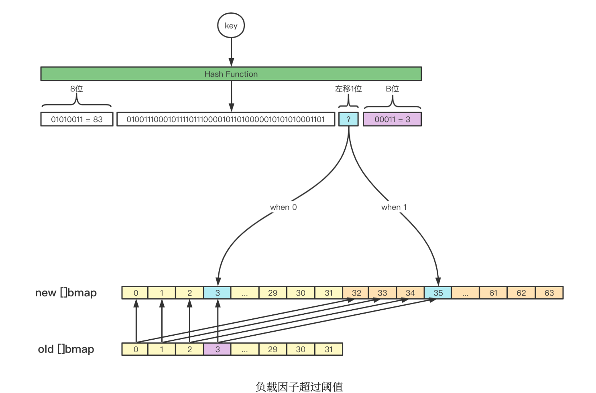

2. 溢出桶过多,当前已经使用的溢出桶数量 >=2^B次方(桶的数量) ,B最大为15，此时map会认为局部的bmap可以进行tophash密集排列，让overflow数量更少。
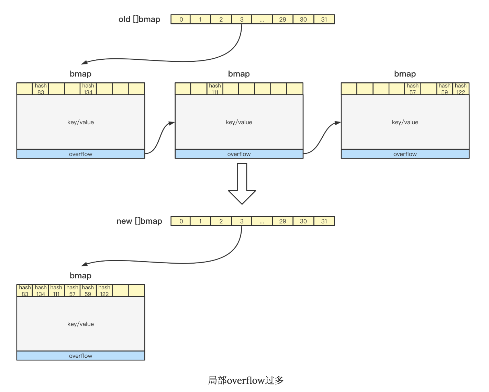

```go
// 触发扩容时机
if !h.growing() && (overLoadFactor(h.count+1, h.B) || tooManyOverflowBuckets(h.noverflow, h.B)) {
  hashGrow(t, h)
  goto again // Growing the table invalidates everything, so try again
}

// 装载因子超过 6.5
func overLoadFactor(count int, B uint8) bool {
    return count > bucketCnt && uintptr(count) > loadFactorNum*(bucketShift(B)/loadFactorDen)
}

// overflow buckets 太多
func tooManyOverflowBuckets(noverflow uint16, B uint8) bool {

    if B > 15 {
        B = 15
    }
    // The compiler doesn't see here that B < 16; mask B to generate shorter shift code.
    return noverflow >= uint16(1)<<(B&15)
}
```

解释

第 1 点：我们知道，每个 bucket 有 8 个空位，在没有溢出，且所有的桶都装满了的情况下，装载因子算出来的结果是 8。
因此当装载因子超过 6.5 时，表明很多 bucket 都快要装满了，查找效率和插入效率都变低了。在这个时候进行扩容是有必要的。

第 2 点：是对第 1 点的补充。就是说在装载因子比较小的情况下，这时候 map 的查找和插入效率也很低，而第 1 点识别不出来这种情况。
表面现象就是计算装载因子的分子比较小，即 map 里元素总数少，但是 bucket 数量多（真实分配的 bucket 数量多，包括大量的 overflow bucket）。

不难想像造成这种情况的原因：不停地插入、删除元素。先插入很多元素，导致创建了很多 bucket，但是装载因子达不到第 1 点的临界值，未触发扩容来缓解这种情况。
之后，删除元素降低元素总数量，再插入很多元素，导致创建很多的 overflow bucket，但就是不会触犯第 1 点的规定，你能拿我怎么办？
overflow bucket 数量太多，导致 key 会很分散，查找插入效率低得吓人，因此出台第 2 点规定。这就像是一座空城，房子很多，但是住户很少，都分散了，找起人来很困难

对于命中条件 1，2 的限制，都会发生扩容。但是扩容的策略并不相同，毕竟两种条件应对的场景不同。

对于条件 1，元素太多，而 bucket 数量太少，很简单：将 B 加 1，bucket 最大数量（2^B）直接变成原来 bucket 数量的 2 倍。
于是，就有新老 bucket 了。注意，这时候元素都在老 bucket 里，还没迁移到新的 bucket 来。而且，新 bucket 只是最大数量变为原来最大数量（2^B）的 2 倍（2^B * 2）。

对于条件 2，其实元素没那么多，但是 overflow bucket 数特别多，说明很多 bucket 都没装满。
解决办法就是开辟一个新 bucket 空间，将老 bucket 中的元素移动到新 bucket，使得同一个 bucket 中的 key 排列地更紧密。
这样，原来，在 overflow bucket 中的 key 可以移动到 bucket 中来。结果是节省空间，提高 bucket 利用率，map 的查找和插入效率自然就会提升。

对于条件 2 的解决方案，曹大的博客里还提出了一个极端的情况：如果插入 map 的 key 哈希都一样，就会落到同一个 bucket 里，
超过 8 个就会产生 overflow bucket，结果也会造成 overflow bucket 数过多。移动元素其实解决不了问题，因为这时整个哈希表已经退化成了一个链表，操作效率变成了 O(n)
“渐进式”扩容

hashGrow() 函数实际上并没有真正地“搬迁”，它只是分配好了新的 buckets，并将老的 buckets 挂到了 oldbuckets 字段上。

```go
func hashGrow(t *maptype, h *hmap) {
    // B+1 相当于是原来 2 倍的空间
	bigger := uint8(1)

	// 对应条件 2
	if !overLoadFactor(h.count+1, h.B) {
        // 进行等量的内存扩容，所以 B 不变
		bigger = 0
		h.flags |= sameSizeGrow
	}

    // 将老 buckets 挂到 buckets 上
	oldbuckets := h.buckets

	// 申请新的 buckets 空间
	newbuckets, nextOverflow := makeBucketArray(t, h.B+bigger, nil)

	// &^按位置0运算符
    //先把 h.flags 中 iterator 和 oldIterator 对应位清 0，然后如果发现 iterator 位为 1，那就把它转接到 oldIterator 位，使得 oldIterator 标志位变成 1。
    //潜台词就是：buckets 现在挂到了 oldBuckets 名下了，对应的标志位也转接过去吧
	flags := h.flags &^ (iterator | oldIterator)
	if h.flags&iterator != 0 {
		flags |= oldIterator
	}

	// 提交 grow 的动作
	h.B += bigger
	h.flags = flags
	h.oldbuckets = oldbuckets
	h.buckets = newbuckets

    // 搬迁进度为 0
	h.nevacuate = 0
    // overflow buckets 数为 0
	h.noverflow = 0

	if h.extra != nil && h.extra.overflow != nil {
		// Promote current overflow buckets to the old generation.
		if h.extra.oldoverflow != nil {
			throw("oldoverflow is not nil")
		}
		h.extra.oldoverflow = h.extra.overflow
		h.extra.overflow = nil
	}
	if nextOverflow != nil {
		if h.extra == nil {
			h.extra = new(mapextra)
		}
		h.extra.nextOverflow = nextOverflow
	}

	// the actual copying of the hash table data is done incrementally
	// by growWork() and evacuate().
}
```

运算符&^:按位置0运算符

```go
x = 01010011
y = 01010100
z = x &^ y= 01010011 & 10101011 = 00000011
//如果 y bit 位为 1，那么结果 z 对应 bit 位就为 0，否则 z 对应 bit 位就和 x 对应 bit 位的值相同
// flags
// 可能有迭代器使用 buckets
iterator     = 1 // there may be an iterator using buckets

// 可能有迭代器使用 oldbuckets
oldIterator  = 2 // there may be an iterator using oldbuckets
// 有协程正在向 map 中写入 key
hashWriting  = 4 // a goroutine is writing to the map
// 等量扩容（对应条件 2）
sameSizeGrow = 8 // the current map growth is to a new map of the same size
```

真正搬迁 buckets 的动作在 growWork() 函数中，而调用 growWork() 函数的动作是在 mapassign 和 mapdelete 函数中
扩容分为两种，一种是等量扩容和2倍扩容：

```go
func growWork(t *maptype, h *hmap, bucket uintptr) {
    // 确认搬迁老的 bucket 对应正在使用的 bucket
	//bucket&h.oldbucketmask() 这行代码，如源码注释里说的，是为了确认搬迁的 bucket 是我们正在使用的 bucket
	//oldbucketmask() 函数返回扩容前的 map 的 bucketmask
	evacuate(t, h, bucket&h.oldbucketmask())

	// 再搬迁一个 bucket，以加快搬迁进程
	if h.growing() {
		evacuate(t, h, h.nevacuate)
	}
}
// 如果 oldbuckets 不为空，说明还没有搬迁完毕，还得继续搬。
func (h *hmap) growing() bool {
    return h.oldbuckets != nil
}
```

所谓的 bucketmask，作用就是将 key 计算出来的哈希值与 bucketmask 相与，得到的结果就是 key 应该落入的桶。
比如 B = 5，那么 bucketmask 的低 5 位是 11111，其余位是 0，hash 值与其相与的意思是，只有 hash 值的低 5 位决策 key 到底落入哪个 bucket。
搬迁的关键函数 evacuate

```go
func evacuate(t *maptype, h *hmap, oldbucket uintptr) {

    // 定位老的 bucket 地址
	b := (*bmap)(add(h.oldbuckets, oldbucket*uintptr(t.bucketsize)))
    // 结果是 2^B，如 B = 5，结果为32
	newbit := h.noldbuckets()
	if !evacuated(b) {

        // 表示bucket 移动的目标地址
		// xy contains the x and y (low and high) evacuation destinations.
		var xy [2]evacDst
		// 默认是等 size 扩容，前后 bucket 序号不变
		x := &xy[0]
		x.b = (*bmap)(add(h.buckets, oldbucket*uintptr(t.bucketsize)))
		x.k = add(unsafe.Pointer(x.b), dataOffset)
		x.e = add(x.k, bucketCnt*uintptr(t.keysize))

        // 如果不是等 size 扩容，前后 bucket 序号有变
		if !h.sameSizeGrow() {
			// 使用 y 来进行搬迁
			y := &xy[1]
			// y 代表的 bucket 序号增加了 2^B
			y.b = (*bmap)(add(h.buckets, (oldbucket+newbit)*uintptr(t.bucketsize)))
			y.k = add(unsafe.Pointer(y.b), dataOffset)
			y.e = add(y.k, bucketCnt*uintptr(t.keysize))
		}

        // 遍历所有的 bucket，包括 overflow buckets
        // b 是老的 bucket 地址
		for ; b != nil; b = b.overflow(t) {
			k := add(unsafe.Pointer(b), dataOffset)
			e := add(k, bucketCnt*uintptr(t.keysize))

            // 遍历 bucket 中的所有 cell
			for i := 0; i < bucketCnt; i, k, e = i+1, add(k, uintptr(t.keysize)), add(e, uintptr(t.elemsize)) {

                // 当前 cell 的 top hash 值
				top := b.tophash[i]
				// 如果 cell 为空，即没有 key
				if isEmpty(top) {
                    // 那就标志它被"搬迁"过
					b.tophash[i] = evacuatedEmpty
					continue
				}
				if top < minTopHash {
					throw("bad map state")
				}
				k2 := k

				// 如果 key 是指针，则解引用
				if t.indirectkey() {
					k2 = *((*unsafe.Pointer)(k2))
				}
				var useY uint8
				// 如果不是等量扩容
				if !h.sameSizeGrow() {

                    // 计算 hash 值，和 key 第一次写入时一样
					hash := t.hasher(k2, uintptr(h.hash0))
					if h.flags&iterator != 0 && !t.reflexivekey() && !t.key.equal(k2, k2) {

                        // 如果有协程正在遍历 map, 如果出现 相同的 key 值，算出来的 hash 值不同
						useY = top & 1
						top = tophash(hash)
					} else {
						if hash&newbit != 0 {
							useY = 1
						}
					}
				}

				if evacuatedX+1 != evacuatedY || evacuatedX^1 != evacuatedY {
					throw("bad evacuatedN")
				}

				b.tophash[i] = evacuatedX + useY // evacuatedX + 1 == evacuatedY
				dst := &xy[useY]                 // evacuation destination

				if dst.i == bucketCnt {
					dst.b = h.newoverflow(t, dst.b)
					dst.i = 0
					dst.k = add(unsafe.Pointer(dst.b), dataOffset)
					dst.e = add(dst.k, bucketCnt*uintptr(t.keysize))
				}
				dst.b.tophash[dst.i&(bucketCnt-1)] = top // mask dst.i as an optimization, to avoid a bounds check
				if t.indirectkey() {
					*(*unsafe.Pointer)(dst.k) = k2 // copy pointer
				} else {
					typedmemmove(t.key, dst.k, k) // copy elem
				}
				if t.indirectelem() {
					*(*unsafe.Pointer)(dst.e) = *(*unsafe.Pointer)(e)
				} else {
					typedmemmove(t.elem, dst.e, e)
				}
				dst.i++
				// These updates might push these pointers past the end of the
				// key or elem arrays.  That's ok, as we have the overflow pointer
				// at the end of the bucket to protect against pointing past the
				// end of the bucket.
				dst.k = add(dst.k, uintptr(t.keysize))
				dst.e = add(dst.e, uintptr(t.elemsize))
			}
		}

		// 如果没有协程在使用老的 buckets，就把老 buckets 清除掉，帮助gc
		if h.flags&oldIterator == 0 && t.bucket.ptrdata != 0 {
			b := add(h.oldbuckets, oldbucket*uintptr(t.bucketsize))

            // 只清除bucket 的 key,value 部分，保留 top hash 部分，指示搬迁状态
			ptr := add(b, dataOffset)
			n := uintptr(t.bucketsize) - dataOffset
			memclrHasPointers(ptr, n)
		}
	}

	if oldbucket == h.nevacuate {

        // 更新搬迁进度
		advanceEvacuationMark(h, t, newbit)
	}
}
```

源码里提到 X, Y part，其实就是我们说的如果是扩容到原来的 2 倍，桶的数量是原来的 2 倍，前一半桶被称为 X part，后一半桶被称为 Y part。
一个 bucket 中的 key 可能会分裂落到 2 个桶，一个位于 X part，一个位于 Y part。所以在搬迁一个 cell 之前，需要知道这个 cell 中的 key 是落到哪个 Part。
很简单，重新计算 cell 中 key 的 hash，并向前“多看”一位，决定落入哪个 Part，这个前面也说得很详细了
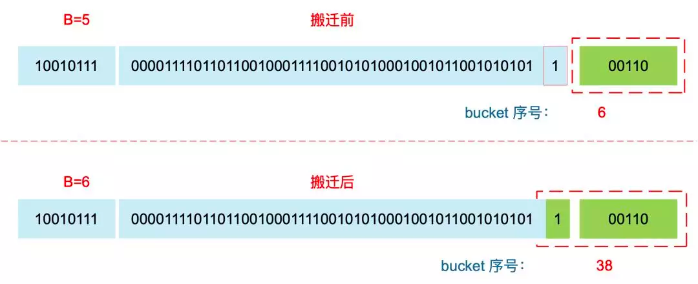

对于条件 1，从老的 buckets 搬迁到新的 buckets，由于 bucktes 数量不变，因此可以按序号来搬，比如原来在 0 号 bucktes，到新的地方后，仍然放在 0 号 buckets。

对于条件 2，就没这么简单了。要重新计算 key 的哈希，才能决定它到底落在哪个 bucket。例如，原来 B = 5，计算出 key 的哈希后，只用看它的低 5 位，就能决定它落在哪个 bucket。
扩容后，B 变成了 6，因此需要多看一位，它的低 6 位决定 key 落在哪个 bucket。这称为 rehash.

因此，某个 key 在搬迁前后 bucket 序号可能和原来相等，也可能是相比原来加上 2^B（原来的 B 值），取决于 hash 值 第 6 bit 位是 0 还是 1.
为什么遍历 map 是无序的？

map 在扩容后，会发生 key 的搬迁，原来落在同一个 bucket 中的 key，搬迁后，有些 key 就要远走高飞了（bucket 序号加上了 2^B）。
而遍历的过程，就是按顺序遍历 bucket，同时按顺序遍历 bucket 中的 key。搬迁后，key 的位置发生了重大的变化，有些 key 飞上高枝，有些 key 则原地不动。
这样，遍历 map 的结果就不可能按原来的顺序了.

当然，如果我就一个 hard code 的 map，我也不会向 map 进行插入删除的操作，按理说每次遍历这样的 map 都会返回一个固定顺序的 key/value 序列吧。
的确是这样，但是 Go 杜绝了这种做法，因为这样会给新手程序员带来误解，以为这是一定会发生的事情，在某些情况下，可能会酿成大错。

当然，Go 做得更绝，当我们在遍历 map 时，并不是固定地从 0 号 bucket 开始遍历，每次都是从一个随机值序号的 bucket 开始遍历，并且是从这个 bucket 的一个随机序号的 cell 开始遍历。
这样，即使你是一个写死的 map，仅仅只是遍历它，也不太可能会返回一个固定序列的 key/value 对了
宏观地看一下扩容前后的变化
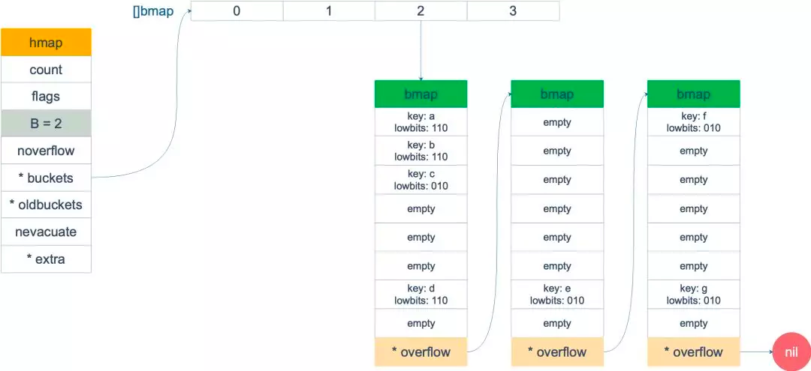
等量扩容图
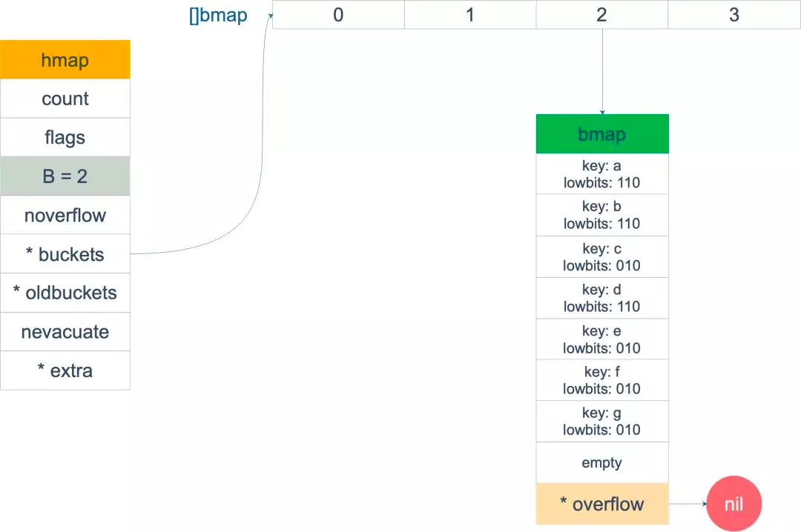

overflow bucket 消失了，key 都集中到了一个 bucket，更为紧凑了，提高了查找的效率
两倍扩容
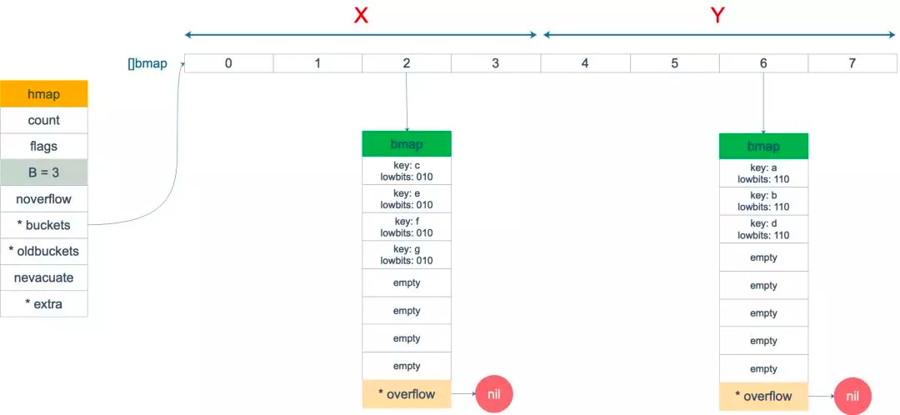

老 buckets 中的 key 分裂到了 2 个 新的 bucket。一个在 x part，一个在 y 的 part。
依据是 hash 的 lowbits。新 map 中 0-3称为 x part， 4-7 称为 y pa


### 6. 遍历

本来 map 的遍历过程比较简单：遍历所有的 bucket 以及它后面挂的 overflow bucket，然后挨个遍历 bucket 中的所有 cell。
每个 bucket 中包含 8 个 cell，从有 key 的 cell 中取出 key 和 value，这个过程就完成了。

但是，现实并没有这么简单。还记得前面讲过的扩容过程吗？
扩容过程不是一个原子的操作，它每次最多只搬运 2 个 bucket，所以如果触发了扩容操作，那么在很长时间里，map 的状态都是处于一个中间态：有些 bucket 已经搬迁到新家，而有些 bucket 还待在老地方。

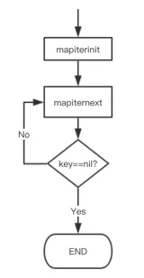

map的迭代底层对应的是runtime.mapiterinit和runtime.mapiternext：

先是调用 mapiterinit 函数初始化迭代器，然后循环调用 mapiternext 函数进行 map 迭代.

迭代器的结构体定义

```go
type hiter struct {
    // key 指针
	key         unsafe.Pointer // Must be in first position.  Write nil to indicate iteration end (see cmd/internal/gc/range.go).

	// value 指针
	elem        unsafe.Pointer // Must be in second position (see cmd/internal/gc/range.go).

    // map 类型，包含如 key size 大小等
	t           *maptype

	// map header
	h           *hmap

	// 初始化时指向的 bucket
	buckets     unsafe.Pointer // bucket ptr at hash_iter initialization time

    // 当前遍历到的 bmap
	bptr        *bmap          // current bucket
	overflow    *[]*bmap       // keeps overflow buckets of hmap.buckets alive
	oldoverflow *[]*bmap       // keeps overflow buckets of hmap.oldbuckets alive

    // 起始遍历的 bucet 编号
	startBucket uintptr        // bucket iteration started at

    // 遍历开始时 cell 的编号（每个 bucket 中有 8 个 cell）
	offset      uint8          // intra-bucket offset to start from during iteration (should be big enough to hold bucketCnt-1)

    // 是否从头遍历了
	wrapped     bool           // already wrapped around from end of bucket array to beginning

    // B 的大小
	B           uint8

	// 指示当前 cell 序号
	i           uint8
	// 指向当前的 bucket
	bucket      uintptr
	// 因为扩容，需要检查的 bucket
	checkBucket uintptr
}
```

```go
func mapiterinit(t *maptype, h *hmap, it *hiter) {
	if raceenabled && h != nil {
		callerpc := getcallerpc()
		racereadpc(unsafe.Pointer(h), callerpc, funcPC(mapiterinit))
	}

	if h == nil || h.count == 0 {
		return
	}

	if unsafe.Sizeof(hiter{})/sys.PtrSize != 12 {
		throw("hash_iter size incorrect") // see cmd/compile/internal/gc/reflect.go
	}
	it.t = t
	it.h = h

	// grab snapshot of bucket state
	it.B = h.B
	it.buckets = h.buckets
	if t.bucket.ptrdata == 0 {
		// Allocate the current slice and remember pointers to both current and old.
		// This preserves all relevant overflow buckets alive even if
		// the table grows and/or overflow buckets are added to the table
		// while we are iterating.
		h.createOverflow()
		it.overflow = h.extra.overflow
		it.oldoverflow = h.extra.oldoverflow
	}

	// decide where to start
	// 生成随机数 r
	r := uintptr(fastrand())
	if h.B > 31-bucketCntBits {
		r += uintptr(fastrand()) << 31
	}
    // 从哪个 bucket 开始遍历
	it.startBucket = r & bucketMask(h.B)
    // 从 bucket 的哪个 cell 开始遍历
	it.offset = uint8(r >> h.B & (bucketCnt - 1))
	/*

	   例如，B = 2，那 uintptr(1)<<h.B-1 结果就是 3，低 8 位为 00000011，将 r 与之相与，就可以得到一个 0~3 的 bucket 序号；
	   bucketCnt - 1 等于 7，低 8 位为 00000111，将 r 右移 2 位后，与 7 相与，就可以得到一个 0~7 号的 cell。

	   于是，在 mapiternext 函数中就会从 it.startBucket 的 it.offset 号的 cell 开始遍历，取出其中的 key 和 value，直到又回到起点 bucket，完成遍历过程。
	 */

  
	it.bucket = it.startBucket

	// Remember we have an iterator.
	// Can run concurrently with another mapiterinit().
	if old := h.flags; old&(iterator|oldIterator) != iterator|oldIterator {
		atomic.Or8(&h.flags, iterator|oldIterator)
	}

	mapiternext(it)
}

```

假设经过初始化后，startBucket = 3，offset = 2。于是，遍历的起点将是 3 号 bucket 的 2 号 cell，下面这张图就是开始遍历时的状态
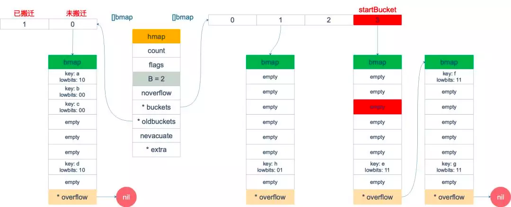

标红的表示起始位置，bucket 遍历顺序为：3 -> 0 -> 1 -> 2.

依次遍历 3 号 bucket 的 cell，这时候会找到第一个非空的 key：元素 e。到这里，mapiternext 函数返回，这时我们的遍历结果仅有一个元素

由于返回的 key 不为空，所以会继续调用 mapiternext 函数。

继续从上次遍历到的地方往后遍历，从新 3 号 overflow bucket 中找到了元素 f 和 元素 g。

新 3 号 bucket 遍历完之后，回到了新 0 号 bucket。0 号 bucket 对应老的 0 号 bucket，经检查，老 0 号 bucket 并未搬迁，
因此对新 0 号 bucket 的遍历就改为遍历老 0 号 bucket。那是不是把老 0 号 bucket 中的所有 key 都取出来呢？

并没有这么简单，回忆一下，老 0 号 bucket 在搬迁后将裂变成 2 个 bucket：新 0 号、新 2 号。而我们此时正在遍历的只是新 0 号 bucket（
注意，遍历都是遍历的 *bucket 指针，也就是所谓的新 buckets）。所以，我们只会取出老 0 号 bucket 中那些在裂变之后，分配到新 0 号 bucket 中的那些 key。

因此， lowbits==00 的将进入遍历结果集：

和之前的流程一样，继续遍历新 1 号 bucket，发现老 1 号 bucket 已经搬迁，只用遍历新 1 号 bucket 中现有的元素就可以了。结果集变成：

继续遍历新 2 号 bucket，它来自老 0 号 bucket，因此需要在老 0 号 bucket 中那些会裂变到新 2 号 bucket 中的 key，也就是 lowbit==10 的那些 key

最后，继续遍历到新 3 号 bucket 时，发现所有的 bucket 都已经遍历完毕，整个迭代过程执行完毕
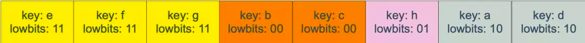

### 7. 删除 mapdelete

```go
func mapdelete(t *maptype, h *hmap, key unsafe.Pointer) {
	if raceenabled && h != nil {
		callerpc := getcallerpc()
		pc := funcPC(mapdelete)
		racewritepc(unsafe.Pointer(h), callerpc, pc)
		raceReadObjectPC(t.key, key, callerpc, pc)
	}
	if msanenabled && h != nil {
		msanread(key, t.key.size)
	}
	if h == nil || h.count == 0 {
		if t.hashMightPanic() {
			t.hasher(key, 0) // see issue 23734
		}
		return
	}
	// 如果发现写标位是 1，直接 panic，因为这表明有其他协程同时在进行写操作。
	if h.flags&hashWriting != 0 {
		throw("concurrent map writes")
	}

	// 计算 key 的哈希，找到落入的 bucket。
	hash := t.hasher(key, uintptr(h.hash0))

	// Set hashWriting after calling t.hasher, since t.hasher may panic,
	// in which case we have not actually done a write (delete).
	//  没有其他写，将flag置位
	h.flags ^= hashWriting

	bucket := hash & bucketMask(h.B)
	// 检查此 map 如果正在扩容的过程中，直接触发一次搬迁操作
	if h.growing() {
		growWork(t, h, bucket)
	}
	b := (*bmap)(add(h.buckets, bucket*uintptr(t.bucketsize)))
	bOrig := b
	top := tophash(hash)
search:
	for ; b != nil; b = b.overflow(t) {
		for i := uintptr(0); i < bucketCnt; i++ {
			if b.tophash[i] != top {
				if b.tophash[i] == emptyRest {
					break search
				}
				continue
			}
			k := add(unsafe.Pointer(b), dataOffset+i*uintptr(t.keysize))
			k2 := k
			if t.indirectkey() {
				k2 = *((*unsafe.Pointer)(k2))
			}
			if !t.key.equal(key, k2) {
				continue
			}
            // 对 key 清零
			// Only clear key if there are pointers in it.
			if t.indirectkey() {
				*(*unsafe.Pointer)(k) = nil
			} else if t.key.ptrdata != 0 {
				memclrHasPointers(k, t.key.size)
			}
			e := add(unsafe.Pointer(b), dataOffset+bucketCnt*uintptr(t.keysize)+i*uintptr(t.elemsize))
			// /对 value 清零
			if t.indirectelem() {
				*(*unsafe.Pointer)(e) = nil
			} else if t.elem.ptrdata != 0 {
				memclrHasPointers(e, t.elem.size)
			} else {
				memclrNoHeapPointers(e, t.elem.size)
			}
			b.tophash[i] = emptyOne
			// If the bucket now ends in a bunch of emptyOne states,
			// change those to emptyRest states.
			// It would be nice to make this a separate function, but
			// for loops are not currently inlineable.
			if i == bucketCnt-1 {
				if b.overflow(t) != nil && b.overflow(t).tophash[0] != emptyRest {
					goto notLast
				}
			} else {
				if b.tophash[i+1] != emptyRest {
					goto notLast
				}
			}
			for {
				b.tophash[i] = emptyRest
				if i == 0 {
					if b == bOrig {
						break // beginning of initial bucket, we're done.
					}
					// Find previous bucket, continue at its last entry.
					c := b
					for b = bOrig; b.overflow(t) != c; b = b.overflow(t) {
					}
					i = bucketCnt - 1
				} else {
					i--
				}
				if b.tophash[i] != emptyOne {
					break
				}
			}
		notLast:
		    //将 count 值减 1
			h.count--
			break search
		}
	}

	if h.flags&hashWriting == 0 {
		throw("concurrent map writes")
	}
    // flag恢复
	h.flags &^= hashWriting
}
```

它首先会检查 h.flags 标志，如果发现写标位是 1，直接 panic，因为这表明有其他协程同时在进行写操作。

计算 key 的哈希，找到落入的 bucket。检查此 map 如果正在扩容的过程中，直接触发一次搬迁操作。

删除操作同样是两层循环，核心还是找到 key 的具体位置。寻找过程都是类似的，在 bucket 中挨个 cell 寻找。

找到对应位置后，对 key 或者 value 进行“清零”操作

最后，将 count 值减 1，将对应位置的 tophash 值置成 Empty

## 参考资料

1. [曹大深度解密Map](https://qcrao.com/post/dive-into-go-map/)