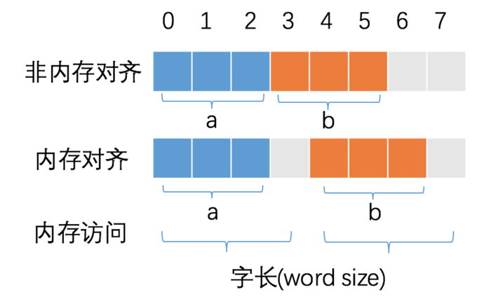
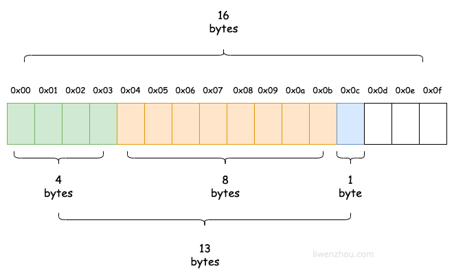
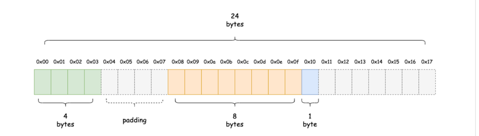
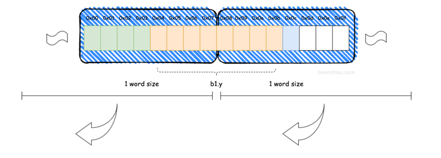
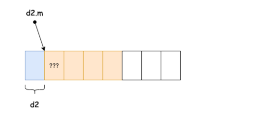

# 结构体数据结构

## 结构体大小
结构体是占用一块连续的内存，一个结构体变量的大小是由结构体中的字段决定。
```go
type Foo struct {
	A int8 // 1
	B int8 // 1
	C int8 // 1
}

func main() {
	var f Foo
	fmt.Println(unsafe.Sizeof(f)) // 3

}
```

## 内存对齐 memory alignment
### 为什么需要内存对齐
CPU 访问内存时，并不是逐个字节访问，而是以字长（word size）为单位访问。比如 32 位的 CPU ，字长为 4 字节，那么 CPU 访问内存的单位也是 4 字节。

这么设计的目的，是减少 CPU 访问内存的次数，加大 CPU 访问内存的吞吐量。比如同样读取 8 个字节的数据，一次读取 4 个字节那么只需要读取 2 次。

CPU 始终以字长访问内存，如果不进行内存对齐，很可能增加 CPU 访问内存的次数，例如



变量 a、b 各占据 3 字节的空间，内存对齐后，a、b 占据 4 字节空间，CPU 读取 b 变量的值只需要进行一次内存访问。
 如果不进行内存对齐，CPU 读取 b 变量的值需要进行 2 次内存访问。第一次访问得到 b 变量的第 1 个字节，第二次访问得到 b 变量的后两个字节。

从这个例子中也可以看到，内存对齐对实现变量的原子性操作也是有好处的，每次内存访问是原子的，如果变量的大小不超过字长，那么内存对齐后，对该变量的访问就是原子的，这个特性在并发场景下至关重要。

简言之：合理的内存对齐可以提高内存读写的性能，并且便于实现变量操作的原子性。

### 结构体的大小不完全由结构体的字段决定
取决因素
1. 只要是它最长字段长度与系统对齐系数两者之间较小的那个的整数倍, 比如int32 为4的倍数，操作系统64位是8的倍数，所以只要4的倍数就行
2. 每个字段的内存地址都严格满足内存对齐要求

```go
type Bar struct {
	x int32 // 4
	y *Foo  // 8
	z bool  // 1
}
func main() {
    var b1 Bar
    fmt.Println(unsafe.Sizeof(b1)) // 24
}

```
预测的内存布局


布局应该如下图,灰色虚线的部分就是内存对齐时的填充（padding）部分。


Go 在编译的时候会按照一定的规则自动进行内存对齐。之所以这么设计是为了减少 CPU 访问内存的次数，加大 CPU 访问内存的吞吐量。
如果不进行内存对齐的话，很可能就会增加CPU访问内存的次数。例如下图中CPU想要获取b1.y字段的值可能就需要两次总线周期。

因为 CPU 访问内存时，并不是逐个字节访问，而是以字（word）为单位访问。比如 64位CPU的字长（word size）为8bytes，那么CPU访问内存的单位也是8字节，
每次加载的内存数据也是固定的若干字长，如8words（64bytes）、16words(128bytes）等.

## 结构体内存布局的特殊场景

### 空结构体字段对齐
如果结构或数组类型不包含大小大于零的字段（或元素），则其大小为0。两个不同的0大小变量在内存中可能有相同的地址。

由于空结构体struct{}的大小为 0，所以当一个结构体中包含空结构体类型的字段时，通常不需要进行内存对齐。例如：
```go
type Demo1 struct {
	m struct{} // 0
	n int8     // 1
}

var d1 Demo1
fmt.Println(unsafe.Sizeof(d1))  // 1
```

但是当空结构体类型作为结构体的最后一个字段时，如果有指向该字段的指针，那么就会返回该结构体之外的地址。为了避免内存泄露会额外进行一次内存对齐。

```go
type Demo2 struct {
	n int8     // 1
	m struct{} // 0
}

var d2 Demo2
fmt.Println(unsafe.Sizeof(d2))  // 2
```

在实际编程中通过灵活应用空结构体大小为0的特性能够帮助我们节省很多不必要的内存开销。

例如，我们可以使用空结构体作为map的值来实现一个类似 Set 的数据结构。
```go
var set map[int]struct{}
```

我们还可以使用空结构体作为通知类channel的元素
```go
// src/net/pipe.go

// pipeDeadline is an abstraction for handling timeouts.
type pipeDeadline struct {
	mu     sync.Mutex // Guards timer and cancel
	timer  *time.Timer
	cancel chan struct{} // Must be non-nil
}
```

## hot path
hot path 是指执行非常频繁的指令序列。

在访问结构体的第一个字段时，我们可以直接使用结构体的指针来访问第一个字段（结构体变量的内存地址就是其第一个字段的内存地址）。

如果要访问结构体的其他字段，除了结构体指针外，还需要计算与第一个值的偏移(calculate offset)。在机器码中，偏移量是随指令传递的附加值，CPU 需要做一次偏移值与指针的加法运算，才能获取要访问的值的地址。因为访问第一个字段的机器代码更紧凑，速度更快。

下面的代码是标准库sync.Once中的使用示例，通过将常用字段放置在结构体的第一个位置上减少CPU要执行的指令数量，从而达到更快的访问效果
```go
// src/sync/once.go 

// Once is an object that will perform exactly one action.
//
// A Once must not be copied after first use.
type Once struct {
	// done indicates whether the action has been performed.
	// It is first in the struct because it is used in the hot path.
	// The hot path is inlined at every call site.
	// Placing done first allows more compact instructions on some architectures (amd64/386),
	// and fewer instructions (to calculate offset) on other architectures.
	done uint32
	m    Mutex
}
```
