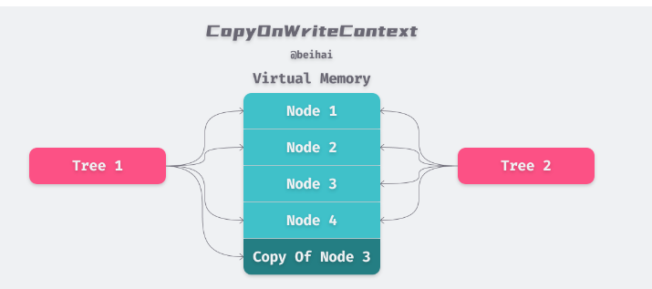

# 写入时复制（英语：Copy-on-write，简称COW）

Copy-On-Write策略用于读多写少的并发场景。


## 缺点


### 内存占用问题
因为Copy-On-Write的写时复制机制，所以在进行写操作的时候，内存里会同时驻扎两个对象的内存。

### 数据一致性问题
Copy-On-Write策略只能保证数据的最终一致性，不能保证数据的实时一致性。写入数据之后，不能保证马上读取到最新的数据。


## 第三方应用： github.com/google/btree
btree是Google开源的一个Go语言的BTree实现。


```go
// github.com/google/btree@v1.1.2/btree_generic.go
type BTreeG[T any] struct {
	degree int
	length int
	root   *node[T]
	cow    *copyOnWriteContext[T]
}

type node[T any] struct {
	items    items[T]
	children items[*node[T]]
	cow      *copyOnWriteContext[T]
}
```

copyOnWriteContext 是一个写时复制有关的内容。


由于 btree 是一个纯内存的实现，当我们使用内部提供的Clone()方法对原有的 btree 进行拷贝时，新树与旧树会使用写时复制技术来共享同一片内存空间，进而节约内存开销与数据复制所需的时间。
```go
type copyOnWriteContext[T any] struct {
	freelist *FreeListG[T]
	less     LessFunc[T]
}
```

> Redis 的 RDB 持久化中也使用到了 COW 技术，Redis 主进程 fork 出子进程进行数据备份，父进程继续对外提供服务。
> 而子父进程只是虚拟空间不同，对应的物理空间是相同的，这与Clone()方法有异曲同工之处。区别在于 btree 的写时复制直接共享了虚拟内存地址，
 
```go
func (n *node[T]) mutableFor(cow *copyOnWriteContext[T]) *node[T] {
	if n.cow == cow {
		// 如果当前节点的 cow 与 btree 的 cow 一致，那么直接返回当前节点
		return n
	}
	// 否则会新建一个节点，并拷贝当前节点的值至新的节点中
	out := cow.newNode()
	if cap(out.items) >= len(n.items) {
		out.items = out.items[:len(n.items)]
	} else {
		out.items = make(items[T], len(n.items), cap(n.items))
	}
	copy(out.items, n.items)
	// Copy children
	if cap(out.children) >= len(n.children) {
		out.children = out.children[:len(n.children)]
	} else {
		out.children = make(items[*node[T]], len(n.children), cap(n.children))
	}
	copy(out.children, n.children)
	return out
}


func (c *copyOnWriteContext[T]) newNode() (n *node[T]) {
	n = c.freelist.newNode()
	n.cow = c
	return
}

func (f *FreeListG[T]) newNode() (n *node[T]) {
	f.mu.Lock()
	index := len(f.freelist) - 1
	if index < 0 {
		f.mu.Unlock()
		return new(node[T])
	}
	n = f.freelist[index]
	f.freelist[index] = nil
	f.freelist = f.freelist[:index]
	f.mu.Unlock()
	return
}

```