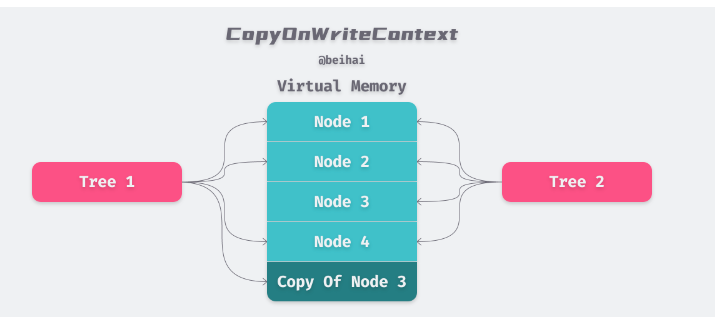

<!-- START doctoc generated TOC please keep comment here to allow auto update -->
<!-- DON'T EDIT THIS SECTION, INSTEAD RE-RUN doctoc TO UPDATE -->
**Table of Contents**  *generated with [DocToc](https://github.com/thlorenz/doctoc)*

- [写入时复制（Copy-on-write，简称COW）](#%E5%86%99%E5%85%A5%E6%97%B6%E5%A4%8D%E5%88%B6copy-on-write%E7%AE%80%E7%A7%B0cow)
  - [优点](#%E4%BC%98%E7%82%B9)
  - [缺点](#%E7%BC%BA%E7%82%B9)
  - [第三方应用： github.com/google/btree](#%E7%AC%AC%E4%B8%89%E6%96%B9%E5%BA%94%E7%94%A8-githubcomgooglebtree)

<!-- END doctoc generated TOC please keep comment here to allow auto update -->

# 写入时复制（Copy-on-write，简称COW）

Copy-On-Write策略用于读多写少的并发场景。

## 优点
COW技术的主要优点是节省内存和提高效率。由于只有一个副本需要被修改，所以它比传统的复制算法更节省内存。 此外，由于其他程序可以继续访问原始的共享内存，所以COW技术也提高了程序的效率。

## 缺点

Copy-On-Write策略只能保证数据的最终一致性，不能保证数据的实时一致性。写入数据之后，不能保证马上读取到最新的数据。


## 第三方应用： github.com/google/btree
btree是Google开源的一个Go语言的BTree实现。


```go
// github.com/google/btree@v1.1.2/btree_generic.go
type BTreeG[T any] struct {
	degree int
	length int
	root   *node[T]
	cow    *copyOnWriteContext[T]
}

type node[T any] struct {
	items    items[T]
	children items[*node[T]]
	cow      *copyOnWriteContext[T]
}

type copyOnWriteContext[T any] struct {
	freelist *FreeListG[T]
	less     LessFunc[T]
}
```

copyOnWriteContext 是一个写时复制有关的内容,每个node里面也保存了一份cow。



```go
func (t *BTree) Clone() (t2 *BTree) {
	// Create two entirely new copy-on-write contexts.
	// This operation effectively creates three trees:
	//   the original, shared nodes (old b.cow)
	//   the new b.cow nodes
	//   the new out.cow nodes
	cow1, cow2 := *t.cow, *t.cow
	out := *t
	t.cow = &cow1
	out.cow = &cow2
	return &out
}
```

由于 btree 是一个纯内存的实现，当我们使用内部提供的Clone()方法对原有的 btree 进行拷贝时，新树与旧树会使用写时复制技术来共享同一片内存空间，进而节约内存开销与数据复制所需的时间。

BTree有一个Clone方法， 可以看到虽然clone出来一个新的cow2，但是cow1和cow2里指向的freelist却还是都是同一个地址(freelist)。
也就是如果只是读取Clone()出来的新BTree，跟原先的是同一份freelist，freelist里面的node如果不修改，则都可以不需要重新拷贝。

> Redis 的 RDB 持久化中也使用到了 COW 技术，Redis 主进程 fork 出子进程进行数据备份，父进程继续对外提供服务。
> 而子父进程只是虚拟空间不同，对应的物理空间是相同的，这与Clone()方法有异曲同工之处。区别在于 btree 的写时复制直接共享了虚拟内存地址，

当需要修改freelist里面的Node的时候
```go
func (t *BTree) ReplaceOrInsert(item Item) Item {
	if item == nil {
		panic("nil item being added to BTree")
	}
	if t.root == nil {
		t.root = t.cow.newNode()
		t.root.items = append(t.root.items, item)
		t.length++
		return nil
	} else {
		//这里判断一下需不需要重新拷贝node
		t.root = t.root.mutableFor(t.cow)
		if len(t.root.items) >= t.maxItems() {
			item2, second := t.root.split(t.maxItems() / 2)
			oldroot := t.root
			t.root = t.cow.newNode()
			t.root.items = append(t.root.items, item2)
			t.root.children = append(t.root.children, oldroot, second)
		}
	}
	out := t.root.insert(item, t.maxItems())
	if out == nil {
		t.length++
	}
	return out
}
```

```go
//这里的逻辑就是判断一下，是否需要重新复制node，并修改其值
func (n *node[T]) mutableFor(cow *copyOnWriteContext[T]) *node[T] {
	if n.cow == cow {
		// 如果当前节点的 cow 与 btree 的 cow 一致，那么直接返回当前节点
		return n
	}
	// 否则会新建一个节点，并拷贝当前节点的值至新的节点中
	out := cow.newNode()
	if cap(out.items) >= len(n.items) {
		out.items = out.items[:len(n.items)]
	} else {
		out.items = make(items[T], len(n.items), cap(n.items))
	}
	copy(out.items, n.items)
	// Copy children
	if cap(out.children) >= len(n.children) {
		out.children = out.children[:len(n.children)]
	} else {
		out.children = make(items[*node[T]], len(n.children), cap(n.children))
	}
	copy(out.children, n.children)
	return out
}


func (c *copyOnWriteContext[T]) newNode() (n *node[T]) {
	n = c.freelist.newNode()
	n.cow = c
	return
}

func (f *FreeListG[T]) newNode() (n *node[T]) {
	f.mu.Lock()
	index := len(f.freelist) - 1
	if index < 0 {
		f.mu.Unlock()
		return new(node[T])
	}
	n = f.freelist[index]
	f.freelist[index] = nil
	f.freelist = f.freelist[:index]
	f.mu.Unlock()
	return
}

```