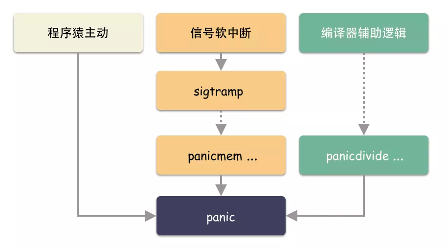

# Panic产生方式
 

主动方式：

    程序猿主动调用 panic( ) 函数；    
被动的方式：

    编译器的隐藏代码触发；
    内核发送给进程信号触发 

现在我们摸透了 panic 产生的姿势，以上三种方式，无论哪一种都归一到 panic( ) 这个函数调用。所以有一点很明确：panic 这个东西是语言层面的处理逻辑。 

    几个简单的事实
    1.panic( ) 函数内部会产生一个关键的数据结构体 _panic ，并且挂接到 goroutine 之上；
    2.panic( ) 函数内部会执行 _defer 函数链条，并针对 _panic 的状态进行对应的处理

# Go 1.13.5

## _panic 数据结构
```go
type _panic struct {
    argp      unsafe.Pointer
    arg       interface{}    // panic 的参数
    link      *_panic        // 链接下一个 panic 结构体
    recovered bool           // 是否恢复，到此为止？recover( ) 其实就是修改这个字段
    aborted   bool           // the panic was aborted
}

// goroutine 的两个重要字段
type g struct {
    // ...
    _panic         *_panic // panic 链表，这是最里的一个
    _defer         *_defer // defer 链表，这是最里的一个；
    // ...
}
//从这里我们看出：_defer 和 _panic 链表都是挂在 goroutine 之上的。什么时候会导致 _panic 链表上多个元素
```

recover 对应了 runtime/panic.go 中的 gorecover 函数实现
```go
func gorecover(argp uintptr) interface{} {
    // 只处理 gp._panic 链表最新的这个 _panic；
	
	//1.取出当前 goroutine 结构体
    gp := getg()
    
    //取出当前 goroutine 的 _panic 链表最新的一个 _panic，如果是非 nil 值，则进行处理；
    p := gp._panic
    if p != nil && !p.recovered && argp == uintptr(p.argp) {
    	// 该 _panic 结构体的 recovered 赋值 true，程序返回
        p.recovered = true
        return p.arg
    }
    return nil
}
```

panic 的实现在一个叫做 gopanic 的函数，位于 runtime/panic.go 文件

为什么 panic 会显得晦涩，主要有两个点：

    1.嵌套 panic 的时候，gopanic 会有递归执行的场景；
    2.程序指令跳转并不是常规的函数压栈，弹栈，在 recovery 的时候，是直接修改指令寄存器的结构体，从而直接越过了 gopanic 后面的逻辑，甚至是多层 gopanic 递归的逻辑；

```go
// runtime/panic.go
func gopanic(e interface{}) {
    gp := getg()
    
    // 在栈上分配一个 _panic 结构体
    var p _panic
    // 把当前最新的 _panic 挂到链表最前面
    p.link = gp._panic
    gp._panic = (*_panic)(noescape(unsafe.Pointer(&p)))
    
    for {
        // 取出当前最近的 defer 函数；
        d := gp._defer
        if d == nil {
            // 如果没有 defer ，那就没有 recover 的时机，只能跳到循环外，退出进程了；
            break
        }

        // 进到这个逻辑，那说明了之前是有 panic 了，现在又有 panic 发生，这里一定处于递归之中；
        if d.started {
            if d._panic != nil {
                d._panic.aborted = true
            }
            // 把这个 defer 从链表中摘掉；
            gp._defer = d.link
            freedefer(d)
            continue
        }

        // 标记 _defer 为 started = true （panic 递归的时候有用）
        d.started = true
        // 记录当前 _defer 对应的 panic
        d._panic = (*_panic)(noescape(unsafe.Pointer(&p)))

        // 执行 defer 函数
        reflectcall(nil, unsafe.Pointer(d.fn), deferArgs(d), uint32(d.siz), uint32(d.siz))

        // defer 执行完成，把这个 defer 从链表里摘掉；
        gp._defer = d.link
        
        // 取出 pc，sp 寄存器的值；
        pc := d.pc
        sp := unsafe.Pointer(d.sp)
        // 如果 _panic 被设置成恢复，那么到此为止；
        if p.recovered {
            // 摘掉当前的 _panic
            gp._panic = p.link
            // 如果前面还有 panic，并且是标记了 aborted 的，那么也摘掉；
            for gp._panic != nil && gp._panic.aborted {
                gp._panic = gp._panic.link
            }
            // panic 的流程到此为止，恢复到业务函数堆栈上执行代码；
            gp.sigcode0 = uintptr(sp)
            gp.sigcode1 = pc
            // 注意：恢复的时候 panic 函数将从此处跳出，本 gopanic 调用结束，后面的代码永远都不会执行。
            mcall(recovery)
            throw("recovery failed") // mcall should not return
        }
    }

    // 打印错误信息和堆栈，并且退出进程；
    preprintpanics(gp._panic)
    fatalpanic(gp._panic) // should not return
    *(*int)(nil) = 0      // not reached
}
```