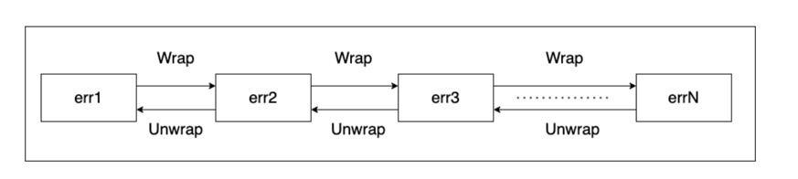

<!-- START doctoc generated TOC please keep comment here to allow auto update -->
<!-- DON'T EDIT THIS SECTION, INSTEAD RE-RUN doctoc TO UPDATE -->
**Table of Contents**  *generated with [DocToc](https://github.com/thlorenz/doctoc)*

- [错误链](#%E9%94%99%E8%AF%AF%E9%93%BE)
  - [背景](#%E8%83%8C%E6%99%AF)

<!-- END doctoc generated TOC please keep comment here to allow auto update -->

# 错误链

由错误逐个包裹而形成的链式结构



## 背景

```go
package main

import (
	"errors"
	"fmt"
	"os"
)

func readFile(filename string) ([]byte, error) {
	data, err := os.ReadFile(filename)
	if err != nil {
		return nil, err
	}
	return data, nil
}

// 方式一
func processFile(filename string) error {
	_, err := readFile(filename)
	if err != nil {

		return err
	}
	// process the file data...
	return nil
}

// 方式二
func processFile2(filename string) error {
	_, err := readFile(filename)
	if err != nil {
		return fmt.Errorf("failed to read file: %w", err)
	}
	// process the file data...
	return nil
}

func main() {
	fmt.Println(processFile("a.txt"))  // open a.txt: no such file or directory

	err := processFile2("a.txt")
	if err != nil {
		fmt.Println(err)                            // failed to read file: open a.txt: no such file or directory
		fmt.Println(errors.Is(err, os.ErrNotExist)) // true
		err = errors.Unwrap(err)
		fmt.Println(err) // open a.txt: no such file or directory
		err = errors.Unwrap(err)
		fmt.Println(err) //no such file or directory
		return
	}
}


```


Go在errors包中提供了Is、As和Unwrap()函数。Is和As函数用于判定某个error是否存在于错误链中，Unwrap这个函数返回错误链中的下一个直接错误。