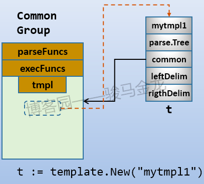

<!-- START doctoc generated TOC please keep comment here to allow auto update -->
<!-- DON'T EDIT THIS SECTION, INSTEAD RE-RUN doctoc TO UPDATE -->
**Table of Contents**  *generated with [DocToc](https://github.com/thlorenz/doctoc)*

- [template](#template)
  - [应用场景](#%E5%BA%94%E7%94%A8%E5%9C%BA%E6%99%AF)
  - [使用流程](#%E4%BD%BF%E7%94%A8%E6%B5%81%E7%A8%8B)
  - [基本语法](#%E5%9F%BA%E6%9C%AC%E8%AF%AD%E6%B3%95)
    - [变量](#%E5%8F%98%E9%87%8F)
    - [控制结构](#%E6%8E%A7%E5%88%B6%E7%BB%93%E6%9E%84)
    - [with...end](#withend)
    - [注释](#%E6%B3%A8%E9%87%8A)
    - [裁剪空白](#%E8%A3%81%E5%89%AA%E7%A9%BA%E7%99%BD)
    - [管道函数](#%E7%AE%A1%E9%81%93%E5%87%BD%E6%95%B0)
    - [文本输出](#%E6%96%87%E6%9C%AC%E8%BE%93%E5%87%BA)
    - [模板函数](#%E6%A8%A1%E6%9D%BF%E5%87%BD%E6%95%B0)
    - [block块](#block%E5%9D%97)
  - [源码分析](#%E6%BA%90%E7%A0%81%E5%88%86%E6%9E%90)
      - [Template结构](#template%E7%BB%93%E6%9E%84)
      - [初始化](#%E5%88%9D%E5%A7%8B%E5%8C%96)
    - [解析](#%E8%A7%A3%E6%9E%90)
    - [执行Execute()和ExecuteTemplate()](#%E6%89%A7%E8%A1%8Cexecute%E5%92%8Cexecutetemplate)
    - [自定义函数](#%E8%87%AA%E5%AE%9A%E4%B9%89%E5%87%BD%E6%95%B0)
  - [常见问题](#%E5%B8%B8%E8%A7%81%E9%97%AE%E9%A2%98)
  - [参考链接](#%E5%8F%82%E8%80%83%E9%93%BE%E6%8E%A5)

<!-- END doctoc generated TOC please keep comment here to allow auto update -->

# template 
- Text/template：实现数据驱动模板以生成文本输出，可以理解为一组文字按照特定格式动态嵌入另一组文字中
- Html/template：Html包 提供了用于转义和修改 HTML 文本的功能。

模板包（html/template）实现了数据驱动的模板，以便在代码注入过程中安全地生成 HTML 输出。它提供了与包 text/template 相同的接口，只要输出是 HTML，就应该使用它来代替 text/template。


## 应用场景
- kratos应用：https://github.com/go-kratos/kratos/blob/main/cmd/kratos/internal/proto/add/template.go

## 使用流程
构建模板对象New()-->解析数据Parse()-->应用合并Execute()

1. [多模版指定](chapter22_template/01_multi_template/main.go)

解释 
- {{.}}代表的是要应用的对象，类似于java/c++中的this，python/perl中的self，更通用地，{{.}}表示的是所处作用域的当前对象


## 基本语法


### 变量
```go
// 未定义过的变量
$var := pipeline

// 已定义过的变量
$var = pipeline
```

例如
```go
{{- $how_long :=(len "output")}}
{{- println $how_long}}   // 输出6
```

### 控制结构
1. 循环操作：pipeline 的值必须是数组、切片、字典和通道中的一种，即可迭代类型的值，根据值的长度输出多个 T1

range...end迭代
```go
{{ range pipeline }} T1 {{ end }}
// 这个 else 比较有意思，如果 pipeline 的长度为 0 则输出 else 中的内容
{{ range pipeline }} T1 {{ else }} T0 {{ end }}

// 获取容器的下标
{{ range $index, $value := pipeline }} T1 {{ end }}

// 案例
{{range .Field}}
  {{.ChildFieldOne}}  -- {{.ChildFieldTwo }}
{{ end }}
```

2. 条件语句
```go
{{ if pipeline }} T1 {{ end }}
{{ if pipeline }} T1 {{ else }} T0 {{ end }}
{{ if pipeline }} T1 {{ else if pipeline }} T0 {{ end }}
// 上面的语法其实是下面的简写
{{ if pipeline }} T1 {{ else }}{{ if pipeline }} T0 { {end }}{{ end }}
{{ if pipeline }} T1 {{ else if pipeline }} T2 {{ else }} T0 {{ end }}

```
需要注意的是，pipeline为false的情况是各种数据对象的0值：数值0，指针或接口是nil，数组、slice、map或string则是len为0。

### with...end
with用来设置"."的值。两种格式

```go
{{with pipeline}} T1 {{end}}
{{with pipeline}} T1 {{else}} T0 {{end}}
```
- 对于第一种格式，当pipeline不为0值的时候，点"."设置为pipeline运算的值，否则跳过。
- 对于第二种格式，当pipeline为0值时，执行else语句块，否则"."设置为pipeline运算的值，并执行T1。

例如
```go
{{with "xx"}}{{println .}}{{end}}
```
上面将输出xx，因为"."已经设置为"xx"。

### 注释
注释后的内容不会被引擎进行替换。但需要注意，注释行在替换的时候也会占用行，所以应该去除前缀和后缀空白，否则会多一空行
```go
{{- /* a comment without prefix/suffix space */}}
{{/* a comment without prefix/suffix space */ -}}
{{- /* a comment without prefix/suffix space */ -}}
```

### 裁剪空白

template引擎在进行替换的时候，是完全按照文本格式进行替换的。除了需要评估和替换的地方，所有的行分隔符、空格等等空白都原样保留。
所以，**对于要解析的内容，不要随意缩进、随意换行**.

```go
// 裁剪 content 前后的空格
{{- content -}}

// 裁剪 content 前面的空格
{{- content }}

// 裁剪 content 后面的空格
{{ content -}}

```
### 管道函数
```go
// 用法1：

{{FuncName1}}

// 此标签将调用名称为“FuncName1”的模板函数（等同于执行“FuncName1()”，不传递任何参数）并输出其返回值。

// 用法2：

{{FuncName1 "参数值1" "参数值2"}}

// 此标签将调用“FuncName1("参数值1", "参数值2")”，并输出其返回值

// 用法3：

{{.Admpub|FuncName1}}

// 此标签将调用名称为“FuncName1”的模板函数（等同于执行“FuncName1(this.Admpub)”，将竖线“|”左边的“.Admpub”变量值作为函数参数传送）并输出其返回值。

```
### 文本输出
pipeline是指产生数据的操作

可以使用管道符号|链接多个命令，用法和unix下的管道类似：|前面的命令将运算结果(或返回值)传递给后一个命令的最后一个位置。

```go
{{.}} | printf "%s\n" "abcd"
```
{{.}}的结果将传递给printf，且传递的参数位置是"abcd"之后。

需要注意的是，并非只有使用了|才是pipeline。Go template中，pipeline的概念是传递数据，只要能产生数据的，都是pipeline。
这使得某些操作可以作为另一些操作内部的表达式先运行得到结果，就像是Unix下的命令替换一样。

例如，下面的(len "output")是pipeline，它整体先运行。
```go
{{println (len "output")}}
```

### 模板函数
即：可以对某个字段使用函数操作。适用于稍微复杂的字段处理。

```go
type FuncMap map[string]interface{}
t = t.Funcs(template.FuncMap{"handleFieldName": HandleFunc})

```
内置模板函数

```go
// go1.18/src/text/template/funcs.go
func builtins() FuncMap {
	return FuncMap{
		"and":      and,
		"call":     call,
		"html":     HTMLEscaper,
		"index":    index,
		"slice":    slice,
		"js":       JSEscaper,
		"len":      length,
		"not":      not,
		"or":       or,
		"print":    fmt.Sprint,
		"printf":   fmt.Sprintf,
		"println":  fmt.Sprintln,
		"urlquery": URLQueryEscaper,

		// Comparisons
		"eq": eq, // ==
		"ge": ge, // >=
		"gt": gt, // >
		"le": le, // <=
		"lt": lt, // <
		"ne": ne, // !=
	}
}
```

index: 对可索引对象进行索引取值。
第一个参数是索引对象，后面的参数是索引位。"index x 1 2 3"代表的是x[1][2][3]。可索引对象包括map、slice、array


call:显式调用函数。第一个参数必须是函数类型，且不是template中的函数，而是外部函数。
例如一个struct中的某个字段是func类型的。
"call .X.Y 1 2"表示调用dot.X.Y(, )，Y必须是func类型，函数参数是和。
函数必须只能有一个或个返回值，如果有第二个返回值，则必须为error类型。

### block块
```go
// go1.18/src/text/template/doc.go
{{block "name" pipeline}} T1 {{end}}
    A block is shorthand for defining a template
        {{define "name"}} T1 {{end}}
    and then executing it in place
        {{template "name" pipeline}}
    The typical use is to define a set of root templates that are
    then customized by redefining the block templates within.
```

> 根据官方文档的解释：block等价于define定义一个名为name的模板，并在"有需要"的地方执行这个模板，执行时将"."设置为pipeline的值。

但应该注意，block的第一个动作是执行名为name的模板，如果不存在，则在此处自动定义这个模板，并执行这个临时定义的模板。换句话说，block可以认为是设置一个默认模板。

```go
{{block "T1" .}} one {{end}}
```

它首先表示{{template "T1" .}}，也就是说先找到T1模板，如果T1存在，则执行找到的T1，
如果没找到T1，则临时定义一个{{define "T1"}} one {{end}}，并执行它。


下面是正常情况下不使用block的示例。
```html
// home.html
<html>
    <head>
        <meta http-equiv="Content-Type" content="text/html; charset=utf-8">
        <title>Go Web Programming</title>
    </head>
    <body>
        {{ template "content" }}
    </body>
</html>
```
在此文件中指定了要执行一个名为"content"的模板，但此文件中没有使用define定义该模板，所以需要在其它文件中定义名为content的模板。现在分别在两个文件中定义两个content模板：


```html
//red.html
{{ define "content" }}
    <h1 style="color: red;">Hello World!</h1>
{{ end }}
```
```html
//blue.html
{{ define "content" }}
    <h1 style="color: blue;">Hello World!</h1>
{{ end }}
```

```go
// handler.go
func process(w http.ResponseWriter, r *http.Request) {
    rand.Seed(time.Now().Unix())
    t := template.New("test")
    if rand.Intn() >  {
        t, _ = template.ParseFiles("home.html", "red.html")
    } else {
        t, _ = template.ParseFiles("home.html", "blue.html")
    }
    t.Execute(w,"")
}
```


接下来使用 block，那么可以设置默认的content模板：将原本定义在blue.html中的content设置为默认模板。
```html
// home.html
<html>
    <head>
        <meta http-equiv="Content-Type" content="text/html; charset=utf-8">
        <title>Go Web Programming</title>
    </head>
    <body>
        {{ block "content" . }}
            <h1 style="color: blue;">Hello World!</h1>
        {{ end }}
    </body>
</html>
```

```go
// handler.ho
func process(w http.ResponseWriter, r *http.Request) {
    rand.Seed(time.Now().Unix())
    t := template.New("test")
    if rand.Intn() >  {
        t, _ = template.ParseFiles("home.html", "red.html")
    } else {
        t, _ = template.ParseFiles("home.html")
    }
    t.Execute(w,"")
}
```


## 源码分析

#### Template结构


```go
type Template struct {
	name string // Template的名称
	*parse.Tree // 解析树
	*common
	leftDelim  string // 左右两边的分隔符，默认为{{ 和 }}
	rightDelim string
}
```

common结构

```go
type common struct {
	tmpl   map[string]*Template // 一个common结构中可以包含多个Template，而Template结构中又指向了一个common结构。
	option option
	muFuncs    sync.RWMutex // protects parseFuncs and execFuncs
	parseFuncs FuncMap
	execFuncs  map[string]reflect.Value
}

```

这个结构的第一个字段tmpl是一个Template的map结构，key为template的name，value为Template。也就是说，一个common结构中可以包含多个Template，而Template结构中又指向了一个common结构。

所以，common是一个模板组，在这个模板组中的(tmpl字段)所有Template都共享一个common(模板组)，模板组中包含parseFuncs和execFuncs。


返回模版的函数


#### 初始化


template.New()函数
```go
func New(name string) *Template {
	t := &Template{
		name: name,
	}
	// 创建common组
	t.init()
	return t
}

func (t *Template) init() {
	if t.common == nil {
		c := new(common)
		c.tmpl = make(map[string]*Template)
		c.parseFuncs = make(FuncMap)
		c.execFuncs = make(map[string]reflect.Value)
		t.common = c
	}
}
```
Note: 新创建的common是空的，只有进行模板解析(Parse()，ParseFiles()等操作)之后，才会将模板添加到common的tmpl字段(map结构)中。

因为还没有进行解析操作，所以上图使用虚线表示尚不存在的部分


除了template.New()函数，还有一个Template.New()方法：
```go
// New allocates a new, undefined template associated with the given one and with the same
// delimiters. The association, which is transitive, allows one template to
// invoke another with a {{template}} action.
func (t *Template) New(name string) *Template {
	t.init()
	nt := &Template{
		name:       name,
		common:     t.common,
		leftDelim:  t.leftDelim,
		rightDelim: t.rightDelim,
	}
	return nt
}

```
首先t.init()保证有一个有效的common结构，然后构造一个新的Template对象nt，这个nt除了name和解析树parse.Tree字段之外，其它所有内容都和t完全一致。换句话说，nt和t共享了common。

这和New()函数的作用基本是一致的，只不过New()函数是构建新的模板对象并构建一个新的common结构，而New()方法则是构建一个新的模板对象，并加入到已有的common结构中。


### 解析
- Parse()只能解析字符串
- 要解析文件中的内容，使用ParseFiles()或ParseGlob()


### 执行Execute()和ExecuteTemplate()
```go
func (t *Template) Execute(wr io.Writer, data interface{}) error
func (t *Template) ExecuteTemplate(wr io.Writer, name string, data interface{}) error

```
两者的区别在于Execute()是应用整个common中已定义的模板对象，而ExecuteTemplate()可以选择common中某个已定义的模板进行应用。

### 自定义函数

template内置了一系列函数
```go
func builtins() FuncMap {
	return FuncMap{
		"and":      and, // 返回第一个为空的参数或最后一个参数。可以有任意多个参数。and x y等价于if x then y else x
		
		//显式调用函数。第一个参数必须是函数类型，且不是template中的函数，而是外部函数。
		// 例如一个struct中的某个字段是func类型的。
		// "call .X.Y 1 2"表示调用dot.X.Y(, )，Y必须是func类型，函数参数是和。
		// 函数必须只能有一个或个返回值，如果有第二个返回值，则必须为error类型
		"call":     call,
		"html":     HTMLEscaper,
		"index":    index,
		"slice":    slice,
		"js":       JSEscaper,
		"len":      length,
		"not":      not, // 布尔取反。只能一个参数。
		"or":       or, // 返回第一个不为空的参数或最后一个参数。可以有任意多个参数。 "or x y"等价于"if x then x else y"。
        // 分别等价于fmt包中的Sprint、Sprintf、Sprintln
		"print":    fmt.Sprint,
		"printf":   fmt.Sprintf,
		"println":  fmt.Sprintln,
		"urlquery": URLQueryEscaper,

		// Comparisons
		"eq": eq, // ==
		"ge": ge, // >=
		"gt": gt, // >
		"le": le, // <=
		"lt": lt, // <
		"ne": ne, // !=
	}
}
```
但这些函数毕竟有限，可能无法满足特殊的需求。template允许我们定义自己的函数，添加到common中，然后就可以在待解析的内容中像使用内置函数一样使用自定义的函数

自定义函数的优先级高于内置的函数优先级，即先检索自定义函数，再检索内置函数。也就是说，如果自定义函数的函数名和内置函数名相同，则内置函数将失效。


## 常见问题
- [bad character U+002F '/'](https://stackoverflow.com/questions/76439684/kubectl-o-go-template-bad-character-u002f)


## 参考链接
1. [Go 标准库 Template](https://www.cnblogs.com/f-ck-need-u/p/10035768.html)
2. [Go 官方 template 文档](https://pkg.go.dev/text/template)