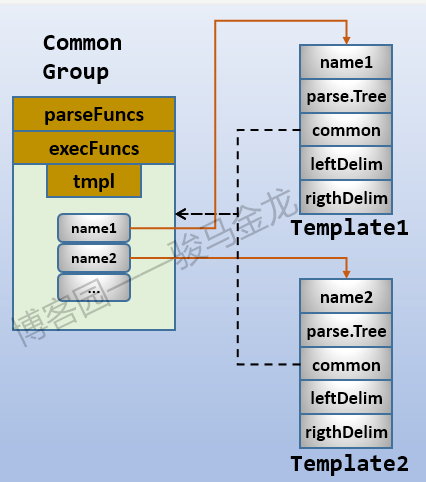
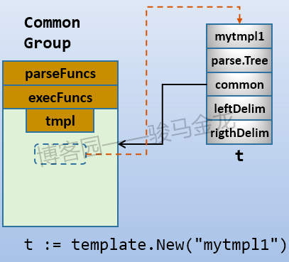

# template 

## Text/template
实现数据驱动模板以生成文本输出，可以理解为一组文字按照特定格式动态嵌入另一组文字中

### 输入
模板的输入文本是任何格式的UTF-8编码文本。 {{ 和 }} 包裹的内容统称为 action，分为两种类型：
- 数据求值（data evaluations）
- 控制结构（control structures）

### 1. 控制结构
循环操作：pipeline 的值必须是数组、切片、字典和通道中的一种，即可迭代类型的值，根据值的长度输出多个 T1
```go
{{ range pipeline }} T1 {{ end }}
*// 这个 else 比较有意思，如果 pipeline 的长度为 0 则输出 else 中的内容*
{{ range pipeline }} T1 {{ else }} T0 {{ end }}
*// 获取容器的下标*
{{ range $index, $value := pipeline }} T1 {{ end }}

// 案例
{{range .Field}}
  {{.ChildFieldOne}}  -- {{.ChildFieldTwo }}
{{ end }}
```
条件语句
```go
{{ if pipeline }} T1 {{ end }}
{{ if pipeline }} T1 {{ else }} T0 {{ end }}
{{ if pipeline }} T1 {{ else if pipeline }} T0 {{ end }}
*// 上面的语法其实是下面的简写*
{{ if pipeline }} T1 {{ else }}{{ if pipeline }} T0 { {end }}{{ end }}
{{ if pipeline }} T1 {{ else if pipeline }} T2 {{ else }} T0 {{ end }}

```

### 注释
```go
{{*/\* comment \*/*}}

```

### 裁剪空格
```go
// 裁剪 content 前后的空格
{{- content -}}

// 裁剪 content 前面的空格
{{- content }}

// 裁剪 content 后面的空格
{{ content -}}

```
### 管道函数
```css
用法1：

{{FuncName1}}

此标签将调用名称为“FuncName1”的模板函数（等同于执行“FuncName1()”，不传递任何参数）并输出其返回值。

用法2：

{{FuncName1 "参数值1" "参数值2"}}

此标签将调用“FuncName1("参数值1", "参数值2")”，并输出其返回值

用法3：

{{.Admpub|FuncName1}}

此标签将调用名称为“FuncName1”的模板函数（等同于执行“FuncName1(this.Admpub)”，将竖线“|”左边的“.Admpub”变量值作为函数参数传送）并输出其返回值。

```
### 文本输出
pipeline 代表的数据会产生与调用 fmt.Print 函数类似的输出，例如整数类型的 3 会转换成字符串 “3” 输出。
```go
{{ pipeline }}
```


### 模板函数
即：可以对某个字段使用函数操作。适用于稍微复杂的字段处理。

```go
type FuncMap map[string]interface{}
t = t.Funcs(template.FuncMap{"handleFieldName": HandleFunc})

```
内置模板函数
```go
var builtins = FuncMap{
    "and":      and,
    "call":     call,
    "html":     HTMLEscaper,
    "index":    index,
    "js":       JSEscaper,
    "len":      length,
    "not":      not,
    "or":       or,
    "print":    fmt.Sprint,
    "printf":   fmt.Sprintf,
    "println":  fmt.Sprintln,
    "urlquery": URLQueryEscaper,
}

```


### 使用流程
构建模板对象New()-->解析数据Parse()-->应用合并Execute()

- Parse()解析的对象中包含了{{}}，其中使用了点(.)，{{.}}代表的是要应用的对象，类似于java/c++中的this，python/perl中的self。


### 源码分析

Template结构
```go
type Template struct {
	name string // Template的名称
	*parse.Tree // 解析树
	*common
	leftDelim  string // 左右两边的分隔符，默认为{{和}}
	rightDelim string
}
```

common结构

```go
type common struct {
	tmpl   map[string]*Template // 一个common结构中可以包含多个Template，而Template结构中又指向了一个common结构。
	option option
	muFuncs    sync.RWMutex // protects parseFuncs and execFuncs
	parseFuncs FuncMap
	execFuncs  map[string]reflect.Value
}

```
#### 初始化


template.New()函数
```go
func New(name string) *Template {
	t := &Template{
		name: name,
	}
	t.init()
	return t
}

func (t *Template) init() {
	if t.common == nil {
		c := new(common)
		c.tmpl = make(map[string]*Template)
		c.parseFuncs = make(FuncMap)
		c.execFuncs = make(map[string]reflect.Value)
		t.common = c
	}
}
```
Note: 新创建的common是空的，只有进行模板解析(Parse()，ParseFiles()等操作)之后，才会将模板添加到common的tmpl字段(map结构)中。

因为还没有进行解析操作，所以上图使用虚线表示尚不存在的部分


除了template.New()函数，还有一个Template.New()方法：
```go
// New allocates a new, undefined template associated with the given one and with the same
// delimiters. The association, which is transitive, allows one template to
// invoke another with a {{template}} action.
func (t *Template) New(name string) *Template {
	t.init()
	nt := &Template{
		name:       name,
		common:     t.common,
		leftDelim:  t.leftDelim,
		rightDelim: t.rightDelim,
	}
	return nt
}

```
首先t.init()保证有一个有效的common结构，然后构造一个新的Template对象nt，这个nt除了name和解析树parse.Tree字段之外，其它所有内容都和t完全一致。换句话说，nt和t共享了common。

这和New()函数的作用基本是一致的，只不过New()函数是构建新的模板对象并构建一个新的common结构，而New()方法则是构建一个新的模板对象，并加入到已有的common结构中。


### 解析
- Parse()只能解析字符串
- 要解析文件中的内容，使用ParseFiles()或ParseGlob()


### 执行Execute()和ExecuteTemplate()
```go
func (t *Template) Execute(wr io.Writer, data interface{}) error
func (t *Template) ExecuteTemplate(wr io.Writer, name string, data interface{}) error

```
两者的区别在于Execute()是应用整个common中已定义的模板对象，而ExecuteTemplate()可以选择common中某个已定义的模板进行应用。

### 自定义函数

template内置了一系列函数，但这些函数毕竟有限，可能无法满足特殊的需求。template允许我们定义自己的函数，添加到common中，然后就可以在待解析的内容中像使用内置函数一样使用自定义的函数

自定义函数的优先级高于内置的函数优先级，即先检索自定义函数，再检索内置函数。也就是说，如果自定义函数的函数名和内置函数名相同，则内置函数将失效。


## 第三方应用
- kratos应用：https://github.com/go-kratos/kratos/blob/main/cmd/kratos/internal/proto/add/template.go


## 参考链接
1. https://www.cnblogs.com/f-ck-need-u/p/10035768.html