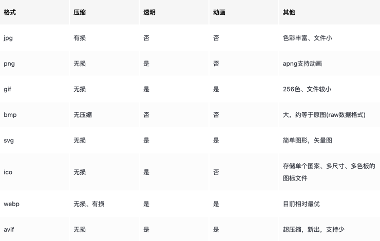

<!-- START doctoc generated TOC please keep comment here to allow auto update -->
<!-- DON'T EDIT THIS SECTION, INSTEAD RE-RUN doctoc TO UPDATE -->
**Table of Contents**  *generated with [DocToc](https://github.com/thlorenz/doctoc)*

- [image 包](#image-%E5%8C%85)
  - [基本知识](#%E5%9F%BA%E6%9C%AC%E7%9F%A5%E8%AF%86)
    - [位图和矢量图](#%E4%BD%8D%E5%9B%BE%E5%92%8C%E7%9F%A2%E9%87%8F%E5%9B%BE)
    - [分辨率、像素与颜色](#%E5%88%86%E8%BE%A8%E7%8E%87%E5%83%8F%E7%B4%A0%E4%B8%8E%E9%A2%9C%E8%89%B2)
    - [不同格式图片介绍](#%E4%B8%8D%E5%90%8C%E6%A0%BC%E5%BC%8F%E5%9B%BE%E7%89%87%E4%BB%8B%E7%BB%8D)
  - [image 接口](#image-%E6%8E%A5%E5%8F%A3)
  - [参考](#%E5%8F%82%E8%80%83)

<!-- END doctoc generated TOC please keep comment here to allow auto update -->


# image 包
在开发中，有时会遇到对图片的处理需求，在 Python中， PIL/Pillow  库非常强大和易用。
而 Golang 语言中，处理图片的标准库 image也可以实现一些基本操作。

image 库支持常见的 PNG、JPEG、GIF 等格式的图片处理， 可以对图片进行读取、裁剪、绘制、生成等操作。


## 基本知识

### 位图和矢量图
图片，一般可以分为 位图 和 矢量图.
- 位图：也叫做点阵图、像素图，基于图像的矩形栅格内的每个像素值来进行编码。位图的像素特点导致它缩放的时候图像会失真,常见格式如jpg、png. 
- 矢量图:也叫向量图，通过使用点、线和多边形来描绘图像，一般应用于简单形状的图形，并且能保证在缩放的时候不失真,常见格式如svg.

### 分辨率、像素与颜色
位图放大后，会看到有小格子，最终结果是一个个像素点的格子，每个格子为 1*1 的像素点。
一张图有多少个像素点，与图片的分辨率有关，即常说的图片宽高尺寸，比如一张图的宽是1920、高是1080，则它拥有1920 * 1080 = 2073600 个像素点。这里的 1920 * 1080 就是图像的分辨率。
而像素作为基本单位，在图像中通常是使用不同的颜色模型来描述，最常见的颜色模型就是 RGB，加上透明通道就是 RGBA


RGBA 使用红、蓝、绿三色通道，再加上透明通道，总共四个通道分量，每个分量多使用1个字节来表示。


### 不同格式图片介绍


图片作为互联网上的一种媒体展示资源，在主流浏览器上已经支持的格式，目前一般有7种：jpg、png、gif、svg、bmp、ico、webp

- jpg格式是最常见的图像格式，我们使用手机、相机等设备拍的照片几乎都是这种格式的，互联网上也有大量jpg格式的图片
- png格式也是非常常见的图像格式，在网络传输和资源展示中都用处很大，它相比于jpg，能够支持透明度，并且图片更清晰、逼真
- gif格式最常应用的场景就是互联网上的表情包和各种图片动画效果，它只支持有8位256种颜色，色彩很简单，加上压缩率也较高，文件大小都很小。
- bmp格式是一种保存图像原始数据的图片格式，属于window系统中的标准图像格式，它是无损压缩，几乎不会作任何有损图像数据的操作，因此它是图像原始数据的一种来源。
- svg格式是浏览器支持的唯一一种矢量图格式，它是一种可伸缩的矢量图形，基于xml语言进行描述的。
- webp是一种相对较新的图像格式，它是谷歌推出的，最大的特点是：视觉效果好、色彩丰富的同时，同样图像的文件大小能比jpg、png减小30%左右
- avif是一种更新也更高效的图像格式，它基于高效视频编码方案而生成的最新的一种图像文件格式。


## image 接口

```go
type Image interface {
	// // 返回图片的颜色模型, 如 RGB、YUV
	ColorModel() color.Model
	// 返回图片的长宽
	Bounds() Rectangle
	// 返回(x,y)像素点的颜色
	At(x, y int) color.Color
}
```


## 参考

- [图片基础知识及不同格式的特点介绍](https://juejin.cn/post/7167182050724675614)
- [Go 语言图片处理简明教程](https://juejin.cn/post/7128793478791692325)