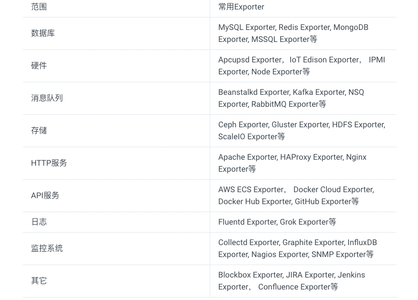

<!-- START doctoc generated TOC please keep comment here to allow auto update -->
<!-- DON'T EDIT THIS SECTION, INSTEAD RE-RUN doctoc TO UPDATE -->
**Table of Contents**  *generated with [DocToc](https://github.com/thlorenz/doctoc)*

- [exporter](#exporter)
  - [来源](#%E6%9D%A5%E6%BA%90)

<!-- END doctoc generated TOC please keep comment here to allow auto update -->

# exporter


广义上讲所有可以向Prometheus提供监控样本数据的程序都可以被称为一个Exporter。
而Exporter的一个实例称为target，如下所示，Prometheus通过轮询的方式定期从这些target中获取样本数据:


## 来源
从Exporter的来源上来讲，主要分为两类：

- 社区提供的
  Prometheus社区提供了丰富的Exporter实现，涵盖了从基础设施，中间件以及网络等各个方面的监控功能。
  这些Exporter可以实现大部分通用的监控需求。下表列举一些社区中常用的Exporter：

  
- 用户自定义的

除了直接使用社区提供的Exporter程序以外，用户还可以基于Prometheus提供的Client Library创建自己的Exporter程序，
目前Promthues社区官方提供了对以下编程语言的支持：Go、Java/Scala、Python、Ruby。同时还有第三方实现的如：Bash、C++、Common Lisp、Erlang,、Haskeel、Lua、Node.js、PHP、Rust等。


Exporter返回的样本数据，主要由三个部分组成：样本的一般注释信息（HELP），样本的类型注释信息（TYPE）和样本。Prometheus会对Exporter响应的内容逐行解析
```yaml
# HELP <metrics_name> <doc_string>
# TYPE <metrics_name> <metrics_type>
metric_name [
  "{" label_name "=" `"` label_value `"` { "," label_name "=" `"` label_value `"` } [ "," ] "}"
] value [ timestamp ]
```

以下是类型为histogram和summary的样本输出示例：
```yaml
# A histogram, which has a pretty complex representation in the text format:
# HELP http_request_duration_seconds A histogram of the request duration.
# TYPE http_request_duration_seconds histogram
http_request_duration_seconds_bucket{le="0.05"} 24054
http_request_duration_seconds_bucket{le="0.1"} 33444
http_request_duration_seconds_bucket{le="0.2"} 100392
http_request_duration_seconds_bucket{le="+Inf"} 144320
http_request_duration_seconds_sum 53423
http_request_duration_seconds_count 144320

# Finally a summary, which has a complex representation, too:
# HELP rpc_duration_seconds A summary of the RPC duration in seconds.
# TYPE rpc_duration_seconds summary
rpc_duration_seconds{quantile="0.01"} 3102
rpc_duration_seconds{quantile="0.05"} 3272
rpc_duration_seconds{quantile="0.5"} 4773
rpc_duration_seconds_sum 1.7560473e+07
rpc_duration_seconds_count 2693
```