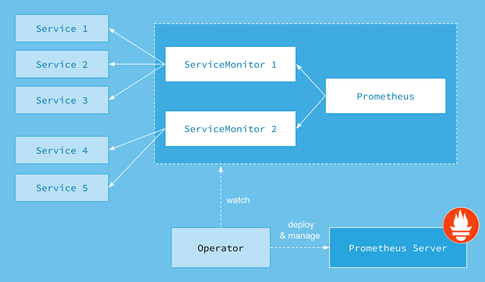
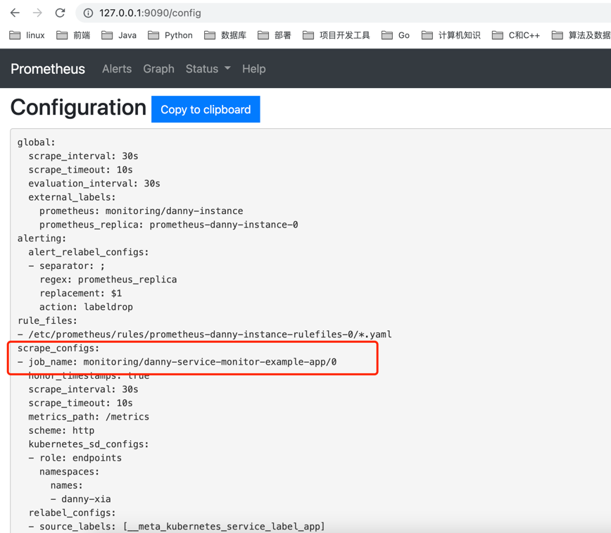
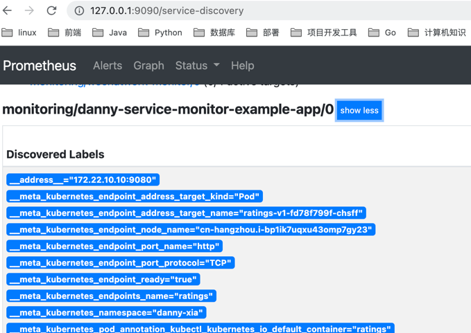
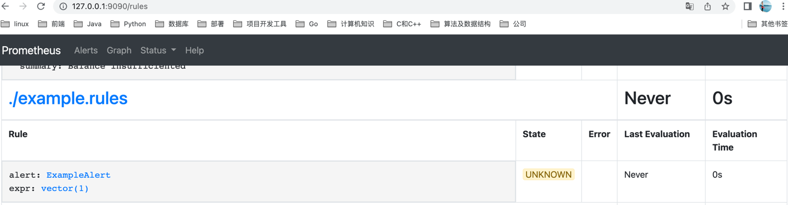

# prometheus Operator

## 背景
为了在Kubernetes能够方便的管理和部署Prometheus，我们使用ConfigMap了管理Prometheus配置文件。
每次对Prometheus配置文件进行升级时，我们需要手动移除已经运行的Pod实例，从而让Kubernetes可以使用最新的配置文件创建Prometheus。
而如果当应用实例的数量更多时，通过手动的方式部署和升级Prometheus过程繁琐并且效率低下。
```yaml
    scrape_configs:
      - job_name: 'prometheus'
        static_configs:
        - targets: ['localhost:9090']
```

从本质上来讲Prometheus属于是典型的有状态应用，而其有包含了一些自身特有的运维管理和配置管理方式。而这些都无法通过Kubernetes原生提供的应用管理概念实现自动化。
为了简化这类应用程序的管理复杂度，CoreOS率先引入了Operator的概念，并且首先推出了针对在Kubernetes下运行和管理Etcd的Etcd Operator。并随后推出了Prometheus Operator


## 工作原理


Prometheus的本职就是一组用户自定义的CRD资源以及Controller的实现，Prometheus Operator负责监听这些自定义资源的变化，并且根据这些资源的定义自动化的完成如Prometheus Server自身以及配置的自动化管理工作

## Operator能做什么

Prometheus Operator为我们提供了哪些自定义的Kubernetes资源，列出了Prometheus Operator目前提供的️资源：

- Prometheus：声明式创建和管理Prometheus Server实例；
- Alertmanager：声明式的创建和管理Alertmanager实例。
- ServiceMonitor：负责声明式的管理监控配置；
- PrometheusRule：负责声明式的管理告警配置；


还有thanosRuler,podMonitor,Probe等

## 安装
由于需要对Prometheus Operator进行RBAC授权，而默认的bundle.yaml中使用了default命名空间，因此，在安装Prometheus Operator之前需要先替换一下bundle.yaml文件中所有namespace定义，由default修改为monitoring。
```shell
$ kubectl -n monitoring apply -f bundle.yaml
clusterrolebinding.rbac.authorization.k8s.io/prometheus-operator created
clusterrole.rbac.authorization.k8s.io/prometheus-operator created
deployment.apps/prometheus-operator created
serviceaccount/prometheus-operator created
service/prometheus-operator created
```

```shell
$ kubectl -n monitoring get pods
NAME                                   READY     STATUS    RESTARTS   AGE
prometheus-operator-6db8dbb7dd-2hz55   1/1       Running   0          19s
```


##  操作
1. 部署正常的业务服务
2. 定义monitoring服务
3. 定义账号给prometheus
4. 关联prometheus服务和service monitor：通过label

### 使用后效果
1. 配置变化

2. 服务发现变化

3. rules变化



Note:不使用账号会报没有权限
```shell
(⎈ |teleport.gllue.com-test:danny-xia)➜  go_advanced_code git:(feature/monitor) ✗ kubectl logs prometheus-danny-instance-0 prometheus -n monitoring --tail 2 
level=error ts=2022-05-05T08:17:55.023Z caller=klog.go:94 component=k8s_client_runtime func=ErrorDepth msg="/app/discovery/kubernetes/kubernetes.go:263: Failed to list *v1.Pod: pods is forbidden: User \"system:serviceaccount:monitoring:default\" cannot list resource \"pods\" in API group \"\" in the namespace \"danny-xia\""
level=error ts=2022-05-05T08:17:55.030Z caller=klog.go:94 component=k8s_client_runtime func=ErrorDepth msg="/app/discovery/kubernetes/kubernetes.go:262: Failed to list *v1.Service: services is forbidden: User \"system:serviceaccount:monitoring:default\" cannot list resource \"services\" in API group \"\" in the namespace \"danny-xia\""

```