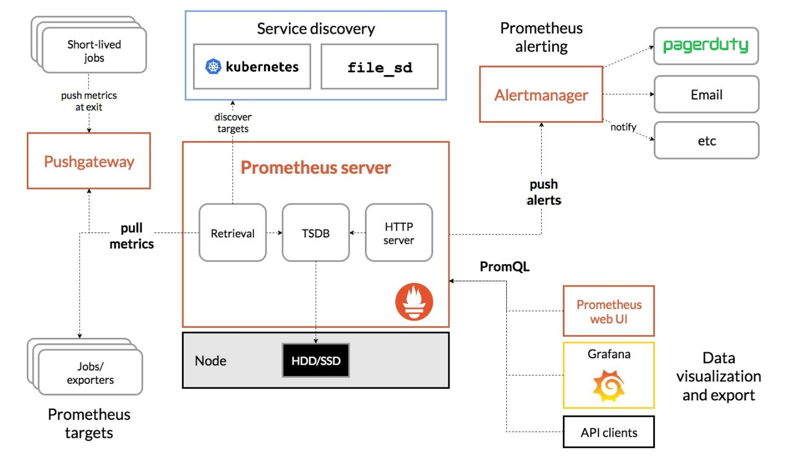
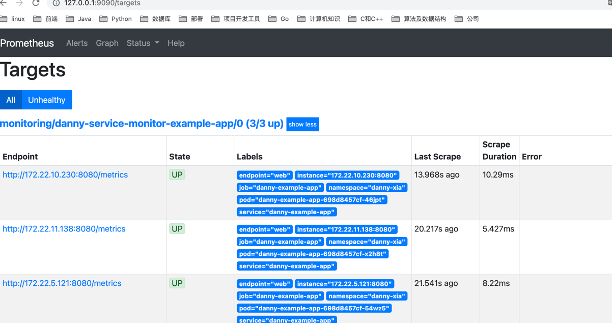
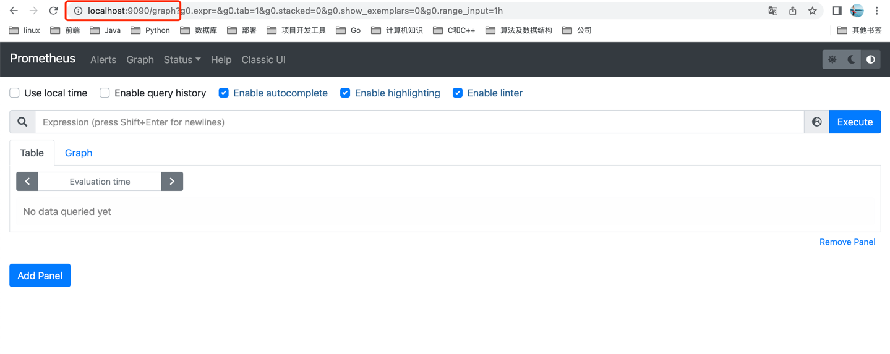
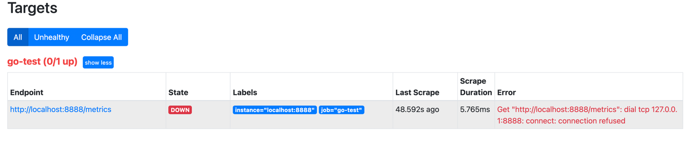
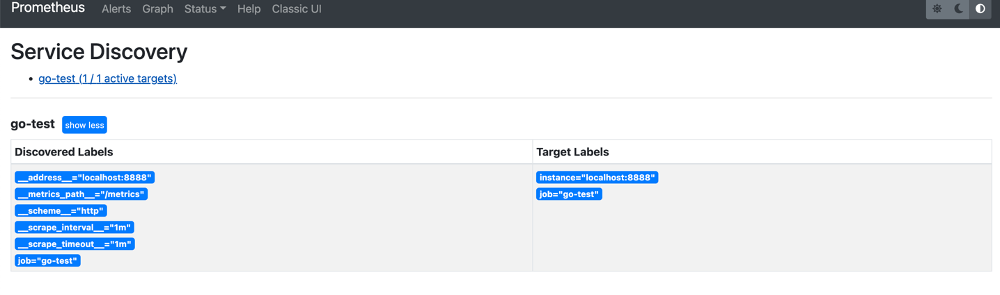
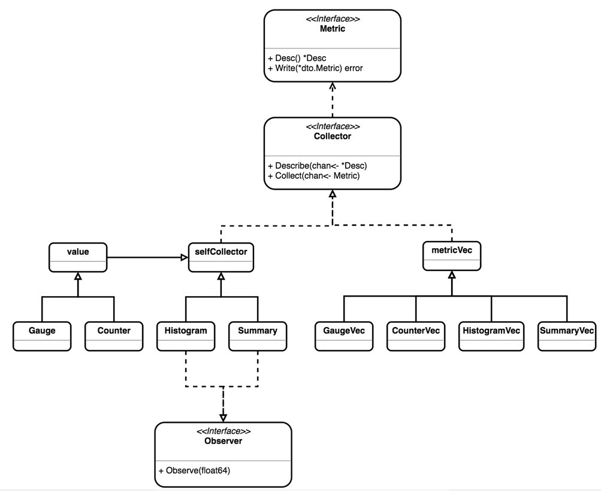

# Prometheus

- Exporter :收集系统或进程信息，转换为 Prometheus 可以识别的数据指标，以 http 或 https 服务的方式暴露给 Prometheus
- AlertManager ：接收 Prometheus 推送过来的告警信息，通过告警路由，向集成的组件 / 工具发送告警信息.
- Prometheus Server: 负责实现对监控数据的获取，存储以及查询。Prometheus Server可以通过静态配置管理监控目标，也可以配合使用Service Discovery的方式动态管理监控目标，并从这些监控目标中获取数据。
  其次Prometheus Server需要对采集到的监控数据进行存储，Prometheus Server本身就是一个时序数据库，将采集到的监控数据按照时间序列的方式存储在本地磁盘当中。
  最后Prometheus Server对外提供了自定义的PromQL语言，实现对数据的查询以及分析。
- PushGateway: 用于支持临时任务的推送网关

## 基本概念

### 数据模型
Prometheus 所有采集的监控数据均以指标（metric）的形式保存在内置的时间序列数据库当中（TSDB）：属于同一指标名称，同一标签集合的、有时间戳标记的数据流。
除了存储的时间序列，Prometheus 还可以根据查询请求产生临时的、衍生的时间序列作为返回结果。

### 样本
```css
<--------------- metric ---------------------><-timestamp -><-value->
http_request_total{status="200", method="GET"}@1434417560938 => 94355
http_request_total{status="200", method="GET"}@1434417561287 => 94334

http_request_total{status="404", method="GET"}@1434417560938 => 38473
http_request_total{status="404", method="GET"}@1434417561287 => 38544

http_request_total{status="200", method="POST"}@1434417560938 => 4748
http_request_total{status="200", method="POST"}@1434417561287 => 4785
```
在时间序列中的每一个点称为一个样本（sample），样本由以下三部分组成：

- 指标（metric）：指标名称和描述当前样本特征的 labelsets；
- 时间戳（timestamp）：一个精确到毫秒的时间戳；
- 样本值（value）： 一个 float64 的浮点型数据表示当前样本的值

### 指标名和标签
每个时间序列都由指标名和一组键值对（也称为标签）唯一标识。
metric的格式如下：
```css
<metric name>{<label name>=<label value>, ...}
```
例如：
```css
http_requests_total{host="192.10.0.1", method="POST", handler="/messages"}
```
- http_requests_total是指标名；
- host、method、handler是三个标签(label)，也就是三个维度；
- 查询语句可以基于这些标签or维度进行过滤和聚合

在Prometheus的底层实现中指标名称实际上是以__name__=<metric name>的形式保存在数据库中的，因此上面的一条time-series等同于：
```css
{__name__="api_http_requests_total"，host="192.10.0.1",method="POST", handler="/messages"}
```


### 指标类型
Prometheus client库提供四种核心度量标准类型。注意是客户端。Prometheus服务端没有区分类型，将所有数据展平为无类型时间序列.

#### 1. Counter计数器
表示一种累积型指标，该指标只能单调递增或在重新启动时重置为零，例如，您可以使用计数器来表示所服务的请求数，已完成的任务或错误.

Counter 类型数据可以让用户方便的了解事件产生的速率的变化，在 PromQL 内置的相关操作函数可以提供相应的分析，比如以 HTTP 应用请求量来进行说明：
```shell
//通过rate()函数获取HTTP请求量的增长率
rate(http_requests_total[5m])
//查询当前系统中，访问量前10的HTTP地址
topk(10, http_requests_total)
```

#### 2. Gauge仪表盘
是最简单的度量类型，只有一个简单的返回值，可增可减，也可以set为指定的值。所以Gauge通常用于反映当前状态，比如当前温度或当前内存使用情况；当然也可以用于“可增加可减少”的计数指标。

对于 Gauge 类型的监控指标，通过 PromQL 内置函数 delta() 可以获取样本在一段时间内的变化情况，例如，计算 CPU 温度在两小时内的差异：
```shell
dalta(cpu_temp_celsius{host="zeus"}[2h])
```

#### 3. Histogram直方图

如果大多数 API 请求都维持在 100ms 的响应时间范围内，而个别请求的响应时间需要 5s，那么就会导致某些 WEB 页面的响应时间落到中位数的情况，而这种现象被称为长尾问题。

为了区分是平均的慢还是长尾的慢，最简单的方式就是按照请求延迟的范围进行分组

主要用于在设定的分布范围内(Buckets)记录大小或者次数。

例如http请求响应时间：0-100ms、100-200ms、200-300ms、>300ms 的分布情况，Histogram会自动创建3个指标，分别为：

- 事件发送的总次数<basename>_count：比如当前一共发生了2次http请求
- 所有事件产生值的大小的总和<basename>_sum：比如发生的2次http请求总的响应时间为150ms
- 事件产生的值分布在bucket中的次数<basename>_bucket{le="上限"}：比如响应时间0-100ms的请求1次，100-200ms的请求1次，其他的0次

#### 4. Summary摘要
与 Histogram 类型类似，用于表示一段时间内的数据采样结果（通常是请求持续时间或响应大小等），但它直接存储了分位数（通过客户端计算，然后展示出来），而不是通过区间来计算

Summary和Histogram都提供了对于事件的计数_count以及值的汇总_sum，因此使用_count,和_sum时间序列可以计算出相同的内容。

现在可以总结一下 Histogram 与 Summary 的异同：
- 它们都包含了 <basename>_sum 和 <basename>_count 指标
- Histogram 需要通过 <basename>_bucket 来计算分位数，而 Summary 则直接存储了分位数的值。

除了四种基本的数据指标类型外，Prometheus 数据模型的一个非常重要的部分是沿着称为 “标签” 的维度对数据指标样本进行划分，这就产生了数据指标向量 (metric vectors).
prometheus 分为为四种基本数据指标类型提供了相应的数据指标向量，分别是 CounterVec,GaugeVec,HistogramVec 和 SummaryVec.
```go
Collect(ch chan<- Metric)  // 实现 Collector 接口的 Collect() 方法
Describe(ch chan<- *Desc)  // 实现 Collector 接口的 Describe() 方法

CurryWith(labels Labels)  // 返回带有指定标签的向量指标及可能发生的错误.多用于 promhttp 包中的中间件.
Delete(labels Labels)  // 删除带有指定标签的向量指标.如果删除了指标,返回 true
DeleteLabelValues(lvs ...string)  // 删除带有指定标签和标签值的向量指标.如果删除了指标,返回 true
GetMetricWith(labels Labels)  // 返回带有指定标签的数据指标及可能发生的错误
GetMetricWithLabelValues(lvs ...string)  // 返回带有指定标签和标签值的数据指标及可能发生的错误
MustCurryWith(labels Labels)  // 与 CurryWith 相同,但如果出现错误,则引发 panics
Reset()  // 删除此指标向量中的所有数据指标
With(labels Labels)  // 与 GetMetricWithLabels 相同,但如果出现错误,则引发 panics
WithLabelValues(lvs ...string)  // 与 GetMetricWithLabelValues 相同,但如果出现错误,则引发 panics
```

### 作业和实例
在prometheus.yml配置文件中，添加如下配置
```yaml
scrape_configs:
  - job_name: 'prometheus'
    static_configs:
      - targets: ['localhost:9090']
  - job_name: 'node'
    static_configs:
      - targets: ['localhost:9100']
```

当前在每一个Job中主要使用了静态配置(static_configs)的方式定义监控目标。
除了静态配置每一个Job的采集Instance地址以外，Prometheus还支持与DNS、Consul、E2C、Kubernetes等进行集成实现自动发现Instance实例，并从这些Instance上获取监控数据。

在Prometheus配置中，一个可以拉取数据的端点IP:Port叫做一个实例（instance），而具有多个相同类型实例的集合称作一个作业（job）
```yaml
- job: api-server
  - instance 1: 1.2.3.4:5670
  - instance 2: 1.2.3.4:5671
  - instance 3: 5.6.7.8:5670
  - instance 4: 5.6.7.8:5671

```
在Prometheus中，每一个暴露监控样本数据的HTTP服务称为一个实例。例如在当前主机上运行的node exporter可以被称为一个实例(Instance)


当Prometheus拉取指标数据时，会自动生成一些标签（label）用于区别抓取的来源：

- job：配置的作业名；
- instance：配置的实例名，若没有实例名，则是抓取的IP:Port

对于每一个实例（instance）的抓取，Prometheus会默认保存以下数据：

- up{job="<job>", instance="<instance>"}：如果实例是健康的，即可达，值为1，否则为0；
- scrape_duration_seconds{job="<job>", instance="<instance>"}：抓取耗时；
- scrape_samples_post_metric_relabeling{job="<job>", instance="<instance>"}：指标重新标记后剩余的样本数。
- scrape_samples_scraped{job="<job>", instance="<instance>"}：实例暴露的样本数
该up指标对于监控实例健康状态很有用。


## 部署
使用prometheus的docker环境
```yaml
# prometheus.yml
global:
  scrape_interval:     15s # By default, scrape targets every 15 seconds.

  # Attach these labels to any time series or alerts when communicating with
  # external systems (federation, remote storage, Alertmanager).
  external_labels:
    monitor: 'codelab-monitor'

# A scrape configuration containing exactly one endpoint to scrape:
# Here it's Prometheus itself.
scrape_configs:
  # The job name is added as a label `job=<job_name>` to any timeseries scraped from this config.
- job_name: "go-test"
  scrape_interval: 60s
  scrape_timeout: 60s
  metrics_path: "/metrics"

  static_configs:
  - targets: ["localhost:8888"]

```

可以看到配置文件中指定了一个job_name，所要监控的任务即视为一个job, scrape_interval和scrape_timeout是pro进行数据采集的时间间隔和频率，metrics_path指定了访问数据的http路径，target是目标的ip:port,这里使用的是同一台主机上的8888端口

```shell
docker run -p 9090:9090 -v /Users/python/Desktop/go_advanced_code/chapter02_goroutine/02_runtime/07prometheus/client/prometheus.yml:/etc/prometheus/prometheus.yml prom/prometheus
```

启动之后可以访问web页面http://localhost:9090/graph,在status下拉菜单中可以看到配置文件和目标的状态，此时目标状态为DOWN，因为我们所需要监控的服务还没有启动起来，那就赶紧步入正文，用pro golang client来实现程序吧。



启动后状态


## prometheus/client_golang 源码分析


prometheus包提供了用于实现监控代码的metric原型和用于注册metric的registry。子包（promhttp）允许通过HTTP来暴露注册的metric或将注册的metric推送到Pushgateway。

### Metrics

- prometheus一共有5种metric类型，前四种为：Counter，Gauge，Summary 和Histogram，每种类型都有对应的vector版本：GaugeVec, CounterVec, SummaryVec, HistogramVec，vector版本细化了prometheus数据模型，增加了label维度。第5种metric为Untyped，它的运作方式类似Gauge，区别在于它只向prometheus服务器发送类型信号。

- 只有基础metric类型实现了Metric接口，metric和它们的vector版本都实现了collector接口。collector负责一系列metrics的采集，但是为了方便，metric也可以“收集自己”。注意：Gauge, Counter, Summary, Histogram, 和Untyped自身就是接口，而GaugeVec, CounterVec, SummaryVec, HistogramVec, 和UntypedVec则不是接口。

- 为了创建metric和它们的vector版本，需要选择合适的opts结构体，如GaugeOpts, CounterOpts, SummaryOpts, HistogramOpts, 或UntypedOpts.

```go
// 其中 GaugeOpts, CounterOpts 实际上均为 Opts 的别名
type CounterOpts Opts
type GaugeOpts Opts
type Opts struct {
    // Namespace, Subsystem, and Name  是 Metric 名称的组成部分(通过 "_" 将这些组成部分连接起来),只有 Name 是必需的.
	// strings.Join([]string{namespace, subsystem, name}, "_")
    Namespace string
    Subsystem string
    Name      string

    // Help 提供 Metric 的信息.具有相同名称的 Metric 必须具有相同的 Help 信息
    Help string

    // ConstLabels 用于将固定标签附加到该指标.很少使用.
    ConstLabels Labels
}

type HistogramOpts struct {
    // Namespace, Subsystem, and Name  是 Metric 名称的组成部分(通过 "_" 将这些组成部分连接起来),只有 Name 是必需的.
    Namespace string
    Subsystem string
    Name      string

    //  Help 提供 Metric 的信息.具有相同名称的 Metric 必须具有相同的 Help 信息
    Help string

    // ConstLabels 用于将固定标签附加到该指标.很少使用.
    ConstLabels Labels

    // Buckets 定义了观察值的取值区间.切片中的每个元素值都是区间的上限,元素值必须按升序排序.
    // Buckets 会隐式添加 `+Inf` 值作为取值区间的最大值
    // 默认值是 DefBuckets =  []float64{.005, .01, .025, .05, .1, .25, .5, 1, 2.5, 5, 10}
    Buckets []float64
}

type SummaryOpts struct {
    // Namespace, Subsystem, and Name  是 Metric 名称的组成部分(通过 "_" 将这些组成部分连接起来),只有 Name 是必需的.
    Namespace string
    Subsystem string
    Name      string

    //  Help 提供 Metric 的信息.具有相同名称的 Metric 必须具有相同的 Help 信息
    Help string

    // ConstLabels 用于将固定标签附加到该指标.很少使用.
    ConstLabels Labels

    // Objectives 定义了分位数等级估计及其各自的绝对误差.如果 Objectives[q] = e，则 q 报告的值将是 [q-e, q + e]之间某个 φ 的 φ 分位数
    // 默认值为空 map,表示没有分位数的摘要
    Objectives map[float64]float64

    // MaxAge 定义观察值与摘要保持相关的持续时间.必须是正数.默认值为 DefMaxAge = 10 * time.Minute
    MaxAge time.Duration

    // AgeBuckets 用于从摘要中排除早于 MaxAge 的观察值的取值区间.默认值为 DefAgeBuckets = 5
    AgeBuckets uint32

    // BufCap 定义默认样本流缓冲区大小.默认值为 DefBufCap = 500.
    BufCap uint32
}
```

### collector
接口定义
```go
type Collector interface {
    // Describe 暴露全部可能的 Metric 描述列表
	Describe(chan<- *Desc)

	// 获取采样数据，然后通过 HTTP 接口暴露给 Prom Server
	Collect(chan<- Metric)
}
```

### Custom Collectors and constant Metrics

实现自己的metric，一般只需要实现自己的collector即可。
如果已经有了现成的metric（prometheus上下文之外创建的），则无需使用Metric类型接口，只需要在采集期间将现有的metric映射到prometheus metric即可，此时可以使用 NewConstMetric, NewConstHistogram, and NewConstSummary (以及对应的Must… 版本)来创建metric实例，以上操作在collect方法中实现。
describe方法用于返回独立的Desc实例，NewDesc用于创建这些metric实例。（NewDesc用于创建prometheus识别的metric）


### Advanced Uses of the Registry

- MustRegister 是注册collector最通用的方式。如果需要捕获注册时产生的错误，可以使用Register 函数，该函数会返回错误。

- 如果注册的collector与已经注册的metric不兼容或不一致时就会返回错误。registry用于使收集的metric与prometheus数据模型保持一致。不一致的错误会在注册时而非采集时检测到。前者会在系统的启动时检测到，而后者只会在采集时发生（可能不会在首次采集时发生），这也是为什么collector和metric必须向Registry describe它们的原因。

- 以上提到的registry都被称为默认registry，可以在全局变量DefaultRegisterer中找到。使用NewRegistry可以创建custom registry，或者可以自己实现Registerer 或Gatherer接口。custom registry的Register和Unregister运作方式类似，默认registry则使用全局函数Register和Unregister。

- custom registry的使用方式还有很多：可以使用NewPedanticRegistry来注册特殊的属性；可以避免由DefaultRegisterer限制的全局状态属性；也可以同时使用多个registry来暴露不同的metrics

- DefaultRegisterer注册了Go runtime metrics （通过NewGoCollector）和用于process metrics 的collector（通过NewProcessCollector）。通过custom registry可以自己决定注册的collector。

### counter相关函数
```go
func (c *counter) Add(v float64) {
	if v < 0 {
		panic(errors.New("counter cannot decrease in value"))
	}

	ival := uint64(v)
	if float64(ival) == v {
		atomic.AddUint64(&c.valInt, ival)
		return
	}

	for {
		oldBits := atomic.LoadUint64(&c.valBits)
		newBits := math.Float64bits(math.Float64frombits(oldBits) + v)
		if atomic.CompareAndSwapUint64(&c.valBits, oldBits, newBits) {
			return
		}
	}
}
```
Add 中修改共享数据时采用了“无锁”实现，相比“有锁 (Mutex)”实现可以更充分利用多核处理器的并行计算能力，性能相比加 Mutex 的实现会有很大提升


### WithLabelValues方法
1个指标由Metric name + Labels共同确定。

若Metric name相同，但Label的值不同，则是不同的Metric。

例如：http_request_count(endpoint="hello")，http_request_count(endpoint="world")是两个不同的指标

```go
// @Param lvs 表示label values
func (v *CounterVec) WithLabelValues(lvs ...string) Counter {
	c, err := v.GetMetricWithLabelValues(lvs...) // 根据label的值来找对应的Metric
	if err != nil {
		panic(err)
	}
	return c
}

// 根据label的值来找对应的Metric
// @Param lvs表示label value
func (v *CounterVec) GetMetricWithLabelValues(lvs ...string) (Counter, error) {
	metric, err := v.MetricVec.GetMetricWithLabelValues(lvs...)
	if metric != nil {
		return metric.(Counter), err
	}
	return nil, err
}

// 根据label值找对应的metric
func (m *MetricVec) GetMetricWithLabelValues(lvs ...string) (Metric, error) {
	h, err := m.hashLabelValues(lvs) // 获取label对应的hash值，非重点不展开讲，这块的核心是，若hash值一样，则对应的Metric是同一个
	if err != nil {
		return nil, err
	}
    // 根据hash值从metricMap里get对应的metric
    // 若不存在则新创建一个metric并放入到metricMap里
	return m.metricMap.getOrCreateMetricWithLabelValues(h, lvs, m.curry), nil
}
```
metricMap的结构，Metric最终存到一个map里，key=根据label值计算出的hash值，value=Metric元信息
```go
// metricMap定义，Exporter的Metric都存在这个结构中
type metricMap struct {
	mtx       sync.RWMutex // Protects metrics.
	metrics   map[uint64][]metricWithLabelValues // Metric最终存到一个map里，key=根据label值计算出的hash值，value=Metric元信息
	desc      *Desc
	newMetric func(labelValues ...string) Metric
}

type metricWithLabelValues struct {
	values []string // label的值
	metric Metric // Metric的meta信息
}
```


### Registry 的高级用法
prometheus 包提供了 MustRegister() 函数用于注册 Collector, 但如果注册过程中发生错误，程序会引发 panics. 而使用 Register() 函数可以实现注册 Collector 的同时处理可能发生的错误.


prometheus 通过 NewGoCollector() 和 NewProcessCollector() 函数创建 Go 运行时数据指标的 Collector 和进程数据指标的 Collector.

## Prometheus拉取Exporter的哪些数据

### promhttp 包
promhttp 包允许创建 http.Handler 实例通过 HTTP 公开 Prometheus 数据指标

```go
// Prometheus拉取的入口
http.Handle("/metrics", promhttp.Handler())

// http.go promhttp.Handler()
func Handler() http.Handler {
	return InstrumentMetricHandler(
		prometheus.DefaultRegisterer, HandlerFor(prometheus.DefaultGatherer, HandlerOpts{}),
	)
}


// http.go HandlerFor
func HandlerFor(reg prometheus.Gatherer, opts HandlerOpts) http.Handler {
	// 省略部分代码
	mfs, err := reg.Gather() // 收集Metric信息
	// 省略部分代码
}

// prometheus.DefaultGatherer
// registry.go 
var (
	defaultRegistry              = NewRegistry() // DefaultGatherer就是defaultRegistry
	DefaultRegisterer Registerer = defaultRegistry
	DefaultGatherer   Gatherer   = defaultRegistry
)

// registry.go 
// Gather implements Gatherer. 负责收集metrics信息
func (r *Registry) Gather() ([]*dto.MetricFamily, error) {
	// 省略部分代码
    // 声明Counter类型的Metric后，需要MustRegist注册到Registry，最终就是保存在collectorsByID里
    // Counter类型本身就是一个collector
	for _, collector := range r.collectorsByID {
		checkedCollectors <- collector
	}
	// 省略部分代码
	collectWorker := func() {
		for {
			select {
			case collector := <-checkedCollectors:
				collector.Collect(checkedMetricChan) // 执行Counter的Collect，见下文
			case collector := <-uncheckedCollectors:
				collector.Collect(uncheckedMetricChan)
			default:
				return
			}
			wg.Done()
		}
	}

	// 省略部分代码
}


// vec.go
// Collect implements Collector.
// Counter类型的Collect方法
func (m *MetricVec) Collect(ch chan<- Metric) { m.metricMap.Collect(ch) }

// vec.go
// Collect implements Collector.
// 返回metricMap里所有的Metric
func (m *metricMap) Collect(ch chan<- Metric) {
	m.mtx.RLock()
	defer m.mtx.RUnlock()

	for _, metrics := range m.metrics {
		for _, metric := range metrics {
			ch <- metric.metric
		}
	}
}
```


## 参考链接
1. https://prometheus.fuckcloudnative.io/di-yi-zhang-jie-shao/overview#:~:text=%E2%80%8BPrometheus%20%E6%98%AF%E7%94%B1%E5%89%8D,%E4%BA%8E%E4%BB%BB%E4%BD%95%E5%85%AC%E5%8F%B8%E8%BF%9B%E8%A1%8C%E7%BB%B4%E6%8A%A4%E3%80%82
2. https://www.infoq.cn/article/prometheus-theory-source-code
3. https://yunlzheng.gitbook.io/prometheus-book/parti-prometheus-ji-chu/promql/prometheus-promql-functions
4. 官网https://prometheus.io/docs/prometheus/latest/querying/functions/
