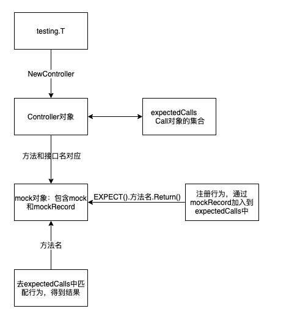

# gomock

gomock 是官方提供的mock框架，用于解决单元测试中遇到的外部依赖问题，并且还有mockgen工具用来辅助生成相关的mock代码。

## 原理

针对 interface 生成对应的Mock代码文件，其中包含了一个实现该接口的结构，并提供了操作该结构行为的方法。使用该结构代替真实的依赖，可以控制下游按我们想要的方式进行某些操作和返回结果，以此达到解除外部依赖的目的。


## 使用
gomock 有两种模式，反射模式和源码模式，都是通过接口生成对应的mock代码，测试的时候直接调用mock对象，相对于 gostub 不会进行地址替换更安全，且是并发安全的。

* -source：包含要mock的接口的文件。
* -package：用于生成的模拟类源代码的包名。如果不设置此项包名默认在原包名前添加mock_前缀。
* -destination：生成的源代码写入的文件。如果不设置此项，代码将打印到标准输出。
* -aux_files：需要参考以解决的附加文件列表，例如在不同文件中定义的嵌入式接口。指定的值应为foo=bar/baz.go形式的以逗号分隔的元素列表，其中bar/baz.go是源文件，foo是-source文件使用的文件的包名。


### 返回值
gomock 中跟返回值相关的用法有以下几个：

- Return()：返回指定值

- Do(func)：执行操作，忽略返回值

- DoAndReturn(func)：执行并返回指定值


### 1. 反射模式

通过构建一个程序用反射理解接口生成一个mock类文件，它通过两个非标志参数生效：导入路径和用逗号分隔的符号列表（多个interface）
```shell
mockgen -destination mock_sql_driver.go database/sql/driver Conn,Driver
```

### 2. 源码模式
```shell
mockgen -source=foo.go [other options]
```
通过一个包含interface定义的文件生成mock类文件，它通过 -source 标识生效，-imports 和 -aux_files 标识在这种模式下也是有用的。


## 缺点
- 必须引入额外的抽象(interface)

## gomock 源代码解析


### 1 查看生成的代码

```go
type MockSearch struct {
    // ...
}

type MockSearchMockRecorder struct {
	// ...
}

// 实际调用时
func (m *MockSearch) GetNameByID(id int64) (string, error) {
    // ..
}

// 实际调用初始化之前
func (mr *MockSearchMockRecorder) GetNameByID(id interface{}) *gomock.Call {
	// 。。
}
```

### 2 初始化需要做的事
```go
	ctl := gomock.NewController(t)
	defer ctl.Finish()

	// 然后生成一个mockSearch对象，用来替代Search接口
	mockSearch := mock_dao.NewMockSearch(ctl)
	// 操纵mockSearch对象的行为
	mockSearch.
		EXPECT().
		GetNameByID(int64(10)). //  参数
		Return("liangPin", nil) // 返回值
```

#### 1 初始化Controller对象—mock对象的核心
Controller控制着mock对象的作用域和生命周期，我们操纵mock对象的行为也是将其加入到expectedCalls中，所以Controller是非常核心的一个对象。
每个测试都应该创建一个controller对象将其注册到defer中。通常通过NewController函数来创建controller，1.14版本以后通过NewController创建的controller可以不必显式地调用ctrl.Finish()。


```go
// Controller对象的定义
type Controller struct {
    // 传入的test对象
   T             TestHelper
   // 保证多协程安全的
   mu            sync.Mutex
   // mock对象的期望行为
   expectedCalls *callSet
   finished      bool
}


// 使用NewController来得到Controller
func NewController(t TestReporter) *Controller {
    // ...
   ctrl := &Controller{
      T:             h,
      expectedCalls: newCallSet(),
   }
    // ...

   return ctrl
}

```

Controller里最重要的属性就是expectedCalls,里面是两个map，map的key是对象和对象对应的方法，值就是Call的指针一个slice，第一个map是期望的调用，第二个map是超过期望调用次数的调用的一个存储

```go
//储存方法
type callSet struct {
	// Calls that are still expected.
	expected map[callSetKey][]*Call
	// Calls that have been exhausted.
	exhausted map[callSetKey][]*Call
}
```
对于mock对象的行为注入，控制器是通过map来维护的，一个方法对应map的一项。因为一个方法在一个用例中可能调用多次，所以map的值类型是数组切片 。
当mock对象进行行为注入时，控制器会将行为Add。当该方法被调用时，控制器会将该行为Remove。

```go
type callSetKey struct {

  receiver interface{}

  fname    string

}
```
里面存储了接口和函数名.


Call对象—>预期的mock对象行为
```go
// Call对象的定义
type Call struct {
   t TestHelper // for triggering test failures on invalid call setup

   receiver   interface{}  // the receiver of the method call
   method     string       // the name of the method
   methodType reflect.Type // the type of the method
   args       []Matcher    // the args
   origin     string       // file and line number of call setup

   preReqs []*Call // prerequisite calls

   // Expectations
   minCalls, maxCalls int

   numCalls int // actual number made

   // actions are called when this Call is called. Each action gets the args and
   // can set the return values by returning a non-nil slice. Actions run in the
   // order they are created.
   actions []func([]interface{}) []interface{}
}

```


#### 2 初始化 recorder,并填加相关期望call
```go
func NewMockSearch(ctrl *gomock.Controller) *MockSearch {
	mock := &MockSearch{ctrl: ctrl}
	mock.recorder = &MockSearchMockRecorder{mock}
	return mock
}
func (m *MockSearch) EXPECT() *MockSearchMockRecorder {
    return m.recorder
}
// 添加期望
func (mr *MockSearchMockRecorder) GetNameByID(id interface{}) *gomock.Call {
	mr.mock.ctrl.T.Helper()
	return mr.mock.ctrl.RecordCallWithMethodType(mr.mock, "GetNameByID", reflect.TypeOf((*MockSearch)(nil).GetNameByID), id)
}
```

打桩具体实现

```go
// RecordCallWithMethodType is called by a mock. It should not be called by user code.
func (ctrl *Controller) RecordCallWithMethodType(receiver interface{}, method string, methodType reflect.Type, args ...interface{}) *Call {
	ctrl.T.Helper()
    // 生成期望
	call := newCall(ctrl.T, receiver, method, methodType, args...)

	ctrl.mu.Lock()
	defer ctrl.mu.Unlock()
	// 添加期望
	ctrl.expectedCalls.Add(call)

	return call
}


// 生成期望call
func newCall(t TestHelper, receiver interface{}, method string, methodType reflect.Type, args ...interface{}) *Call {
	t.Helper()

	// TODO: check arity, types.
	// 为每个参数生成s所需要的matcher,默认使用 eqMatcher
	mArgs := make([]Matcher, len(args))
	for i, arg := range args {
		if m, ok := arg.(Matcher); ok {
			mArgs[i] = m
		} else if arg == nil {
			// Handle nil specially so that passing a nil interface value
			// will match the typed nils of concrete args.
			mArgs[i] = Nil()
		} else {
			mArgs[i] = Eq(arg)
		}
	}

	// callerInfo's skip should be updated if the number of calls between the user's test
	// and this line changes, i.e. this code is wrapped in another anonymous function.
	// 0 is us, 1 is RecordCallWithMethodType(), 2 is the generated recorder, and 3 is the user's test.
	origin := callerInfo(3)
	actions := []func([]interface{}) []interface{}{func([]interface{}) []interface{} {
		// Synthesize the zero value for each of the return args' types.
		rets := make([]interface{}, methodType.NumOut())
		for i := 0; i < methodType.NumOut(); i++ {
			rets[i] = reflect.Zero(methodType.Out(i)).Interface()
		}
		return rets
	}}
	return &Call{t: t, receiver: receiver, method: method, methodType: methodType,
		args: mArgs, origin: origin, minCalls: 1, maxCalls: 1, actions: actions}
}


// 增加call
func (cs callSet) Add(call *Call) {
	key := callSetKey{call.receiver, call.method}
	m := cs.expected
	if call.exhausted() {
		m = cs.exhausted
	}
	m[key] = append(m[key], call)
}

```

#### 3 通过 DoAndReturn 添加 action
```go
func (c *Call) Return(rets ...interface{}) *Call {
    // ...
	c.addAction(func([]interface{}) []interface{} {
		return rets
	})

	return c
}
```
```go
func (c *Call) addAction(action func([]interface{}) []interface{}) {
	c.actions = append(c.actions, action)
}
```


### 3 实际调用：查看call，调用方法，并删除方法

```go
// GetNameByID mocks base method.
func (m *MockSearch) GetNameByID(id int64) (string, error) {
	m.ctrl.T.Helper()
	ret := m.ctrl.Call(m, "GetNameByID", id)
	ret0, _ := ret[0].(string)
	ret1, _ := ret[1].(error)
	return ret0, ret1
}
```

它实际调了Call方法。
```go
func (ctrl *Controller) Call(receiver interface{}, method string, args ...interface{}) []interface{} {
	ctrl.T.Helper()

	// Nest this code so we can use defer to make sure the lock is released.
	actions := func() []func([]interface{}) []interface{} {
		ctrl.T.Helper()
		ctrl.mu.Lock()
		defer ctrl.mu.Unlock()

		// 1. 找打桩的时候注入的方法
		expected, err := ctrl.expectedCalls.FindMatch(receiver, method, args)
        // 。。。
		// Two things happen here:
		// * the matching call no longer needs to check prerequite calls,
		// * and the prerequite calls are no longer expected, so remove them.
		preReqCalls := expected.dropPrereqs()
		for _, preReqCall := range preReqCalls {
			ctrl.expectedCalls.Remove(preReqCall)
		}

		actions := expected.call()
		if expected.exhausted() {
			ctrl.expectedCalls.Remove(expected)
		}
		return actions
	}()

	//2. 执行方法，获取返回值
	var rets []interface{}
	for _, action := range actions {
		if r := action(args); r != nil {
			rets = r
		}
	}

	return rets
}
```

#### 查找call 
```go
func (cs callSet) FindMatch(receiver interface{}, method string, args []interface{}) (*Call, error) {}
```

调用完毕后
```go
func (cs callSet) Remove(call *Call) {
	key := callSetKey{call.receiver, call.method}
	calls := cs.expected[key]
	for i, c := range calls {
		if c == call {
			// maintain order for remaining calls
			cs.expected[key] = append(calls[:i], calls[i+1:]...)
			cs.exhausted[key] = append(cs.exhausted[key], call)
			break
		}
	}
}
```

