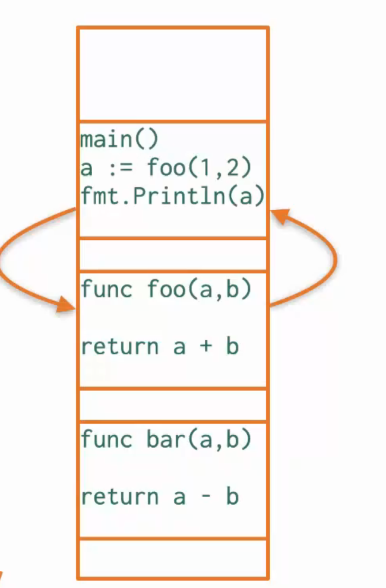
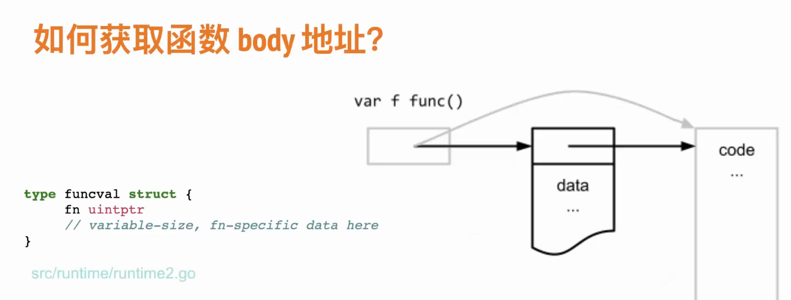
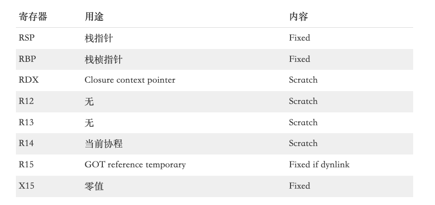
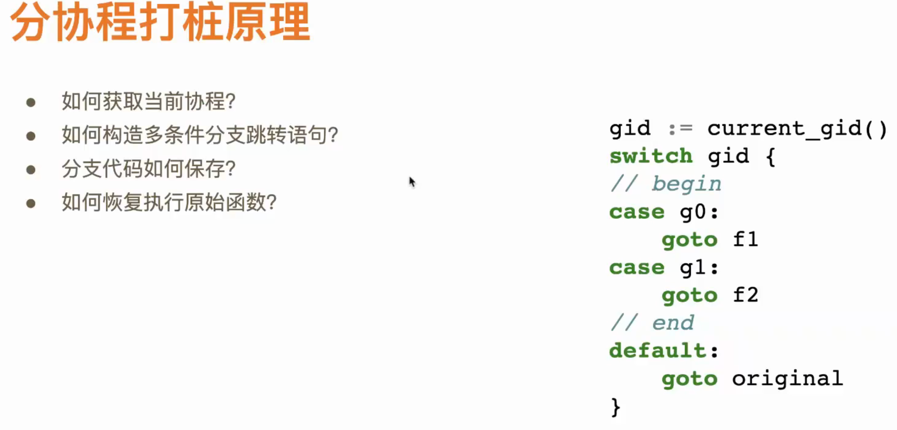
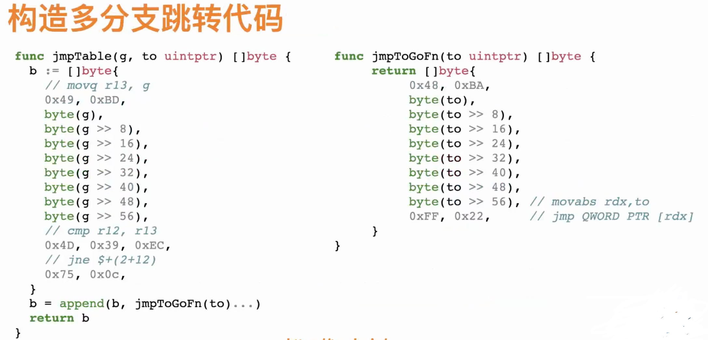

# 测试

## 背景
1. 不容易测试的代码，结果不固定
```go
package main

import (
	"math/rand"
	"time"
)

func foo()int64  {
    n := time.Now()
    r := rand.Int63()
    return n.UnixNano()+r
}

func main(){
	n := foo()
}
```

下面修改后的代码，问题会变成业务代码为了测试而进行修改
```go
package main

import (
	"math/rand"
	"time"
)

func foo(fn func() time.Time, fr func() int64) int64 {
	n := fn()
	r := fr()
	return n.UnixNano() + r
}

func main() {
	n := foo(time.Now, rand.Int63)

}


```

## 如何动态修改函数的行为


编译器会把函数中的每一条语句翻译成机器码，存到可执行文件的代码段。我们在执行函数的时候会把对应的代码段加载到内存的某个位置。
机器码说白了也是内存里的数据。我们能不能在执行foo()函数之前把它的机器码替换成一段跳转指令，让CPU跳转到bar()函数的机器码继续执行呢？能！

为了实现这个效果，我们要做三件事：

- 找到foo()和bar()机器码所在的内存地址
- 构造跳转指令（涉及架构指令不同，下面用intel amd64展示）
- 修改foo()函数的机器码

函数的机器码在内存中的地址说白了就是函数指针,使用反射就可以轻松获取函数指针
```go
reflect.ValueOf(f).Pointer()
```

对于任意函数名f（或者匿名函数变量），我们可以通过reflect.ValueOf(f)构造一个反射对象，然后调用它的Pointer()方法拿到对应的函数指针。这个指针变量保存的就是函数的第一条机器码的内存地址（也就是指向函数）。


问题：
- 如何获取函数body的地址
- 如何修改函数body的指令
- 如何跳转函数的指令


### 如何获取函数body的地址


函数变量f实际是个指针，指向底层的结构体funcval ,第一个成员是个二级指针，指向数据。 

```go
// interface{}来存取foo和bar, replacement是新函数，target是被换的函数
func patch(target, replacement interface{}) {
	t := reflect.ValueOf(target)
	r := reflect.ValueOf(replacement)

	fv := getPtr(r) // 需要被修改的函数指针
	// 加*取数值即图中的code,也可以定义结构体获取第一个成员
	fn := *(*uintptr)(fv)
	fn := r.Pointer()
}

// 重写一遍是因为底层reflect包中Value中ptr成员是私有的，重写一遍获取
type value struct {
	_   uintptr // 类型不关系
	ptr unsafe.Pointer
}

// 通过此函数获取var f func() 对应funcval的指针
func getPtr(v reflect.Value) unsafe.Pointer {
	return (*value)(unsafe.Pointer(&v)).ptr // 获取value的第二个成员ptr
}
```


### 如何修改函数body指令
copy方法的签名是func copy(dst, src []Type) int，要求dst和src类型相同。这里src是跳转指令，其类型为[]byte，所以dst的类型也必须是[]byte。

前面通过反射拿到了函数指针，但它的类型是uintptr，这相当于C语言中的void *。因为没有具体的类型信息，Go编译器没法直接操作它所指向的内存.
所以我们可以强转成*[]byte然后通过*提取到指向的内容，也就是[]byte对象。
```go
func rawMemoryAccess(p uintptr, length int) []byte {
	return *(*[]byte)(unsafe.Pointer(&reflect.SliceHeader{
		Data: p,
		Len:  length,
		Cap:  length,
	}))
}

func copyToLocation(l uintptr, data []byte) {
	f := rawMemoryAccess(l, len(data))
	// 增加可写权限,syscal.Mprotect没法随意修改内存的权限，必须要以内存的页(page)为单位进行修改。
	mprotectCrossPage(l, len(data), syscall.PROT_READ|syscall.PROT_WRITE|syscall.PROT_EXEC)
	copy(f, data[:])
	// 恢复权限
	mprotectCrossPage(l, len(data), syscall.PROT_READ|syscall.PROT_EXEC)
}
```

整个过程比较绕，而且unsafe.Pointer也很不常用，所以过程比较麻烦。Go官方也觉得不好理解，所以在 v1.17 引入了unsafe.Slice方法，上面的代码可以简化成
```go
func rawMemoryAccess(p uintptr, length int) []byte {
  return *(*[]byte)(unsafe.Slice(p, length))
}
```

### 函数跳转指令

```assembly
movabs rdx,ox;
jmp DWORD PTR [rdx];   // Intel 的 x86/amd64 处理器都不支持绝对跳转，只能先把目标地址存到寄存器，再根据寄存器的内容完成跳转
jmp rdx;
```
GO 1.17后使用寄存器，funcval上下文会存在rdx中,不会影响闭包调用。
```go
func jmpToFn(to uintptr) []byte {
	return []byte{
		0x48, 0xBA, // 就是movabs rdx
		byte(to), // 小端排序
		byte(to >> 8),
		byte(to >> 16),
		byte(to >> 24),
		byte(to >> 32),
		byte(to >> 40),
		byte(to >> 48),
		byte(to >> 56), // movabs rdx ,to ;
		0xFF, 0x22,     // jmp QWORD PTR [rdx]
	}
}

```


### 以上的问题
- 不可移植。不同架构的处理器需要构造不同的跳转指令。
- 只能做全局打桩。不同协程打桩会相互影响，甚至都不是并发安全的。比如有多个测试用例都调用time.Now()函数。如果一个用例修改了time.Now()的行为，而且是并发跑测试用例，那其他测试用例都会受到影响。因此，我们内部的测试用例都是线性运行的


## 多协程打桩




## 参考
1. [Go夜读monkey patch](https://talkgo.org/t/topic/2880)