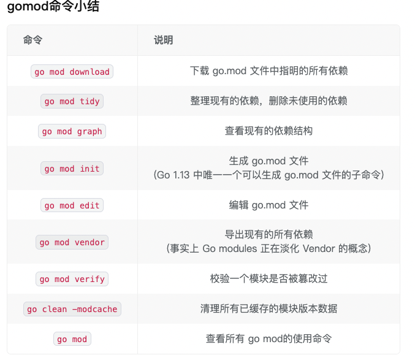

<!-- START doctoc generated TOC please keep comment here to allow auto update -->
<!-- DON'T EDIT THIS SECTION, INSTEAD RE-RUN doctoc TO UPDATE -->
**Table of Contents**  *generated with [DocToc](https://github.com/thlorenz/doctoc)*

- [Go Modules相关操作](#go-modules%E7%9B%B8%E5%85%B3%E6%93%8D%E4%BD%9C)
  - [配置环境变量](#%E9%85%8D%E7%BD%AE%E7%8E%AF%E5%A2%83%E5%8F%98%E9%87%8F)
    - [关于GOPROXY](#%E5%85%B3%E4%BA%8Egoproxy)
  - [在module-get模式下:](#%E5%9C%A8module-get%E6%A8%A1%E5%BC%8F%E4%B8%8B)
  - [更换依赖版本](#%E6%9B%B4%E6%8D%A2%E4%BE%9D%E8%B5%96%E7%89%88%E6%9C%AC)
  - [go mod vendor说明](#go-mod-vendor%E8%AF%B4%E6%98%8E)
  - [模块缓存](#%E6%A8%A1%E5%9D%97%E7%BC%93%E5%AD%98)
  - [go mod & sum格式](#go-mod--sum%E6%A0%BC%E5%BC%8F)
  - [1. go.sum](#1-gosum)
  - [2. go.mod](#2-gomod)
    - [module path](#module-path)
    - [go directive](#go-directive)
    - [require](#require)
    - [indirect注释](#indirect%E6%B3%A8%E9%87%8A)
    - [incompatible](#incompatible)
    - [exclude](#exclude)
    - [replace](#replace)
    - [retract](#retract)
  - [最佳实践](#%E6%9C%80%E4%BD%B3%E5%AE%9E%E8%B7%B5)

<!-- END doctoc generated TOC please keep comment here to allow auto update -->

# Go Modules相关操作


## 配置环境变量
```shell
# 修改 GOBIN 路径（可选）
go env -w GOBIN=$HOME/bin
# 打开 Go modules
go env -w GO111MODULE=on
# 设置 GOPROXY
go env -w GOPROXY=https://goproxy.cn,direct
```

- go install才会链接到GOBIN;

- go build之后你的可执行文件和你的main.go在同一目录下


Note: Go1.13新增了 go env -w 用于写入环境变量，而写入的地方是os.UserConfigDir所返回的路径


### 关于GOPROXY


这个环境变量主要是用于设置 Go 模块代理

它的值是一个以英文逗号 “,” 分割的 Go module proxy 列表，默认是proxy.golang.org，国内访问不了

这里要感谢盛傲飞和七牛云为中国乃至全世界的 Go 语言开发者提供免费、可靠的、持续在线的且经过CDN加速Go module proxy（goproxy.cn）

值列表中的 direct 为特殊指示符:

direct用于指示 Go 回源到模块版本的源地址去抓取(比如 GitHub 等)

- 当值列表中上一个 Go module proxy 返回 404 或 410 错误时，Go 自动尝试列表中的下一个;
- 在遇见direct时回源;
- 遇见 EOF 时终止并抛出类似 invalid version: unknown revision…的错误


## 在module-get模式下:

- 拉取最新的版本(优先择取 tag)：go get golang.org/x/text@latest
- 拉取 master 分支的最新 commit：go get golang.org/x/text@master
- 拉取 tag 为 v0.3.2 的 commit：go get golang.org/x/text@v0.3.2
- 拉取 hash 为 342b231 的 commit，最终会被转换为 v0.3.2：go get golang.org/x/text@342b2e


## 更换依赖版本

查看gin所有历史版本:
```shell
go list -m -versions github.com/gin-gonic/gin 
github.com/gin-gonic/gin v1.1.1 v1.1.2 v1.1.3 v1.1.4 v1.3.0 v1.4.0 v1.5.0 v1.6.0 v1.6.1 v1.6.2 v1.6.3
```

```shell
# 修改依赖版本
go mod edit -require="github.com/gin-gonic/gin@v1.5.0"
# 更新现有依赖
go mod tidy
```

## go mod vendor说明

使用goverdor来管理项目依赖包时, 如果GOPATH中本身没有项目的依赖包，则需要通过go get先下载到GOPATH中，再通过govendor add +external拷贝到vendor目录中


构建的环境无法连接其他网络或者无法连接一些依赖库下载对应依赖时(尤其是国内这种恶劣的开发环境), 将依赖直接导出到项目目录直接进行构建就显得尤为重要了!


## 模块缓存
Global Caching这个主要是针对 Go modules 的全局缓存数据说明，如

```shell
go_advanced_code git:(feature/new-version) ✗ go env
GOMODCACHE="/Users/python/go/pkg/mod"
```

- 同一个模块版本的数据只缓存一份，所有其他模块共享使用
- 目前所有模块版本数据均缓存在 $GOPATH/pkg/mod和 $GOPATH/pkg/sum下，未来或将移至 $GOCACHE/mod和$GOCACHE/sum下( 可能会在当 $GOPATH 被淘汰后)
- 可以使用 go clean -modcache 清理所有已缓存的模块版本数据


## go mod & sum格式
go.mod以及go.sum一般会成对出现在项目根目录中。其中，go.mod负责记录需求列表(用于构建依赖模块)；而go.sum用于记录安全性以及完整性校验

## 1. go.sum

```go
 <模块> <版本>[/go.mod] <哈希>
```

- 带有/go.mod代表该版本模块的go.mod文件hash值

- 不带/go.mod代表该版本模块源代码的hash值

```go
   cloud.google.com/go v0.26.0/go.mod h1:aQUYkXzVsufM+DwF1aE+0xfcU+56JwCaLick0ClmMTw=   cloud.google.com/go v0.34.0/go.mod h1:aQUYkXzVsufM+DwF1aE+0xfcU+56JwCaLick0ClmMTw=   cloud.google.com/go v0.38.0 h1:ROfEUZz+Gh5pa62DJWXSaonyu3StP6EA6lPEXPI6mCo=   cloud.google.com/go v0.38.0/go.mod h1:990N+gfupTy94rShfmMCWGDn0LpTmnzTp2qbd1dvSRU=   cloud.google.com/go v0.41.0 h1:NFvqUTDnSNYPX5oReekmB+D+90jrJIcVImxQ3qrBVgM=   cloud.google.com/go v0.41.0/go.mod h1:OauMR7DV8fzvZIl2qg6rkaIhD/vmgk4iwEw/h6ercmg=   contrib.go.opencensus.io/exporter/ocagent v0.4.12/go.mod h1:450APlNTSR6FrvC3CTRqYosuDstRB9un7SOx2k/9ckA=   github.com/AlekSi/pointer v1.1.0 h1:SSDMPcXD9jSl8FPy9cRzoRaMJtm9g9ggGTxecRUbQoI=   github.com/AlekSi/pointer v1.1.0/go.mod h1:y7BvfRI3wXPWKXEBhU71nbnIEEZX0QTSB2Bj48UJIZE=   github.com/Azure/azure-sdk-for-go v16.2.1+incompatible/go.mod h1:9XXNKU+eRnpl9moKnB4QOLf1HestfXbmab5FXxiDBjc=   github.com/Azure/azure-sdk-for-go v31.1.0+incompatible h1:5SzgnfAvUBdBwNTN23WLfZoCt/rGhLvd7QdCAaFXgY4=   github.com/Azure/azure-sdk-for-go v31.1.0+incompatible/go.mod h1:9XXNKU+eRnpl9moKnB4QOLf1HestfXbmab5FXxiDBjc=   github.com/Azure/azure-sdk-for-go v35.0.0+incompatible h1:PkmdmQUmeSdQQ5258f4SyCf2Zcz0w67qztEg37cOR7U=   github.com/Azure/azure-sdk-for-go v35.0.0+incompatible/go.mod h1:9XXNKU+eRnpl9moKnB4QOLf1HestfXbmab5FXxiDBjc=
```
go.sum文件可以不存在，当go.sum文件不存在时默认会到远程校验数据库进行校验(通过GOSUMDB设置地址)，当然也可以设置为不校验(GONOSUMDB)


## 2. go.mod
go module最重要的是go.mod文件的定义，它用来标记一个module和它的依赖库以及依赖库的版本。会放在module的主文件夹下，一般以go.mod命名。

一个go.mod内容类似下面的格式:
```go
module github.com/panicthis/modfile
go 1.16
require (
	github.com/cenk/backoff v2.2.1+incompatible
	github.com/coreos/bbolt v1.3.3
	github.com/edwingeng/doublejump v0.0.0-20200330080233-e4ea8bd1cbed
	github.com/stretchr/objx v0.3.0 // indirect
	github.com/stretchr/testify v1.7.0
	go.etcd.io/bbolt v1.3.6 // indirect
	go.etcd.io/etcd/client/v2 v2.305.0-rc.1
	go.etcd.io/etcd/client/v3 v3.5.0-rc.1
	golang.org/x/net v0.0.0-20210610132358-84b48f89b13b // indirect
	golang.org/x/sys v0.0.0-20210611083646-a4fc73990273 // indirect
)
exclude (
	go.etcd.io/etcd/client/v2 v2.305.0-rc.0
	go.etcd.io/etcd/client/v3 v3.5.0-rc.0
)
retract (
    v1.0.0 // 废弃的版本，请使用v1.1.0
)
```


### module path
go.mod的第一行是module path, 一般采用仓库+module name的方式定义。这样我们获取一个module的时候，就可以到它的仓库中去查询，或者让go proxy到仓库中去查询。
```go
	
module github.com/panicthis/modfile
```

如果你的版本已经大于等于2.0.0，按照Go的规范，你应该加上major的后缀，module path改成下面的方式:
```go
module github.com/panicthis/modfile/v2
//或则
module github.com/panicthis/modfile/v3
```
而且引用代码的时候，也要加上v2、v3、vx后缀，以便和其它major版本进行区分。

这是一个很奇怪的约定，带来的好处是你一个项目中可以使用依赖库的不同的major版本，它们可以共存。


### go directive

第二行是go directive。格式是 go 1.xx,它并不是指你当前使用的Go版本，而是指名你的代码所需要的Go的最低版本。
```go
go 1.16
```
因为Go的标准库也有所变化，一些新的API也被增加进来，如果你的代码用到了这些新的API,你可能需要指名它依赖的go版本。

这一行不是必须的，你可以不写。


### require
require段中列出了项目所需要的各个依赖库以及它们的版本，除了正规的v1.3.0这样的版本外，还有一些奇奇怪怪的版本和注释，
```go
github.com/coreos/bbolt v1.3.3
```

伪版本号

```go
github.com/edwingeng/doublejump v0.0.0-20200330080233-e4ea8bd1cbed
```
上面这个库中的版本号就是一个伪版本号v0.0.0-20200330080233-e4ea8bd1cbed,这是go module为它生成的一个类似符合语义化版本2.0.0版本，实际这个库并没有发布这个版本

正式因为这个依赖库没有发布版本，而go module需要指定这个库的一个确定的版本，所以才创建的这样一个伪版本号。

go module的目的就是在go.mod中标记出这个项目所有的依赖以及它们确定的某个版本。

这里的20200330080233是这次提交的时间，格式是yyyyMMddhhmmss, 而e4ea8bd1cbed就是这个版本的commit id,通过这个字段，就可以确定这个库的特定的版本

而前面的v0.0.0可能有多种生成方式，主要看你这个commit的base version:

- vX.0.0-yyyymmddhhmmss-abcdefabcdef: 如果没有base version,那么就是vX.0.0的形式
- vX.Y.Z-pre.0.yyyymmddhhmmss-abcdefabcdef： 如果base version是一个预发布的版本，比如vX.Y.Z-pre,那么它就用vX.Y.Z-pre.0的形式
- vX.Y.(Z+1)-0.yyyymmddhhmmss-abcdefabcdef: 如果base version是一个正式发布的版本，那么它就patch号加1，如vX.Y.(Z+1)-0


### indirect注释
```go
go.etcd.io/bbolt v1.3.6 // indirect
golang.org/x/net v0.0.0-20210610132358-84b48f89b13b // indirect
golang.org/x/sys v0.0.0-20210611083646-a4fc73990273 // indirect
```

如果用一句话总结，间接的使用了这个库，但是又没有被列到某个go.mod中，当然这句话也不算太准确，更精确的说法是下面的情况之一就会对这个库加indirect后缀：

- 当前项目依赖A,但是A的go.mod遗漏了B, 那么就会在当前项目的go.mod中补充B, 加indirect注释
- 当前项目依赖A,但是A没有go.mod,同样就会在当前项目的go.mod中补充B, 加indirect注释
- 当前项目依赖A,A又依赖B,当对A降级的时候，降级的A不再依赖B,这个时候B就标记indirect注释


### incompatible

有些库后面加了incompatible后缀，但是你如果看这些项目，它们只是发布了v2.2.1的tag,并没有+incompatible后缀。
```go
	
github.com/cenk/backoff v2.2.1+incompatible
```

这些库采用了go.mod的管理，但是不幸的是，虽然这些库的版major版本已经大于等于2了，但是他们的module path中依然没有添加v2、v3这样的后缀。

所以go module把它们标记为incompatible的，虽然可以引用，但是实际它们是不符合规范的。


### exclude
```go
exclude (
	go.etcd.io/etcd/client/v2 v2.305.0-rc.0
	go.etcd.io/etcd/client/v3 v3.5.0-rc.0
)
```
这样，Go在版本选择的时候，就会主动跳过这些版本，比如你使用go get -u ......或者go get github.com/xxx/xxx@latest等命令时，会执行version query的动作，这些版本不在考虑的范围之内


### replace
replace也是常用的一个手段，用来解决一些错误的依赖库的引用或者调试依赖库。
```go
replace github.com/coreos/bbolt => go.etcd.io/bbolt v1.3.3
replace github.com/panicthis/A v1.1.0 => github.com/panicthis/R v1.8.0
replace github.com/coreos/bbolt => ../R
```

比如etcd v3.3.x的版本中错误的使用了github.com/coreos/bbolt作为bbolt的module path,其实这个库在它自己的go.mod中声明的module path是go.etcd.io/bbolt，又比如etcd使用的grpc版本有问题，你也可以通过replace替换成所需的grpc版本。

甚至你觉得某个依赖库有问题，自己fork到本地做修改，想调试一下，你也可以替换成本地的文件夹。

replace可以替换某个库的所有版本到另一个库的特定版本，也可以替换某个库的特定版本到另一个库的特定版本。


### retract

retract是go 1.16中新增加的内容，借用学术界期刊撤稿的术语，宣布撤回库的某个版本。

如果你误发布了某个版本，或者事后发现某个版本不成熟，那么你可以推一个新的版本，在新的版本中，声明前面的某个版本被撤回，提示大家都不要用了。

撤回的版本tag依然还存在，go proxy也存在这个版本，所以你如果强制使用，还是可以使用的，否则这些版本就会被跳过。

和exclude的区别是retract是这个库的owner定义的， 而exclude是库的使用者在自己的go.mod中定义的


## 最佳实践

- 尽量不要手动修改go.mod文件，通过go命令来操作go.mod文件

- 尽量遵守semantic version(语义化版本)发布和管理模块

- 利用go mod tidy进行自动整理操作。该模块会清理需求列表：删除不需要的需求项，添加需要的需求项

- 本地调试：如果本地有依赖模块还未发布，则可以利用如下方法进行调试：
    - replace：将依赖模块修改成本地依赖包地址，这样就可以在本地修改依赖包的同时进行编译调试了(需要注意go.mod文件内容发生修改，注意不要提交)
    - vendor：默认情况下go build会忽略vendor目录；当添加-mod=vendor选项时，go build会优先查找vendor目录下的依赖模块。因此可以将本地开发的依赖包放置在vendor目录，并将vendor通过.gitignore文件设置在版本控制之外，这样既可以满足本地调试，同时也不影响版本提交
 