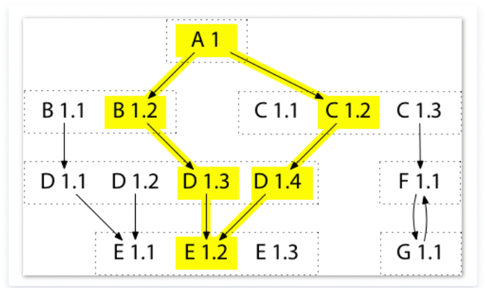
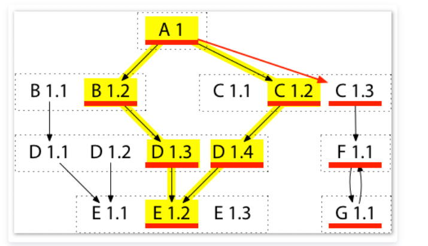

# module包管理

go官方库管理方式叫做go module。 先前，我们的库都是以package来组织的，package以一个文件或者多个文件实现单一的功能，一个项目包含一个package或者多个package。
Go module就是一组统一打版和发布的package的集合，在根文件下有go.mod文件定义module path和依赖库的版本，package以子文件夹的形式存在module中，对package path就是 module path +"/"+ package name的形式。

一般我们项目都是单module的形式，项目主文件夹下包含go.mod,子文件夹定义package，或者主文件夹也是一个package。但是一个项目也可以包含多个module,只不过这种方式不常用而已。

## 背景
- vendor(2015.06)；Go 1.5版本引入vendor(类似godep)，存放于项目根目录，编译时优先使用vendor目录，之后再去GOPATH，GOROOT目录查找(解决GOPATH无法管控依赖变更和丢失的问题)
- dep(2016.08)：dep期望统一Go依赖管理，虽然提供了兼容其它依赖管理工具的功能，但是本质上还是利用GOPATH和vendor解决依赖管理
- Go Modules(2018.08)：Go 1.11发布的官方依赖管理解决方案，并最终统一了Go依赖管理(by Russ Cox)。Go Modules以semantic version(语义版本化)和Minimal Version Selection, MVS(最小版本选择)为核心，相比dep更具稳定性；同时也解决了vendor代码库依赖过于庞大，造成存储浪费的问题


## 原理

### semantic version语义化版本 2.0.0

Go module遵循语义化版本规范 2.0.0。语义化版本规范 2.0.0规定了版本号的格式，每个字段的意义以及版本号比较的规则等等.

如果你想为你的项目发版，你可以设置tag为上面的格式，比如v1.3.0、v2.0.0-rc.1等等。metadata中在Go版本比较时是不参与运算的，只是一个辅助信息。
- MAJOR version when you make incompatible API changes(不兼容的修改)
- MINOR version when you add functionality in a backwards compatible manner(特性添加，版本兼容)
- PATCH version when you make backwards compatible bug fixes(bug修复，版本兼容)

### Minimal Version Selection 最小版本选择算法

在Minimal version selection之前，Go的选择算法很简单，且提供了 2 种不同的版本选择算法，但都不正确：
1. go get 的默认行为：若本地有一个版本，则使用此版本；否则下载使用最新的版本。这种模式将导致使用的版本太老：假设已经安装了B 1.1，并执行 go get 下载，那么go get 不会更新到B 1.2，这样就会导致因为B 1.1太老构建失败或有bug
2. go get -u 的行为：下载并使用所有模块的最新版本。这种模式可能会因为版本太新而失败：若你运行 go get -u 来下载A依赖模块，会正确地更新到B 1.2。同时也会更新到C 1.3 和E 1.3，但这可能不是 A 想要的，因为这些版本可能未经测试，无法正常工作

这 2 种算法的构建是低保真构建（Low-Fidelity Builds）：虽然都想复现模块 A 的作者所使用的构建，但这些构建都因某些不明确的原因而变得有些偏差

我对最小版本选择算法中'最小'的理解如下：

- 最小的修改操作
- 最小的需求列表
- 最小的模块版本。这里比较的对象是该模块的最新版本：如果项目需要依赖的模块版本是v1.2，而该模块实际最新的版本是v1.3，那么最小版本选择算法会选取v1.2版本而非v1.3(为了尽可能提高构建的稳定性和重复性)。也即'最小版本'表示项目所需要依赖模块的最小版本号(v1.2)，而不是该模块实际的最小版本号(v1.1)，也并非该模块实际的最大版本号(v1.3)

最小版本选择算法涉及下面四个方面
1. Construct the current build list. 构建项目当前build list
2. Upgrade all modules to their latest versions. 升级所有依赖模块到它们的最新版本
3. Upgrade one module to a specific newer version. 升级某个依赖模块到指定版本
4. Downgrade one module to a specific older version. 将某个依赖模块降级到指定版本

####  Algorithm 1: Construct Build List●


以通过图遍历以及递归算法(图递归遍历)来构建依赖列表。从根节点出发依次遍历直接依赖B1.2以及C1.2，然后递归遍历。这样根据初始的依赖关系(指定版本：A1->B1.2，A1->C1.2)，会按照如下路径选取依赖：


首先构建empty build list，然后从根节点出发递归遍历依赖模块获取rough build list，这样rough build list中可能会存在同一个依赖模块的不同版本(如D1.3与D1.4)，通过选取最新版本构建final build list(最终的构建列表一个模块只取一个版本，即这些版本中的最新版)，如下：


#### Algorithm 2. Upgrade All Modules


这里面添加了新的依赖模块：E1.3，G1.1，F1.1以及C1.3。新rough build list会将新引入的依赖模块和旧的rough build list模块(黄色部分)进行合并，并从中选取最大版本，最终构建final build list(上图红线标识模块)。

上述例子中A1的go.mod文件会构建如下：
```go
module A1
go 1.14
require (
	B1.2
	C1.3
	D1.4 // indirect
	E1.3 // indirect)
```
可以看到上述go.mod文件中，没有出现F1.1以及G1.1，这是因为F1.1存在于C1.3的go.mod文件中，而G1.1存在于F1.1的go.mod文件中，因此没有必要将这两个模块填写到A1的go.mod文件中；


#### Algorithm 3. Upgrade One Module
```shell
go get C@1.3
```

当我们升级某个模块时，会在构建图中将指向这个模块的箭头挪向新版本(A1->C1.2挪向A1->C1.3)并递归引入新的依赖模块。例如在升级C1.2->C1.3时，会新引入F1.1以及G1.1模块(对一个模块的升级或者降级可能会引入其他依赖模块)，而新的rough build list(红线)将由旧rough build list(黄色部分)与新模块(C1.3，F1.1以及G1.1)构成，并最终选取其中最大版本合成新的final build list(A1，B1.2，C1.3，D1.4，E1.2，F1.1以及G1.1)


注意最终构建列表中模块D为D1.4而非D1.3，这是因为当升级某个模块时，只会添加箭头，引入新模块；而不会减少箭头，从而删除或者降级某些模块；

比如若从 A 至 C 1.3 的新箭头替换了从 A 至 C 1.2 的旧箭头，升级后的构建列表将会丢掉 D 1.4。也即是这种对 C 的升级将导致 D 的降级(降级为D1.3)，这明显是预料之外的，且不是最小修改

一旦我们完成了构建列表的升级，就可运行前面的算法 R 来决定如何升级需求列表(go.mod)。这种情况下，我们最终将以C1.3替换C 1.2，但同时也会添加一个对D1.4的新需求，以避免D的意外降级(因为按照算法1，D1.3才会出现在最终构建列表中)。如下

```go
module A1
go 1.14
require (
	B1.2
	C1.3
	D1.4 // indirect)
```

#### Algorithm 4. Downgrade One Module


```shell
go get D@1.2
```
这里将D降级为D1.2，会先删除D1.3以及D1.4模块，然后回溯删除B1.2以及C1.2模块，最终确定到B1.1以及C1.1版本(它们分别是B和C不依赖>=D1.3模块的最新版本了)，

在确定直接依赖是B1.1以及C1.1之后，会递归将其依赖模块引入，并添加指定版本D1.2，那么按照算法1可以很容易得出构建列表为：A1，B1.1，D1.2(D1.1 vs D1.2)，E1.1以及C1.1

同时，为了保证最小修改，其它不需要降级的模块我们需要尽可能保留，比如：E1.2。这样，final build list就为：A1，B1.1，D1.2(D1.1 vs D1.2)，E1.2(E1.1 vs E1.2)以及C1.1

```go
module A1
go 1.14
require (
	B1.1
	C1.1
	D1.2 // indirect
	E1.2 // indirect)
```


 