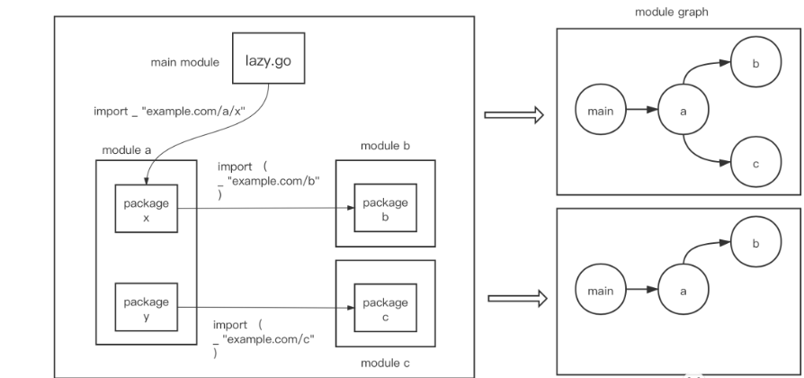

<!-- START doctoc generated TOC please keep comment here to allow auto update -->
<!-- DON'T EDIT THIS SECTION, INSTEAD RE-RUN doctoc TO UPDATE -->
**Table of Contents**  *generated with [DocToc](https://github.com/thlorenz/doctoc)*

- [Go 1.17 新特性: module依赖图修剪(module graph pruning)与延迟module加载(lazy module loading)](#go-117-%E6%96%B0%E7%89%B9%E6%80%A7-module%E4%BE%9D%E8%B5%96%E5%9B%BE%E4%BF%AE%E5%89%AAmodule-graph-pruning%E4%B8%8E%E5%BB%B6%E8%BF%9Fmodule%E5%8A%A0%E8%BD%BDlazy-module-loading)
  - [module依赖图修剪 module graph pruning](#module%E4%BE%9D%E8%B5%96%E5%9B%BE%E4%BF%AE%E5%89%AA-module-graph-pruning)
  - [延迟module加载(lazy module loading)](#%E5%BB%B6%E8%BF%9Fmodule%E5%8A%A0%E8%BD%BDlazy-module-loading)
  - [参考](#%E5%8F%82%E8%80%83)

<!-- END doctoc generated TOC please keep comment here to allow auto update -->

# Go 1.17 新特性: module依赖图修剪(module graph pruning)与延迟module加载(lazy module loading)

module依赖图修剪(module graph pruning)是延迟module加载(lazy module loading)的基础。

## module依赖图修剪 module graph pruning



main module中的lazy.go导入了module a的package x，后者则导入了module b；并且module a还有一个package y，该包导入了module c

现在问题来了！package y是因为自身是module a的一部分而被main module所依赖，它没有为main module的构建做出任何“代码级贡献”；
同理，package y所依赖的module c亦是如此。但是在Go 1.17之前的版本中，如果Go编译器找不到module c，那么main module的构建将会失败，这会让开发者们觉得不够合理！

gnet为例，Go 1.17版本之前的go.mod如下：

```go

module github.com/panjf2000/gnet

go 1.16

require (
 github.com/BurntSushi/toml v0.3.1 // indirect
 github.com/panjf2000/ants/v2 v2.4.6
 github.com/stretchr/testify v1.7.0
 github.com/valyala/bytebufferpool v1.0.0
 go.uber.org/atomic v1.8.0 // indirect
 go.uber.org/multierr v1.7.0 // indirect
 go.uber.org/zap v1.18.1
 golang.org/x/sys v0.0.0-20210630005230-0f9fa26af87c
 gopkg.in/natefinch/lumberjack.v2 v2.0.0
)
```

Go 1.17重新mod tidy后，go.mod内容如下：
```go

module github.com/panjf2000/gnet

go 1.17

require (
 github.com/BurntSushi/toml v0.3.1 // indirect
 github.com/panjf2000/ants/v2 v2.4.6
 github.com/stretchr/testify v1.7.0
 github.com/valyala/bytebufferpool v1.0.0
 go.uber.org/atomic v1.8.0 // indirect
 go.uber.org/multierr v1.7.0 // indirect
 go.uber.org/zap v1.18.1
 golang.org/x/sys v0.0.0-20210630005230-0f9fa26af87c
 gopkg.in/natefinch/lumberjack.v2 v2.0.0
)

require (
 github.com/davecgh/go-spew v1.1.1 // indirect
 github.com/pmezard/go-difflib v1.0.0 // indirect
 gopkg.in/yaml.v3 v3.0.0-20210107192922-496545a6307b // indirect
)
```

我们看到go 1.17后，go.mod中的main module的依赖分成了两个require块儿，第一个是直接依赖，第二个是间接依赖。


这种将那些“占着茅坑不拉屎”、对构建完全没有“贡献”的间接依赖module从构建时使用的依赖图中修剪掉的过程，就被称为module依赖图修剪。


但module依赖图修剪也带来了一个副作用，那就是go.mod文件size的变大。因为Go 1.17版本后，每次go mod tidy，go命令都会对main module的依赖做一次深度扫描(deepening scan)，并将main module的所有直接和间接依赖都记录在go.mod中。

考虑到内容较多，go 1.17将直接依赖和间接依赖分别放在两个不同的require块儿中。
## 延迟module加载(lazy module loading)


延迟module加载其含义就是那些在完整的module graph(complete module graph)中，但不在pruned module graph中的module的go.mod不会被go命令加载。


## 参考

- [Go 1.17新特性详解：module依赖图修剪与延迟module加载](https://tonybai.com/2021/08/19/go-module-changes-in-go-1-17/)