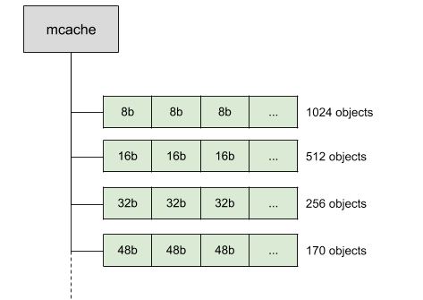
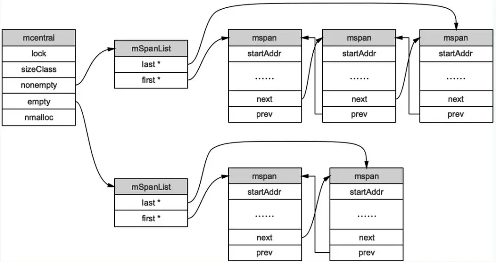
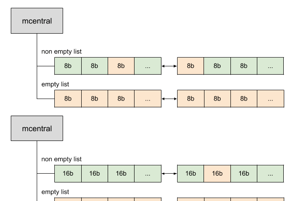

<!-- START doctoc generated TOC please keep comment here to allow auto update -->
<!-- DON'T EDIT THIS SECTION, INSTEAD RE-RUN doctoc TO UPDATE -->
**Table of Contents**  *generated with [DocToc](https://github.com/thlorenz/doctoc)*

- [Golang 内存管理](#golang-%E5%86%85%E5%AD%98%E7%AE%A1%E7%90%86)
  - [内存管理的几个概念](#%E5%86%85%E5%AD%98%E7%AE%A1%E7%90%86%E7%9A%84%E5%87%A0%E4%B8%AA%E6%A6%82%E5%BF%B5)
  - [内存分配流程](#%E5%86%85%E5%AD%98%E5%88%86%E9%85%8D%E6%B5%81%E7%A8%8B)
  - [1. 内存管理单元 mspan](#1-%E5%86%85%E5%AD%98%E7%AE%A1%E7%90%86%E5%8D%95%E5%85%83-mspan)
  - [2. 内存管理组件](#2-%E5%86%85%E5%AD%98%E7%AE%A1%E7%90%86%E7%BB%84%E4%BB%B6)
    - [1. mcache](#1-mcache)
    - [2. mcentral](#2-mcentral)
    - [3. mheap](#3-mheap)
  - [分配方法](#%E5%88%86%E9%85%8D%E6%96%B9%E6%B3%95)
  - [分配器](#%E5%88%86%E9%85%8D%E5%99%A8)
    - [1. tiny 类型的分配](#1-tiny-%E7%B1%BB%E5%9E%8B%E7%9A%84%E5%88%86%E9%85%8D)
    - [2. small 类型](#2-small-%E7%B1%BB%E5%9E%8B)
    - [3. large 类型](#3-large-%E7%B1%BB%E5%9E%8B)
  - [内存架构](#%E5%86%85%E5%AD%98%E6%9E%B6%E6%9E%84)
    - [1.10及以前: 线性内存](#110%E5%8F%8A%E4%BB%A5%E5%89%8D-%E7%BA%BF%E6%80%A7%E5%86%85%E5%AD%98)
    - [1.11及以后:稀疏内存](#111%E5%8F%8A%E4%BB%A5%E5%90%8E%E7%A8%80%E7%96%8F%E5%86%85%E5%AD%98)
    - [内存管理器初始化](#%E5%86%85%E5%AD%98%E7%AE%A1%E7%90%86%E5%99%A8%E5%88%9D%E5%A7%8B%E5%8C%96)
  - [地址空间](#%E5%9C%B0%E5%9D%80%E7%A9%BA%E9%97%B4)
  - [参考资料](#%E5%8F%82%E8%80%83%E8%B5%84%E6%96%99)

<!-- END doctoc generated TOC please keep comment here to allow auto update -->

# Golang 内存管理

在现代 CPU 上，除了内存分配的正确性以外，我们还要考虑分配过程的效率问题，应用执行期间小对象会不断地生成与销毁，如果每一次对象的分配与释放都需要与操作系统交互，那么成本是很高的。
这就需要我们在应用层设计好内存分配的多级缓存，尽量减少小对象高频创建与销毁时的锁竞争，这个问题在传统的 C/C++ 语言中已经有了解法，那就是 tcmalloc：

golang的内存分配机制源自Google的 TCMalloc 算法，英文全称Thread-Caching Malloc，从名字可以看出，是在原有基础上，针对多核多线程的内存管理进行优化而提出来的。


该算法的核心思想是内存的多级管理，进而降低锁的粒度；将内存按需划成大小不一的块，减少内存的碎片化。
为每个P，也就是go协程调度模型了里面的逻辑处理器维护一个mcache结构体的独立内存池，只有当该内存池不足时，才会向全局mcentral和mheap结构体管理的内存池申请。
为每一个P维持一个私有的本地内存池，从而不用加锁，加快了内存分配速度。只有在本地P的内存池被消耗完，或者申请的内存太大时，才会访问全局的内存池，大大减小了多线程下对全局内存池访问带来的竞争系统损耗。

## 内存管理的几个概念

* page 内存页，一块 8K 大小的内存空间。Go 与操作系统之间的内存申请和释放，都是以 page 为单位的。
* mheap 堆分配器，以8192byte页进行管理
* mspan 由mheap管理的页面,mspan结构体是go内存管理的基本单元
* mcentral 所有给定大小类的mspan集合，Central组件其实也是一个缓存，但它缓存的不是小对象内存块，而是一组一组的内存page(一个page占4k大小)
* mcache 运行时分配池，每个线程都有自己的局部内存缓存mCache，实现goroutine高并发的重要因素(分配小对象可直接从mCache中分配，不用加锁)
* areas: Go 向操作系统申请内存时的最小单位，每个 arena 为 64MB 大小，在内存中可以部分连续，但整体是个稀疏结构。
* bitmap 区域是标识arena中那些地址保存了对象，及对象中是否包含了指针，其中1个byte（8bit）对应arena中4个指针大小的内存（即：2bit对应1个指针大小），对应大小16G；
* span 是页管理单元，是内存分配的基本单位，其中一个指针对应arena中1个虚拟地址页大小（8kb），对应大小512M
* sizeclass 空间规格，每个 span 都带有一个 sizeclass ，标记着该 span 中的 page 应该如何使用。使用上面的比喻，就是 sizeclass 标志着 span 是一个什么样的队伍。
* object  对象，用来存储一个变量数据内存空间，一个 span 在初始化时，会被切割成一堆等大的 object 。
  假设 object 的大小是 16B ， span 大小是 8K ，那么就会把 span 中的 page 就会被初始化 8K / 16B = 512 个 object 。
  所谓内存分配，就是分配一个 object 出去

单个 arena 会被切分成以 8KB 为单位的 page，由 page allocator 管理，一个或多个 page 可以组成一个 mspan，每个 mspan 可以按照 sizeclass 再划分成多个 element。
同样大小的 mspan 又分为 scan 和 noscan 两种，分别对应内部有指针的 object 和内部没有指针的 object。

## 内存分配流程


变量是在栈上分配还是在堆上分配，是由逃逸分析的结果决定的。通常情况下，编译器是倾向于将变量分配到栈上的，因为它的开销小，最极端的就是"zero garbage"，
所有的变量都会在栈上分配，这样就不会存在内存碎片，垃圾回收之类的东西。

大体上的分配流程：


| 类别         | 大小                                | 分配来源                                                          |
| ------------ | ----------------------------------- | ----------------------------------------------------------------- |
| 微对象 tiny  | (0, 16B)  && has no pointer(noscan) | 使用 mcache 的tiny分配器分配                                      |
| 小对象 small | [16B, 32KB]                         | 首先计算对象的规格大小，然后使用mcache中相应规格大小的mspan分配： |
| 大对象 large | [(32KB, +∞)                        | 直接从mheap上分配                                                 |

small 小对象流程重点:
首先计算对象的规格大小，然后使用mcache中相应规格大小的mspan分配：

1. 如果 mcache 没有相应规格大小的mspan，则向m central 申请
2. 如果 mcentral 没有相应规格大小的mspan，则向 mheap 申请
3. 如果 mheap 中也没有合适大小的mspan， 则调用 sysAlloc(mmap) 向系统申请

## 1. 内存管理单元 mspan

mspan：Go中内存管理的基本单元，是由一片连续的 8KB 的页组成的大块内存。注意，这里的页和操作系统本身的页并不是一回事，它一般是操作系统页大小的几倍。
一句话概括： mspan 是一个包含起始地址、 mspan规格、页的数量等内容的双端链表。


```go
type spanClass uint8

//结构
// path: go/src/runtime/mheap.go
type mspan struct{
	//链表后向指针，用于将span链接起来
	next *mspan
	//链表前向指针，用于将span链接起来
	prev *mspan
	// 起始地址，也即所管理页的地址,当前span在arena中的起始字节的地址
	startAddr uintptr
	// 管理的页数,当前span包含arena中多少页
	npages uintptr
	// 块个数，表示有多少个块可供分配.当前span，包含多少个对象。golang又对每一个span，按照所属class的不同，切分成大小不同的块，以减少内存碎片。
	nelems uintptr
	//分配位图，每一位代表一个块是否已分配.
	allocBits *gcBits
	// 已分配块的个数
	allocCount uint16
	// class表中的class ID，和Size Class相关
	spanclass spanClass
	// class表中的对象大小，也即块大小
	elemsize uintptr
}
```

从next,prev可以发现，这是一个双向链表。

每个 mspan按照它自身的属性 SizeClass的大小分割成若干个 object，每个 object可存储一个对象。并且会使用一个位图来标记其尚未使用的 object。
属性 SizeClass决定 object大小，而 mspan只会分配给和 object尺寸大小接近的对象，当然，对象的大小要小于 object大小
使用span机制来减少碎片. 每个span至少分配1个page(8KB), 划分成固定大小的slot, 用于分配一定大小范围的内存需求.



```go
// /Users/python/go/go1.18/src/runtime/sizeclasses.go
// class  bytes/obj  bytes/span  objects  tail waste  max waste  min align
//     1          8        8192     1024           0     87.50%          8
//     2         16        8192      512           0     43.75%         16
//     3         24        8192      341           8     29.24%          8
//     4         32        8192      256           0     21.88%         32
//     5         48        8192      170          32     31.52%         16
//     6         64        8192      128           0     23.44%         64
//     7         80        8192      102          32     19.07%         16
//     8         96        8192       85          32     15.95%         32
//     9        112        8192       73          16     13.56%         16
//    10        128        8192       64           0     11.72%        128
// ....
//    63      21760       65536        3         256      6.25%        256
//    64      24576       24576        1           0     11.45%       8192
//    65      27264       81920        3         128     10.00%        128
//    66      28672       57344        2           0      4.91%       4096
//    67      32768       32768        1           0     12.50%       8192

// alignment  bits  min obj size
//         8     3             8
//        16     4            32
//        32     5           256
//        64     6           512
//       128     7           768
//      4096    12         28672
//      8192    13         32768

```

可以看到一共67，实际一共68种。
class0表示单独分配一个 >32KB 对象的span, 有67个 size, 每个size两种, 用于分配有指针和无指针对象, 所以 有67*2=134个class.

- class：是class id， 对应了span结构体所属的class的种类，可以看到一共66中，实际一共67种。大于32K的内存 分配，会直接从mheap中分配，后面会介绍
- bytes/obj：每个对象占用的字节
- bytes/span：每个span的大小，也就是页数*8k（页大小)
- objects：该类span所拥有的对象数，span所占字节数/对象所占字节
- waste bytes：该类span浪费的字节数，从以上分析可以看出，每一类span并不能刚好按该类对象大小，分配整数个对象，即做到每一字节物尽其用，这个值是：span所占字节数%对象所占字节数

以class 10 为例，span与管理的内存如下图所示：


表示当前span类别属于class10，大小只有1页，又切分56个大小为144字节的块。

## 2. 内存管理组件

内存分配由内存分配器完成。分配器由3种组件构成： mcache, mcentral, mheap

### 1. mcache


```go
// /Users/python/go/go1.18/src/runtime/runtime2.go
type p struct {
	id          int32
	// ....
	m           muintptr   // back-link to associated m (nil if idle)
	mcache      *mcache
	// ...
```

在Go的调度器模型里，每个线程M会绑定给一个处理器P，在单一粒度的时间里只能处理运行一个goroutine，每个P都会绑定一个上面说的本地缓存mcache。
当需要进行内存分配时，当前运行的goroutine会从mcache中查找可用的mspan。从本地mcache里分配内存时不需要加锁，这种分配策略效率更高。

```go
// /Users/python/go/go1.18/src/runtime/mcache.go
type mcache struct{
	// ...
	alloc [numSpanClasses]*mspan
	// ... 
}
numSpanClasses = _NumSizeClasses << 1

const _NumSizeClasses = 68 
```

### 2. mcentral

我们可能会好奇，如果分配内存时mcachce里没有空闲的32字节的mspan了该怎么办？Go里还为每种类别的mspan维护着一个mcentral。






mcentral的作用是为所有mcache提供切分好的mspan资源。每个central会持有一种特定大小的全局mspan列表，包括已分配出去的和未分配出去的。
每个mcentral对应一种mspan，当工作线程的mcache中没有合适（也就是特定大小的）的mspan时就会从mcentral 去获取。
mcentral被所有的工作线程共同享有，存在多个goroutine竞争的情况，因此从mcentral获取资源时需要加锁。

```go
// /usr/local/go/src/runtime/mcentral.go
type mcentral struct {
	spanclass spanClass

	// partial and full contain two mspan sets: one of swept in-user
	// spans, and one of unswept in-user spans. These two trade
	// roles on each GC cycle. The unswept set is drained either by
	// allocation or by the background sweeper in every GC cycle,
	// so only two roles are necessary.
	partial [2]spanSet // 尚有空闲object的mspan链表
	full    [2]spanSet // 没有空闲object的mspan链表，或者是已被mcache取走的msapn链表
```

```go
// /Users/python/go/go1.18/src/runtime/mspanset.go

// A spanSet is a set of *mspans.
//
// spanSet is safe for concurrent push and pop operations.
type spanSet struct {

	spineLock mutex
	spine     unsafe.Pointer // *[N]*spanSetBlock, accessed atomically
	spineLen  uintptr        // Spine array length, accessed atomically
	spineCap  uintptr        // Spine array cap, accessed under lock

	index headTailIndex
}
```

### 3. mheap

当mcentral没有空闲的mspan时，会向mheap申请。而mheap没有资源时，会向操作系统申请新内存。mheap主要用于大对象的内存分配，以及管理未切割的mspan，用于给mcentral切割成小对象。

```go
// /Users/python/go/go1.18/src/runtime/mheap.go

//go:notinheap
type mheap struct {
	// lock must only be acquired on the system stack, otherwise a g
	// could self-deadlock if its stack grows with the lock held.
	lock  mutex
	pages pageAlloc //  堆的页分配

	sweepgen uint32 // sweep generation, see comment in mspan; written during STW

    // 所有的 spans 都是通过 mheap_ 申请，所有申请过的 mspan 都会记录在 allspans。结构体中的 lock 就是用来保证并发安全的。
	// In general, allspans is protected by mheap_.lock, which
	// prevents concurrent access as well as freeing the backing
	// store. Accesses during STW might not hold the lock, but
	// must ensure that allocation cannot happen around the
	// access (since that may free the backing store).
	allspans []*mspan // all spans out there

	// _ uint32 // align uint64 fields on 32-bit for atomics

	// Proportional sweep
	//
	// These parameters represent a linear function from gcController.heapLive
	// to page sweep count. The proportional sweep system works to
	// stay in the black by keeping the current page sweep count
	// above this line at the current gcController.heapLive.
	//
	// The line has slope sweepPagesPerByte and passes through a
	// basis point at (sweepHeapLiveBasis, pagesSweptBasis). At
	// any given time, the system is at (gcController.heapLive,
	// pagesSwept) in this space.
	//
	// It is important that the line pass through a point we
	// control rather than simply starting at a 0,0 origin
	// because that lets us adjust sweep pacing at any time while
	// accounting for current progress. If we could only adjust
	// the slope, it would create a discontinuity in debt if any
	// progress has already been made.
	pagesInUse         atomic.Uint64 // pages of spans in stats mSpanInUse
	pagesSwept         atomic.Uint64 // pages swept this cycle
	pagesSweptBasis    atomic.Uint64 // pagesSwept to user as the origin of the sweep ratio
	sweepHeapLiveBasis uint64        // value of gcController.heapLive to user as the origin of sweep ratio; written with lock, read without
	sweepPagesPerByte  float64       // proportional sweep ratio; written with lock, read without
	// TODO(austin): pagesInUse should be a uintptr, but the 386
	// compiler can't 8-byte align fields.

	// scavengeGoal is the amount of total retained heap memory (measured by
	// heapRetained) that the runtime will try to maintain by returning memory
	// to the OS.
	//
	// Accessed atomically.
	scavengeGoal uint64

	// Page reclaimer state

	// reclaimIndex is the page index in allArenas of next page to
	// reclaim. Specifically, it refers to page (i %
	// pagesPerArena) of arena allArenas[i / pagesPerArena].
	//
	// If this is >= 1<<63, the page reclaimer is done scanning
	// the page marks.
	reclaimIndex atomic.Uint64

	// reclaimCredit is spare credit for extra pages swept. Since
	// the page reclaimer works in large chunks, it may reclaim
	// more than requested. Any spare pages released go to this
	// credit pool.
	reclaimCredit atomic.Uintptr

	// arenas is the heap arena map. It points to the metadata for
	// the heap for every arena frame of the entire usable virtual
	// address space.
	//
	// Use arenaIndex to compute indexes into this array.
	//
	// For regions of the address space that are not backed by the
	// Go heap, the arena map contains nil.
	//
	// Modifications are protected by mheap_.lock. Reads can be
	// performed without locking; however, a given entry can
	// transition from nil to non-nil at any time when the lock
	// isn't held. (Entries never transitions back to nil.)
	//
	// In general, this is a two-level mapping consisting of an L1
	// map and possibly many L2 maps. This saves space when there
	// are a huge number of arena frames. However, on many
	// platforms (even 64-bit), arenaL1Bits is 0, making this
	// effectively a single-level map. In this case, arenas[0]
	// will never be nil.
	arenas [1 << arenaL1Bits]*[1 << arenaL2Bits]*heapArena

	// heapArenaAlloc is pre-reserved space for allocating heapArena
	// objects. This is only used on 32-bit, where we pre-reserve
	// this space to avoid interleaving it with the heap itself.
	heapArenaAlloc linearAlloc

	// arenaHints is a list of addresses at which to attempt to
	// add more heap arenas. This is initially populated with a
	// set of general hint addresses, and grown with the bounds of
	// actual heap arena ranges.
	arenaHints *arenaHint

	// arena is a pre-reserved space for allocating heap arenas
	// (the actual arenas). This is only used on 32-bit.
	arena linearAlloc

	// allArenas is the arenaIndex of every mapped arena. This can
	// be used to iterate through the address space.
	//
	// Access is protected by mheap_.lock. However, since this is
	// append-only and old backing arrays are never freed, it is
	// safe to acquire mheap_.lock, copy the slice header, and
	// then release mheap_.lock.
	allArenas []arenaIdx

	// sweepArenas is a snapshot of allArenas taken at the
	// beginning of the sweep cycle. This can be read safely by
	// simply blocking GC (by disabling preemption).
	sweepArenas []arenaIdx

	// markArenas is a snapshot of allArenas taken at the beginning
	// of the mark cycle. Because allArenas is append-only, neither
	// this slice nor its contents will change during the mark, so
	// it can be read safely.
	markArenas []arenaIdx

	// curArena is the arena that the heap is currently growing
	// into. This should always be physPageSize-aligned.
	curArena struct {
		base, end uintptr
	}

	_ uint32 // ensure 64-bit alignment of central

	// mcentral结构单元
	central [numSpanClasses]struct {
		mcentral mcentral
		pad      [cpu.CacheLinePadSize - unsafe.Sizeof(mcentral{})%cpu.CacheLinePadSize]byte
	}

	// 下面是 分配器
	spanalloc             fixalloc // allocator for span*
	cachealloc            fixalloc // allocator for mcache*
	specialfinalizeralloc fixalloc // allocator for specialfinalizer*
	specialprofilealloc   fixalloc // allocator for specialprofile*
	specialReachableAlloc fixalloc // allocator for specialReachable
	speciallock           mutex    // lock for special record allocators.
	arenaHintAlloc        fixalloc // allocator for arenaHints

	unused *specialfinalizer // never set, just here to force the specialfinalizer type into DWARF
}

//go:notinheap
type arenaHint struct {
	addr uintptr // arena 的起始地址
	down bool // 是否最后一个 arena
	next *arenaHint // 下一个 arenaHint 的指针地址
}
```

arena 是 Golang 中用于分配内存的连续虚拟地址区域。由 mheap 管理，堆上申请的所有内存都来自 arena。那么如何标志内存可用呢？

操作系统的常见做法用两种：一种是用链表将所有的可用内存都串起来；另一种是使用位图来标志内存块是否可用。


bitmap和arena_start指向了同一个地址，这是因为bitmap的地址是从高到低增长

## 分配方法

编程语言的内存分配器一般包含两种分配方法，一种是线性分配器（Sequential Allocator，Bump Allocator），另一种是空闲链表分配器（Free-List Allocator

## 分配器


```go
// /Users/python/go/go1.18/src/runtime/mfixalloc.go

type fixalloc struct {
	size   uintptr
	first  func(arg, p unsafe.Pointer) // called first time p is returned
	arg    unsafe.Pointer
	list   *mlink
	chunk  uintptr // user uintptr instead of unsafe.Pointer to avoid write barriers
	nchunk uint32  // bytes remaining in current chunk
	nalloc uint32  // size of new chunks in bytes
	inuse  uintptr // in-user bytes now
	stat   *sysMemStat
	zero   bool // zero allocations
}
```

### 1. tiny 类型的分配


我们可以将内存分配的路径与 CPU 的多级缓存作类比，这里 mcache 内部的 tiny 可以类比为 L1 cache，而 alloc 数组中的元素可以类比为 L2 cache，全局的 mheap.mcentral 结构为 L3 cache，mheap.arenas 是 L4，L4 是以页为单位将内存向下派发的，由 pageAlloc 来管理 arena 中的空闲内存。
如果 L4 也没法满足我们的内存分配需求，那我们就需要向操作系统去要内存了。


### 2. small 类型


small 类型的内存没有本地的 mcache.tiny 缓存，其余的与 tiny 分配路径完全一致：

### 3. large 类型

large 内存分配稍微特殊一些，没有前面这两类这样复杂的缓存流程，而是直接从 mheap.arenas 中要内存，直接走 pageAlloc 页分配器。

## 内存架构

上面提到的mspan，mcache，mcentral，mheap数据都是直接从OS申请而来的，并不在Go堆管理的那部分内存内。Go程序启动时的内存组织如图所示：

以64位的Linux系统为例，是一个块块64MB大小的块。golang内存的三级架构如下图所示


1. arena区域就是我们所谓的堆区，Go动态分配的内存都是在这个区域，它把内存分割成 8KB大小的页，一些页组合起来称为 mspan
2. bitmap区域标识 arena区域哪些地址保存了对象，并用 4bit标志位表示对象是否包含指针、 GC标记信息。
   bitmap中一个 byte大小的内存对应 arena区域中4个指针大小（指针大小为 8B ）的内存，所以 bitmap区域的大小是 512GB/(4*8B)=16GB。
   
3. spans区域存放 mspan（也就是一些 arena分割的页组合起来的内存管理基本单元，后文会再讲）的指针，每个指针对应一页，
   所以 spans区域的大小就是 512GB/8KB*8B=512MB.创建 mspan的时候，按页填充对应的 spans区域，在回收 object时，根据地址很容易就能找到它所属的 mspan

### 1.10及以前: 线性内存


- arena的大小为512G, arena 区域是真正的堆区，为了方便管理把arena区域划分成一个个的page, 每个page 8KB, 这些内存页中存储了所有在堆上初始化的对象,一共有512GB/8KB个页.
- spans 区域存储了指向内存管理单元 runtime.mspan 的指针，每个内存单元会管理几页的内存空间，每页大小为 8KB, 表示arena中对应的Page所属的span, 所以span区域的大小为(512GB/8KB)* 指针大小 8byte = 512M.
- bitmap用于标识 arena 区域中的那些地址保存了对象，位图中的每个字节都会表示堆区中的 32 字节是否空闲,主要用于GC, 用两个bit表示 arena中一个字的可用状态, 所以是 (512G/8个字节一个字)*2/8个bit每个字节=16G

### 1.11及以后:稀疏内存


改成了两阶稀疏索引的方式. 内存可以超过512G, 也可以允许不连续的内存.mheap中的arenas字段是一个指针数组, 每个heapArena管理64M的内存.

bitmap 和 spans 和上面的功能一致.

```go
// /Users/python/go/go1.18/src/runtime/mheap.go
// A heapArena stores metadata for a heap arena. heapArenas are stored
// outside of the Go heap and accessed via the mheap_.arenas index.
//
//go:notinheap
type heapArena struct {
	// bitmap stores the pointer/scalar bitmap for the words in
	// this arena. See mbitmap.go for a description. Use the
	// heapBits type to access this.
	bitmap [heapArenaBitmapBytes]byte

	// spans maps from virtual address page ID within this arena to *mspan.
	// For allocated spans, their pages map to the span itself.
	// For free spans, only the lowest and highest pages map to the span itself.
	// Internal pages map to an arbitrary span.
	// For pages that have never been allocated, spans entries are nil.
	//
	// Modifications are protected by mheap.lock. Reads can be
	// performed without locking, but ONLY from indexes that are
	// known to contain in-user or stack spans. This means there
	// must not be a safe-point between establishing that an
	// address is live and looking it up in the spans array.
	spans [pagesPerArena]*mspan

	// pageInUse is a bitmap that indicates which spans are in
	// state mSpanInUse. This bitmap is indexed by page number,
	// but only the bit corresponding to the first page in each
	// span is used.
	//
	// Reads and writes are atomic.
	pageInUse [pagesPerArena / 8]uint8

	// pageMarks is a bitmap that indicates which spans have any
	// marked objects on them. Like pageInUse, only the bit
	// corresponding to the first page in each span is used.
	//
	// Writes are done atomically during marking. Reads are
	// non-atomic and lock-free since they only occur during
	// sweeping (and hence never race with writes).
	//
	// This is used to quickly find whole spans that can be freed.
	//
	// TODO(austin): It would be nice if this was uint64 for
	// faster scanning, but we don't have 64-bit atomic bit
	// operations.
	pageMarks [pagesPerArena / 8]uint8

	// pageSpecials is a bitmap that indicates which spans have
	// specials (finalizers or other). Like pageInUse, only the bit
	// corresponding to the first page in each span is used.
	//
	// Writes are done atomically whenever a special is added to
	// a span and whenever the last special is removed from a span.
	// Reads are done atomically to find spans containing specials
	// during marking.
	pageSpecials [pagesPerArena / 8]uint8

	// checkmarks stores the debug.gccheckmark state. It is only
	// used if debug.gccheckmark > 0.
	checkmarks *checkmarksMap

	// zeroedBase marks the first byte of the first page in this
	// arena which hasn't been used yet and is therefore already
	// zero. zeroedBase is relative to the arena base.
	// Increases monotonically until it hits heapArenaBytes.
	//
	// This field is sufficient to determine if an allocation
	// needs to be zeroed because the page allocator follows an
	// address-ordered first-fit policy.
	//
	// Read atomically and written with an atomic CAS.
	zeroedBase uintptr // zeroedBase 字段指向了该结构体管理的内存的基地址
}
```

### 内存管理器初始化

在golang程序初始化时，runtime中会初始化内存管理器，调用函数 mallocinit()

```go
// /Users/python/go/go1.18/src/runtime/malloc.go
func mallocinit() {
    //一些系统检测代码，略去

	// Initialize the heap.
	mheap_.init()
	mcache0 = allocmcache()
	lockInit(&gcBitsArenas.lock, lockRankGcBitsArenas)
	lockInit(&proflock, lockRankProf)
	lockInit(&globalAlloc.mutex, lockRankGlobalAlloc)

	// 系统指针大小 PtrSize = 8，表示这是一个 64 位系统
	if goarch.PtrSize == 8 {
		// On a 64-bit machine, we pick the following hints
		// because:
		//
		// 1. Starting from the middle of the address space
		// makes it easier to grow out a contiguous range
		// without running in to some other mapping.
		//
		// 2. This makes Go heap addresses more easily
		// recognizable when debugging.
		//
		// 3. Stack scanning in gccgo is still conservative,
		// so it's important that addresses be distinguishable
		// from other data.
		//
		// Starting at 0x00c0 means that the valid memory addresses
		// will begin 0x00c0, 0x00c1, ...
		// In little-endian, that's c0 00, c1 00, ... None of those are valid
		// UTF-8 sequences, and they are otherwise as far away from
		// ff (likely a common byte) as possible. If that fails, we try other 0xXXc0
		// addresses. An earlier attempt to user 0x11f8 caused out of memory errors
		// on OS X during thread allocations.  0x00c0 causes conflicts with
		// AddressSanitizer which reserves all memory up to 0x0100.
		// These choices reduce the odds of a conservative garbage collector
		// not collecting memory because some non-pointer block of memory
		// had a bit pattern that matched a memory address.
		//
		// However, on arm64, we ignore all this advice above and slam the
		// allocation at 0x40 << 32 because when using 4k pages with 3-level
		// translation buffers, the user address space is limited to 39 bits
		// On ios/arm64, the address space is even smaller.
		//
		// On AIX, mmaps starts at 0x0A00000000000000 for 64-bit.
		// processes.
		// 尝试从不同地址开始申请
		for i := 0x7f; i >= 0; i-- {
			var p uintptr
			switch {
			case raceenabled:
				// The TSAN runtime requires the heap
				// to be in the range [0x00c000000000,
				// 0x00e000000000).
				p = uintptr(i)<<32 | uintptrMask&(0x00c0<<32)
				if p >= uintptrMask&0x00e000000000 {
					continue
				}
			case GOARCH == "arm64" && GOOS == "ios":
				p = uintptr(i)<<40 | uintptrMask&(0x0013<<28)
			case GOARCH == "arm64":
				p = uintptr(i)<<40 | uintptrMask&(0x0040<<32)
			case GOOS == "aix":
				if i == 0 {
					// We don't user addresses directly after 0x0A00000000000000
					// to avoid collisions with others mmaps done by non-go programs.
					continue
				}
				p = uintptr(i)<<40 | uintptrMask&(0xa0<<52)
			default:
				p = uintptr(i)<<40 | uintptrMask&(0x00c0<<32)
			}
			hint := (*arenaHint)(mheap_.arenaHintAlloc.alloc())
			hint.addr = p
			hint.next, mheap_.arenaHints = mheap_.arenaHints, hint
		}
	} else {
		// On a 32-bit machine, we're much more concerned
		// about keeping the usable heap contiguous.
		// Hence:
		//
		// 1. We reserve space for all heapArenas up front so
		// they don't get interleaved with the heap. They're
		// ~258MB, so this isn't too bad. (We could reserve a
		// smaller amount of space up front if this is a
		// problem.)
		//
		// 2. We hint the heap to start right above the end of
		// the binary so we have the best chance of keeping it
		// contiguous.
		//
		// 3. We try to stake out a reasonably large initial
		// heap reservation.

        // .....
	}
}
```

## 地址空间


因为所有的内存最终都是要从操作系统中申请的，所以 Go 语言的运行时构建了操作系统的内存管理抽象层，该抽象层将运行时管理的地址空间分成以下四种状态


| 状态       | 解释 |  |
| ---------- | ---- | - |
| `None`     | 内存没有被保留或者映射，是地址空间的默认状态     |  |
| `Reserved` |   运行时持有该地址空间，但是访问该内存会导致错误   |  |
| `Prepared` |  内存被保留，一般没有对应的物理内存访问该片内存的行为是未定义的可以快速转换到 Ready 状态    |  |
| `Ready` |   可以被安全访问   |  |


地址空间的状态转换
- runtime.sysAlloc 会从操作系统中获取一大块可用的内存空间，可能为几百 KB 或者几 MB；
- runtime.sysFree 会在程序发生内存不足（Out-of Memory，OOM）时调用并无条件地返回内存；
- runtime.sysReserve 会保留操作系统中的一片内存区域，访问这片内存会触发异常；
- runtime.sysMap 保证内存区域可以快速转换至就绪状态；
- runtime.sysUsed 通知操作系统应用程序需要使用该内存区域，保证内存区域可以安全访问；
- runtime.sysUnused 通知操作系统虚拟内存对应的物理内存已经不再需要，可以重用物理内存；
- runtime.sysFault 将内存区域转换成保留状态，主要用于运行时的调试；


## 参考资料

1. [Go 语言设计与实现-内存分配器](https://draveness.me/golang/docs/part3-runtime/ch07-memory/golang-memory-allocator/)
