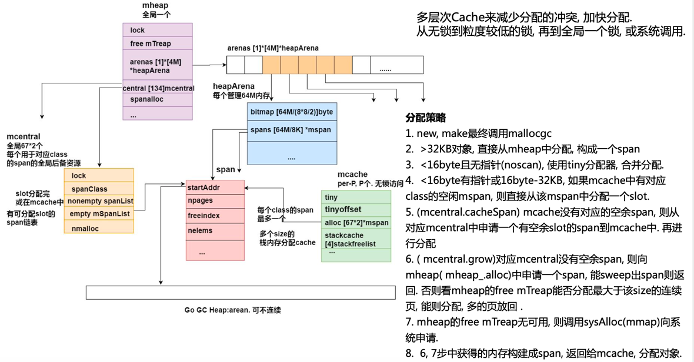

# golang内存管理

## 概述
在现代 CPU 上，除了内存分配的正确性以外，我们还要考虑分配过程的效率问题，应用执行期间小对象会不断地生成与销毁，如果每一次对象的分配与释放都需要与操作系统交互，那么成本是很高的。
这就需要我们在应用层设计好内存分配的多级缓存，尽量减少小对象高频创建与销毁时的锁竞争，这个问题在传统的 C/C++ 语言中已经有了解法，那就是 tcmalloc：

golang的内存分配机制源自Google的tcmalloc算法，英文全称thread caching malloc，从名字可以看出，是在原有基础上，针对多核多线程的内存管理进行优化而提出来的。


该算法的核心思想是内存的多级管理，进而降低锁的粒度；将内存按需划成大小不一的块，减少内存的碎片化。
为每个P，也就是go协程调度模型了里面的逻辑处理器维护一个mcache结构体的独立内存池，只有当该内存池不足时，才会向全局mcentral和mheap结构体管理的内存池申请。
为每一个P维持一个私有的本地内存池，从而不用加锁，加快了内存分配速度。只有在本地P的内存池被消耗完，或者申请的内存太大时，才会访问全局的内存池，大大减小了多线程下对全局内存池访问带来的竞争系统损耗。

## 内存分配流程


变量是在栈上分配还是在堆上分配，是由逃逸分析的结果决定的。通常情况下，编译器是倾向于将变量分配到栈上的，因为它的开销小，最极端的就是"zero garbage"，
所有的变量都会在栈上分配，这样就不会存在内存碎片，垃圾回收之类的东西。


大体上的分配流程：

1. large: >32KB 的对象，直接从mheap上分配
```go

package main

func main() {
    var m = make([]int, 10240)
    println(m[0])
}
```

2. tiny: < 16B && has no pointer(noscan),使用 mcache 的tiny分配器分配；

3. small: [16B,32KB] 的对象，首先计算对象的规格大小，然后使用mcache中相应规格大小的mspan分配；

    1. 如果mcache没有相应规格大小的mspan，则向mcentral申请

    2. 如果mcentral没有相应规格大小的mspan，则向mheap申请

    3. 如果mheap中也没有合适大小的mspan， 则调用sysAlloc(mmap)向系 统申请


## 内存管理的几个概念

* page 内存页，一块 8K 大小的内存空间。Go 与操作系统之间的内存申请和释放，都是以 page 为单位的。
* mheap 堆分配器，以8192byte页进行管理
* mspan 由mheap管理的页面,mspan结构体是go内存管理的基本单元
* mcentral 所有给定大小类的mspan集合，Central组件其实也是一个缓存，但它缓存的不是小对象内存块，而是一组一组的内存page(一个page占4k大小)
* mcache 运行时分配池，每个线程都有自己的局部内存缓存mCache，实现goroutine高并发的重要因素(分配小对象可直接从mCache中分配，不用加锁)
* areas: Go 向操作系统申请内存时的最小单位，每个 arena 为 64MB 大小，在内存中可以部分连续，但整体是个稀疏结构。
* bitmap 区域是标识arena中那些地址保存了对象，及对象中是否包含了指针，其中1个byte（8bit）对应arena中4个指针大小的内存（即：2bit对应1个指针大小），对应大小16G；
* span 是页管理单元，是内存分配的基本单位，其中一个指针对应arena中1个虚拟地址页大小（8kb），对应大小512M
* sizeclass 空间规格，每个 span 都带有一个 sizeclass ，标记着该 span 中的 page 应该如何使用。使用上面的比喻，就是 sizeclass 标志着 span 是一个什么样的队伍。
* object  对象，用来存储一个变量数据内存空间，一个 span 在初始化时，会被切割成一堆等大的 object 。
    假设 object 的大小是 16B ， span 大小是 8K ，那么就会把 span 中的 page 就会被初始化 8K / 16B = 512 个 object 。
    所谓内存分配，就是分配一个 object 出去

单个 arena 会被切分成以 8KB 为单位的 page，由 page allocator 管理，一个或多个 page 可以组成一个 mspan，每个 mspan 可以按照 sizeclass 再划分成多个 element。
同样大小的 mspan 又分为 scan 和 noscan 两种，分别对应内部有指针的 object 和内部没有指针的 object。

## 分配器


### 1. tiny 类型的分配


我们可以将内存分配的路径与 CPU 的多级缓存作类比，这里 mcache 内部的 tiny 可以类比为 L1 cache，而 alloc 数组中的元素可以类比为 L2 cache，全局的 mheap.mcentral 结构为 L3 cache，mheap.arenas 是 L4，L4 是以页为单位将内存向下派发的，由 pageAlloc 来管理 arena 中的空闲内存。
如果 L4 也没法满足我们的内存分配需求，那我们就需要向操作系统去要内存了。


### 2. small 类型

small 类型的内存没有本地的 mcache.tiny 缓存，其余的与 tiny 分配路径完全一致：

### 3. large 类型
large 内存分配稍微特殊一些，没有前面这两类这样复杂的缓存流程，而是直接从 mheap.arenas 中要内存，直接走 pageAlloc 页分配器。


## 内存架构
以64位的Linux系统为例，是一个块块64MB大小的块。golang内存的三级架构如下图所示


1. arena区域就是我们所谓的堆区，Go动态分配的内存都是在这个区域，它把内存分割成 8KB大小的页，一些页组合起来称为 mspan

2. bitmap区域标识 arena区域哪些地址保存了对象，并用 4bit标志位表示对象是否包含指针、 GC标记信息。
   bitmap中一个 byte大小的内存对应 arena区域中4个指针大小（指针大小为 8B ）的内存，所以 bitmap区域的大小是 512GB/(4*8B)=16GB。
   

3. spans区域存放 mspan（也就是一些 arena分割的页组合起来的内存管理基本单元，后文会再讲）的指针，每个指针对应一页，
   所以 spans区域的大小就是 512GB/8KB*8B=512MB.创建 mspan的时候，按页填充对应的 spans区域，在回收 object时，根据地址很容易就能找到它所属的 mspan


### 1.10及以前


arena的大小为512G, 为了方便管理把arena区域划分成一个个的page, 每个page 8KB, 一共有512GB/8KB个页.
spans区域存放指向span的指针, 表示arean中对应的Page所属的span, 所以span区域的大小为(512GB/8KB)* 指针大小 8byte = 512M.
bitmap主要用于GC, 用两个bit表示 arena中一个字的可用状态, 所以是 (512G/8个字节一个字)*2/8个bit每个字节=16G

### 1.11及以后:


改成了两阶稀疏索引的方式. 内存可以超过512G, 也可以允许不连续的内存.
mheap中的arenas字段是一个指针数组, 每个heapArena管理64M的内存.
bitmap和spans和上面的功能一致.

## 1. 内存管理单元
mspan：Go中内存管理的基本单元，是由一片连续的 8KB的页组成的大块内存。注意，这里的页和操作系统本身的页并不是一回事，它一般是操作系统页大小的几倍。
一句话概括： mspan是一个包含起始地址、 mspan规格、页的数量等内容的双端链表。


```go
type spanClass uint8

//结构
// path: go/src/runtime/mheap.go
type mspan struct{
	//链表后向指针，用于将span链接起来
	next *mspan
	//链表前向指针，用于将span链接起来
	prev *mspan
	// 起始地址，也即所管理页的地址,当前span在arena中的起始字节的地址
	startAddr uintptr
	// 管理的页数,当前span包含arena中多少页
	npages uintptr
	// 块个数，表示有多少个块可供分配.当前span，包含多少个对象。golang又对每一个span，按照所属class的不同，切分成大小不同的块，以减少内存碎片。
	nelems uintptr
	//分配位图，每一位代表一个块是否已分配.
	allocBits *gcBits
	// 已分配块的个数
	allocCount uint16
	// class表中的class ID，和Size Class相关
	spanclass spanClass
	// class表中的对象大小，也即块大小
	elemsize uintptr
}
```
从next,prev可以发现，这是一个双向链表。

每个 mspan按照它自身的属性 SizeClass的大小分割成若干个 object，每个 object可存储一个对象。并且会使用一个位图来标记其尚未使用的 object。
属性 SizeClass决定 object大小，而 mspan只会分配给和 object尺寸大小接近的对象，当然，对象的大小要小于 object大小
使用span机制来减少碎片. 每个span至少分配1个page(8KB), 划分成固定大小的slot, 用于分配一定大小范围的内存需求.
```go
// runtime/sizeclasses.go
// class  bytes/obj  bytes/span  objects  tail waste  max waste
//     1          8        8192     1024           0     87.50%
//     2         16        8192      512           0     43.75%
//     3         32        8192      256           0     46.88%
//     4         48        8192      170          32     31.52%
//     5         64        8192      128           0     23.44%
//     6         80        8192      102          32     19.07%
//     7         96        8192       85          32     15.95%
//     8        112        8192       73          16     13.56%
//     9        128        8192       64           0     11.72%
//    10        144        8192       56         128     11.82%
//    11        160        8192       51          32      9.73%
//    12        176        8192       46          96      9.59%
//    13        192        8192       42         128      9.25%
//    14        208        8192       39          80      8.12%
//    15        224        8192       36         128      8.15%
//    16        240        8192       34          32      6.62%
//    17        256        8192       32           0      5.86%
//    18        288        8192       28         128     12.16%
//    19        320        8192       25         192     11.80%
//    20        352        8192       23          96      9.88%
//    21        384        8192       21         128      9.51%
//    22        416        8192       19         288     10.71%
//    23        448        8192       18         128      8.37%
//    24        480        8192       17          32      6.82%
//    25        512        8192       16           0      6.05%
//    26        576        8192       14         128     12.33%
//    27        640        8192       12         512     15.48%
//    28        704        8192       11         448     13.93%
//    29        768        8192       10         512     13.94%
//    30        896        8192        9         128     15.52%
//    31       1024        8192        8           0     12.40%
//    32       1152        8192        7         128     12.41%
//    33       1280        8192        6         512     15.55%
//    34       1408       16384       11         896     14.00%
//    35       1536        8192        5         512     14.00%
//    36       1792       16384        9         256     15.57%
//    37       2048        8192        4           0     12.45%
//    38       2304       16384        7         256     12.46%
//    39       2688        8192        3         128     15.59%
//    40       3072       24576        8           0     12.47%
//    41       3200       16384        5         384      6.22%
//    42       3456       24576        7         384      8.83%
//    43       4096        8192        2           0     15.60%
//    44       4864       24576        5         256     16.65%
//    45       5376       16384        3         256     10.92%
//    46       6144       24576        4           0     12.48%
//    47       6528       32768        5         128      6.23%
//    48       6784       40960        6         256      4.36%
//    49       6912       49152        7         768      3.37%
//    50       8192        8192        1           0     15.61%
//    51       9472       57344        6         512     14.28%
//    52       9728       49152        5         512      3.64%
//    53      10240       40960        4           0      4.99%
//    54      10880       32768        3         128      6.24%
//    55      12288       24576        2           0     11.45%
//    56      13568       40960        3         256      9.99%
//    57      14336       57344        4           0      5.35%
//    58      16384       16384        1           0     12.49%
//    59      18432       73728        4           0     11.11%
//    60      19072       57344        3         128      3.57%
//    61      20480       40960        2           0      6.87%
//    62      21760       65536        3         256      6.25%
//    63      24576       24576        1           0     11.45%
//    64      27264       81920        3         128     10.00%
//    65      28672       57344        2           0      4.91%
//    66      32768       32768        1           0     12.50%
```
可以看到一共66中，实际一共67种。
class0表示单独分配一个 >32KB 对象的span, 有67个 size, 每个size两种, 用于分配有指针和无指针对象, 所以 有67*2=134个class.
- class：是class id， 对应了span结构体所属的class的种类，可以看到一共66中，实际一共67种。大于32K的内存 分配，会直接从mheap中分配，后面会介绍
- bytes/obj：每个对象占用的字节
- bytes/span：每个span的大小，也就是页数*8k（页大小
- objects：该类span所拥有的对象数，span所占字节数/对象所占字节
- waste bytes：该类span浪费的字节数，从以上分析可以看出，每一类span并不能刚好按该类对象大小，分配整数个对象，即做到每一字节物尽其用，这个值是：span所占字节数%对象所占字节数

以class 10 为例，span与管理的内存如下图所示：

表示当前span类别属于class10，大小只有1页，又切分56个大小为144字节的块，其中两个已分配。


## 2. 内存管理组件
内存分配由内存分配器完成。分配器由3种组件构成： mcache, mcentral, mheap
### 1. mcache


每个工作线程都会绑定一个mcache，本地缓存可用的 mspan资源，这样就可以直接给Goroutine分配，因为不存在多个Goroutine竞争的情况，所以不会消耗锁资源。
```go
type mcache struct{
	alloc [numSpanClasses]*mspan
}
numSpanClasses = _NumSizeClasses << 1

const _NumSizeClasses = 68 
```


### 2. mheap
mheap管理整个go程序的堆空间，Go程序使用一个 mheap的全局对象 _mheap来管理堆内存
```go
//path: /usr/local/go/src/runtime/mheap.go
type mheap struct {
    lock mutex
	pages     pageAlloc // 堆的页分配
	
    // spans: 指向mspans区域，用于映射mspan和page的关系
	allspans []*mspan // all spans out there
	
    // 指向bitmap首地址，bitmap是从高地址向低地址增长的
    bitmap uintptr
    
    // 指示arena区已使用地址位置
    arena_used  uintptr

	arenas [1 << arenaL1Bits]*[1 << arenaL2Bits]*heapArena
    curArena struct {
        base, end uintptr     // 指示arena区首地址,    指示arena区末地址
    }
    
    // mcentral结构单元
    central [67*2]struct {
        mcentral mcentral
        pad [sys.CacheLineSize-unsafe.Sizeof(mcentral{})%sys.CacheLineSize]byte
    }

    spanalloc             fixalloc // mspan分配器
    cachealloc            fixalloc // mache分配器
}
```

bitmap和arena_start指向了同一个地址，这是因为bitmap的地址是从高到低增长


### 3. mcentral
从mheap的结构体中，可以看到，mheap创建了一个包含164个mcentral对象的数组。也就是mheap管理着67*2个mcentral。


为所有 mcache提供切分好的 mspan资源。每个 central保存一种特定大小的全局 mspan列表，包括已分配出去的和未分配出去的。
每个 mcentral对应一种 mspan，而 mspan的种类导致它分割的 object大小不同。当工作线程的 mcache中没有合适（也就是特定大小的）的 mspan时就会从 mcentral获取

```go
// /usr/local/go/src/runtime/mcentral.go
type mcentral struct {
	spanclass spanClass

	
	partial [2]spanSet // list of spans with a free object
	full    [2]spanSet // list of spans with no free objects
}
```
```go
// A spanSet is a set of *mspans.
//
// spanSet is safe for concurrent push and pop operations.
type spanSet struct {

	spineLock mutex
	spine     unsafe.Pointer // *[N]*spanSetBlock, accessed atomically
	spineLen  uintptr        // Spine array length, accessed atomically
	spineCap  uintptr        // Spine array cap, accessed under lock
	
	index headTailIndex
}
```


## 内存管理器初始化
在golang程序初始化时，runtime中会初始化内存管理器，调用函数 mallocinit()


