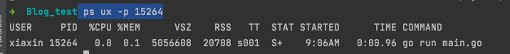

# Linux 的虚拟内存管理

1. 每个进程都有独立的虚拟地址空间，进程访问的虚拟地址并不是真正的物理地址；
2. 虚拟地址可通过每个进程上的页表(在每个进程的内核虚拟地址空间)与物理地址进行映射，获得真正物理地址；
3. 如果虚拟地址对应物理地址不在物理内存中，则产生缺页中断，真正分配物理地址，同时更新进程的页表；如果此时物理内存已耗尽，则根据内存替换算法淘汰部分页面至物理磁盘中。

## 物理和虚拟内存


笔记本电脑内存就是 8GB,其实指的是物理内存. 物理内存也称为主存，大多数计算机用的主存都是动态随机访问内存（DRAM）。只有内核才可以直接访问物理内存。

物理内存看作是一个槽/单元的数组，其中槽可以容纳 8 个位信息 1。每个内存槽都有一个地址。


虚拟内存可以使用基于 CPU 体系结构和操作系统的段或页表来实现。页表更常见。

Linux 内核给每个进程都提供了一个独立的虚拟地址空间，并且这个地址空间是连续的。这样，进程就可以很方便地访问内存，更确切地说是访问虚拟内存.

在分页虚拟内存中，我们将虚拟内存划分为块，称为页。页的大小可以根据硬件的不同而有所不同，但是页的大小通常是 4-64 KB，此外，通常还能够使用从 2MB 到 1GB 的巨大的页。
分块很有用，因为单独管理每个内存槽需要更多的内存，而且会降低计算机的性能。


为了实现分页虚拟内存，计算机通常有一个称为内存管理单元(MMU)的芯片，它位于 CPU 和内存之间。
MMU 在一个名为页表的表(它存储在内存中)中保存了从虚拟地址到物理地址的映射，其中每页包含一个页表项(PTE)。
MMU 还有一个物理缓存旁路转换缓冲(TLB Translation Lookaside Buffer)，用来存储最近从虚拟内存到物理内存的转换。

TLB 其实就是 MMU 中页表的高速缓存。由于进程的虚拟地址空间是独立的，而 TLB 的访问速度又比 MMU 快得多，
所以，通过减少进程的上下文切换，减少 TLB 的刷新次数，就可以提高 TLB 缓存的使用率，进而提高 CPU 的内存访问性能。

因此，假设操作系统决定将一些虚拟内存页放入磁盘，程序会尝试访问它。此过程如下所示：

1. CPU 发出访问虚拟地址的命令，MMU 在其页面表中检查它并禁止访问，因为没有为该虚拟页面分配物理 RAM。
2. 然后 MMU 向 CPU 发送页错误。
3. 然后，操作系统通过查找 RAM 的备用内存块（称为帧）并设置新的 PTE 来映射它来处理页错误。
4. 如果没有 RAM 是空闲的，它可以使用一些替换算法选择现有页面，并将其保存到磁盘（此过程称为分页）。
5. 对于一些内存管理单元，还可能出现页表入口不足的情况，在这种情况下，操作系统必须为新的映射释放一个表入口。

## Linux 虚拟地址空间分布:用户空间与内核空间


现在操作系统都是采用虚拟存储器，那么对 32 位操作系统而言，它的寻址空间（虚拟存储空间）为 4G（2 的 32 次方）。
操作系统的核心是内核，独立于普通的应用程序，可以访问受保护的内存空间，也有访问底层硬件设备的所有权限。
为了保证用户进程不能直接操作内核（kernel），保证内核的安全，操心系统将虚拟空间划分为两部分，一部分为内核空间，一部分为用户空间。

针对 linux 操作系统而言，将最高的 1G 字节（从虚拟地址 0xC0000000 到 0xFFFFFFFF），供内核使用，称为*内核空间*,包括内核代码和数据、与进程相关的数据结构（如页表、内核栈）等 ，
而将较低的 3G 字节（从虚拟地址 0x00000000 到 0xBFFFFFFF），供各个进程使用，称为*用户空间*.

- %rsp是栈顶，往低地址方向变化；
- brk/sbrk 函数控制堆顶_edata往高地址方向变化

Linux 使用虚拟地址空间，大大增加了进程的寻址空间，由高地址到低地址分别为

- Kernel space：用户代码不可见的内存区域，由内核管理(页表就存放在内核虚拟空间)；

- Stack：栈空间，是用户存放程序临时创建的局部变量，栈的增长方向是从高位地址到地位地址向下进行增长。在现代主流机器架构上（例如x86）中，栈都是向下生长的。
  然而，也有一些处理器（例如B5000）栈是向上生长的，还有一些架构（例如System Z）允许自定义栈的生长方向，甚至还有一些处理器（例如SPARC）是循环栈的处理方式.
  一般为 8M ，可通过 ulimit –s 查看.
  
- 文件映射区域: 如动态库、共享内存等映射物理空间的内存，一般是 mmap 函数所分配的虚拟地址空间

- Heap：堆空间，堆是用于存放进程运行中被动态分配的内存段，它的大小并不固定，可动态扩张或缩减；
  malloc/new 大部分都来源于此。其中堆顶的位置可通过函数 brk 和 sbrk 进行动态调整。

- BSS segment：BSS段，存放的是全局或者静态数据，但是存放的是全局/静态未初始化数据

- Data segment：数据段，通常是指用来存放程序中已初始化的全局变量的一块内存区域；

- Text segment：代码段，指用来存放程序执行代码的一块内存区域。这部分区域的大小在程序运行前就已经确定，并且内存区域属于只读。


### 64位系统结果怎样呢？ 64 位系统是否拥有 2^64 的地址空间吗？

事实上， 64 位系统的虚拟地址空间划分发生了改变：

地址空间大小不是2^32，也不是2^64，而一般是2^48。因为并不需要 2^64 这么大的寻址空间，过大空间只会导致资源的浪费。
64位Linux一般使用48位来表示虚拟地址空间，40位表示物理地址，这可通过 cat /proc/cpuinfo 来查看信息
```shell
[root@k8s-master01 ~]# cat /proc/cpuinfo
processor       : 0
vendor_id       : GenuineIntel
cpu family      : 6
model           : 94
model name      : Intel(R) Xeon(R) Gold 6133 CPU @ 2.50GHz
stepping        : 3
microcode       : 0x1
cpu MHz         : 2494.130
cache size      : 28160 KB
physical id     : 0
siblings        : 2
core id         : 0
cpu cores       : 2
apicid          : 0
initial apicid  : 0
fpu             : yes
fpu_exception   : yes
cpuid level     : 13
wp              : yes
flags           : fpu vme de pse tsc msr pae mce cx8 apic sep mtrr pge mca cmov pat pse36 clflush mmx fxsr sse sse2 ss ht syscall nx pdpe1gb rdtscp lm constant_tsc rep_good nopl eagerfpu pni pclmulqdq ssse3 fma cx16 pcid sse4_1 sse4_2 x2apic movbe popcnt tsc_deadline_timer aes xsave avx f16c rdrand hypervisor lahf_lm abm 3dnowprefetch invpcid_single fsgsbase bmi1 hle avx2 smep bmi2 erms invpcid rtm mpx rdseed adx smap clflushopt xsaveopt xsavec xgetbv1 arat
bogomips        : 4988.26
clflush size    : 64
cache_alignment : 64
address sizes   : 46 bits physical, 48 bits virtual
power management:

processor       : 1
vendor_id       : GenuineIntel
cpu family      : 6
model           : 94
model name      : Intel(R) Xeon(R) Gold 6133 CPU @ 2.50GHz
stepping        : 3
microcode       : 0x1
cpu MHz         : 2494.130
cache size      : 28160 KB
physical id     : 0
siblings        : 2
core id         : 1
cpu cores       : 2
apicid          : 1
initial apicid  : 1
fpu             : yes
fpu_exception   : yes
cpuid level     : 13
wp              : yes
flags           : fpu vme de pse tsc msr pae mce cx8 apic sep mtrr pge mca cmov pat pse36 clflush mmx fxsr sse sse2 ss ht syscall nx pdpe1gb rdtscp lm constant_tsc rep_good nopl eagerfpu pni pclmulqdq ssse3 fma cx16 pcid sse4_1 sse4_2 x2apic movbe popcnt tsc_deadline_timer aes xsave avx f16c rdrand hypervisor lahf_lm abm 3dnowprefetch invpcid_single fsgsbase bmi1 hle avx2 smep bmi2 erms invpcid rtm mpx rdseed adx smap clflushopt xsaveopt xsavec xgetbv1 arat
bogomips        : 4988.26
clflush size    : 64
cache_alignment : 64
address sizes   : 46 bits physical, 48 bits virtual
power management:
```
其中信息展示 address sizes : 46 bits physical, 48 bits virtual
   

## 进程地址空间

每个进程都有一个线性虚拟地址空间，地址从 0 到最大值。虚拟地址空间不需要是连续的，因此并非所有这些虚拟地址实际上都用于存储数据，并且它们不占用 RAM 或磁盘中的空间。
很酷的一点是，真实内存的同一帧可以支持属于多个进程的多个虚拟页面。通常就是这种情况，虚拟内存占用 GNU C 库代码（libc），如果使用 go build 进行编译，则默认包含该代码。
你可以通过添加 ldflags 参数来设置编译时不带 libc 的代码：
```go
go build -ldflags '-libgcc=none'
```

目标文件是直接在处理器上执行的程序的二进制表示。这些目标文件不仅包含机器代码，还包含有关应用程序的元数据，如操作系统体系结构，调试信息。
目标文件还携带应用程序数据，如全局变量或常量。通常，目标文件由以下段（section）组成，如：.text（可执行代码），.data（全局变量） 和 .rodata（全局常量） 等。

- text段包含程序指令、字面量和静态常量。
- data段是程序的工作存储器。它可以由 exec 预分配和预加载，进程可以扩展或收缩它。

Libc 手册解释是，程序可以使用 exec 系列函数和编程方式以两种主要方式进行分配。
exec  调用程序加载器来启动程序，从而为进程创建虚拟地址空间，将程序加载进内存并运行它。常用的编程方式有：

- 静态分配是在声明全局变量时发生的事情。每个全局变量定义一个固定大小的空间块。当你的程序启动时（exec 操作的一部分），该空间被分配一次，并且永远不会被释放。
- 自动分配 - 声明自动变量（例如函数参数或局部变量）时会发生自动分配。输入包含声明的复合语句时会分配自动变量的空间，并在退出该复合语句时释放。
- 动态分配 - 是一种程序确定它们在哪里运行，并存储某些信息的技术。当你需要的内存量或你需要多长时间时，你需要动态分配，这取决于程序运行之前未知的因素。

要动态分配内存，你有几个选择。其中一个选项是调用操作系统（syscall 或通过 libc）。操作系统提供各种功能，如：
- mmap/munmap - 分配/解除分配固定块内存页面。mmap 是在进程的虚拟地址空间中（堆和栈中间，称为“文件映射区域”的地方）找一块空闲的虚拟内存,
  我们可以将这段内存作为进程间通信的共享内存，也可以将文件直接映射到其中.munmap函数则用于释放有mmap创建的这段内存空间
```C
#inlcude<sys/mann.h>
void mmap(void *start, size_t length, int prot, int flags, int fd, off_t offset);
int munmap(void *start, size_t length);
/*
void *start 允许用户使用某一个人特定的地址为有这段内存的起始位置。如果他被设置为NULL，则系统自动分配一个地址。
size_t length 此参数制定了内存段的长度
int prot 此参数设置内存段访问权限：
		PROT_READ:可读
		PROT_WRITE:可写
		PROT_EXEC:可执行
		PROT_NONE:内存段不能被访问
int flags 此参数控制内存段内容被修改后程序的行为。它可以被设置为以下值的按位或（MAP_SHARED和MAP_PRIVATE是互斥的，不能同时指定）
		MAP_SHARED:在进程间共享这段内存。对该内存段的修改将反应到被映射的文件中。它提供了进程间共享内存的POSIX方法
		MAP_PRIVATE:内存段调用为进程私有，对该内存段的修改不会反应到被映射的文件中
		MAP_ANONYMOUS:这段内存不是从文件映射而来的，其内容被初始化为全0，这种情况下，mmap函数的最后两个参数将被忽略
		MAP_FIXED:内存段必须位于start参数指定的地址处。start必须是内存页面大小（4096）的整数倍
		MAP_HUGETLB:按照大内存页面来分配内存空间。大内存页面的大小可以通过/pro/meminfo文件来查看
int fd 此参数是被映射文件对应的文件描述符。他一般通过open系统调用获得。
off_t offset此参数设置从文件的何处开始映射（对于不需要读入整个文件的情况）

mmap函数成功时返回指向目标内存区域的指针，失败则返回MAO_FAILED((void*)-1)并设置errno

munmap函数成功返回0.失败返回-1并设置errno
*/

```  
  
- brk/sbrk - 更改/获取数据分段大小 ,brk 是将数据段（.data）的最高地址指针 _edata 往高地址推。
  > brk() sets the end of the data segment to the value specified by
  addr, when that value is reasonable, the system has enough memory,
  and the process does not exceed its maximum data size (see
  setrlimit(2)).

  > sbrk() increments the program's data space by increment bytes.
  Calling sbrk() with an increment of 0 can be used to find the current
  location of the program break.


- madvise - 建议内核，在从 addr 指定的地址开始，长度等于 len 参数值的范围内，该区域的用户虚拟内存应遵循特定的使用模式。
  内核使用这些信息优化与指定范围关联的资源的处理和维护过程。如果使用 madvise() 函数的程序明确了解其内存访问模式，则使用此函数可以提高系统性能。
- set_thread_area/get_thread_area - 适用于线程本地存储。


从操作系统角度来看，进程分配内存有两种方式，分别由两个系统调用完成：brk和mmap（不考虑共享内存）,mmap,brk这两种方式分配的都是虚拟内存，没有分配物理内存。
在第一次访问已分配的虚拟地址空间的时候，发生缺页中断，操作系统负责分配物理内存，然后建立虚拟内存和物理内存之间的映射关系（一般是硬件单元MMU管理）。


对比：
- brk() 方式的缓存，可以减少缺页异常的发生，提高内存访问效率。不过，由于这些内存没有归还系统，在内存工作繁忙时，频繁的内存分配和释放会造成内存碎片
- mmap() 方式分配的内存，会在释放时直接归还系统，所以每次 mmap 都会发生缺页异常。在内存工作繁忙时，频繁的内存分配会导致大量的缺页异常，使内核的管理负担增大。这也是 malloc 只对大块内存使用 mmap 的原因。

我认为 Go 语言的运行时只使用 mmap、 madvise、 munmap 与 sbrk，并且它们都是在操作系统下通过汇编或者 cgo 直接调用的，也就是说它不会调用 libc。
这些内存分配是低级别的，通常程序员不使用它们。

更常见的是使用 libc 的 malloc 系列函数，当你向系统申请 n 个字节的内存时，libc 将为你分配内存。 同时，你不需要这些内存的时候，要调用 free 来释放这些内存。


## 库函数 malloc/free

malloc() 是 C 标准库提供的内存分配函数，对应到系统调用上，有两种实现方式，即 brk() 和 mmap()。

在标准C库中，提供了malloc/free函数分配释放内存，这两个函数底层是由brk，mmap，munmap这些系统调用实现的。

1. 当开辟的空间小于 128K 时，调用 brk()函数，malloc 的底层实现是系统调用函数 brk()，将_edata往高地址推(只分配虚拟空间，不对应物理内存(因此没有初始化)，第一次读/写数据时，引起内核缺页中断，内核才分配对应的物理内存，然后虚拟地址空间建立映射关系)

  - 进程启动的时候，其（虚拟）内存空间的初始布局如图1所示.
  - 程调用A=malloc(30K)以后，内存空间如图2.malloc函数会调用brk系统调用，将_edata指针往高地址推30K，就完成虚拟内存分配。
  - 进程调用B=malloc(40K)以后，内存空间如图3。

2. 当开辟的空间大于 128K 时，mmap（）系统调用函数来在虚拟地址空间中（堆和栈中间，称为“文件映射区域”的地方）找一块空间来开辟。

   - 进程调用C=malloc(200K)以后，内存空间如图4: 默认情况下，malloc函数分配内存，如果请求内存大于128K（可由M_MMAP_THRESHOLD选项调节），那就不是去推_edata指针了，
     而是利用mmap系统调用，从堆和栈的中间分配一块虚拟内存.这样子做主要是因为brk分配的内存需要等到高地址内存释放以后才能释放（例如，在B释放之前，A是不可能释放的，这就是内存碎片产生的原因），而mmap分配的内存可以单独释放。
     
3. free

   - 进程调用free(B)以后，如图7所示:B对应的虚拟内存和物理内存都没有释放，因为只有一个_edata指针，如果往回推，那么D这块内存怎么办呢？
     当然，B这块内存，是可以重用的，如果这个时候再来一个40K的请求，那么malloc很可能就把B这块内存返回回去了。
   - 进程调用free(D)以后，如图8所示:B和D连接起来，变成一块140K的空闲内存。
   - 默认情况下： 当最高地址空间的空闲内存超过128K（可由M_TRIM_THRESHOLD选项调节）时，执行内存紧缩操作（trim）。在上一个步骤free的时候，发现最高地址空闲内存超过128K，于是内存紧缩，变成图9所示。


### 发成缺页中断后，执行了那些操作？
当一个进程发生缺页中断的时候，进程会陷入内核态，执行以下操作：
1. 检查要访问的虚拟地址是否合法
2. 查找/分配一个物理页
3. 填充物理页内容（读取磁盘，或者直接置0，或者啥也不干）
4. 建立映射关系（虚拟地址到物理地址

## 分配算法TCMalloc


由于 Go 语言不使用 malloc 来获取内存，而是直接操作系统申请（通过 mmap），它必须自己实现内存分配和释放（就像 malloc 一样）。
Go 语言的内存分配器最初基于 TCMalloc：Thread-Caching Malloc, 但是现在已经有了很大的不同。

Golang运行时的内存分配算法主要源自 Google 为 C 语言开发的 TCMalloc算法，全称 Thread-CachingMalloc,即线程缓存的malloc.
核心思想就是把内存分为多级管理，从而降低锁的粒度。

它将可用的堆内存采用二级分配的方式进行管理：每个线程都会自行维护一个独立的内存池，进行内存分配时优先从该内存池中分配，
当内存池不足时才会向全局内存池申请，以避免不同线程对全局内存池的频繁竞争

TCMalloc是gperftools的一部分，除TCMalloc外，gperftools还包括heap-checker、heap-profiler和cpu-profiler。


## Go程序查看对应内存
```go
func main() {
    http.HandleFunc("/bar", func(w http.ResponseWriter, r *http.Request) {
        fmt.Fprintf(w, "Hello, %q", html.EscapeString(r.URL.Path))
    })

    http.ListenAndServe(":8080", nil)
}
```
运行后查看


- PID :进程Id
- %CPU:（处理器）使用百分比
- TT: 控制终端的缩写名称
- STAT: 状态代码（O，R，S，T，Z）
- TIME: 积累CPU时间
- COMMAND: 正被执行的命令的完整名称
- 虚拟内存大小(VSZ)是进程可以访问的所有内存，包括换出的内存、分配但未使用的内存和共享库中的内存.
- 驻留集大小（RSS）是进程在实际内存中的内存页数乘以内存页大小，这里不包括换出的内存页（译者注：包含共享库占用的内存）。


## 查看进程

free 显示的是整个系统的内存使用情况。如果你想查看进程的内存使用情况，可以用 top 或者 ps 等工具
```shell
top - 13:19:29 up 21 days, 14:17,  1 user,  load average: 0.16, 0.11, 0.13
Tasks: 129 total,   1 running, 128 sleeping,   0 stopped,   0 zombie
%Cpu(s): 11.1 us,  1.8 sy,  0.0 ni, 86.6 id,  0.0 wa,  0.0 hi,  0.5 si,  0.0 st
MiB Mem :   3419.2 total,    120.1 free,   2113.2 used,   1185.8 buff/cache
MiB Swap:      0.0 total,      0.0 free,      0.0 used.    887.4 avail Mem 

    PID USER      PR  NI    VIRT    RES    SHR S  %CPU  %MEM     TIME+ COMMAND                                                                                                                                                  
2391077 ubuntu    20   0 3852540   1.0g 167528 S   0.3  30.6  91:13.29 java                                                                                                                                                     
 226817 systemd+  20   0 1778212 418412      0 S   0.3  12.0 171:41.33 mysqld                                                                                                                                                   
2391434 ubuntu    20   0 1765264 400600   9072 S  20.3  11.4 208:13.26 node                                                                                                                                                     
 805185 root      20   0 1060468 107336  18412 S   1.3   3.1 356:16.53 YDService 
```

- VIRT 是进程虚拟内存的大小，只要是进程申请过的内存，即便还没有真正分配物理内存，也会计算在内
- RES 是常驻内存的大小，也就是进程实际使用的物理内存大小，但不包括 Swap 和共享内存
- SHR 是共享内存的大小，比如与其他进程共同使用的共享内存、加载的动态链接库以及程序的代码段等


## 参考链接
1. [Linux内存分配小结--malloc、brk、mmap](https://blog.csdn.net/gfgdsg/article/details/42709943?spm=1001.2101.3001.6650.3&utm_medium=distribute.pc_relevant.none-task-blog-2%7Edefault%7ECTRLIST%7ERate-3.pc_relevant_default&depth_1-utm_source=distribute.pc_relevant.none-task-blog-2%7Edefault%7ECTRLIST%7ERate-3.pc_relevant_default&utm_relevant_index=6)
2. [TCMalloc 相关的信息可以看这里](http://goog-perftools.sourceforge.net/doc/tcmalloc.html)

