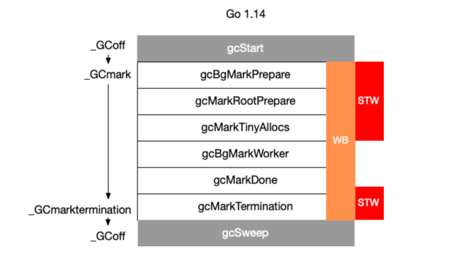
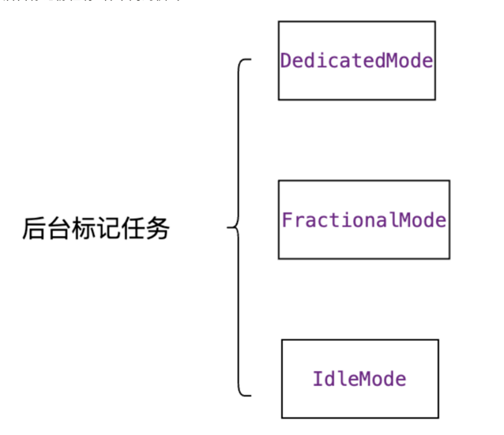

# GC 阶段
Go 的每一轮版本迭代几乎都会对 GC 做优化。经过多次优化后，较新的 GC 流程如下


## GC phase 垃圾收集阶段



GC 相关的代码在 runtime/mgc.go 文件下。通过注释介绍我们可以知道 GC 一共分为4个阶段：
```go
const (
	_GCoff             = iota // GC not running; sweeping in background, write barrier disabled
	_GCmark                   // GC marking roots and workbufs: allocate black, write barrier ENABLED
	_GCmarktermination        // GC mark termination: allocate black, P's help GC, write barrier ENABLED
)
```

1. sweep termination（标记准备阶段）

    - 会触发 STW ，所有的 P（处理器） 都会进入 safe-point（安全点）；

2. the mark phase（并发标记阶段）

    - 将 _GCoff GC 状态 改成 _GCmark，开启 Write Barrier （写入屏障）、mutator assists（协助线程），将根对象入队；
    - 恢复程序执行，mark workers（标记进程）和 mutator assists（协助线程）会开始并发标记内存中的对象。对于任何指针写入和新的指针值，都会被写屏障覆盖，而所有新创建的对象都会被直接标记成黑色；
    - GC 执行根节点的标记，这包括扫描所有的栈、全局对象以及不在堆中的运行时数据结构。扫描goroutine 栈绘导致 goroutine 停止，并对栈上找到的所有指针加置灰，然后继续执行 goroutine。
    - GC 在遍历灰色对象队列的时候，会将灰色对象变成黑色，并将该对象指向的对象置灰；
    - GC 会使用分布式终止算法（distributed termination algorithm）来检测何时不再有根标记作业或灰色对象，如果没有了 GC 会转为mark termination（标记终止）；

3. mark termination（标记终止）

    - STW，然后将 GC 阶段转为 _GCmarktermination,关闭 GC 工作线程以及 mutator assists（协助线程）；
    - 执行清理，如 flush mcache；

4. the sweep phase（清扫阶段）

    - 将 GC 状态转变至 _GCoff，初始化清理状态并关闭 Write Barrier（写入屏障）；
    - 恢复程序执行，从此开始新创建的对象都是白色的；
    - 后台并发清理所有的内存管理单元


问题：
1. 生产速度（申请内存） 大于消费速度（GC）？

解决：在标记开始的时候，收集器会默认抢占 25% 的 CPU 性能，剩下的75%会分配给程序执行。
但是一旦收集器认为来不及进行标记任务了，就会改变这个 25% 的性能分配。这个时候收集器会抢占程序额外的 CPU，这部分被抢占 goroutine 有个名字叫 Mark Assist。
而且因为抢占 CPU的目的主要是 GC 来不及标记新增的内存，那么抢占正在分配内存的 goroutine 效果会更加好，所以分配内存速度越快的 goroutine 就会被抢占越多的资源。


## 观察GC方式

1.
```go
 go build main.go
 GODEBUG=gctrace=1 ./main
```
GODEBUG 变量可以控制运行时内的调试变量，参数以逗号分隔，格式为：name=val。本文着重点在 GC 的观察上，主要涉及 gctrace 参数，
我们通过设置 gctrace=1 后就可以使得垃圾收集器向标准错误流发出 GC 运行信息

2.
```shell
go tool trace trace.out
```

3. debug.ReadGCStats

4. runtime.ReadMemStats

```shell
gc 18 @17.141s 0%: 0.21+4.8+0.007 ms clock, 1.7+0/0.45/4.8+0.062 ms cpu, 1->1->1 MB, 4 MB goal, 8 P (forced)
gc 19 @18.151s 0%: 0.063+1.1+0.003 ms clock, 0.51+0/0.12/1.1+0.030 ms cpu, 1->1->1 MB, 4 MB goal, 8 P (forced)
gc 20 @19.157s 0%: 0.12+3.5+0.008 ms clock, 0.98+0/3.6/0.094+0.064 ms cpu, 1->1->1 MB, 4 MB goal, 8 P (forced)
```

涉及术语
- mark：标记阶段。
- markTermination：标记结束阶段。
- mutator assist：辅助 GC，是指在 GC 过程中 mutator 线程会并发运行，而 mutator assist 机制会协助 GC 做一部分的工作。
- heap_live：在 Go 的内存管理中，span 是内存页的基本单元，每页大小为 8kb，同时 Go 会根据对象的大小不同而分配不同页数的 span，而 heap_live 就代表着所有 span 的总大小。
- dedicated / fractional / idle：在标记阶段会分为三种不同的 mark worker 模式，分别是 dedicated、fractional 和 idle，它们代表着不同的专注程度，
  其中 dedicated 模式最专注，是完整的 GC 回收行为，fractional 只会干部分的 GC 行为，idle 最轻松。
  这里你只需要了解它是不同专注程度的 mark worker 就好了，详细介绍我们可以等后续的文章。

```shell
gc # @#s #%: #+#+# ms clock, #+#/#/#+# ms cpu, #->#-># MB, # MB goal, # P
```

含义
- 1 gc#：GC 执行次数的编号，每次叠加。
- 2 @#s：自程序启动后到当前的具体秒数。
- 3 #%：自程序启动以来在GC中花费的时间百分比。
- 4 #+...+#：GC 的标记工作共使用的 CPU 时间占总 CPU 时间的百分比。
- 5 #->#-># MB：分别表示 GC 启动时, GC 结束时, GC 活动时的堆大小.
- 6 #MB goal：下一次触发 GC 的内存占用阈值。
- 7 #P：当前使用的处理器 P 的数量

案例代码
```go

const capacity = 50000

var d interface{}

func main() {
	//value值方式
	//d = Value()

	// value指针方式
	d = pointer()
	for i := 0; i < 20; i++ {
		runtime.GC()
		time.Sleep(time.Second)
	}

}

func Value() interface{} {
	m := make(map[int]int, capacity)
	for i := 0; i < capacity; i++ {
		m[i] = i
	}
	return m
}

func pointer() interface{} {
	m := make(map[int]*int, capacity)
	for i := 0; i < capacity; i++ {
		v := i
		m[i] = &v
	}
	return m
}
```
执行结果分析
```shell
gc 7 @0.140s 1%: 0.031+2.0+0.042 ms clock, 0.12+0.43/1.8/0.049+0.17 ms cpu, 4->4->1 MB, 5 MB goal, 4 P
```


- gc 7：第 7 次 GC。
- @0.140s：当前是程序启动后的 0.140s。
- 1%：程序启动后到现在共花费 1% 的时间在 GC 上。
- 0.031+2.0+0.042 ms clock：
  0.031：表示单个 P 在 mark 阶段的 STW 时间。
  2.0：表示所有 P 的 mark concurrent（并发标记）所使用的时间。
  0.042：表示单个 P 的 markTermination 阶段的 STW 时间。

- 0.12+0.43/1.8/0.049+0.17 ms cpu：
  0.12：表示整个进程在 mark 阶段 STW 停顿的时间。
  0.43/1.8/0.049：0.43 表示 mutator assist 占用的时间，1.8 表示 dedicated + fractional 占用的时间，0.049 表示 idle 占用的时间。
  0.17ms：0.17 表示整个进程在 markTermination 阶段 STW 时间。

- 4->4->1 MB：
  4：表示开始 mark 阶段前的 heap_live 大小。
  4：表示开始 markTermination 阶段前的 heap_live 大小。
  1：表示被标记对象的大小。
- 5 MB goal：表示下一次触发 GC 回收的阈值是 5 MB。
- 4 P：本次 GC 一共涉及多少个 P。

- wall clock 是指开始执行到完成所经历的实际时间，包括其他程序和本程序所消耗的时间；cpu time 是指特定程序使用 CPU 的时间；他们存在以下关系：

    - wall clock < cpu time: 充分利用多核

    - wall clock ≈ cpu time: 未并行执行

    - wall clock > cpu time: 多核优势不明显


- DedicatedMode代表处理器专门负责标记对象，不会被调度器抢占；
- FractionalMode代表协助后台标记，其在整个标记阶段只会花费一定部分时间执行，
- IdleMode 为当处理器没有查找到可以执行的 协程时，执行垃圾收集的标记任务直到被抢占
