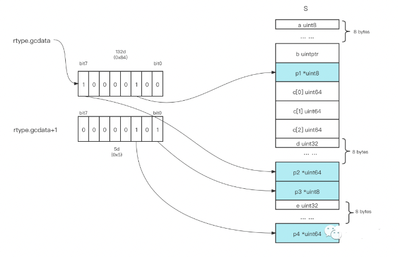

# 检测内存对象中的指针


## 运行时类型信息（rtype)


Go是静态语言，每个变量都有自己的归属的类型，当变量被在堆上分配时，堆上的内存对象也就有了自己归属的类型。Go编译器在编译阶段就为Go应用中的每种类型建立了对应的类型信息，这些信息体现在runtime._rtype结构体中，Go reflect包的rtype结构体等价于runtime._rtype：

```go
// $GOROOT/src/reflect/type.go

// rtype is the common implementation of most values.
// It is embedded in other struct types.
//
// rtype must be kept in sync with ../runtime/type.go:/^type._type.
type rtype struct {
    size       uintptr
    ptrdata    uintptr // number of bytes in the type that can contain pointers
    hash       uint32  // hash of type; avoids computation in hash tables
    tflag      tflag   // extra type information flags
    align      uint8   // alignment of variable with this type
    fieldAlign uint8   // alignment of struct field with this type
    kind       uint8   // enumeration for C
    // function for comparing objects of this type
    // (ptr to object A, ptr to object B) -> ==?
    equal     func(unsafe.Pointer, unsafe.Pointer) bool
    gcdata    *byte   // garbage collection data
    str       nameOff // string form
    ptrToThis typeOff // type for pointer to this type, may be zero
}
```

在这个结构体类型中的gcdata字段是为GC服务的，我们看看它究竟是什么！怎么看呢？由于reflect.rtype类型是非导出类型，我们需要对本地的Go语言源码做一些hack，我在reflect包的type.go文件中rtype结构体的定义之前添加一行代码：

```go
// /Users/python/go/go1.18/src/reflect/type.go
type Rtype = rtype
```


改了本地Go标准库源码后，Go编译器就会使用最新源码来编译我们的Go示例程序么？Go 1.18之前的版本都不会

```go

package main

import (
 "fmt"
 "reflect"
 "unsafe"
)

type tflag uint8
type nameOff int32 // offset to a name
type typeOff int32 // offset to an *rtype

type rtype struct {
 size       uintptr
 ptrdata    uintptr // number of bytes in the type that can contain pointers
 hash       uint32  // hash of type; avoids computation in hash tables
 tflag      tflag   // extra type information flags
 align      uint8   // alignment of variable with this type
 fieldAlign uint8   // alignment of struct field with this type
 kind       uint8   // enumeration for C
 // function for comparing objects of this type
 // (ptr to object A, ptr to object B) -> ==?
 equal     func(unsafe.Pointer, unsafe.Pointer) bool
 gcdata    *byte   // garbage collection data
 str       nameOff // string form
 ptrToThis typeOff // type for pointer to this type, may be zero
}

func bar() []*int {
 t := make([]*int, 8)
 return t
}

func main() {
 t := bar()
 v := reflect.TypeOf(t)

 rtyp, ok := v.(*reflect.Rtype)
 if !ok {
  println("error")
  return
 }

 r := (*rtype)(unsafe.Pointer(rtyp))
 fmt.Printf("%#v\n", *r)
 fmt.Printf("*gcdata = %d\n", *(r.gcdata))
}
```
我们看到gcdata指向的一个字节的内存的值为1(二进制为0b00000001)。

gcdata所指的这个字节每 1 bit 上的值代表一个8字节的内存块是否包含指针。

一个字节就可以标识在一个64字节的内存块中，每个8字节的内存单元是否包含指针.

如果类型长度超过64字节，那么用于表示指针地图的gcdata指向的有效字节个数也不止1个字节

切片类型在runtime层表示为下面结构：


多个字节才能表示的结构体
```go
type S struct {  // 起始地址
    a  uint8     // 0
    b  uintptr   // 8
    p1 *uint8    // 16
    c  [3]uint64 // 24
    d  uint32    // 48
    p2 *uint64   // 56
    p3 *uint8    // 64
	// 超过一个字节
	
    e  uint32    // 72
    p4 *uint64   // 80
}

func foo() *S {
    t := new(S)
    return t
}

func main() {
    t := foo()
    println(unsafe.Sizeof(*t)) // 88
    typ := reflect.TypeOf(t)
    rtyp, ok := typ.Elem().(*reflect.Rtype)

    if !ok {
        println("error")
        return
    }
    fmt.Printf("%#v\n", *rtyp)

    r := (*rtype)(unsafe.Pointer(rtyp))
    fmt.Printf("%#v\n", *r)
    fmt.Printf("%d\n", *(r.gcdata))
    gcdata1 := (*byte)(unsafe.Pointer(uintptr(unsafe.Pointer(r.gcdata)) + 1))
    fmt.Printf("%d\n", *gcdata1)
}
```



## 参考资料 

1. [Go Gc如何检测内存对象中的指针](https://mp.weixin.qq.com/s/uVhRqQh0gwzUeP93UXJ5wA)