<!-- START doctoc generated TOC please keep comment here to allow auto update -->
<!-- DON'T EDIT THIS SECTION, INSTEAD RE-RUN doctoc TO UPDATE -->
**Table of Contents**  *generated with [DocToc](https://github.com/thlorenz/doctoc)*

- [GC 垃圾回收](#gc-%E5%9E%83%E5%9C%BE%E5%9B%9E%E6%94%B6)
  - [基本概念](#%E5%9F%BA%E6%9C%AC%E6%A6%82%E5%BF%B5)
    - [根对象](#%E6%A0%B9%E5%AF%B9%E8%B1%A1)
    - [垃圾](#%E5%9E%83%E5%9C%BE)
    - [安全点Safe Point](#%E5%AE%89%E5%85%A8%E7%82%B9safe-point)
    - [安全区域](#%E5%AE%89%E5%85%A8%E5%8C%BA%E5%9F%9F)
  - [GC实现方式](#gc%E5%AE%9E%E7%8E%B0%E6%96%B9%E5%BC%8F)
    - [1. 追踪式 GC(可达性分析)](#1-%E8%BF%BD%E8%B8%AA%E5%BC%8F-gc%E5%8F%AF%E8%BE%BE%E6%80%A7%E5%88%86%E6%9E%90)
    - [2. 引用计数式 GC](#2-%E5%BC%95%E7%94%A8%E8%AE%A1%E6%95%B0%E5%BC%8F-gc)
      - [缺点](#%E7%BC%BA%E7%82%B9)
  - [如何清理](#%E5%A6%82%E4%BD%95%E6%B8%85%E7%90%86)
    - [1. 标记清除](#1-%E6%A0%87%E8%AE%B0%E6%B8%85%E9%99%A4)
      - [优化方向](#%E4%BC%98%E5%8C%96%E6%96%B9%E5%90%91)
    - [2. 标记复制](#2-%E6%A0%87%E8%AE%B0%E5%A4%8D%E5%88%B6)
    - [3. 标记压缩算法](#3-%E6%A0%87%E8%AE%B0%E5%8E%8B%E7%BC%A9%E7%AE%97%E6%B3%95)
  - [GC优化方向](#gc%E4%BC%98%E5%8C%96%E6%96%B9%E5%90%91)
    - [增量收集器](#%E5%A2%9E%E9%87%8F%E6%94%B6%E9%9B%86%E5%99%A8)
    - [并发收集器](#%E5%B9%B6%E5%8F%91%E6%94%B6%E9%9B%86%E5%99%A8)
  - [Go 的 GC](#go-%E7%9A%84-gc)
    - [原因](#%E5%8E%9F%E5%9B%A0)
    - [三色标记法的流程如下](#%E4%B8%89%E8%89%B2%E6%A0%87%E8%AE%B0%E6%B3%95%E7%9A%84%E6%B5%81%E7%A8%8B%E5%A6%82%E4%B8%8B)
    - [GC 时为什么要暂停用户线程？](#gc-%E6%97%B6%E4%B8%BA%E4%BB%80%E4%B9%88%E8%A6%81%E6%9A%82%E5%81%9C%E7%94%A8%E6%88%B7%E7%BA%BF%E7%A8%8B)
      - [可能存在的问题](#%E5%8F%AF%E8%83%BD%E5%AD%98%E5%9C%A8%E7%9A%84%E9%97%AE%E9%A2%98)
    - [如何解决上述**漏标**问题](#%E5%A6%82%E4%BD%95%E8%A7%A3%E5%86%B3%E4%B8%8A%E8%BF%B0%E6%BC%8F%E6%A0%87%E9%97%AE%E9%A2%98)
      - [内存屏障](#%E5%86%85%E5%AD%98%E5%B1%8F%E9%9A%9C)
      - [写屏障](#%E5%86%99%E5%B1%8F%E9%9A%9C)
        - [Dijkstra 插入屏障--满足强三色：指针修改时，指向的新对象要标灰：](#dijkstra-%E6%8F%92%E5%85%A5%E5%B1%8F%E9%9A%9C--%E6%BB%A1%E8%B6%B3%E5%BC%BA%E4%B8%89%E8%89%B2%E6%8C%87%E9%92%88%E4%BF%AE%E6%94%B9%E6%97%B6%E6%8C%87%E5%90%91%E7%9A%84%E6%96%B0%E5%AF%B9%E8%B1%A1%E8%A6%81%E6%A0%87%E7%81%B0)
        - [Yuasa 删除写屏障--满足弱三色：指针修改时，修改前指向的对象要标灰](#yuasa-%E5%88%A0%E9%99%A4%E5%86%99%E5%B1%8F%E9%9A%9C--%E6%BB%A1%E8%B6%B3%E5%BC%B1%E4%B8%89%E8%89%B2%E6%8C%87%E9%92%88%E4%BF%AE%E6%94%B9%E6%97%B6%E4%BF%AE%E6%94%B9%E5%89%8D%E6%8C%87%E5%90%91%E7%9A%84%E5%AF%B9%E8%B1%A1%E8%A6%81%E6%A0%87%E7%81%B0)
        - [Hybrid write barrier 混合写屏障](#hybrid-write-barrier-%E6%B7%B7%E5%90%88%E5%86%99%E5%B1%8F%E9%9A%9C)
  - [GC 触发条件](#gc-%E8%A7%A6%E5%8F%91%E6%9D%A1%E4%BB%B6)
    - [堆内存大小触发 GC 的情况](#%E5%A0%86%E5%86%85%E5%AD%98%E5%A4%A7%E5%B0%8F%E8%A7%A6%E5%8F%91-gc-%E7%9A%84%E6%83%85%E5%86%B5)
  - [参考资料](#%E5%8F%82%E8%80%83%E8%B5%84%E6%96%99)

<!-- END doctoc generated TOC please keep comment here to allow auto update -->

# GC 垃圾回收
GC，全称 GarbageCollection，即垃圾回收，是一种自动内存管理的机制

当程序向操作系统申请的内存不再需要时，垃圾回收主动将其回收并供其他代码进行内存申请时候复用，或者将其归还给操作系统，
这种针对内存级别资源的自动回收过程，即为垃圾回收。而负责垃圾回收的程序组件，即为垃圾回收器.

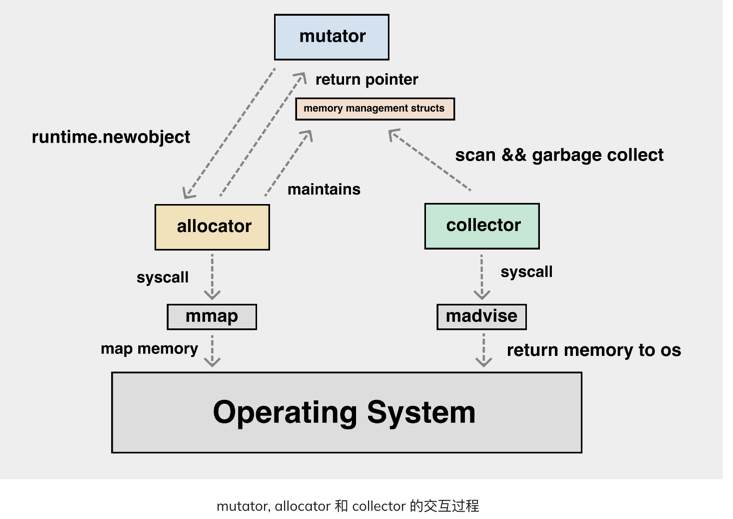

当讨论内存管理问题时，我们主要会讲三个参与者，mutator，allocator 和 garbage collector

- 赋值器（Mutator）：这一名称本质上是在指代用户态的代码。因为对垃圾回收器而言，用户态的代码仅仅只是在修改对象之间的引用关系，也就是在对象图（对象之间引用关系的一个有向图）上进行操作。
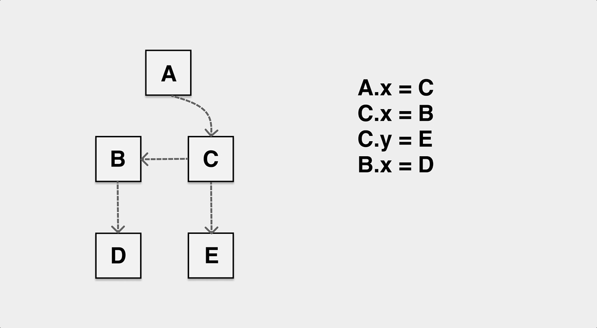

- 回收器（Collector）：负责执行垃圾回收的代码.需要扫描内存中存活的堆对象，扫描完成后，未被扫描到的对象就是无法访问的堆上垃圾，需要将其占用内存回收掉。

- 内存分配器(allocator) :应用需要内存的时候都要向 allocator 申请。allocator 要维护好内存分配的数据结构，在多线程场景下工作的内存分配器还需要考虑高并发场景下锁的影响，并针对性地进行设计以降低锁冲突

## 基本概念

> Object—An object is a dynamically allocated piece of memory that contains one or more Go values.

> Pointer—A memory address that references any value within an object. This naturally includes Go values of the form *T, but also includes parts of built-in Go values. Strings, slices, channels, maps, and interface values all contain memory addresses that the GC must trace.

### 根对象


根对象在垃圾回收的术语中又叫做根集合，它是垃圾回收器在标记过程时最先检查的对象，包括
    
1. 全局变量：程序在编译期就能确定的那些存在于程序整个生命周期的变量。

2. 执行栈：每个 goroutine 都包含自己的执行栈，这些执行栈上包含栈上的变量及指向分配的堆内存区块的指针。

3. 寄存器：寄存器的值可能表示一个指针，参与计算的这些指针可能指向某些赋值器分配的堆内存区块。


GC 扫描的起点是根对象，忽略掉那些不重要的（finalizer 相关的先省略），常见的根对象可以参见下图：
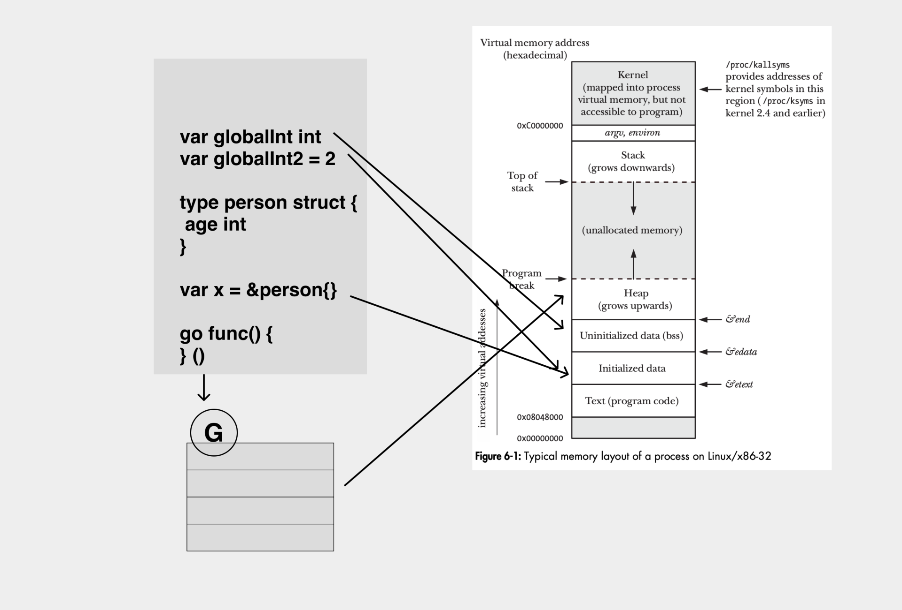


所以在 Go 语言中，从根开始扫描的含义是从 .bss 段，.data 段以及 goroutine 的栈开始扫描，最终遍历整个堆上的对象树。


### 垃圾

分类，主要可以分为为语义垃圾和语法垃圾两类，但并不是所有垃圾都可以被垃圾回收器回收。

1. 语义垃圾（semantic garbage），有些场景也被称为内存泄露，指的是从语法上可达（可以通过局部、全局变量被引用）的对象，但从语义上来讲他们是垃圾，垃圾回收器对此无能为力
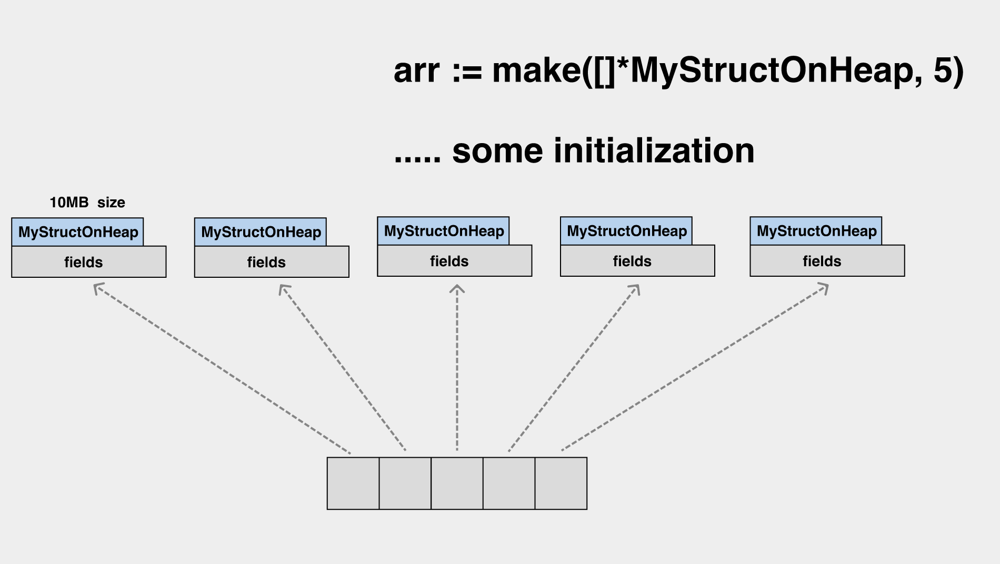
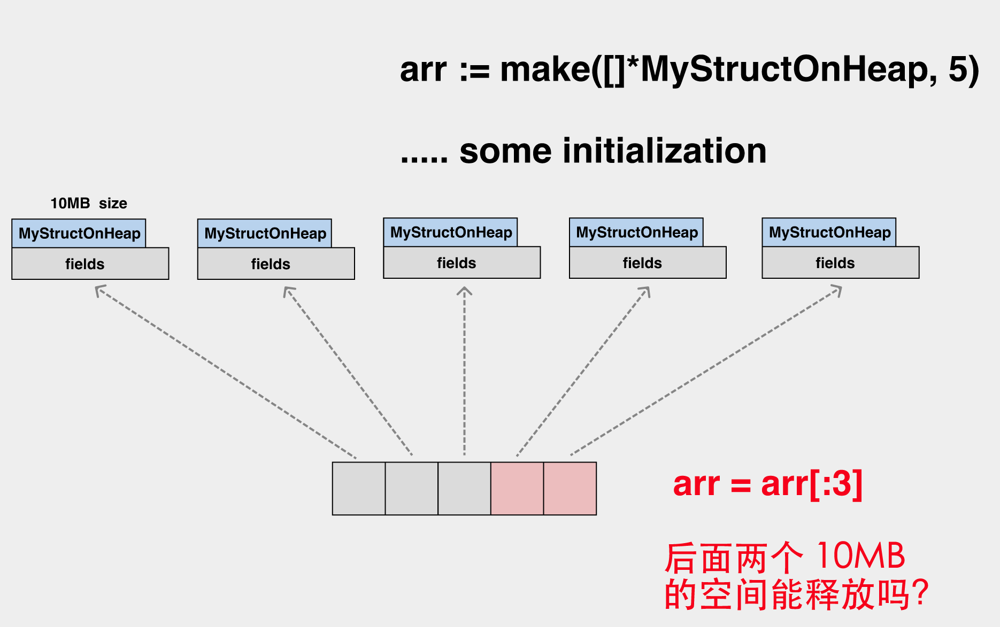
> 我们初始化了一个 slice，元素均为指针，每个指针都指向了堆上 10MB 大小的一个对象。
> 当这个 slice 缩容时，底层数组的后两个元素已经无法再访问了，但它关联的堆上内存依然是无法释放的

2. 语法垃圾（syntactic garbage），讲的是那些从语法上无法到达的对象，这些才是垃圾收集器主要的收集目标
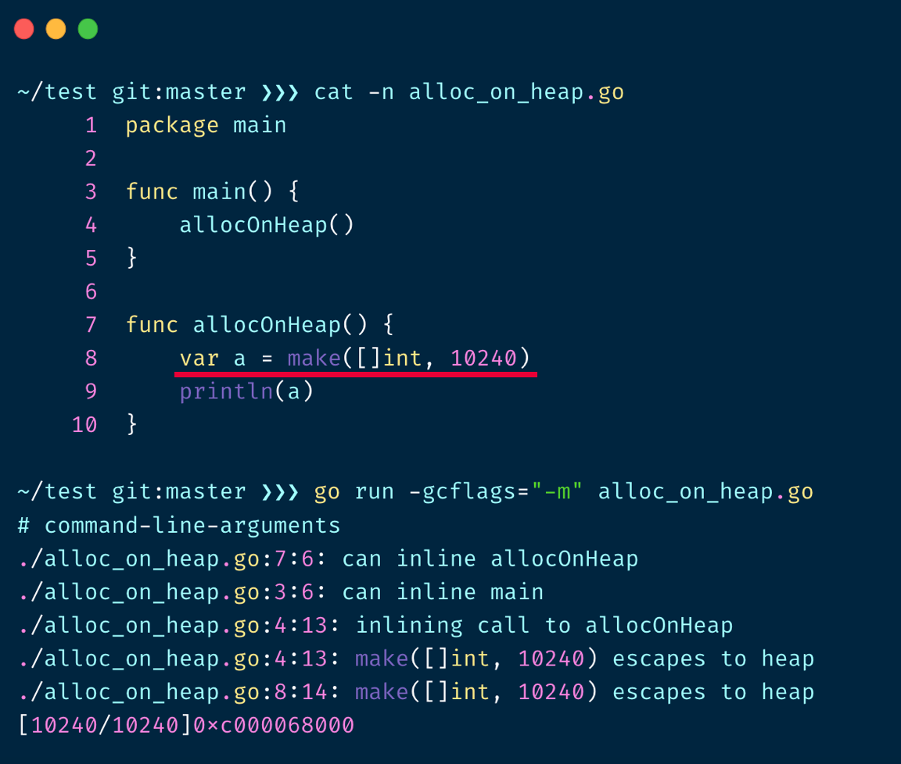
> 在 allocOnHeap 返回后，堆上的 a 无法访问，便成为了语法垃圾。

### 安全点Safe Point
safePoint 安全点顾名思义是指一些特定的位置，当线程运行到这些位置时，线程的一些状态可以被确定(the thread’s representation of it’s Java machine state is well described)，比如记录映射表OopMap的状态，从而确定GC Root的信息，使JVM可以安全的进行一些操作，比如开始GC


### 安全区域
指在一段代码片段之中，引用关系不会发生变化。这个区域中的任意地方开始GC都是安全的、我们也可以把安全区域看做是被扩展了的安全点。

## GC实现方式

所有的 GC 算法其存在形式可以归结为追踪（Tracing）和引用计数（Reference Counting）这两种形式的混合运用.

### 1. 追踪式 GC(可达性分析)
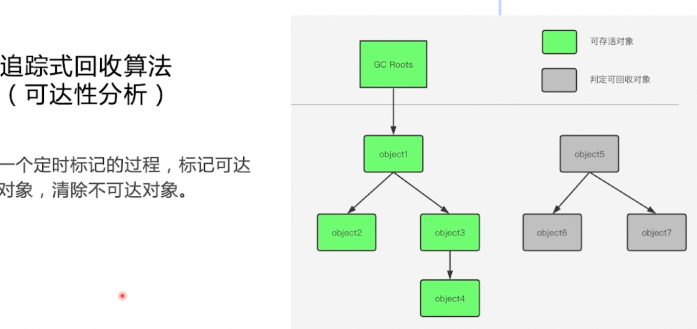

从根对象出发，根据对象之间的引用信息，一步步推进直到扫描完毕整个堆并确定需要保留的对象，从而回收所有可回收的对象。
Go、 Java、V8 对 JavaScript 的实现等均为追踪式 GC。

### 2. 引用计数式 GC


每个对象自身包含一个被引用的计数器，当计数器归零时自动得到回收。因为此方法缺陷较多，在追求高性能时通常不被应用。Python、Objective-C 等均为引用计数式 GC。

#### 缺点
- 循环引用，内存泄漏

Python如何解决循环这个问题？

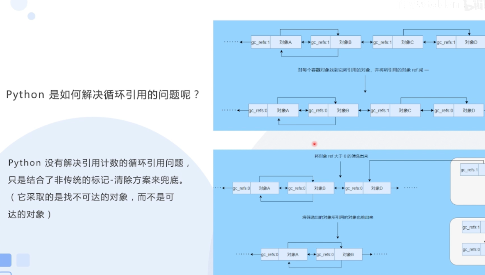
1. python并没有解决这问题，只是有个双向链表去进行处理，将引用的对象ref减1，然后进行对比识别出来。


## 如何清理
 

- 标记清除
- 标记复制
- 标记压缩


### 1. 标记清除
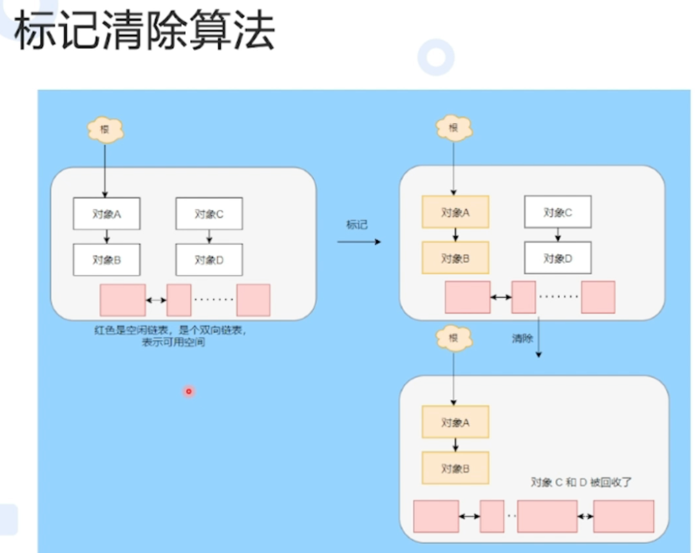   
将不可达对象放回双向链表 

#### 优化方向

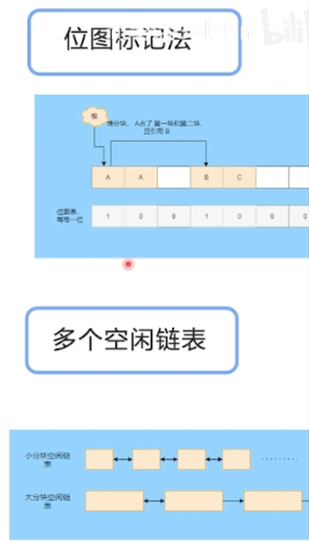
- 给每个对象增加个属性标记，但是占用空间大，用**位图标记法**优化。
- 回收后有碎片，使用多个**空闲链表**进行减少碎片分布


### 2. 标记复制
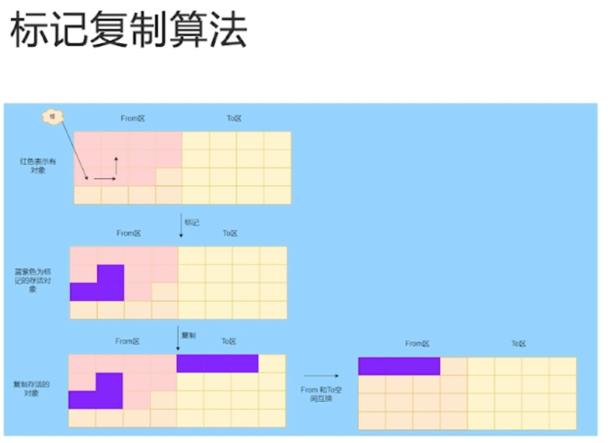 
从A区可用对象复制到B区，分配对象在B区，清理完A区，再拷贝回A区。

很明显占用空间大  

### 3. 标记压缩算法
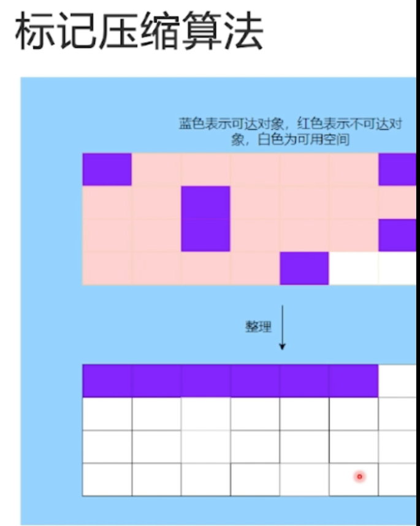 

可用对象在一端，可用空间在一端。

很明显整理的频率得高。


## GC优化方向
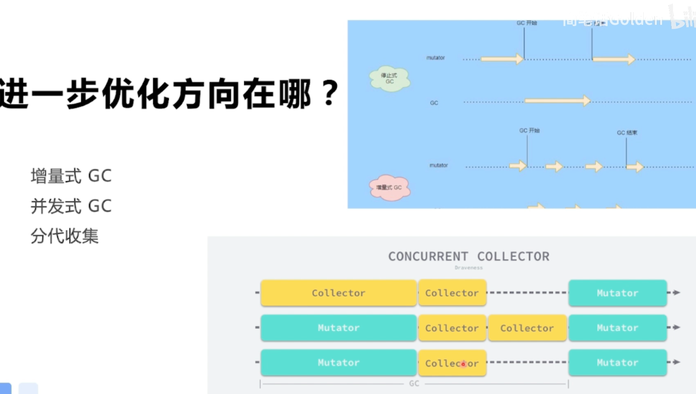
- 增量式GC: 允许 collector 分多个小批次执行，每次造成的 mutator 停顿都很小，达到近似实时的效果
- 并发式GC : 利用CPU多核
- 分代GC: JAVA的JVM

### 增量收集器 
增量式（Incremental）的垃圾收集是减少程序最长暂停时间的一种方案，它可以将原本时间较长的暂停时间切分成多个更小的 GC 时间片，虽然从垃圾收集开始到结束的时间更长了，但是这也减少了应用程序暂停的最大时间：

### 并发收集器
并发（Concurrent）的垃圾收集不仅能够减少程序的最长暂停时间，还能减少整个垃圾收集阶段的时间，通过开启读写屏障、利用多核优势与用户程序并行执行，并发垃圾收集器确实能够减少垃圾收集对应用程序的影响

## Go 的 GC
> One alternative technique you may be familiar with is to actually move the objects to a new part of memory and leave behind a forwarding pointer that is later used to update all the application's pointers. We call a GC that moves objects in this way a moving GC; Go has a non-moving GC
 

Go 的 GC 目前使用的是无分代（对象没有代际之分）、不整理（回收过程中不对对象进行移动与整理）、并发（与用户代码并发执行）的三色标记清扫算法.

### 原因

1. 对象整理的优势是解决内存碎片问题以及“允许”使用顺序内存分配器。但 Go 运行时的分配算法基于 tcmalloc，基本上没有碎片问题。
并且顺序内存分配器在多线程的场景下并不适用。Go 使用的是基于 tcmalloc 的现代内存分配算法，对对象进行整理不会带来实质性的性能提升。

2. 分代 GC 依赖分代假设，即 GC 将主要的回收目标放在新创建的对象上（存活时间短，更倾向于被回收），而非频繁检查所有对象。
但 Go 的编译器会通过逃逸分析将大部分新生对象存储在栈上（栈直接被回收），只有那些需要长期存在的对象才会被分配到需要进行垃圾回收的堆中。
也就是说，分代 GC 回收的那些存活时间短的对象在 Go 中是直接被分配到栈上，当 goroutine 死亡后栈也会被直接回收，不需要 GC 的参与，进而分代假设并没有带来直接优势。
并且 Go 的垃圾回收器与用户代码并发执行，使得 STW 的时间与对象的代际、对象的 size 没有关系。
   
Go 团队更关注于如何更好地让 GC 与用户代码并发执行（使用适当的 CPU 来执行垃圾回收），而非减少停顿时间这一单一目标上。

### 三色标记法的流程如下 
三色标记法的关键是理解对象的三色抽象以及波面（wavefront）推进这两个概念
    
* 白色对象（可能死亡）：未扫描，collector 不知道任何相关信息。在回收开始阶段，所有对象均为白色，当回收结束后，白色对象均不可达。

* 灰色对象（波面）：已被回收器访问到的对象子节点未扫描完毕（gcmarkbits = 1, 在队列内）,回收器需要对其中的一个或多个指针进行扫描，因为他们可能还指向白色对象。

* 黑色对象（确定存活）：已被回收器访问到的对象，子节点扫描完毕（gcmarkbits = 1，且在队列外，黑色对象中任何一个指针都不可能直接指向白色对象。


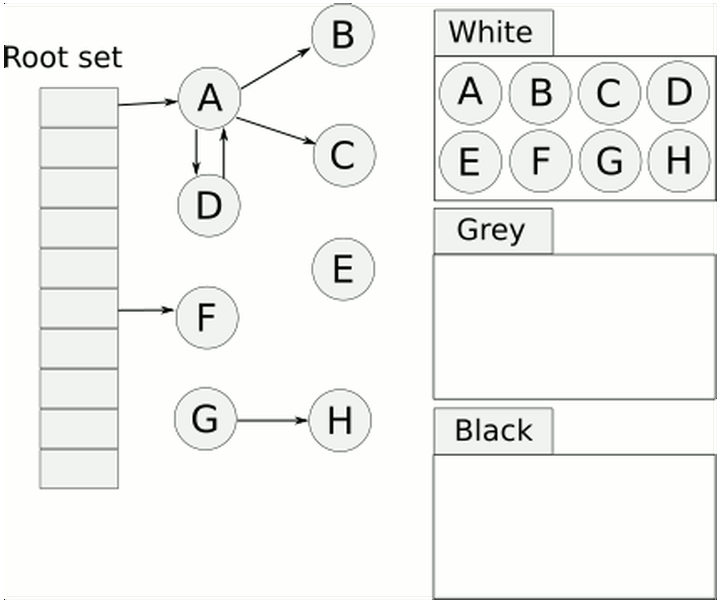

标记过程是一个广度优先的遍历过程。它是扫描节点，将节点的子节点推到任务队列中，然后递归扫描子节点的子节点，直到所有工作队列都被排空为止。

1. 所有对象最开始都是白色.
2. 从 root 开始找到所有可达对象，标记为灰色，放入待处理队列。
3. 遍历灰色对象队列，将其引用对象标记为灰色放入待处理队列，自身标记为黑色。
4. 循环步骤3直到灰色队列为空为止，此时所有引用对象都被标记为黑色，所有不可达的对象依然为白色，白色的就是需要进行回收的对象。

三色标记法相对于普通标记清扫，减少了 STW 时间. 这主要得益于标记过程是 "on-the-fly" 的，在标记过程中是不需要 STW 的，它与程序是并发执行的，这就大大缩短了 STW 的时间.


### GC 时为什么要暂停用户线程？
- 首先，如果不暂停用户线程，就意味着期间会不断有垃圾产生，永远也清理不干净。
- 其次，用户线程的运行必然会导致对象的引用关系发生改变，这就会导致两种情况：漏标和错标。

#### 可能存在的问题
1. 多标-浮动垃圾问题

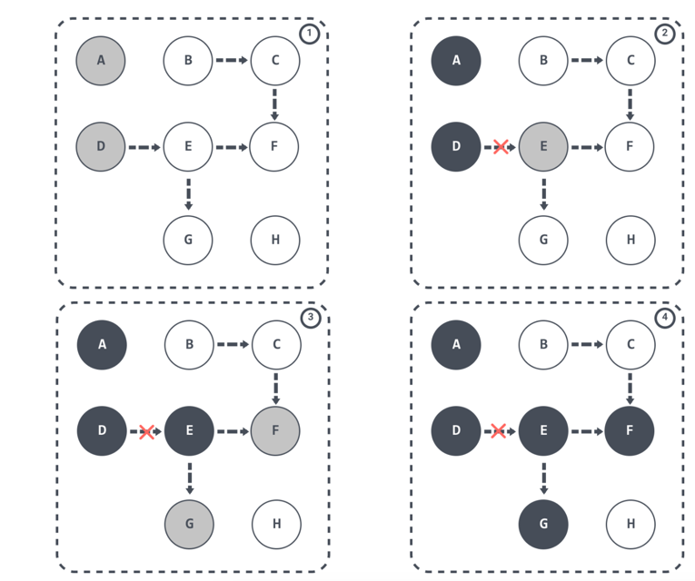  

假设 E 已经被标记过了（变成灰色了），此时 D 和 E 断开了引用，按理来说对象 E/F/G 应该被回收的，但是因为 E 已经变为灰色了，其仍会被当作存活对象继续遍历下去。
最终的结果是：这部分对象仍会被标记为存活，即本轮 GC 不会回收这部分内存。

这部分本应该回收 但是没有回收到的内存，被称之为“浮动垃圾”。


解释方式二： 
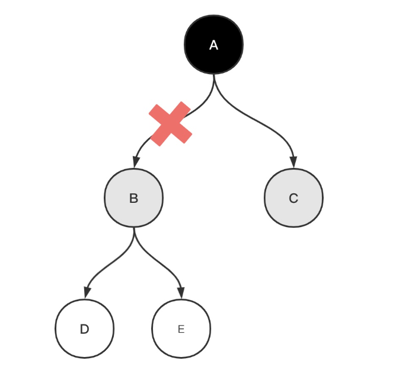

假设GC已经在遍历对象B了，而此时用户线程执行了A.B=null的操作，切断了A到B的引用。

本来执行了A.B=null之后，B、D、E都可以被回收了，但是由于B已经变为灰色，它仍会被当做存活对象，继续遍历下去。

最终的结果就是本轮GC不会回收B、D、E，留到下次GC时回收，也算是浮动垃圾的一部分。

实际上，这个问题依然可以通过「写屏障」来解决，只要在A写B的时候加入写屏障，记录下B被切断的记录，重新标记时可以再把他们标为白色即可。


2. 漏标-悬挂指针问题

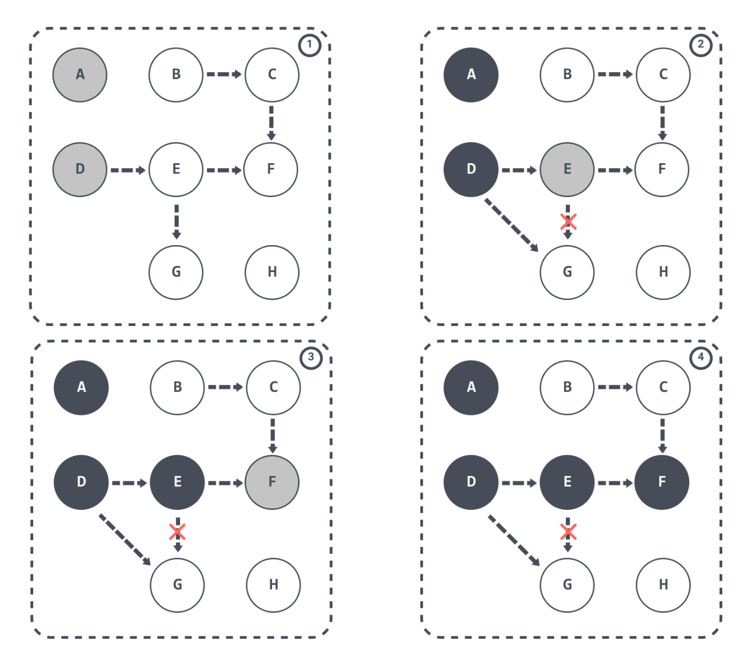  

当 GC 线程已经遍历到 E 变成灰色，D变成黑色时，灰色 E 断开引用白色 G ，黑色 D 引用了白色 G。此时切回 GC 线程继续跑，因为 E 已经没有对 G 的引用了，所以不会将 G 放到灰色集合。尽管因为 D 重新引用了 G，但因为 D 已经是黑色了，不会再重新做遍历处理。

最终导致的结果是：G 会一直停留在白色集合中，最后被当作垃圾进行清除。这直接影响到了应用程序的正确性，是不可接受的，这也是 Go 需要在 GC 时解决的问题。


解释方式二： 假设GC线程已经遍历到B了，此时用户线程执行了以下操作：
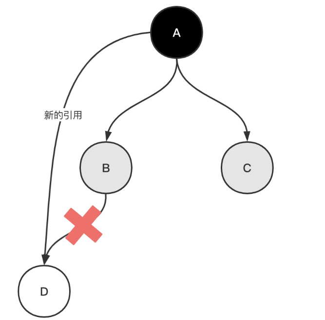
```go
B.D=null;//B到D的引用被切断A.xx=D;//A到D的引用被建立
```

此时GC线程继续工作，由于B不再引用D了，尽管A又引用了D，但是因为A已经标记为黑色，GC不会再遍历A了，所以D会被标记为白色，最后被当做垃圾回收。
可以看到错标的结果比漏表严重的多，浮动垃圾可以下次GC清理，而把不该回收的对象回收掉，将会造成程序运行错误。

错标只有在满足下面两种情况下才会发生：


### 如何解决上述**漏标**问题
满足三色不变性

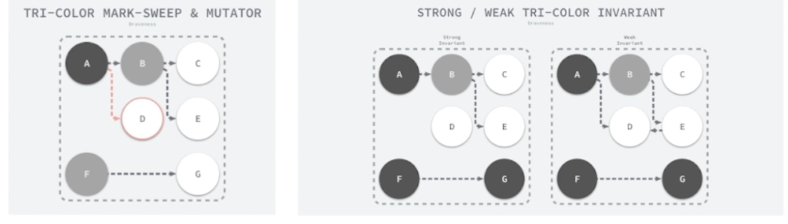
- 强三色不变性： 黑对象不能直接引用白对象
- 弱三色不变性： 黑对象可以引用白对象，但是必须多一条灰色指向白色。

如何满足三色不变性？使用屏障技术（偏向硬件）

#### 内存屏障


内存屏障，是一种屏障指令，它能使CPU或编译器对在该屏障指令之前和之后发出的内存操作强制执行排序约束，在内存屏障前执行的操作一定会先于内存屏障后执行的操作。

垃圾收集中的屏障技术更像是一个钩子方法，它是在用户程序读取对象、创建新对象以及更新对象指针时执行的一段代码，根据操作类型的不同，我们可以将它们分成读屏障（Read barrier）和写屏障（Write barrier）两种，因为读屏障需要在读操作中加入代码片段，对用户程序的性能影响很大，所以编程语言往往都会采用写屏障保证三色不变性。


对于一个不需要对象拷贝的垃圾回收器来说， Read barrier（读屏障）代价是很高的，因为对于这类垃圾回收器来说是不需要保存读操作的版本指针问题。
相对来说 Write barrier（写屏障）代码更小，因为堆中的写操作远远小于堆中的读操作。

#### 写屏障
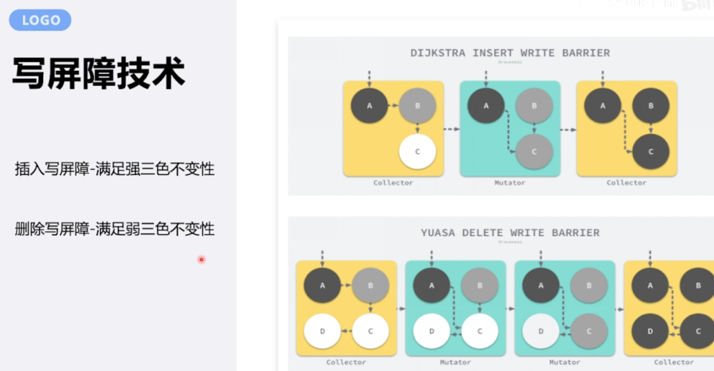

##### Dijkstra 插入屏障--满足强三色：指针修改时，指向的新对象要标灰：

Go 1.7 之前使用的是 Dijkstra Write barrier（写屏障），使用的实现类似下面伪代码：
```go
writePointer(slot, ptr):
    shade(ptr)
    *slot = ptr
```
如果该对象是白色的话，shade(ptr)会将对象标记成灰色。这样可以保证强三色不变性，它会保证 ptr 指针指向的对象在赋值给 *slot 前不是白色。


Dijkstra 插入屏障的好处在于可以立刻开始并发标记，但由于产生了灰色赋值器，缺陷是需要标记终止阶段 STW 时进行重新扫描


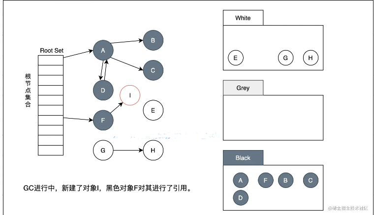
在GC进行的过程中，应用程序新建了对象I，此时如果已经标记成黑的对象F引用了对象I，那么在本次GC执行过程中因为黑色对象不会再次扫描，所以如果I着色成白色的话，会被回收掉，这显然是不允许的。

写屏障主要做一件事情，修改原先的写逻辑，然后在对象新增的同时给它着色，并且着色为灰色。因此打开了写屏障可以保证了三色标记法在并发下安全正确地运行。那么有人就会问这些写屏障标记成灰色的对象什么时候回收呢？答案是后续的GC过程中回收，在新的GC过程中所有已存对象就又从白色开始逐步被标记啦。


##### Yuasa 删除写屏障--满足弱三色：指针修改时，修改前指向的对象要标灰
Yuasa 在 1990 年的论文 Real-time garbage collection on general-purpose machines 中提出了删除写屏障，因为一旦该写屏障开始工作，它会保证开启写屏障时堆上所有对象的可达，所以也被称作快照垃圾收集（Snapshot GC）

其思想是当赋值器从灰色或白色对象中删除白色指针时，通过写屏障将这一行为通知给并发执行的回收器。

该算法会使用如下所示的写屏障保证增量或者并发执行垃圾收集时程序的正确性，伪代码实现如下：
```
writePointer(slot, ptr)
    shade(*slot)
    *slot = ptr
```


Yuasa 删除屏障的优势则在于不需要标记结束阶段的重新扫描，缺陷是依然会产生丢失的对象，需要在标记开始前对整个对象图进行快照

##### Hybrid write barrier 混合写屏障

Go 在 1.8 的时候使用 Hybrid write barrier（混合写屏障），结合了 Yuasa write barrier 和 Dijkstra write barrier ，实现的伪代码如下：
```go
writePointer(slot, ptr):
    shade(*slot)
    if current stack is grey:
        shade(ptr)
    *slot = ptr
```
混合写屏障的基本思想是：对正在被覆盖的对象进行着色，且如果当前栈未扫描完成， 则同样对指针进行着色。


## GC 触发条件
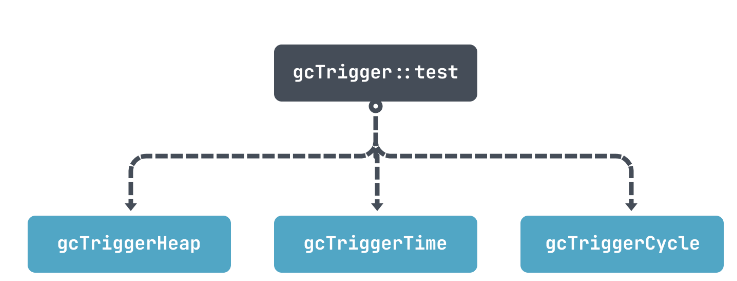
```go
// go1.21.5/src/runtime/mgc.go
type gcTriggerKind int

const (
	// gcTriggerHeap indicates that a cycle should be started when
	// the heap size reaches the trigger heap size computed by the
	// controller.
	gcTriggerHeap gcTriggerKind = iota

	// gcTriggerTime indicates that a cycle should be started when
	// it's been more than forcegcperiod nanoseconds since the
	// previous GC cycle.
	gcTriggerTime

	// gcTriggerCycle indicates that a cycle should be started if
	// we have not yet started cycle number gcTrigger.n (relative
	// to work.cycles).
	gcTriggerCycle
)

```

1. 主动触发gcTriggerCycle: 如果当前没有开启垃圾收集，则启动GC；主要是调用函数 [runtime.GC()]

2. 被动触发，分为两种方式：

    * 使用系统 sysmon 监控，gcTriggerTime 自从上次GC后间隔时间达到了[runtime.forcegcperiod 默认为2分钟]
    
    * 使用步调（Pacing）算法，其核心思想是控制内存增长的比例, gcTriggerHeap 当前分配的内存达到一定阈值时触发，这个阈值在每次GC过后都会根据堆内存的增长情况和CPU占用率来调整；


```go
func (t gcTrigger) test() bool {
	if !memstats.enablegc || panicking.Load() != 0 || gcphase != _GCoff {
		return false
	}
	switch t.kind {
	case gcTriggerHeap:
		trigger, _ := gcController.trigger()
		return gcController.heapLive.Load() >= trigger
	case gcTriggerTime:
		if gcController.gcPercent.Load() < 0 {
			return false
		}
		lastgc := int64(atomic.Load64(&memstats.last_gc_nanotime))
		return lastgc != 0 && t.now-lastgc > forcegcperiod
	case gcTriggerCycle:
		// t.n > work.cycles, but accounting for wraparound.
		return int32(t.n-work.cycles.Load()) > 0
	}
	return true
}
```


### 堆内存大小触发 GC 的情况


```go
// 控制器计算的触发堆大小
func (c *gcControllerState) trigger() (uint64, uint64) {
	goal, minTrigger := c.heapGoalInternal()
	

	if c.heapMarked >= goal {
		// The goal should never be smaller than heapMarked, but let's be
		// defensive about it. The only reasonable trigger here is one that
		// causes a continuous GC cycle at heapMarked, but respect the goal
		// if it came out as smaller than that.
		return goal, goal
	}

	// Below this point, c.heapMarked < goal.

	// heapMarked is our absolute minimum, and it's possible the trigger
	// bound we get from heapGoalinternal is less than that.
	if minTrigger < c.heapMarked {
		minTrigger = c.heapMarked
	}

	triggerLowerBound := uint64(((goal-c.heapMarked)/triggerRatioDen)*minTriggerRatioNum) + c.heapMarked
	if minTrigger < triggerLowerBound {
		minTrigger = triggerLowerBound
	}
	
	maxTrigger := uint64(((goal-c.heapMarked)/triggerRatioDen)*maxTriggerRatioNum) + c.heapMarked
	if goal > defaultHeapMinimum && goal-defaultHeapMinimum > maxTrigger {
		maxTrigger = goal - defaultHeapMinimum
	}
	if maxTrigger < minTrigger {
		maxTrigger = minTrigger
	}

	// Compute the trigger from our bounds and the runway stored by commit.
	var trigger uint64
	runway := c.runway.Load()
	if runway > goal {
		trigger = minTrigger
	} else {
		trigger = goal - runway
	}
	if trigger < minTrigger {
		trigger = minTrigger
	}
	if trigger > maxTrigger {
		trigger = maxTrigger
	}
	if trigger > goal {
		print("trigger=", trigger, " heapGoal=", goal, "\n")
		print("minTrigger=", minTrigger, " maxTrigger=", maxTrigger, "\n")
		throw("produced a trigger greater than the heap goal")
	}
	return trigger, goal
}
```
获取 goal： HeapGoal 的时候使用了两种方式，一种是通过 GOGC 值计算，另一种是通过 memoryLimit 值计算(优化来自 https://github.com/golang/go/issues/48409 )，然后取它们两个中小的值作为 HeapGoal。
```go
func (c *gcControllerState) heapGoalInternal() (goal, minTrigger uint64) {
	// GOGC 值计算结果
	goal = c.gcPercentHeapGoal.Load()

	// 取它们 GOGC 和 memoryLimi t两个中小的值作为 HeapGoal
	if newGoal := c.memoryLimitHeapGoal(); newGoal < goal {
		goal = newGoal
	} else {
		// We're not limited by the memory limit goal, so perform a series of
		// adjustments that might move the goal forward in a variety of circumstances.

		sweepDistTrigger := c.sweepDistMinTrigger.Load()
		if sweepDistTrigger > goal {
			// Set the goal to maintain a minimum sweep distance since
			// the last call to commit. Note that we never want to do this
			// if we're in the memory limit regime, because it could push
			// the goal up.
			goal = sweepDistTrigger
		}
		// Since we ignore the sweep distance trigger in the memory
		// limit regime, we need to ensure we don't propagate it to
		// the trigger, because it could cause a violation of the
		// invariant that the trigger < goal.
		minTrigger = sweepDistTrigger

		// Ensure that the heap goal is at least a little larger than
		// the point at which we triggered. This may not be the case if GC
		// start is delayed or if the allocation that pushed gcController.heapLive
		// over trigger is large or if the trigger is really close to
		// GOGC. Assist is proportional to this distance, so enforce a
		// minimum distance, even if it means going over the GOGC goal
		// by a tiny bit.
		//
		// Ignore this if we're in the memory limit regime: we'd prefer to
		// have the GC respond hard about how close we are to the goal than to
		// push the goal back in such a manner that it could cause us to exceed
		// the memory limit.
		const minRunway = 64 << 10
		if c.triggered != ^uint64(0) && goal < c.triggered+minRunway {
			goal = c.triggered + minRunway
		}
	}
	return
}
```


第一个：gcPercentHeapGoal 通过 GOGC 值计算公式如下
```go
func (c *gcControllerState) commit(isSweepDone bool) {
	// ...
	gcPercentHeapGoal := ^uint64(0)
	if gcPercent := c.gcPercent.Load(); gcPercent >= 0 {
		// HeapGoal = 存活堆大小 + （存活堆大小+栈大小+全局变量大小）* GOGC/100
		gcPercentHeapGoal = c.heapMarked + (c.heapMarked+c.lastStackScan.Load()+c.globalsScan.Load())*uint64(gcPercent)/100
	}
	// Apply the minimum heap size here. It's defined in terms of gcPercent
	// and is only updated by functions that call commit.
	if gcPercentHeapGoal < c.heapMinimum {
		gcPercentHeapGoal = c.heapMinimum
	}
	c.gcPercentHeapGoal.Store(gcPercentHeapGoal)
}
```

gcPercent 默认 100, 通过 GOGC env 获取
```go
func readGOGC() int32 {
	p := gogetenv("GOGC")
	if p == "off" {
		return -1
	}
	if n, ok := atoi32(p); ok {
		return n
	}
	return 100
}
```

第二个：memoryLimit
```go
func (c *gcControllerState) memoryLimitHeapGoal() uint64 {
	// Start by pulling out some values we'll need. Be careful about overflow.
	var heapFree, heapAlloc, mappedReady uint64
    // ...

	memoryLimit := uint64(c.memoryLimit.Load())

	// Compute term 1.
	nonHeapMemory := mappedReady - heapFree - heapAlloc

	// Compute term 2.
	var overage uint64
	if mappedReady > memoryLimit {
		overage = mappedReady - memoryLimit
	}

	if nonHeapMemory+overage >= memoryLimit {
		// We're at a point where non-heap memory exceeds the memory limit on its own.
		// There's honestly not much we can do here but just trigger GCs continuously
		// and let the CPU limiter reign that in. Something has to give at this point.
		// Set it to heapMarked, the lowest possible goal.
		return c.heapMarked
	}

	// Compute the goal.
	goal := memoryLimit - (nonHeapMemory + overage)

    // ..
	return goal
}
```


## 参考资料
1. [Go中内存分配源码实现](https://www.luozhiyun.com/archives/434) 
2. [Go语言设计:垃圾收集器](https://draveness.me/golang/docs/part3-runtime/ch07-memory/golang-garbage-collector/)
3. [BFS (Breadth First Search 广度优先遍历）-->树的层次遍历](https://github.com/Danny5487401/algorithm-in-go-and-c/blob/master/01_dataStructure/04_graph/graph.md)
4. [Go 官方gc-guide](https://tip.golang.org/doc/gc-guide)
5. [Golang什么时候会触发GC](https://blog.haohtml.com/archives/23911)