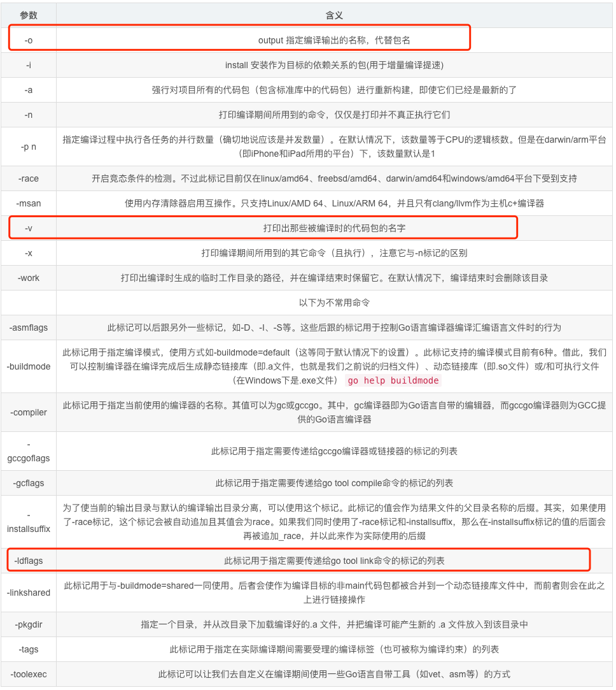

# go build 

build过程细化成两部分，compile与link，即编译和链接。

go run 可等价于 go build + 执行。

go 的编译是以 package main 的 main() 函数作为主入口，生成可执行文件。若 build 的是非 main 包，则不会生成可执行文件，只检查是否可执行编译。

build指令编译packages和对应的依赖，但是不会安装编译结果


```shell
go build [-o output] [build flags] [packages]
```

## packages
- 如果传入了 在一个文件夹下的文件列表 ，指令会将这些文件当作一个（只包含这些传入的文件）package来处理。
- 忽略_test.go结尾的文件。
- 如果在编译单独的main包，build指令会生成一个可执行文件；反之，只编译，丢弃编译结果，用来检查编译是否可以通过。
可执行文件的名称取决于：
（通过-o指定了路径或文件名）写入到指定的文件夹和指定的文件名
（如果传入了文件列表）第一个文件的名字
（没有指定文件列表）源码目录的名字

## 介绍build选项

```shell
➜  03_n git:(feature/memory) ✗ go help build            
usage: go build [-o output] [build flags] [packages]

Build compiles the packages named by the import paths,
along with their dependencies, but it does not install the results.

If the arguments to build are a list of .go files from a single directory,
build treats them as a list of source files specifying a single package.

When compiling packages, build ignores files that end in '_test.go'.

When compiling a single main package, build writes
the resulting executable to an output file named after
the first source file ('go build ed.go rx.go' writes 'ed' or 'ed.exe')
or the source code directory ('go build unix/sam' writes 'sam' or 'sam.exe').
The '.exe' suffix is added when writing a Windows executable.

When compiling multiple packages or a single non-main package,
build compiles the packages but discards the resulting object,
serving only as a check that the packages can be built.

The -o flag forces build to write the resulting executable or object
to the named output file or directory, instead of the default behavior described
in the last two paragraphs. If the named output is an existing directory or
ends with a slash or backslash, then any resulting executables
will be written to that directory.

The -i flag installs the packages that are dependencies of the target.
The -i flag is deprecated. Compiled packages are cached automatically.

The build flags are shared by the build, clean, get, install, list, run,
and test commands:

        -a  强制重新编译（缓存的编译结果）已经是最新的包
        -n
                print the commands but do not run them.
        -p n
                the number of programs, such as build commands or
                test binaries, that can be run in parallel.
                The default is GOMAXPROCS, normally the number of CPUs available.
        -race
                开启数据竞争的检测.
                Supported only on linux/amd64, freebsd/amd64, darwin/amd64, darwin/arm64, windows/amd64,
                linux/ppc64le and linux/arm64 (only for 48-bit VMA).
        -msan
                enable interoperation with memory sanitizer.
                Supported only on linux/amd64, linux/arm64
                and only with Clang/LLVM as the host C compiler.
                On linux/arm64, pie build mode will be used.
        -asan
                enable interoperation with address sanitizer.
                Supported only on linux/arm64, linux/amd64.
        -v      在编译一个包时，打印包名.
        -work   打印临时工作目录（temporary work directory），并且退出时不删除
        -x      打印指令

        -asmflags '[pattern=]arg list'
                会传递给所有的go tool asm调用
        -buildmode mode
                编译模式. See 'go help buildmode' for more. default模式：输入的main包编译成可执行文件； 其他包编译成.a文件。  plugin模式：编译为go插件
        -buildvcs
                Whether to stamp binaries with version control information. By default,
                version control information is stamped into a binary if the main package
                and the main module containing it are in the repository containing the
                current directory (if there is a repository). Use -buildvcs=false to
                omit version control information.
        -compiler name  使用的编译器，gccgo/gc
        -gccgoflags '[pattern=]arg list'
                arguments to pass on each gccgo compiler/linker invocation.
        -gcflags '[pattern=]arg list'
                arguments to pass on each go tool compile invocation. 传递给所有的go tool compile的参数
        -installsuffix suffix
                a suffix to use in the name of the package installation directory,
                in order to keep output separate from default builds.
                If using the -race flag, the install suffix is automatically set to race
                or, if set explicitly, has _race appended to it. Likewise for the -msan
                and -asan flags. Using a -buildmode option that requires non-default compile
                flags has a similar effect.
        -ldflags '[pattern=]arg list'
                arguments to pass on each go tool link invocation. 传递给go tool link的参数
        -linkshared
                build code that will be linked against shared libraries previously
                created with -buildmode=shared.
        -mod mode
                module download mode to use: readonly, vendor, or mod.
                go.mod中的版本大于等于1.14且存在vendor文件夹，那么会使用-mod=vendor； 反之，使用-mod=readonly
                See https://golang.org/ref/mod#build-commands for details.
        -modcacherw
                leave newly-created directories in the module cache read-write
                instead of making them read-only.
        -modfile file
                in module aware mode, read (and possibly write) an alternate go.mod
                file instead of the one in the module root directory. A file named
                "go.mod" must still be present in order to determine the module root
                directory, but it is not accessed. When -modfile is specified, an
                alternate go.sum file is also used: its path is derived from the
                -modfile flag by trimming the ".mod" extension and appending ".sum".
        -overlay file
                read a JSON config file that provides an overlay for build operations.
                The file is a JSON struct with a single field, named 'Replace', that
                maps each disk file path (a string) to its backing file path, so that
                a build will run as if the disk file path exists with the contents
                given by the backing file paths, or as if the disk file path does not
                exist if its backing file path is empty. Support for the -overlay flag
                has some limitations: importantly, cgo files included from outside the
                include path must be in the same directory as the Go package they are
                included from, and overlays will not appear when binaries and tests are
                run through go run and go test respectively.
        -pkgdir dir
                替换所有的安装和加载所有的包的路径
                For example, when building with a non-standard configuration,
                use -pkgdir to keep generated packages in a separate location.
        -tags tag,list
                逗号分割的编译tag列表. For more information about build tags, see the description of
                build constraints in the documentation for the go/build package.
                (Earlier versions of Go used a space-separated list, and that form
                is deprecated but still recognized.)
        -trimpath
                remove all file system paths from the resulting executable.
                Instead of absolute file system paths, the recorded file names
                will begin either a module path@version (when using modules),
                or a plain import path (when using the standard library, or GOPATH).
        -toolexec 'cmd args'
                a program to use to invoke toolchain programs like vet and asm.
                For example, instead of running asm, the go command will run
                'cmd args /path/to/asm <arguments for asm>'.
                The TOOLEXEC_IMPORTPATH environment variable will be set,
                matching 'go list -f {{.ImportPath}}' for the package being built.

The -asmflags, -gccgoflags, -gcflags, and -ldflags flags accept a
space-separated list of arguments to pass to an underlying tool
during the build. To embed spaces in an element in the list, surround
it with either single or double quotes. The argument list may be
preceded by a package pattern and an equal sign, which restricts
the use of that argument list to the building of packages matching
that pattern (see 'go help packages' for a description of package
patterns). Without a pattern, the argument list applies only to the
packages named on the command line. The flags may be repeated
with different patterns in order to specify different arguments for
different sets of packages. If a package matches patterns given in
multiple flags, the latest match on the command line wins.
For example, 'go build -gcflags=-S fmt' prints the disassembly
only for package fmt, while 'go build -gcflags=all=-S fmt'
prints the disassembly for fmt and all its dependencies.

For more about specifying packages, see 'go help packages'.
For more about where packages and binaries are installed,
run 'go help gopath'.
For more about calling between Go and C/C++, run 'go help c'.

Note: Build adheres to certain conventions such as those described
by 'go help gopath'. Not all projects can follow these conventions,
however. Installations that have their own conventions or that use
a separate software build system may choose to use lower-level
invocations such as 'go tool compile' and 'go tool link' to avoid
some of the overheads and design decisions of the build tool.

See also: go install, go get, go clean.

```


### -n 不执行地打印流程中用到的命令

- [案例](chapter31_tool/01_build/03_n/hello.go)
```shell
➜  03_n git:(feature/memory) ✗ go build -n hello.go

#
# command-line-arguments
#

mkdir -p $WORK/b001/
cat >$WORK/b001/importcfg << 'EOF' # internal
# import config
packagefile fmt=/Users/python/go/go1.18/pkg/darwin_arm64/fmt.a
packagefile runtime=/Users/python/go/go1.18/pkg/darwin_arm64/runtime.a
EOF
cd /Users/python/Desktop/go_advanced_code/chapter31_tool/01_build/03_n
/Users/python/go/go1.18/pkg/tool/darwin_arm64/compile -o $WORK/b001/_pkg_.a -trimpath "$WORK/b001=>" -p main -complete -buildid MSs9LwS2RC1k46GDbTe6/MSs9LwS2RC1k46GDbTe6 -goversion go1.18 -shared -c=4 -nolocalimports -importcfg $WORK/b001/importcfg -pack ./hello.go
/Users/python/go/go1.18/pkg/tool/darwin_arm64/buildid -w $WORK/b001/_pkg_.a # internal
cat >$WORK/b001/importcfg.link << 'EOF' # internal
packagefile command-line-arguments=$WORK/b001/_pkg_.a
packagefile fmt=/Users/python/go/go1.18/pkg/darwin_arm64/fmt.a
packagefile runtime=/Users/python/go/go1.18/pkg/darwin_arm64/runtime.a
packagefile errors=/Users/python/go/go1.18/pkg/darwin_arm64/errors.a
packagefile internal/fmtsort=/Users/python/go/go1.18/pkg/darwin_arm64/internal/fmtsort.a
packagefile io=/Users/python/go/go1.18/pkg/darwin_arm64/io.a
packagefile math=/Users/python/go/go1.18/pkg/darwin_arm64/math.a
packagefile os=/Users/python/go/go1.18/pkg/darwin_arm64/os.a
packagefile reflect=/Users/python/go/go1.18/pkg/darwin_arm64/reflect.a
packagefile strconv=/Users/python/go/go1.18/pkg/darwin_arm64/strconv.a
packagefile sync=/Users/python/go/go1.18/pkg/darwin_arm64/sync.a
packagefile unicode/utf8=/Users/python/go/go1.18/pkg/darwin_arm64/unicode/utf8.a
packagefile internal/abi=/Users/python/go/go1.18/pkg/darwin_arm64/internal/abi.a
packagefile internal/bytealg=/Users/python/go/go1.18/pkg/darwin_arm64/internal/bytealg.a
packagefile internal/cpu=/Users/python/go/go1.18/pkg/darwin_arm64/internal/cpu.a
packagefile internal/goarch=/Users/python/go/go1.18/pkg/darwin_arm64/internal/goarch.a
packagefile internal/goexperiment=/Users/python/go/go1.18/pkg/darwin_arm64/internal/goexperiment.a
packagefile internal/goos=/Users/python/go/go1.18/pkg/darwin_arm64/internal/goos.a
packagefile runtime/internal/atomic=/Users/python/go/go1.18/pkg/darwin_arm64/runtime/internal/atomic.a
packagefile runtime/internal/math=/Users/python/go/go1.18/pkg/darwin_arm64/runtime/internal/math.a
packagefile runtime/internal/sys=/Users/python/go/go1.18/pkg/darwin_arm64/runtime/internal/sys.a
packagefile internal/reflectlite=/Users/python/go/go1.18/pkg/darwin_arm64/internal/reflectlite.a
packagefile sort=/Users/python/go/go1.18/pkg/darwin_arm64/sort.a
packagefile math/bits=/Users/python/go/go1.18/pkg/darwin_arm64/math/bits.a
packagefile internal/itoa=/Users/python/go/go1.18/pkg/darwin_arm64/internal/itoa.a
packagefile internal/oserror=/Users/python/go/go1.18/pkg/darwin_arm64/internal/oserror.a
packagefile internal/poll=/Users/python/go/go1.18/pkg/darwin_arm64/internal/poll.a
packagefile internal/syscall/execenv=/Users/python/go/go1.18/pkg/darwin_arm64/internal/syscall/execenv.a
packagefile internal/syscall/unix=/Users/python/go/go1.18/pkg/darwin_arm64/internal/syscall/unix.a
packagefile internal/testlog=/Users/python/go/go1.18/pkg/darwin_arm64/internal/testlog.a
packagefile internal/unsafeheader=/Users/python/go/go1.18/pkg/darwin_arm64/internal/unsafeheader.a
packagefile io/fs=/Users/python/go/go1.18/pkg/darwin_arm64/io/fs.a
packagefile sync/atomic=/Users/python/go/go1.18/pkg/darwin_arm64/sync/atomic.a
packagefile syscall=/Users/python/go/go1.18/pkg/darwin_arm64/syscall.a
packagefile time=/Users/python/go/go1.18/pkg/darwin_arm64/time.a
packagefile unicode=/Users/python/go/go1.18/pkg/darwin_arm64/unicode.a
packagefile internal/race=/Users/python/go/go1.18/pkg/darwin_arm64/internal/race.a
packagefile path=/Users/python/go/go1.18/pkg/darwin_arm64/path.a
modinfo "0w\xaf\f\x92t\b\x02A\xe1\xc1\a\xe6\xd6\x18\xe6path\tcommand-line-arguments\nbuild\t-compiler=gc\nbuild\tCGO_ENABLED=1\nbuild\tCGO_CFLAGS=\nbuild\tCGO_CPPFLAGS=\nbuild\tCGO_CXXFLAGS=\nbuild\tCGO_LDFLAGS=\nbuild\tGOARCH=arm64\nbuild\tGOOS=darwin\n\xf92C1\x86\x18 r\x00\x82B\x10A\x16\xd8\xf2"
EOF
mkdir -p $WORK/b001/exe/
cd .
/Users/python/go/go1.18/pkg/tool/darwin_arm64/link -o $WORK/b001/exe/a.out -importcfg $WORK/b001/importcfg.link -buildmode=exe -buildid=2AFKwN-A-nbAuG5ZYWFN/MSs9LwS2RC1k46GDbTe6/MSs9LwS2RC1k46GDbTe6/2AFKwN-A-nbAuG5ZYWFN -extld=clang $WORK/b001/_pkg_.a
/Users/python/go/go1.18/pkg/tool/darwin_arm64/buildid -w $WORK/b001/exe/a.out # internal
mv $WORK/b001/exe/a.out hello

```

发现主要由几部分组成，分别是：

- 创建临时目录，mkdir -p $WORK/b001/;
- 查找依赖信息，cat >$WORK/b001/importcfg << ...;
- 执行源代码编译，/usr/local/go/pkg/tool/darwin_amd64/compile ...;
- 收集链接库文件，cat >$WORK/b001/importcfg.link << ...;
- 生成可执行文件，/usr/local/go/pkg/tool/darwin_amd64/link -o ...;
- 移动可执行文件，mv $WORK/b001/exe/a.out hello;

* 一个非 main 包在编译后会对应生成一个 .a 文件，该文件可以理解为 Go 包的目标文件，该目标文件实际上是通过 pack 工具对 .o 文件打包后形成的。默认情况下，在编译过程中 .a 文件生成在临时目录下。如果是构建可执行程序，那么 .a 文件会在构建可执行程序的链接阶段起作用。


* 标准库包的源码文件在 GOROOT/src下面，而对应的.a文件存放在GOROOT/src 下面，而对应的 .a 文件存放在 GOROOT/src下面，
而对应的.a文件存放在GOROOT/pkg/darwin_amd64（以 macos 为例，linux 是linux_amd64）。默认情况下，对于 Go 标准库中的包，编译器直接链接的是 $GOROOT/pkg/darwin_amd64 下的 .a 文件。
我这里是 /Users/python/go/go1.18/pkg/darwin_arm64

* 在使用第三方包的时候，在第三方包源码存在且对应的 .a 已安装的情况下，编译器链接的仍是根据第三方包最新源码编译出的 .a 文件，而不是之前已经安装到 $GOROOT/pkg/darwin_amd64 下的目标文件。所谓的使用第三方包源码，实际上是链接了以该最新包源码编译的、存放在临时目录下的包的 .a 文件。


对比 go run 
```shell
➜  03_n git:(feature/memory) ✗ go run -x hello.go                                                                 
WORK=/var/folders/sk/m49vysmj3ss_y50cv9cvcn800000gn/T/go-build3865472980
mkdir -p $WORK/b001/
cat >$WORK/b001/importcfg << 'EOF' # internal
# import config
packagefile fmt=/Users/python/go/go1.18/pkg/darwin_arm64/fmt.a
packagefile runtime=/Users/python/go/go1.18/pkg/darwin_arm64/runtime.a
EOF
cd /Users/python/Desktop/go_advanced_code/chapter31_tool/01_build/03_n
/Users/python/go/go1.18/pkg/tool/darwin_arm64/compile -o $WORK/b001/_pkg_.a -trimpath "$WORK/b001=>" -p main -complete -buildid IoyTdPQNb0RqKSuZSzrn/IoyTdPQNb0RqKSuZSzrn -dwarf=false -goversion go1.18 -shared -c=4 -nolocalimports -importcfg $WORK/b001/importcfg -pack ./hello.go
/Users/python/go/go1.18/pkg/tool/darwin_arm64/buildid -w $WORK/b001/_pkg_.a # internal
cp $WORK/b001/_pkg_.a /Users/python/Library/Caches/go-build/83/838255e304acc7b1c13d11414361339f34fac021458e87eed6866578556dac52-d # internal
cat >$WORK/b001/importcfg.link << 'EOF' # internal
packagefile command-line-arguments=$WORK/b001/_pkg_.a
packagefile fmt=/Users/python/go/go1.18/pkg/darwin_arm64/fmt.a
packagefile runtime=/Users/python/go/go1.18/pkg/darwin_arm64/runtime.a
packagefile errors=/Users/python/go/go1.18/pkg/darwin_arm64/errors.a
packagefile internal/fmtsort=/Users/python/go/go1.18/pkg/darwin_arm64/internal/fmtsort.a
packagefile io=/Users/python/go/go1.18/pkg/darwin_arm64/io.a
packagefile math=/Users/python/go/go1.18/pkg/darwin_arm64/math.a
packagefile os=/Users/python/go/go1.18/pkg/darwin_arm64/os.a
packagefile reflect=/Users/python/go/go1.18/pkg/darwin_arm64/reflect.a
packagefile strconv=/Users/python/go/go1.18/pkg/darwin_arm64/strconv.a
packagefile sync=/Users/python/go/go1.18/pkg/darwin_arm64/sync.a
packagefile unicode/utf8=/Users/python/go/go1.18/pkg/darwin_arm64/unicode/utf8.a
packagefile internal/abi=/Users/python/go/go1.18/pkg/darwin_arm64/internal/abi.a
packagefile internal/bytealg=/Users/python/go/go1.18/pkg/darwin_arm64/internal/bytealg.a
packagefile internal/cpu=/Users/python/go/go1.18/pkg/darwin_arm64/internal/cpu.a
packagefile internal/goarch=/Users/python/go/go1.18/pkg/darwin_arm64/internal/goarch.a
packagefile internal/goexperiment=/Users/python/go/go1.18/pkg/darwin_arm64/internal/goexperiment.a
packagefile internal/goos=/Users/python/go/go1.18/pkg/darwin_arm64/internal/goos.a
packagefile runtime/internal/atomic=/Users/python/go/go1.18/pkg/darwin_arm64/runtime/internal/atomic.a
packagefile runtime/internal/math=/Users/python/go/go1.18/pkg/darwin_arm64/runtime/internal/math.a
packagefile runtime/internal/sys=/Users/python/go/go1.18/pkg/darwin_arm64/runtime/internal/sys.a
packagefile internal/reflectlite=/Users/python/go/go1.18/pkg/darwin_arm64/internal/reflectlite.a
packagefile sort=/Users/python/go/go1.18/pkg/darwin_arm64/sort.a
packagefile math/bits=/Users/python/go/go1.18/pkg/darwin_arm64/math/bits.a
packagefile internal/itoa=/Users/python/go/go1.18/pkg/darwin_arm64/internal/itoa.a
packagefile internal/oserror=/Users/python/go/go1.18/pkg/darwin_arm64/internal/oserror.a
packagefile internal/poll=/Users/python/go/go1.18/pkg/darwin_arm64/internal/poll.a
packagefile internal/syscall/execenv=/Users/python/go/go1.18/pkg/darwin_arm64/internal/syscall/execenv.a
packagefile internal/syscall/unix=/Users/python/go/go1.18/pkg/darwin_arm64/internal/syscall/unix.a
packagefile internal/testlog=/Users/python/go/go1.18/pkg/darwin_arm64/internal/testlog.a
packagefile internal/unsafeheader=/Users/python/go/go1.18/pkg/darwin_arm64/internal/unsafeheader.a
packagefile io/fs=/Users/python/go/go1.18/pkg/darwin_arm64/io/fs.a
packagefile sync/atomic=/Users/python/go/go1.18/pkg/darwin_arm64/sync/atomic.a
packagefile syscall=/Users/python/go/go1.18/pkg/darwin_arm64/syscall.a
packagefile time=/Users/python/go/go1.18/pkg/darwin_arm64/time.a
packagefile unicode=/Users/python/go/go1.18/pkg/darwin_arm64/unicode.a
packagefile internal/race=/Users/python/go/go1.18/pkg/darwin_arm64/internal/race.a
packagefile path=/Users/python/go/go1.18/pkg/darwin_arm64/path.a
modinfo "0w\xaf\f\x92t\b\x02A\xe1\xc1\a\xe6\xd6\x18\xe6path\tcommand-line-arguments\nbuild\t-compiler=gc\nbuild\tCGO_ENABLED=1\nbuild\tCGO_CFLAGS=\nbuild\tCGO_CPPFLAGS=\nbuild\tCGO_CXXFLAGS=\nbuild\tCGO_LDFLAGS=\nbuild\tGOARCH=arm64\nbuild\tGOOS=darwin\n\xf92C1\x86\x18 r\x00\x82B\x10A\x16\xd8\xf2"
EOF
mkdir -p $WORK/b001/exe/
cd .
/Users/python/go/go1.18/pkg/tool/darwin_arm64/link -o $WORK/b001/exe/hello -importcfg $WORK/b001/importcfg.link -s -w -buildmode=exe -buildid=DJDhO5UH55uugWyT3yqX/IoyTdPQNb0RqKSuZSzrn/u5feEq5h8tt8TRX_7jVW/DJDhO5UH55uugWyT3yqX -extld=clang $WORK/b001/_pkg_.a
$WORK/b001/exe/hello
hello

```

与build不同的是，在link生成hello文件后，并没有把它移动到当前目录，而是通过$WORK/b001/exe/hello执行了程序


### --work保留可执行文件

```shell
# -x 执行并打印流程中用到的命令,要注意下它与-n选项的区别
➜  03_n git:(feature/memory) ✗ go run -x --work hello.go
➜  03_n git:(feature/memory) ✗ ls /var/folders/sk/m49vysmj3ss_y50cv9cvcn800000gn/T/go-build2348639944/b001/exe 
hello

```

##  Go 语言的包导入
编译器在编译过程中必然要使用的是编译单元（一个包）所依赖的包的源码。而编译器要找到依赖包的源码文件，就需要知道依赖包的源码路径。这个路径由两部分组成：基础搜索路径和包导入路径

- 基础搜索路径的规则：

    - 所有包的源码基础搜索路径都包括 $GOROOT/src；
    - 在 1 的基础上，不同版本 Go 包含的其他搜索路径有不同：

        - 经典的 gopath 模式下（GO111MODULE=off）：$GOPATH/src；
        - module-aware 模式下（GO111MODULE=on/auto）：$GOPATH/pkg/mod；

搜索路径的第二部分就是位于每个包源码文件头部的包导入路径。基础搜索路径与包导入路径结合在一起，Go 编译器便可确定一个包的所有依赖包的源码路径的集合，这个集合构成了 Go 编译器的源码搜索路径空间


## 参考资料
1. [Go 增量构建](https://mp.weixin.qq.com/s?__biz=MzIyNzM0MDk0Mg==&mid=2247491831&idx=1&sn=8eb54239e5105aed870ae931b338868e&chksm=e8600716df178e00d890d6528de47d16f843f35fd6de453d3e7219ee97eeacbf3eed2ba6f6a4&scene=178&cur_album_id=1509674724564500480#rd)