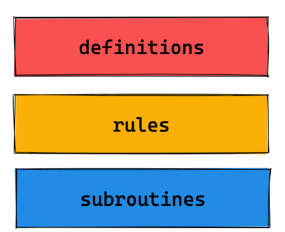

<!-- START doctoc generated TOC please keep comment here to allow auto update -->
<!-- DON'T EDIT THIS SECTION, INSTEAD RE-RUN doctoc TO UPDATE -->
**Table of Contents**  *generated with [DocToc](https://github.com/thlorenz/doctoc)*

- [yacc(Yet Another Compiler Compiler)](#yaccyet-another-compiler-compiler)
  - [.y 文件](#y-%E6%96%87%E4%BB%B6)
    - [定义部分](#%E5%AE%9A%E4%B9%89%E9%83%A8%E5%88%86)
    - [语法的规则](#%E8%AF%AD%E6%B3%95%E7%9A%84%E8%A7%84%E5%88%99)
  - [第三方应用 --> prometheus](#%E7%AC%AC%E4%B8%89%E6%96%B9%E5%BA%94%E7%94%A8----prometheus)
  - [参考](#%E5%8F%82%E8%80%83)

<!-- END doctoc generated TOC please keep comment here to allow auto update -->

# yacc(Yet Another Compiler Compiler)

yacc 经典的生成 Parser 语法分析器的工具.yacc生成的编译器主要是用C语言写成的语法解析器（Parser），需要与词法解析器Lexer 一起使用，再把两部分产生出来的C程序一并编译。


goyacc 就是golang语言的yacc. 和 Yacc 的功能一样，goyacc 根据输入的语法规则文件，生成该语法规则的 go 语言版解析器.

lexer 需要满足的接口
```go
// https://github.com/golang/tools/blob/v0.30.0/cmd/goyacc/doc.go
type yyLexer interface {
	// Lex应该返回token类型，并将token值放到放在lval中（与yacc的yylval对应）。
    Lex(lval *yySymType) int
    Error(e string)
}
```


```shell
# As of 1.8, 'go tool yacc' is no longer included.
# 安装
¥ go install golang.org/x/tools/cmd/goyacc
# 基本命令
$ goyacc --help
Usage of goyacc:
  -l    disable line directives
  -o string
        parser output (default "y.go")
  -p string
        name prefix to use in generated code (default "yy")
  -v string
        create parsing tables (default "y.output")

```


## .y 文件



https://github.com/golang/tools/blob/v0.30.0/cmd/goyacc/testdata/expr/expr.y
```shell
<定义>

%%

<规则>

%%

<代码>

```
由三部分组成，其中前两部分必须: 
- 第一个称为定义部分，可以在其中进行各种定义。
- 第二个部分是语法的规则，是比较关键的部分。
- 第三个部分是用户定义部分.


如下是计算器词法分析器的规则定义。该定义由三部分组成，由%%分隔。
```
// 计算器词法分析器
%{
    enum yytokentype {
        NUMBER = 258,
        ADD = 259,
        SUB = 260,
        MUL = 261,
        DIV = 262,
        ABS = 263,
        EOL = 264
    };
    int yylval;
%}

%% 
"+"        {return ADD;}
"-"        {return SUB;}
"*"        {return MUL;}
"/"        {return DIV;}
"|"        {return ABS;}
[0-9]+     {yylval = atoi(yytext); return NUMBER;}
\n         {return EOL;}
[ \t]      {/*忽略空白字符*/}
%%

main(int argc, char **argv) {
    int tok;

  while(tok = yylex()) {
    printf("%d", tok);
    if (tok == NUMBER) {
      printf(" = %d\n", yylval);
    } else {
      print("\n");
    }
  }
}

// 运行
/// 输入：
34 + 45

/// 输出：
258 = 34
259
258 = 45

```
- 第一部分为声明部分。%{、%}之间的代码，会被原样拷贝到C文件中。其中定义了token类型，以及token值的变量
- 第二部分模式匹配部分。每行开头是匹配的模式，接着是要执行的代码。
  例如，[0-9]+行表示：当匹配为数字时，则转换成整型复制给yylval，并返回token类型为NUMBER。
- 第三部分为主程序代码，负责调用词法分析函数yylex()，并输出结果


### 定义部分
- %type: 声明非终结符。%type的名字必须以%union定义过
- %union: 标示了符号值所有的变量类型。
- %token 终结符: 是词法分析器传递给语法分析器的符号. 语法分析器调用yylex()获取下一个token。
- %{ 文字块 %}之间定义的文字块，通常被原样拷贝到C代码中
- %left、%right、%nonassoc： 定义了运算符的结合性，同一行的运算符优先级相同，不同行的运算符，后定义的行具有更高的优先级
- %start 起始规则，即语法分析器首先分析的规则


### 语法的规则

规则部分定义了一系列的 词法翻译规则（Lexical Translation Rules），每一条词法翻译规则可以分为两部分：模式 和 动作。

- 模式：用于描述词法规则的正则表达式
- 动作：模式匹配时要执行的 C 代码


## 第三方应用 --> prometheus

```
// https://github.com/prometheus/prometheus/blob/c954cd9d1d4e3530be2939d39d8633c38b70913f/promql/parser/generated_parser.y
%{
package parser

import (
        "math"
        "sort"
        "strconv"
        "time"

        "github.com/prometheus/prometheus/model/labels"
        "github.com/prometheus/prometheus/model/value"
)
%}

%union {
    node      Node
    item      Item
    matchers  []*labels.Matcher
    matcher   *labels.Matcher
    label     labels.Label
    labels    labels.Labels
    strings   []string
    series    []SequenceValue
    uint      uint64
    float     float64
    duration  time.Duration
}


%token <item>
EQL
BLANK
COLON
COMMA
COMMENT
DURATION
EOF
ERROR
IDENTIFIER
LEFT_BRACE
LEFT_BRACKET
LEFT_PAREN
METRIC_IDENTIFIER
NUMBER
RIGHT_BRACE
RIGHT_BRACKET
RIGHT_PAREN
SEMICOLON
SPACE
STRING
TIMES

// Operators.
%token	operatorsStart
%token <item>
ADD
DIV
EQLC
EQL_REGEX
GTE
GTR
LAND
LOR
LSS
LTE
LUNLESS
MOD
MUL
NEQ
NEQ_REGEX
POW
SUB
AT
ATAN2
%token	operatorsEnd

// Aggregators.
%token	aggregatorsStart
%token <item>
AVG
BOTTOMK
COUNT
COUNT_VALUES
GROUP
MAX
MIN
QUANTILE
STDDEV
STDVAR
SUM
TOPK
%token	aggregatorsEnd

// Keywords.
%token	keywordsStart
%token <item>
BOOL
BY
GROUP_LEFT
GROUP_RIGHT
IGNORING
OFFSET
ON
WITHOUT
%token keywordsEnd

// Preprocessors.
%token preprocessorStart
%token <item>
START
END
%token preprocessorEnd


// Start symbols for the generated parser.
%token	startSymbolsStart
%token
START_METRIC
START_SERIES_DESCRIPTION
START_EXPRESSION
START_METRIC_SELECTOR
%token	startSymbolsEnd


// Type definitions for grammar rules.
%type <matchers> label_match_list
%type <matcher> label_matcher

%type <item> aggregate_op grouping_label match_op maybe_label metric_identifier unary_op at_modifier_preprocessors

%type <labels> label_set label_set_list metric
%type <label> label_set_item
%type <strings> grouping_label_list grouping_labels maybe_grouping_labels
%type <series> series_item series_values
%type <uint> uint
%type <float> number series_value signed_number signed_or_unsigned_number
%type <node> step_invariant_expr aggregate_expr aggregate_modifier bin_modifier binary_expr bool_modifier expr function_call function_call_args function_call_body group_modifiers label_matchers matrix_selector number_literal offset_expr on_or_ignoring paren_expr string_literal subquery_expr unary_expr vector_selector
%type <duration> duration maybe_duration

%start start

// Operators are listed with increasing precedence.
%left LOR
%left LAND LUNLESS
%left EQLC GTE GTR LSS LTE NEQ
%left ADD SUB
%left MUL DIV MOD ATAN2
%right POW

// Offset modifiers do not have associativity.
%nonassoc OFFSET

// This ensures that it is always attempted to parse range or subquery selectors when a left
// bracket is encountered.
%right LEFT_BRACKET

%%

start           :
                START_METRIC metric
                        { yylex.(*parser).generatedParserResult = $2 }
                | START_SERIES_DESCRIPTION series_description
                | START_EXPRESSION /* empty */ EOF
                        { yylex.(*parser).addParseErrf(PositionRange{}, "no expression found in input")}
                | START_EXPRESSION expr
                        { yylex.(*parser).generatedParserResult = $2 }
                | START_METRIC_SELECTOR vector_selector
                        { yylex.(*parser).generatedParserResult = $2 }
                | start EOF
                | error /* If none of the more detailed error messages are triggered, we fall back to this. */
                        { yylex.(*parser).unexpected("","") }
                ;

// .... 其他规则
```


实现 yyLexer 接口
```go
// https://github.com/prometheus/prometheus/blob/6bdecf377cea8e856509914f35234e948c4fcb80/promql/parser/parse.go
func (p *parser) Lex(lval *yySymType) int {
	var typ ItemType

	if p.injecting {
		p.injecting = false
		return int(p.inject)
	}
	// Skip comments.
	for {
		p.lex.NextItem(&lval.item)
		typ = lval.item.Typ
		if typ != COMMENT {
			break
		}
	}

	switch typ {
	case ERROR:
		pos := PositionRange{
			Start: p.lex.start,
			End:   Pos(len(p.lex.input)),
		}
		p.addParseErr(pos, errors.New(p.yyParser.lval.item.Val))

		// Tells yacc that this is the end of input.
		return 0
	case EOF:
		lval.item.Typ = EOF
		p.InjectItem(0)
	case RIGHT_BRACE, RIGHT_PAREN, RIGHT_BRACKET, DURATION, NUMBER:
		p.lastClosing = lval.item.Pos + Pos(len(lval.item.Val))
	}

	return int(typ)
}

func (p *parser) Error(e string) {
}
```


## 参考
- [SQL解析系列(golang)--goyacc实战](https://zhuanlan.zhihu.com/p/264367718)
- [编译原理工具系列(1)——lex](https://chuquan.me/2022/06/22/compiler-principle-tool-lex/)
- [编译原理工具系列(2)——yacc](https://chuquan.me/2022/07/10/compiler-principle-tool-yacc/)