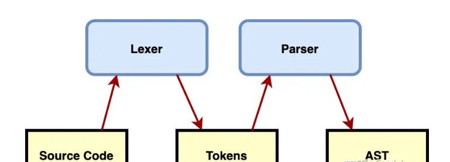
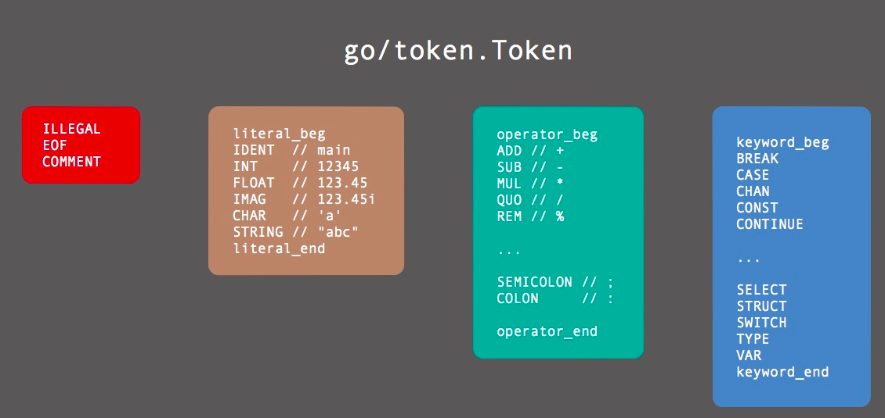

<!-- START doctoc generated TOC please keep comment here to allow auto update -->
<!-- DON'T EDIT THIS SECTION, INSTEAD RE-RUN doctoc TO UPDATE -->
**Table of Contents**  *generated with [DocToc](https://github.com/thlorenz/doctoc)*

- [AST（Abstract Syntax Tree 抽象语法树）](#astabstract-syntax-tree-%E6%8A%BD%E8%B1%A1%E8%AF%AD%E6%B3%95%E6%A0%91)
  - [Token](#token)
  - [AST的常见的几个用途](#ast%E7%9A%84%E5%B8%B8%E8%A7%81%E7%9A%84%E5%87%A0%E4%B8%AA%E7%94%A8%E9%80%94)
  - [go/token 源码](#gotoken-%E6%BA%90%E7%A0%81)
    - [FileSet & File](#fileset--file)
    - [Position](#position)
  - [go/ast 源码](#goast-%E6%BA%90%E7%A0%81)
    - [Lit](#lit)
    - [Expression](#expression)
    - [Declaration Node](#declaration-node)
    - [General declaration](#general-declaration)
  - [parser](#parser)
  - [参考](#%E5%8F%82%E8%80%83)

<!-- END doctoc generated TOC please keep comment here to allow auto update -->

# AST（Abstract Syntax Tree 抽象语法树）




1 词法分析器(A Lexical Analyzer Generator): 对文本(Source Code)进行词法分析，生成Token(又称扫描)。一般接下来是将它传给一个解析器，然后检索生成AST。


Lexer-又名词法分析器：词法分析器用来将字符序列转换为单词(Token)。词法分析主要是完成：

- 对源程序的代码进行从左到右的逐行扫描，识别出各个单词，从而确定单词的类型；
- 将识别出的单词转换为统一的机内表示——词法单元（Token）形式。

```go
go package main
const s = "foo" 
```
转换为token之后
```shell
PACKAGE(package) 
IDENT(main) 
CONST(const) 
IDENT(s) 
ASSIGN(=) 
STRING("foo") 
EOF() 
```

Token被定义为一种枚举值，不同值的Token表示不同类型的词法记号。


2 语法分析器(Parser)：语法分析器的作用是进行语法检查、并构建由输入的单词(Token)组成的数据结构（一般是语法分析树、抽象语法树等层次化的数据结构）


## Token 

Token是编程语言中最小的具有独立意义的词法单元。Token不仅包含关键字，还包含了各种用户自定义的标识符、运算符、分隔符和注释等。

Token对应的词法单元有三个重要属性：

- Token本身的值表示词法单元的类型
- Token在源代码中的表现形式
- Token出现的位置


所有的Token被分为四类：特殊类型的Token、基础面值对应的Token、运算符Token和关键字。


*_beg是私有类型，主要用于值域范围范围的判断
```go
// IsOperator returns true for tokens corresponding to operators and
// delimiters; it returns false otherwise.
func (tok Token) IsOperator() bool {
	return (operator_beg < tok && tok < operator_end) || tok == TILDE
}


// go1.20/src/go/token/token.go
// Token is the set of lexical tokens of the Go programming language.
type Token int

// The list of tokens.
const (
  // Special tokens
  ILLEGAL Token = iota
  EOF
  COMMENT
  
  literal_beg
  // Identifiers and basic type literals
  // (these tokens stand for classes of literals)
  IDENT  // main
  INT    // 12345
  FLOAT  // 123.45
  IMAG   // 123.45i
  CHAR   // 'a'
  STRING // "abc"
  literal_end
  
  operator_beg
  // Operators and delimiters
  
  // ....
}


var tokens = [...]string{
	ILLEGAL: "ILLEGAL",

	EOF:     "EOF",
	COMMENT: "COMMENT",
	// ...
}
```


## AST的常见的几个用途
- 代码语法的检查、代码风格的检查、代码的格式化、代码的高亮、代码错误提示、代码自动补全等等
  - 如使用语言的Lint工具对代码错误或风格的检查，发现一些潜在的错误
  - IDE的错误提示、格式化、高亮、自动补全等
- 代码混淆压缩
  - UglifyJS2等
- 优化变更代码，改变代码结构使达到想要的结构
  - 代码打包工具webpack、rollup等等
  - CommonJS、AMD、CMD、UMD等代码规范之间的转化
  - CoffeeScript、TypeScript、JSX等转化为原生Javascript


golang官方提供的几个包，可以帮助我们进行AST分析：

- go/scanner：词法解析，将源代码分割成一个个token
- go/token：token类型及相关结构体定义
- go/ast：ast的结构定义
- go/parser：语法分析，读取token流生成ast


## go/token 源码


### FileSet & File
Go语言是由多个文件组成的包，而后多个包链接为一个可执行文件，因此单个包对应的多个文件可被视作Go的基本编译单元。

```go

// /Users/python/go/go1.23.0/src/go/token/position.go

// 一组文件
type FileSet struct {
	mutex sync.RWMutex         // protects the file set
	base  int                  // base offset for the next file
	files []*File              // list of files in the order added to the set
	last  atomic.Pointer[File] // cache of last file looked up
}
```

```go
// /Users/python/go/go1.23.0/src/go/ast/ast.go

// 单个文件
// A File is a handle for a file belonging to a FileSet.
// A File has a name, size, and line offset table.
type File struct {
	name string // file name as provided to AddFile
	base int    // Pos value range for this file is [base...base+size]
	size int    // file size as provided to AddFile

	// lines and infos are protected by mutex
	mutex sync.Mutex
	lines []int // lines contains the offset of the first character for each line (the first entry is always 0)
	infos []lineInfo
}

```

FileSet可以抽象为一个存储File的一维数组。而每个File的主要组成为name、base、size。

### Position
```go
type Position struct {
	Filename string // filename, if any
	Offset   int    // offset, starting at 0
	Line     int    // line number, starting at 1
	Column   int    // column number, starting at 1 (byte count)
}

```


## go/ast 源码

Node有如下几种类型:

- Comments 注释， //-style 或是 /*-style
- Declarations 声明，GenDecl (generic declaration node) 代表 import, constant, type 或 variable declaration. BadDecl 代表有语法错误的 node
- Statements: 赋值语句，控制语句（if，else,for，select...）等
- File 代表一个 go 源码文件
- Package 代表一组源代码文件
- Expr 表达式 ArrayExpr, StructExpr, SliceExpr 等等

主要由三种节点构成：分别是表达式和类型节点(Expressions and type nodes)、语句节点(statement nodes)和声明节点(declaration nodes)
```go
// ----------------------------------------------------------------------------
// Interfaces
//
// There are 3 main classes of nodes: Expressions and type nodes,
// statement nodes, and declaration nodes. The node names usually
// match the corresponding Go spec production names to which they
// correspond. The node fields correspond to the individual parts
// of the respective productions.
//
// All nodes contain position information marking the beginning of
// the corresponding source text segment; it is accessible via the
// Pos accessor method. Nodes may contain additional position info
// for language constructs where comments may be found between parts
// of the construct (typically any larger, parenthesized subpart).
// That position information is needed to properly position comments
// when printing the construct.

// All node types implement the Node interface.
type Node interface {
	Pos() token.Pos // position of first character belonging to the node
	End() token.Pos // position of first character immediately after the node
}

// All expression nodes implement the Expr interface.
type Expr interface {
	Node
	exprNode()
}

// All statement nodes implement the Stmt interface.
type Stmt interface {
	Node
	stmtNode()
}

// All declaration nodes implement the Decl interface.
type Decl interface {
	Node
	declNode()
}
```
主要接口实现了ast.Node。

- ast.Expr - 代表表达式和类型的节点
- ast.Stmt - 代表报表节点
- ast.Decl - 代表声明节点

### Lit 

BasicLit是程序代码中直接表示的值。比如在x*2+1中，2即为BasicLit，而x不是BasicLit而是identifier


```go
type (
// A BasicLit node represents a literal of basic type.
	BasicLit struct {
		ValuePos token.Pos   // literal position
		Kind     token.Token // token.INT, token.FLOAT, token.IMAG, token.CHAR, or token.STRING
		Value    string      // literal string; e.g. 42, 0x7f, 3.14, 1e-9, 2.4i, 'a', '\x7f', "foo" or `\m\n\o`
	}

)
```

### Expression

基础表达式主要是由一元、二元运算符组成的表达式，运算的主题为各种面值、或标识符。语法如下所示。


```go
type Node interface {
	Pos() token.Pos // position of first character belonging to the node
	End() token.Pos // position of first character immediately after the node
}

// All expression nodes implement the Expr interface.
type Expr interface {
	Node
	exprNode()
}
```
```shell
✗ go doc go/ast | grep Expr

type BadExpr struct{ ... }
type BinaryExpr struct{ ... }
type CallExpr struct{ ... }
type Expr interface{ ... }
type ExprStmt struct{ ... }
type IndexExpr struct{ ... }
type IndexListExpr struct{ ... }
type KeyValueExpr struct{ ... }
type ParenExpr struct{ ... }
type SelectorExpr struct{ ... }
type SliceExpr struct{ ... }
type StarExpr struct{ ... }
type TypeAssertExpr struct{ ... }
type UnaryExpr struct{ ... }
```

### Declaration Node

### General declaration
通用声明是不含函数声明的包级别声明，包含：导入、类型、常量和变量四种声明

```go
import "fmt"
import https "net/http"
import . "go/token"
import _ "go/parser"
```

- 第一种为默认的导包形式，即将包名作为符号导入当前的文件的符号空间；
- 第二种将导入的net/http以https命名导入当前文件的符号空间；
- 第三种将包中所有公开符号导入当前文件的符号空间；
- 第四种仅触发包初始化动作，而不导入任何符号


## parser

ParseFile 函数的作用：解析单个 Go 源文件的源代码，并返回对应的 ast.File 节点。
```go
func ParseFile(fset *token.FileSet, filename string, src any, mode Mode) (f *ast.File, err error) {
    // ...
	
	// get source: 如果传入了 src，优先从 src 解析文件,其次从filename
	text, err := readSource(filename, src)
	if err != nil {
		return nil, err
	}

	var p parser
    // ...

	// parse source
	p.init(fset, filename, text, mode)
	f = p.parseFile()

	return
}


func (p *parser) init(fset *token.FileSet, filename string, src []byte, mode Mode) {
	p.file = fset.AddFile(filename, -1, len(src))
	eh := func(pos token.Position, msg string) { p.errors.Add(pos, msg) }
	p.scanner.Init(p.file, src, eh, scanner.ScanComments)

	p.top = true
	p.mode = mode
	p.trace = mode&Trace != 0 // for convenience (p.trace is used frequently)
	p.next()
}
```

## 参考
- https://github.com/chai2010/go-ast-book
- [Golang的抽象语法树(AST)](https://zhuanlan.zhihu.com/p/380421057)
- [Go AST 浅析与CTF中的实战运用](https://tttang.com/archive/1736/)