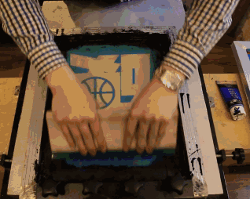

<!-- START doctoc generated TOC please keep comment here to allow auto update -->
<!-- DON'T EDIT THIS SECTION, INSTEAD RE-RUN doctoc TO UPDATE -->
**Table of Contents**  *generated with [DocToc](https://github.com/thlorenz/doctoc)*

- [Generic泛型](#generic%E6%B3%9B%E5%9E%8B)
  - [使用背景](#%E4%BD%BF%E7%94%A8%E8%83%8C%E6%99%AF)
  - [Go泛型方案](#go%E6%B3%9B%E5%9E%8B%E6%96%B9%E6%A1%88)
    - [1. 字典(dictionaries)：单份代码实例，以字典传递类型参数信息。](#1-%E5%AD%97%E5%85%B8dictionaries%E5%8D%95%E4%BB%BD%E4%BB%A3%E7%A0%81%E5%AE%9E%E4%BE%8B%E4%BB%A5%E5%AD%97%E5%85%B8%E4%BC%A0%E9%80%92%E7%B1%BB%E5%9E%8B%E5%8F%82%E6%95%B0%E4%BF%A1%E6%81%AF)
    - [2. 模版(stenciling)：为每次调用生成代码实例，即便类型参数相同。](#2-%E6%A8%A1%E7%89%88stenciling%E4%B8%BA%E6%AF%8F%E6%AC%A1%E8%B0%83%E7%94%A8%E7%94%9F%E6%88%90%E4%BB%A3%E7%A0%81%E5%AE%9E%E4%BE%8B%E5%8D%B3%E4%BE%BF%E7%B1%BB%E5%9E%8B%E5%8F%82%E6%95%B0%E7%9B%B8%E5%90%8C)
    - [3. 混合方案（GC Shape Stenciling）](#3-%E6%B7%B7%E5%90%88%E6%96%B9%E6%A1%88gc-shape-stenciling)
  - [类型形参(Type Parameters)](#%E7%B1%BB%E5%9E%8B%E5%BD%A2%E5%8F%82type-parameters)
    - [类型约束(Type Constraint)](#%E7%B1%BB%E5%9E%8B%E7%BA%A6%E6%9D%9Ftype-constraint)
    - [类型具化（instantiation）与类型推导（type inference）](#%E7%B1%BB%E5%9E%8B%E5%85%B7%E5%8C%96instantiation%E4%B8%8E%E7%B1%BB%E5%9E%8B%E6%8E%A8%E5%AF%BCtype-inference)
  - [类型集合(Type sets)](#%E7%B1%BB%E5%9E%8B%E9%9B%86%E5%90%88type-sets)
  - [参考资料](#%E5%8F%82%E8%80%83%E8%B5%84%E6%96%99)

<!-- END doctoc generated TOC please keep comment here to allow auto update -->

# Generic泛型
Go的泛型指的是在Go的类型声明和函数声明中增加可选的类型形参(type parameters)。
类型形参(type parameters)要受到类型约束（constraint），Go使用嵌入额外元素的接口类型来定义类型约束，类型约束定义了一组满足约束的类型集(Type Set)

Go 1.18版本增加了对泛型的支持,
除了语法，外加两个预定义类型：
- comparable: 是Go语言内置的类型约束，它表示类型的值可以使用==和!=比较大小，这也是map类型的key要求的
- any 任意类型， 
增加了两个操作符: 
- ~
- | : 表示允许两者中的任何一个

```go
func SumIntsOrFloats[K comparable, V int64 | float64](m map[K]V) V {
	var s V
	for _, v := range m {
		s += v
	}
	return s
}
```
泛型在Go语言中增加了三个新的重要内容

- 函数和类型新增对 *类型形参(type parameters)* 的支持。 
- 将接口类型定义为类型集合，包括没有方法的接口类型。 
- 支持类型推导，大多数情况下，调用泛型函数时可省略类型实参(type arguments)。

## 使用背景
- Go官方团队在Go 1.18 Beta 1版本的标准库里因为泛型设计而引入了contraints包，Go官方团队的技术负责人Russ Cox在2022.01.25提议将constraints包从Go标准库里移除，放到x/exp项目下，
  该提议也同Go语言发明者Rob Pike, Robert Griesemer和Ian Lance Taylor做过讨论，得到了他们的同意。
- golang.org/x下所有package的源码独立于Go源码的主干分支，也不在Go的二进制安装包里。如果需要使用golang.org/x下的package，可以使用go get来安装。
- golang.org/x/exp下的所有package都属于实验性质或者被废弃的package，不建议使用。


## Go泛型方案

### 1. 字典(dictionaries)：单份代码实例，以字典传递类型参数信息。
在编译时生成一组实例化的字典，在实例化一个泛型函数的时候会使用字典进行蜡印(stencile).

当为泛型函数生成代码的时候，会生成唯一的一块代码，并且会在参数列表中增加一个字典做参数，就像方法会把receiver当成一个参数传入。字典包含为类型参数实例化的类型信息。

字典在编译时生成，存放在只读的data section中。

当然字段可以当成第一个参数，或者最后一个参数，或者放入一个独占的寄存器。

当然这种方案还有依赖问题，比如字典递归的问题，更重要的是，它对性能可能有比较大的影响，比如一个实例化类型int, x=y可能通过寄存器复制就可以了，但是泛型必须通过memmove

### 2. 模版(stenciling)：为每次调用生成代码实例，即便类型参数相同。
同一个泛型函数，为每一个实例化的类型参数生成一套独立的代码，感觉和rust的泛型特化一样。




比如下面一个泛型方法:
```go
func f[T1, T2 any](x int, y T1) T2 {
    ...
}
```
如果有两个不同的类型实例化的调用：
```go
var a float64 = f[int, float64](7, 8.0)
var b struct{f int} = f[complex128, struct{f int}](3, 1+1i)
```

那么这个方案会生成两套代码：
```go
func f1(x int, y int) float64 {
    ... identical bodies ...
}
func f2(x int, y complex128) struct{f int} {
    ... identical bodies ...
}
```

因为编译f时是不知道它的实例化类型的，只有在调用它时才知道它的实例化的类型，所以需要在调用时编译f。
对于相同实例化类型的多个调用，同一个package下编译器可以识别出来是一样的，只生成一个代码就可以了，但是不同的package就不简单了，这些函数表标记为DUPOK,所以链接器会丢掉重复的函数实现

这种策略需要更多的编译时间，因为需要编译泛型函数多次。因为对于同一个泛型函数，每种类型需要单独的一份编译的代码，如果类型非常多，编译的文件可能非常大，而且性能也比较差。


### 3. 混合方案（GC Shape Stenciling）

啥叫shape?

类型的shape是它对内存分配器/垃圾回收器呈现的方式，包括它的大小、所需的对齐方式、以及类型哪些部分包含指针.

每一个唯一的shape会产生一份代码，每份代码携带一个字典，包含了实例化类型的信息

```go
type a int
type b int
type c = int
```
任何指针类型，或具有相同底层类型(underlying type)的类型，属于同一GCShape组。


对于实例类型的shape相同的情况，只生成一份代码，对于shape类型相同的类型，使用字典区分类型的不同行为。


## 类型形参(Type Parameters)

类型形参是在函数声明、方法声明的receiver部分或类型定义的类型参数列表中，声明的（非限定）类型名称。
类型形参在声明中充当了一个未知类型的占位符（placeholder），在泛型函数或泛型类型实例化(instantiation)时，类型形参(Type Parameters)会被一个类型实参（type argument）替换

函数和类型被允许拥有类型形参(Type Parameters)。一个类型形参列表看起来和普通的函数形参列表一样，只是它使用的是中括号[方括号]而不是小括号()。

```go
func GenericFoo[P aConstraint, Q anotherConstraint](x,y P, z Q "P aConstraint, Q anotherConstraint")

```

P，Q是类型形参的名字，也就是类型，aConstraint，anotherConstraint代表类型参数的约束（constraint），我们可以理解为对类型参数可选值的一种限定 

```go
 func F[T any](p T) { ... }。
```
声明的类型参数可以在函数的参数和函数体中使用。 在这个例子中，T是类型参数的名字，也就是类型，any是类型参数的约束，是对类型参数可选类型的约束。但是T的类型要等到泛型函数具化时才能确定

### 类型约束(Type Constraint)

约束（constraint）规定了一个类型实参（type argument）必须满足的条件要求。
如果某个类型满足了某个约束规定的所有条件要求，那么它就是这个约束修饰的类型形参的一个合法的类型实参。 

在Go泛型中，我们使用interface类型来定义约束。为此，Go接口类型的定义也进行了扩展，我们既可以声明接口的方法集合，也可以声明可用作类型实参的类型列表。
```go
[T any]             // 任意类型
[T int]             // 只能是 int
[T ~int]            // 是 int 或底层类型是 int 的类型。(type I int)
[T int | string]    // 只能是 int 或 string。(interface{ int | string})
[T io.Reader]       // 任何实现io.Reader 接口的类型
```

- [参考代码](chapter32_generic/02_typeParam_n_typeArgument/main.go)


为了支持使用接口类型来定义Go泛型类型参数的类型约束，Go 1.18对接口定义语法进行了扩展。 在接口定义中既可以定义接口的方法集(Method Set)，也可以声明可以被用作泛型类型参数的类型实参的类型集(Type Set)


### 类型具化（instantiation）与类型推导（type inference）

Go编译器会根据传入的实参的类型，进行类型实参（type argument）的自动推导。自动类型推导使得人们在编写调用泛型函数的代码时可以使用一种更为自然的风格。


## 类型集合(Type sets)
一个普通函数的每个值形参(译注：value parameter，相对于类型形参type parameter)都有一个对应的类型；该类型定义了一组值.

类型形参列表中的每个类型形参都有一个类型。因为类型形参本身就是一个类型，所以类型形参的类型定义了类型的集合。
这种元类型(meta-type)被称为类型约束(type constraint).


## 参考资料
1. [鸟窝关于 Go 泛形实现](https://colobu.com/2021/08/30/how-is-go-generic-implemented/)
