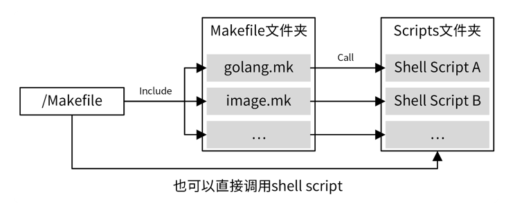
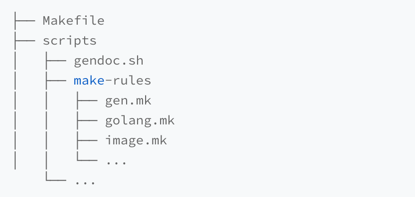

<!-- START doctoc generated TOC please keep comment here to allow auto update -->
<!-- DON'T EDIT THIS SECTION, INSTEAD RE-RUN doctoc TO UPDATE -->
**Table of Contents**  *generated with [DocToc](https://github.com/thlorenz/doctoc)*

- [Go makefile 项目](#go-makefile-%E9%A1%B9%E7%9B%AE)
  - [makefile 结构](#makefile-%E7%BB%93%E6%9E%84)
  - [iam 案例](#iam-%E6%A1%88%E4%BE%8B)
  - [makefile 编写技巧](#makefile-%E7%BC%96%E5%86%99%E6%8A%80%E5%B7%A7)
    - [1 善用通配符和自动变量](#1-%E5%96%84%E7%94%A8%E9%80%9A%E9%85%8D%E7%AC%A6%E5%92%8C%E8%87%AA%E5%8A%A8%E5%8F%98%E9%87%8F)
    - [2 善用函数](#2-%E5%96%84%E7%94%A8%E5%87%BD%E6%95%B0)
    - [3 依赖需要用到的工具](#3-%E4%BE%9D%E8%B5%96%E9%9C%80%E8%A6%81%E7%94%A8%E5%88%B0%E7%9A%84%E5%B7%A5%E5%85%B7)
    - [4 把常用功能放在 /Makefile 中，不常用的放在分类 Makefile 中](#4-%E6%8A%8A%E5%B8%B8%E7%94%A8%E5%8A%9F%E8%83%BD%E6%94%BE%E5%9C%A8-makefile-%E4%B8%AD%E4%B8%8D%E5%B8%B8%E7%94%A8%E7%9A%84%E6%94%BE%E5%9C%A8%E5%88%86%E7%B1%BB-makefile-%E4%B8%AD)
    - [5 编写可扩展的 Makefile](#5-%E7%BC%96%E5%86%99%E5%8F%AF%E6%89%A9%E5%B1%95%E7%9A%84-makefile)
    - [6 将所有输出存放在一个目录下，方便清理和查找](#6-%E5%B0%86%E6%89%80%E6%9C%89%E8%BE%93%E5%87%BA%E5%AD%98%E6%94%BE%E5%9C%A8%E4%B8%80%E4%B8%AA%E7%9B%AE%E5%BD%95%E4%B8%8B%E6%96%B9%E4%BE%BF%E6%B8%85%E7%90%86%E5%92%8C%E6%9F%A5%E6%89%BE)
    - [7 使用带层级的命名方式](#7-%E4%BD%BF%E7%94%A8%E5%B8%A6%E5%B1%82%E7%BA%A7%E7%9A%84%E5%91%BD%E5%90%8D%E6%96%B9%E5%BC%8F)
    - [8 做好目标拆分](#8-%E5%81%9A%E5%A5%BD%E7%9B%AE%E6%A0%87%E6%8B%86%E5%88%86)
    - [9 设置 OPTIONS](#9-%E8%AE%BE%E7%BD%AE-options)
    - [10 定义环境变量](#10-%E5%AE%9A%E4%B9%89%E7%8E%AF%E5%A2%83%E5%8F%98%E9%87%8F)
    - [11 自己调用自己](#11-%E8%87%AA%E5%B7%B1%E8%B0%83%E7%94%A8%E8%87%AA%E5%B7%B1)
  - [参考资料](#%E5%8F%82%E8%80%83%E8%B5%84%E6%96%99)

<!-- END doctoc generated TOC please keep comment here to allow auto update -->

# Go makefile 项目


通常而言，Go 项目的 Makefile 应该实现以下功能：格式化代码、静态代码检查、单元测试、代码构建、文件清理、帮助等等。

如果通过 docker 部署，还需要有 docker 镜像打包功能。因为 Go 是跨平台的语言，所以构建和 docker 打包命令，还要能够支持不同的 CPU 架构和平台。为了能够更好地控制 Makefile 命令的行为，还需要支持 Options。


## makefile 结构


对于大型项目来说，需要管理的内容很多，所有管理功能都集成在一个 Makefile 中，可能会导致 Makefile 很大，难以阅读和维护，所以建议采用分层的设计方法，根目录下的 Makefile 聚合所有的 Makefile 命令，具体实现则按功能分类，放在另外的 Makefile 中


我们经常会在 Makefile 命令中集成 shell 脚本，但如果 shell 脚本过于复杂，也会导致 Makefile 内容过多，难以阅读和维护。并且在 Makefile 中集成复杂的 shell 脚本，编写体验也很差。

对于这种情况，可以将复杂的 shell 命令封装在 shell 脚本中，供 Makefile 直接调用，而一些简单的命令则可以直接集成在 Makefile 中



在上面的 Makefile 组织方式中，根目录下的 Makefile 聚合了项目所有的管理功能，这些管理功能通过 Makefile 伪目标的方式实现。
同时，还将这些伪目标进行分类，把相同类别的伪目标放在同一个 Makefile 中，这样可以使得 Makefile 更容易维护。对于复杂的命令，则编写成独立的 shell 脚本，并在 Makefile 命令中调用这些 shell 脚本。


## iam 案例


我们将相同类别的操作统一放在 scripts/make-rules 目录下的 Makefile 文件中。Makefile 的文件名参考分类命名，例如 golang.mk。最后，在 /Makefile 中 include 这些 Makefile。

为了跟 Makefile 的层级相匹配，golang.mk 中的所有目标都按 go.xxx 方式命名。

通过这种命名方式，我们可以很容易分辨出某个目标完成什么功能，放在什么文件里，这在复杂的 Makefile 中尤其有用。以下是 IAM 项目根目录下，Makefile 的内容摘录，你可以看一看，作为参考：
```makefile
# Copyright 2020 Lingfei Kong <colin404@foxmail.com>. All rights reserved.
# Use of this source code is governed by a MIT style
# license that can be found in the LICENSE file.

# Build all by default, even if it's not first
.DEFAULT_GOAL := all

.PHONY: all
all: tidy gen add-copyright format lint cover build

# ==============================================================================
# Build options

ROOT_PACKAGE=github.com/marmotedu/iam
VERSION_PACKAGE=github.com/marmotedu/component-base/pkg/version

# ==============================================================================
# Includes

include scripts/make-rules/common.mk # make sure include common.mk at the first include line
include scripts/make-rules/golang.mk
include scripts/make-rules/image.mk
include scripts/make-rules/deploy.mk
include scripts/make-rules/copyright.mk
include scripts/make-rules/gen.mk
include scripts/make-rules/ca.mk
include scripts/make-rules/release.mk
include scripts/make-rules/swagger.mk
include scripts/make-rules/dependencies.mk
include scripts/make-rules/tools.mk

# ==============================================================================
# Usage

define USAGE_OPTIONS

Options:
  DEBUG            Whether to generate debug symbols. Default is 0.
  BINS             The binaries to build. Default is all of cmd.
                   This option is available when using: make build/build.multiarch
                   Example: make build BINS="iam-apiserver iam-authz-server"
  IMAGES           Backend images to make. Default is all of cmd starting with iam-.
                   This option is available when using: make image/image.multiarch/push/push.multiarch
                   Example: make image.multiarch IMAGES="iam-apiserver iam-authz-server"
  REGISTRY_PREFIX  Docker registry prefix. Default is marmotedu. 
                   Example: make push REGISTRY_PREFIX=ccr.ccs.tencentyun.com/marmotedu VERSION=v1.6.2
  PLATFORMS        The multiple platforms to build. Default is linux_amd64 and linux_arm64.
                   This option is available when using: make build.multiarch/image.multiarch/push.multiarch
                   Example: make image.multiarch IMAGES="iam-apiserver iam-pump" PLATFORMS="linux_amd64 linux_arm64"
  VERSION          The version information compiled into binaries.
                   The default is obtained from gsemver or git.
  V                Set to 1 enable verbose build. Default is 0.
endef
export USAGE_OPTIONS

# ==============================================================================
# Targets

## build: Build source code for host platform.
.PHONY: build
build:
	@$(MAKE) go.build

## build.multiarch: Build source code for multiple platforms. See option PLATFORMS.
.PHONY: build.multiarch
build.multiarch:
	@$(MAKE) go.build.multiarch

## image: Build docker images for host arch.
.PHONY: image
image:
	@$(MAKE) image.build

## image.multiarch: Build docker images for multiple platforms. See option PLATFORMS.
.PHONY: image.multiarch
image.multiarch:
	@$(MAKE) image.build.multiarch

## push: Build docker images for host arch and push images to registry.
.PHONY: push
push:
	@$(MAKE) image.push

## push.multiarch: Build docker images for multiple platforms and push images to registry.
.PHONY: push.multiarch
push.multiarch:
	@$(MAKE) image.push.multiarch

## deploy: Deploy updated components to development env.
.PHONY: deploy
deploy:
	@$(MAKE) deploy.run

## clean: Remove all files that are created by building.
.PHONY: clean
clean:
	@echo "===========> Cleaning all build output"
	@-rm -vrf $(OUTPUT_DIR)

## lint: Check syntax and styling of go sources.
.PHONY: lint
lint:
	@$(MAKE) go.lint

## test: Run unit test.
.PHONY: test
test:
	@$(MAKE) go.test

## cover: Run unit test and get test coverage.
.PHONY: cover 
cover:
	@$(MAKE) go.test.cover

.PHONY: release.build
release.build:
	@$(MAKE) push.multiarch

## release: Release iam
.PHONY: release
release:
	@$(MAKE) release.run

## format: Gofmt (reformat) package sources (exclude vendor dir if existed).
.PHONY: format
format: tools.verify.golines tools.verify.goimports
	@echo "===========> Formating codes"
	@$(FIND) -type f -name '*.go' | $(XARGS) gofmt -s -w
	@$(FIND) -type f -name '*.go' | $(XARGS) goimports -w -local $(ROOT_PACKAGE)
	@$(FIND) -type f -name '*.go' | $(XARGS) golines -w --max-len=120 --reformat-tags --shorten-comments --ignore-generated .
	@$(GO) mod edit -fmt

## verify-copyright: Verify the boilerplate headers for all files.
.PHONY: verify-copyright
verify-copyright:
	@$(MAKE) copyright.verify

## add-copyright: Ensures source code files have copyright license headers.
.PHONY: add-copyright
add-copyright:
	@$(MAKE) copyright.add

## gen: Generate all necessary files, such as error code files.
.PHONY: gen
gen:
	@$(MAKE) gen.run

## ca: Generate CA files for all iam components.
.PHONY: ca
ca:
	@$(MAKE) gen.ca

## install: Install iam system with all its components.
.PHONY: install
install:
	@$(MAKE) install.install

## swagger: Generate swagger document.
.PHONY: swagger
swagger:
	@$(MAKE) swagger.run

## serve-swagger: Serve swagger spec and docs.
.PHONY: swagger.serve
serve-swagger:
	@$(MAKE) swagger.serve

## dependencies: Install necessary dependencies.
.PHONY: dependencies
dependencies:
	@$(MAKE) dependencies.run

## tools: install dependent tools.
.PHONY: tools
tools:
	@$(MAKE) tools.install

## check-updates: Check outdated dependencies of the go projects.
.PHONY: check-updates
check-updates:
	@$(MAKE) go.updates

.PHONY: tidy
tidy:
	@$(GO) mod tidy

## help: Show this help info.
.PHONY: help
help: Makefile
	@echo -e "\nUsage: make <TARGETS> <OPTIONS> ...\n\nTargets:"
	@sed -n 's/^##//p' $< | column -t -s ':' | sed -e 's/^/ /'
	@echo "$$USAGE_OPTIONS"

```


## makefile 编写技巧

### 1 善用通配符和自动变量

Makefile 允许对目标进行类似正则运算的匹配，主要用到的通配符是%。

通过使用通配符，可以使不同的目标使用相同的规则，从而使 Makefile 扩展性更强，也更简洁。

IAM 实战项目中，就大量使用了通配符 %。例如go.build.%,ca.gen.%,deploy.run.%等。


案例：tools.verify.%

```shell
.PHONY: tools.verify.%
tools.verify.%:
	@if ! which $* &>/dev/null; then $(MAKE) tools.install.$*; fi
```

make tools.verify.swagger, make tools.verify.mockgen 等均可以使用上面定义的规则，%分别代表了swagger,mockgen.

如果不使用%,我们需要单独写tools.verify.swagger, tools.verify.mockgen规则。

tools.verify.%这种命名方式的好处：tools 说明依赖的定义位于 scripts/make-rules/tools.mk.
伪目标属于 verify 分类，主要用来验证工具是否安装。通过这种命名方式，你可以很容易地知道目标位于哪个 Makefile 文件中，以及想要完成的功能。

另外，上面的定义中还用到了自动变量,用来指代被匹配的值swagger,mockgen.

Makefile 自带的函数能够帮助我们实现很多强大的功能。所以，在我们编写 Makefile 的过程中，如果有功能需求，可以优先使用这些函数。

### 2 善用函数
Makefile 自带的函数能够帮助我们实现很多强大的功能。所以，在我们编写 Makefile 的过程中，如果有功能需求，可以优先使用这些函数.
- [Makefile常用函数列表](chapter33_makefile/makefile_func.md)

### 3 依赖需要用到的工具

如果 Makefile 某个目标的命令中用到了某个工具，可以将该工具放在目标的依赖中。这样，当执行该目标时，就可以指定检查系统是否安装该工具，如果没有安装则自动安装，从而实现更高程度的自动化。例如，/Makefile 文件中，format 伪目标，定义如下
```makefile
.PHONY: format
format: tools.verify.golines tools.verify.goimports
  @echo "===========> Formating codes"
  @$(FIND) -type f -name '*.go' | $(XARGS) gofmt -s -w
  @$(FIND) -type f -name '*.go' | $(XARGS) goimports -w -local $(ROOT_PACKAGE)
  @$(FIND) -type f -name '*.go' | $(XARGS) golines -w --max-len=120 --reformat-tags --shorten-comments --ignore-generated .
```
format 依赖tools.verify.golines tools.verify.goimports

再来看下tools.verify.golines的定义
```makefile

tools.verify.%:
  @if ! which $* &>/dev/null; then $(MAKE) tools.install.$*; fi
```
再来看下tools.install.$*规则：
```makefile
.PHONY: tools.install
tools.install: $(addprefix tools.install., $(TOOLS))

.PHONY: tools.install.%
tools.install.%:
	@echo "===========> Installing $*"
	@$(MAKE) install.$*


.PHONY: install.golines
install.golines:
  @$(GO) get -u github.com/segmentio/golines
```
通过tools.verify.%规则定义，我们可以知道，tools.verify.%会先检查工具是否安装，如果没有安装，就会执行tools.install.$*来安装。
如此一来，当我们执行tools.verify.%目标时，如果系统没有安装 golines 命令，就会自动调用go get安装，提高了 Makefile 的自动化程度


### 4 把常用功能放在 /Makefile 中，不常用的放在分类 Makefile 中

一个项目，尤其是大型项目，有很多需要管理的地方，其中大部分都可以通过 Makefile 实现自动化操作。不过，为了保持 /Makefile 文件的整洁性，我们不能把所有的命令都添加在 /Makefile 文件中。

IAM 项目的 /Makefile 集成了format、lint、test、build等常用命令，而将gen.errcode.code、gen.errcode.doc这类不常用的功能放在 scripts/make-rules/gen.mk 文件中。
当然，我们也可以直接执行 make gen.errcode.code来执行gen.errcode.code伪目标。
通过这种方式，既可以保证 /Makefile 的简洁、易维护，又可以通过make命令来运行伪目标，更加灵活。


### 5 编写可扩展的 Makefile

- 可以在不改变 Makefile 结构的情况下添加新功能。
- 扩展项目时，新功能可以自动纳入到 Makefile 现有逻辑中
```makefile

COMMANDS ?= $(filter-out %.md, $(wildcard ${ROOT_DIR}/cmd/*))
BINS ?= $(foreach cmd,${COMMANDS},$(notdir ${cmd}))

.PHONY: go.build
go.build: go.build.verify $(addprefix go.build., $(addprefix $(PLATFORM)., $(BINS)))
.PHONY: go.build.%               

go.build.%:             
  $(eval COMMAND := $(word 2,$(subst ., ,$*)))
  $(eval PLATFORM := $(word 1,$(subst ., ,$*)))
  $(eval OS := $(word 1,$(subst _, ,$(PLATFORM))))           
  $(eval ARCH := $(word 2,$(subst _, ,$(PLATFORM))))                         
  @echo "===========> Building binary $(COMMAND) $(VERSION) for $(OS) $(ARCH)"
  @mkdir -p $(OUTPUT_DIR)/platforms/$(OS)/$(ARCH)
  @CGO_ENABLED=0 GOOS=$(OS) GOARCH=$(ARCH) $(GO) build $(GO_BUILD_FLAGS) -o $(OUTPUT_DIR)/platforms/$(OS)/$(ARCH)/$(COMMAND)$(GO_OUT_EXT) $(ROOT_PACKAGE)/cmd/$(COMMAND)
```

### 6 将所有输出存放在一个目录下，方便清理和查找

在执行 Makefile 的过程中，会输出各种各样的文件，例如 Go 编译后的二进制文件、测试覆盖率数据等，我建议你把这些文件统一放在一个目录下，方便后期的清理和查找。
通常我们可以把它们放在_output这类目录下，这样清理时就很方便，只需要清理_output文件夹就可以

```makefile

.PHONY: go.clean
go.clean:
  @echo "===========> Cleaning all build output"
  @-rm -vrf $(OUTPUT_DIR)
```
这里要注意，要用-rm，而不是rm，防止在没有_output目录时，执行make go.clean报错。

### 7 使用带层级的命名方式

通过使用带层级的命名方式，例如tools.verify.swagger ，我们可以实现目标分组管理。这样做的好处有很多。
首先，当 Makefile 有大量目标时，通过分组，我们可以更好地管理这些目标。
其次，分组也能方便理解，可以通过组名一眼识别出该目标的功能类别。
最后，这样做还可以大大减小目标重名的概率

```makefile

.PHONY: gen.run
gen.run: gen.clean gen.errcode gen.docgo

.PHONY: gen.errcode
gen.errcode: gen.errcode.code gen.errcode.doc

.PHONY: gen.errcode.code
gen.errcode.code: tools.verify.codegen
    ...
.PHONY: gen.errcode.doc
gen.errcode.doc: tools.verify.codegen
    ...
```

### 8 做好目标拆分
还有一个比较实用的技巧：我们要合理地拆分目标。比如，我们可以将安装工具拆分成两个目标：验证工具是否已安装和安装工具。

```makefile

gen.errcode.code: tools.verify.codegen

tools.verify.%:    
  @if ! which $* &>/dev/null; then $(MAKE) tools.install.$*; fi  

.PHONY: install.codegen
install.codegen:              
  @$(GO) install ${ROOT_DIR}/tools/codegen/codegen.go
```

上面的 Makefile 中，gen.errcode.code 依赖了 tools.verify.codegen，tools.verify.codegen 会先检查 codegen 命令是否存在，
如果不存在，再调用 install.codegen 来安装 codegen 工具。


### 9 设置 OPTIONS

假设我们需要通过一个选项 V ，来控制是否需要在执行 Makefile 时打印详细的信息。这可以通过下面的步骤来实现。

首先，在 /Makefile 中定义 USAGE_OPTIONS 。定义 USAGE_OPTIONS 可以使开发者在执行 make help 后感知到此 OPTION，并根据需要进行设置。

```makefile

define USAGE_OPTIONS    
                         
Options:
  ...
  BINS         The binaries to build. Default is all of cmd.
               ...
  ...
  V            Set to 1 enable verbose build. Default is 0.    
endef    
export USAGE_OPTIONS    
```

接着，在scripts/make-rules/common.mk文件中，我们通过判断有没有设置 V 选项，来选择不同的行为
```makefile

ifndef V    
MAKEFLAGS += --no-print-directory    
endif
```

```makefile
ifeq ($(origin V), undefined) 
MAKEFLAGS += --no-print-directory 
endif
```


### 10 定义环境变量

```makefile

GO := go                                          
GO_SUPPORTED_VERSIONS ?= 1.13|1.14|1.15|1.16|1.17    
GO_LDFLAGS += -X $(VERSION_PACKAGE).GitVersion=$(VERSION) \    
  -X $(VERSION_PACKAGE).GitCommit=$(GIT_COMMIT) \       
  -X $(VERSION_PACKAGE).GitTreeState=$(GIT_TREE_STATE) \                          
  -X $(VERSION_PACKAGE).BuildDate=$(shell date -u +'%Y-%m-%dT%H:%M:%SZ')    
ifneq ($(DLV),)                                                                                                                              
  GO_BUILD_FLAGS += -gcflags "all=-N -l"    
  LDFLAGS = ""      
endif                                                                                   
GO_BUILD_FLAGS += -tags=jsoniter -ldflags "$(GO_LDFLAGS)" 
...
FIND := find . ! -path './third_party/*' ! -path './vendor/*'    
XARGS := xargs --no-run-if-empty 
```

### 11 自己调用自己
在编写 Makefile 的过程中，你可能会遇到这样一种情况：A-Target 目标命令中，需要完成操作 B-Action，而操作 B-Action 我们已经通过伪目标 B-Target 实现过。
为了达到最大的代码复用度，这时候最好的方式是在 A-Target 的命令中执行 B-Target。方法如下：

```makefile

tools.verify.%:
  @if ! which $* &>/dev/null; then $(MAKE) tools.install.$*; fi
```

这里，我们通过 $(MAKE) 调用了伪目标 tools.install.$* 。要注意的是，默认情况下，Makefile 在切换目录时会输出以下信息

```shell

$ make tools.install.codegen
===========> Installing codegen
make[1]: Entering directory `/home/colin/workspace/golang/src/github.com/marmotedu/iam'
make[1]: Leaving directory `/home/colin/workspace/golang/src/github.com/marmotedu/iam'
```

如果觉得 Entering directory 这类信息很烦人，可以通过设置 MAKEFLAGS += --no-print-directory 来禁止 Makefile 打印这些信息

## 参考资料
1. [IAM 的makefile 最佳实践](https://github.com/marmotedu/iam/blob/master/Makefile)