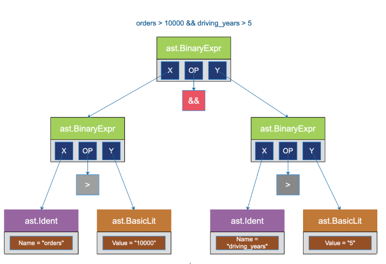

# 需求来理解 ast 的强大


假定一个场景：我们可以从司机平台的某个接口获取司机的各种特征，例如：年龄、订单数、收入、每天驾驶时长、驾龄、平均车速、被投诉次数……数据一般采用 json 来传递。

司机平台的运营小姐姐经常需要搞一些活动，例如选出：

- 订单数超过 10000，且驾龄超过 5 年的老司机
- 每天驾驶时小于 3 小时，且收入超过 500 的高效司机
- 年龄大于 40，且平均速度大于 70 的“狂野”司机


## 实现


- [正常实现，需要频繁改代码](chapter34_ast/01_easy_use/01_normal/driver_test.go)

- [ast 二元表达式实现](chapter34_ast/01_easy_use/02_ast/ast_test.go)


## 源码分析 二元表达式

```go
type (
	// A BinaryExpr node represents a binary expression.
	BinaryExpr struct {
		X     Expr        // left operand  左操作数
		OpPos token.Pos   // position of Op 操作符在表达式中的偏移
		Op    token.Token // operator 操作符
		Y     Expr        // right operand 右操作数
	}
)
```


## 参考资料
1. [曹大带我学ast](https://cloud.tencent.com/developer/article/1836272)