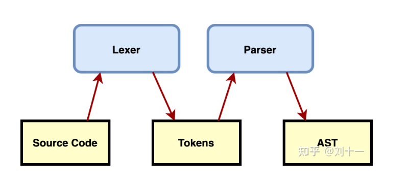
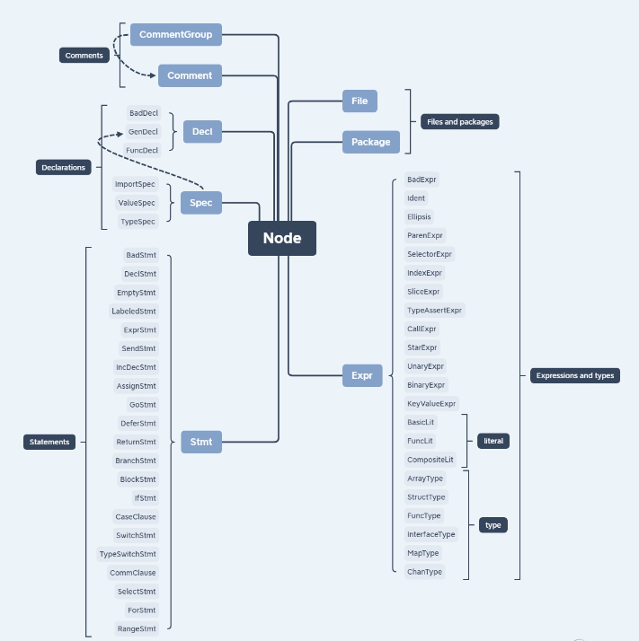

# 抽象语法树 AST（Abstract Syntax Tree）


大多数编译器和解释器都使用AST作为源代码的内部表示，AST通常会省略语法树中的分号、换行字符、白空格、大括号、方括号和圆括号等

## 用途

- 代码语法的检查、代码风格的检查、代码的格式化、代码的高亮、代码错误提示、代码自动补全等等,如 goimport，gomock，wire 等项目
  - 如使用语言的Lint工具对代码错误或风格的检查，发现一些潜在的错误
  - IDE的错误提示、格式化、高亮、自动补全等
- 代码混淆压缩
  - UglifyJS2等
  - 优化变更代码，改变代码结构使达到想要的结构
- 代码打包工具webpack、rollup等等
  - CommonJS、AMD、CMD、UMD等代码规范之间的转化
  - CoffeeScript、TypeScript、JSX等转化为原生Javascript

## 生成AST的步骤



首先，计算机先用一个词法分析器(Lexer)对文本(Source Code)进行词法分析，生成Token。一般接下来是将它传给一个解析器，然后检索生成AST

Lexer-又名词法分析器：词法分析器用来将字符序列转换为单词(Token)。词法分析主要是完成：

1. 对源程序的代码进行从左到右的逐行扫描，识别出各个单词，从而确定单词的类型；
2. 将识别出的单词转换为统一的机内表示——词法单元（Token）形式。

token是一种类型Map的key/value形式，它由<种别码，属性值>组成，种别码就是类型、属性值就是值。例如下述代码中：


Parser-语法分析器：语法分析器的作用是进行语法检查、并构建由输入的单词(Token)组成的数据结构（一般是语法分析树、抽象语法树等层次化的数据结构）。

语法分析的分析方法一般分为自顶向下和自底向上两种：

- 自顶向下分析：可以被看作找到当前输入流最左推导的过程，对于任意一个输入流，根据当前的输入符号，确定一个生产规则，使用生产规则右侧的符号替代相应的非终结符向下推导；
- 自底向上分析：语法分析器从输入流开始，每次都尝试重写最右侧的多个符号，这其实是说解析器会从最简单的符号进行推导，在解析的最后合并成开始符号；


## Golang中的AST
golang官方提供的几个包，可以帮助我们进行AST分析：

- go/scanner：词法解析，将源代码分割成一个个token
- go/token：token类型及相关结构体定义
- go/ast：ast的结构定义
- go/parser：语法分析，读取token流生成ast

抽象语法树有节点(Node)构成，从源代码中(go/ast/ast.go)我们可以看出，
Golang的AST主要由三种节点构成：分别是表达式和类型节点(Expressions and type nodes)、语句节点(statement nodes)和声明节点(declaration nodes)。
```go
// /Users/python/go/go1.18/src/go/ast/ast.go
// All node types implement the Node interface.
type Node interface {
	Pos() token.Pos // position of first character belonging to the node
	End() token.Pos // position of first character immediately after the node
}

// All expression nodes implement the Expr interface.
type Expr interface {
	Node
	exprNode()
}

// All statement nodes implement the Stmt interface.
type Stmt interface {
	Node
	stmtNode()
}

// All declaration nodes implement the Decl interface.
type Decl interface {
	Node
	declNode()
}
```


具体实现
 

Node有如下几种类型:
- Comments 注释， //-style 或是 /*-style
- Declarations 声明，GenDecl (generic declaration node) 代表 import, constant, type 或 variable declaration. BadDecl 代表有语法错误的 node
- Statements 常见的语句表达式，return, case, if 等等
- File 代表一个 go 源码文件
- Package 代表一组源代码文件
- Expr 表达式 ArrayExpr, StructExpr, SliceExpr 等等


## 案例理解

- [代码 1](chapter34_ast/02_ast_struct/main.go)

```go
var srcCode = `
package hello

import "fmt"

func greet() {
    var msg = "Hello World!"
    fmt.Println(msg)
}
`
```
打印结果
```shell
     0  *ast.File {
     1  .  Package: 2:1
     2  .  Name: *ast.Ident {
     3  .  .  NamePos: 2:9
     4  .  .  Name: "hello"
     5  .  }
     6  .  Decls: []ast.Decl (len = 2) {
     7  .  .  0: *ast.GenDecl {
     8  .  .  .  TokPos: 4:1
     9  .  .  .  Tok: import
    10  .  .  .  Lparen: -
    11  .  .  .  Specs: []ast.Spec (len = 1) {
    12  .  .  .  .  0: *ast.ImportSpec {
    13  .  .  .  .  .  Path: *ast.BasicLit {
    14  .  .  .  .  .  .  ValuePos: 4:8
    15  .  .  .  .  .  .  Kind: STRING
    16  .  .  .  .  .  .  Value: "\"fmt\""
    17  .  .  .  .  .  }
    18  .  .  .  .  .  EndPos: -
    19  .  .  .  .  }
    20  .  .  .  }
    21  .  .  .  Rparen: -
    22  .  .  }
    23  .  .  1: *ast.FuncDecl {
    24  .  .  .  Name: *ast.Ident {
    25  .  .  .  .  NamePos: 6:6
    26  .  .  .  .  Name: "greet"
    27  .  .  .  .  Obj: *ast.Object {
    28  .  .  .  .  .  Kind: func
    29  .  .  .  .  .  Name: "greet"
    30  .  .  .  .  .  Decl: *(obj @ 23)
    31  .  .  .  .  }
    32  .  .  .  }
    33  .  .  .  Type: *ast.FuncType {
    34  .  .  .  .  Func: 6:1
    35  .  .  .  .  Params: *ast.FieldList {
    36  .  .  .  .  .  Opening: 6:11
    37  .  .  .  .  .  Closing: 6:12
    38  .  .  .  .  }
    39  .  .  .  }
    40  .  .  .  Body: *ast.BlockStmt {
    41  .  .  .  .  Lbrace: 6:14
    42  .  .  .  .  List: []ast.Stmt (len = 2) {
    43  .  .  .  .  .  0: *ast.DeclStmt {
    44  .  .  .  .  .  .  Decl: *ast.GenDecl {
    45  .  .  .  .  .  .  .  TokPos: 7:5
    46  .  .  .  .  .  .  .  Tok: var
    47  .  .  .  .  .  .  .  Lparen: -
    48  .  .  .  .  .  .  .  Specs: []ast.Spec (len = 1) {
    49  .  .  .  .  .  .  .  .  0: *ast.ValueSpec {
    50  .  .  .  .  .  .  .  .  .  Names: []*ast.Ident (len = 1) {
    51  .  .  .  .  .  .  .  .  .  .  0: *ast.Ident {
    52  .  .  .  .  .  .  .  .  .  .  .  NamePos: 7:9
    53  .  .  .  .  .  .  .  .  .  .  .  Name: "msg"
    54  .  .  .  .  .  .  .  .  .  .  .  Obj: *ast.Object {
    55  .  .  .  .  .  .  .  .  .  .  .  .  Kind: var
    56  .  .  .  .  .  .  .  .  .  .  .  .  Name: "msg"
    57  .  .  .  .  .  .  .  .  .  .  .  .  Decl: *(obj @ 49)
    58  .  .  .  .  .  .  .  .  .  .  .  .  Data: 0
    59  .  .  .  .  .  .  .  .  .  .  .  }
    60  .  .  .  .  .  .  .  .  .  .  }
    61  .  .  .  .  .  .  .  .  .  }
    62  .  .  .  .  .  .  .  .  .  Values: []ast.Expr (len = 1) {
    63  .  .  .  .  .  .  .  .  .  .  0: *ast.BasicLit {
    64  .  .  .  .  .  .  .  .  .  .  .  ValuePos: 7:15
    65  .  .  .  .  .  .  .  .  .  .  .  Kind: STRING
    66  .  .  .  .  .  .  .  .  .  .  .  Value: "\"Hello World!\""
    67  .  .  .  .  .  .  .  .  .  .  }
    68  .  .  .  .  .  .  .  .  .  }
    69  .  .  .  .  .  .  .  .  }
    70  .  .  .  .  .  .  .  }
    71  .  .  .  .  .  .  .  Rparen: -
    72  .  .  .  .  .  .  }
    73  .  .  .  .  .  }
    74  .  .  .  .  .  1: *ast.ExprStmt {
    75  .  .  .  .  .  .  X: *ast.CallExpr {
    76  .  .  .  .  .  .  .  Fun: *ast.SelectorExpr {
    77  .  .  .  .  .  .  .  .  X: *ast.Ident {
    78  .  .  .  .  .  .  .  .  .  NamePos: 8:5
    79  .  .  .  .  .  .  .  .  .  Name: "fmt"
    80  .  .  .  .  .  .  .  .  }
    81  .  .  .  .  .  .  .  .  Sel: *ast.Ident {
    82  .  .  .  .  .  .  .  .  .  NamePos: 8:9
    83  .  .  .  .  .  .  .  .  .  Name: "Println"
    84  .  .  .  .  .  .  .  .  }
    85  .  .  .  .  .  .  .  }
    86  .  .  .  .  .  .  .  Lparen: 8:16
    87  .  .  .  .  .  .  .  Args: []ast.Expr (len = 1) {
    88  .  .  .  .  .  .  .  .  0: *ast.Ident {
    89  .  .  .  .  .  .  .  .  .  NamePos: 8:17
    90  .  .  .  .  .  .  .  .  .  Name: "msg"
    91  .  .  .  .  .  .  .  .  .  Obj: *(obj @ 54)
    92  .  .  .  .  .  .  .  .  }
    93  .  .  .  .  .  .  .  }
    94  .  .  .  .  .  .  .  Ellipsis: -
    95  .  .  .  .  .  .  .  Rparen: 8:20
    96  .  .  .  .  .  .  }
    97  .  .  .  .  .  }
    98  .  .  .  .  }
    99  .  .  .  .  Rbrace: 9:1
   100  .  .  .  }
   101  .  .  }
   102  .  }
   103  .  Scope: *ast.Scope {
   104  .  .  Objects: map[string]*ast.Object (len = 1) {
   105  .  .  .  "greet": *(obj @ 27)
   106  .  .  }
   107  .  }
   108  .  Imports: []*ast.ImportSpec (len = 1) {
   109  .  .  0: *(obj @ 12)
   110  .  }
   111  .  Unresolved: []*ast.Ident (len = 1) {
   112  .  .  0: *(obj @ 77)
   113  .  }
   114  }
```

- *ast.File

第一个要访问的节点是*ast.File，它是所有AST节点的根。

```go
// /Users/python/go/go1.18/src/go/ast/ast.go
type File struct {
	Doc        *CommentGroup   // associated documentation; or nil
	Package    token.Pos       // position of "package" keyword
	Name       *Ident          // package name
	Decls      []Decl          // top-level declarations; or nil
	Scope      *Scope          // package scope (this file only)
	Imports    []*ImportSpec   // imports in this file
	Unresolved []*Ident        // unresolved identifiers in this file
	Comments   []*CommentGroup // list of all comments in the source file
}
```

### Expression and Type

- ast.Ident
  Indent（identifier）表示一个标识符, 其中hello 包就是一个 Ident,Name字段就是一个expression node：
```go
type(
	// An Ident node represents an identifier.
	Ident struct {
		NamePos token.Pos // identifier position
		Name    string    // identifier name
		Obj     *Object   // denoted object; or nil
	}
)
```

```css
     0  *ast.File {
     1  .  Package: chapter34_ast/02_ast_struct/hello/hello.go:1:1
     2  .  Name: *ast.Ident {
     3  .  .  NamePos: chapter34_ast/02_ast_struct/hello/hello.go:1:9
     4  .  .  Name: "hello"
     5  .  }
        // ....
        }   
```

- type nodes
```go
// A type is represented by a tree consisting of one
// or more of the following type-specific expression
// nodes.
//
type (
	// An ArrayType node represents an array or slice type.
	ArrayType struct {
		Lbrack token.Pos // position of "["
		Len    Expr      // Ellipsis node for [...]T array types, nil for slice types
		Elt    Expr      // element type
	}

	// A StructType node represents a struct type.
	StructType struct {
		Struct     token.Pos  // position of "struct" keyword
		Fields     *FieldList // list of field declarations
		Incomplete bool       // true if (source) fields are missing in the Fields list
	}

	// Pointer types are represented via StarExpr nodes.

	// A FuncType node represents a function type.
	FuncType struct {
		Func       token.Pos  // position of "func" keyword (token.NoPos if there is no "func")
		TypeParams *FieldList // type parameters; or nil
		Params     *FieldList // (incoming) parameters; non-nil
		Results    *FieldList // (outgoing) results; or nil
	}

	// An InterfaceType node represents an interface type.
	InterfaceType struct {
		Interface  token.Pos  // position of "interface" keyword
		Methods    *FieldList // list of embedded interfaces, methods, or types
		Incomplete bool       // true if (source) methods or types are missing in the Methods list
	}

	// A MapType node represents a map type.
	MapType struct {
		Map   token.Pos // position of "map" keyword
		Key   Expr
		Value Expr
	}

	// A ChanType node represents a channel type.
	ChanType struct {
		Begin token.Pos // position of "chan" keyword or "<-" (whichever comes first)
		Arrow token.Pos // position of "<-" (token.NoPos if there is no "<-")
		Dir   ChanDir   // channel direction
		Value Expr      // value type
	}
)
```

### Statement
赋值语句，控制语句（if，else,for，select...）等均属于statement node。


### Declaration Node
Declaration node 只有三种：
- BadDecl表示一个有语法错误的节点；
- GenDecl用于表示import, const，type或变量声明；
- FunDecl用于表示函数声明。

## 参考资料

1. [抽象语法树](https://zhuanlan.zhihu.com/p/380421057)
2. [ast 使用](https://studygolang.com/articles/24311)


