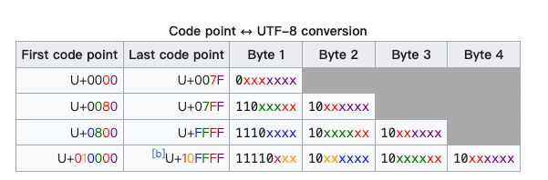

<!-- START doctoc generated TOC please keep comment here to allow auto update -->
<!-- DON'T EDIT THIS SECTION, INSTEAD RE-RUN doctoc TO UPDATE -->
**Table of Contents**  *generated with [DocToc](https://github.com/thlorenz/doctoc)*

- [unicode](#unicode)
  - [基本概念](#%E5%9F%BA%E6%9C%AC%E6%A6%82%E5%BF%B5)
  - [UTF-8 的例子](#utf-8-%E7%9A%84%E4%BE%8B%E5%AD%90)
  - [一个string类型的值在底层是怎样被表达的？](#%E4%B8%80%E4%B8%AAstring%E7%B1%BB%E5%9E%8B%E7%9A%84%E5%80%BC%E5%9C%A8%E5%BA%95%E5%B1%82%E6%98%AF%E6%80%8E%E6%A0%B7%E8%A2%AB%E8%A1%A8%E8%BE%BE%E7%9A%84)
  - [Unicode 与 Golang](#unicode-%E4%B8%8E-golang)
    - [使用](#%E4%BD%BF%E7%94%A8)
  - [源码](#%E6%BA%90%E7%A0%81)

<!-- END doctoc generated TOC please keep comment here to allow auto update -->

# unicode

中国常用的编码是 GBK 以及 GB2312。

Unicode 编码规范提供了三种不同的编码格式，即：UTF-8、UTF-16 和 UTF-32。其中的 UTF 是 UCS Transformation Format 的缩写。

而 UCS 又是 Universal Character Set 的缩写，但也可以代表 Unicode Character Set。所以，UTF 也可以被翻译为 Unicode 转换格式。它代表的是字符与字节序列之间的转换方式。

在这几种编码格式的名称中，“-”右边的整数的含义是，以多少个比特位作为一个编码单元。
以 UTF-8 为例，它会以 8 个比特，也就是一个字节，作为一个编码单元。并且，它与标准的 ASCII 编码是完全兼容的。也就是说，在[0x00, 0x7F]的范围内，这两种编码表示的字符都是相同的。
这也是 UTF-8 编码格式的一个巨大优势。UTF-8 是一种可变宽的编码方案。换句话说，它会用一个或多个字节的二进制数来表示某个字符，最多使用四个字节。
比如，对于一个英文字符，它仅用一个字节的二进制数就可以表示，而对于一个中文字符，它需要使用三个字节才能够表示。不论怎样，一个受支持的字符总是可以由 UTF-8 编码为一个字节序列。以下会简称后者为 UTF-8 编码值



比如汉字一般用三个 Byte，每个 Byte 的开头都是固定的，各种文字软件解析 UTF-8 编码的时候，它就会按照这个格式去解析，一旦解析错误（毕竟还可能会有不符合要求的数据，或者是文件错误了），错误的字节就会被替换为 "�" (U+FFFD)，然后神奇的地方就来了：即使遇到这种错误，它也不会影响接下来的其他字符的解析，因为这种编码不必从头开始，使得它可以自我同步（Self-synchronizing）


## 基本概念

- 代码点（ Code Point ）就是指Unicode 中为字符分配的编号，一个字符只占一个代码点，例如我们说到字符“汉”，它的代码点是 U+6C49

## UTF-8 的例子
我们拿 Unicode 中最受欢迎的 Emoji 表情 😂 来举例：它的 Code point 是 U+1F602（对，1F602 是以 16 进制表示的），然而在内存中它的存储方式的却是0xf09f9882，为什么？这就是 UTF-8 的编码了（注意对比上图的编码方式）：
```go
fmt.Printf("%b \n", []byte(`😂`)) // [11110000 10011111 10011000 10000010]
fmt.Printf("%x \n", []byte(`😂`)) // f09f9882

r, _ := utf8.DecodeRuneInString(`😂`)
fmt.Printf("%b \n", r) // 11111011000000010
fmt.Printf("%x \n", r) // 1f602


```
## 一个string类型的值在底层是怎样被表达的？

是在底层，一个string类型的值是由一系列相对应的 Unicode 代码点的 UTF-8 编码值来表达的。

在 Go 语言中，一个string类型的值既可以被拆分为一个包含多个字符的序列，也可以被拆分为一个包含多个字节的序列。前者可以由一个以rune为元素类型的切片来表示，而后者则可以由一个以byte为元素类型的切片代表。
rune是 Go 语言特有的一个基本数据类型，它的一个值就代表一个字符，即：一个 Unicode 字符。比如，'G'、'o'、'爱'、'好'、'者'代表的就都是一个 Unicode 字符。
我们已经知道，UTF-8 编码方案会把一个 Unicode 字符编码为一个长度在[1, 4]范围内的字节序列。所以，一个rune类型的值也可以由一个或多个字节来代表。

## Unicode 与 Golang
Golang 设计了一个 rune 类型来取代 Code point 的意义

```go
// rune is an alias for int32 and is equivalent to int32 in all ways. It is
// used, by convention, to distinguish character values from integer values.
type rune = int32
```
rune 看源码就知道，它就是 int32，刚好 4 个 Byte，刚可以用来表示 Unicode 的所有编码 UTF-8 与 UTF-16。

Golang 的源码是默认 UTF-8 编码的，这点从上面我给出的例子中就能明白，所以表情字符在编译的时候，就已经能被解析

### 使用

```go
func IsControl(r rune) bool  // 是否控制字符
func IsDigit(r rune) bool  // 是否阿拉伯数字字符，即 0-9
func IsGraphic(r rune) bool // 是否图形字符
func IsLetter(r rune) bool // 是否字母
func IsLower(r rune) bool // 是否小写字符
func IsMark(r rune) bool // 是否符号字符
func IsNumber(r rune) bool // 是否数字字符，比如罗马数字 Ⅷ 也是数字字符
func IsOneOf(ranges []*RangeTable, r rune) bool // 是否是 RangeTable 中的一个
func IsPrint(r rune) bool // 是否可打印字符
func IsPunct(r rune) bool // 是否标点符号
func IsSpace(r rune) bool // 是否空格
func IsSymbol(r rune) bool // 是否符号字符
func IsTitle(r rune) bool // 是否 title case
func IsUpper(r rune) bool // 是否大写字符
func Is(rangeTab *RangeTable, r rune) bool // r 是否为 rangeTab 类型的字符
func In(r rune, ranges ...*RangeTable) bool  // r 是否为 ranges 中任意一个类型的字符
```


## 源码

```go
// go1.20/src/unicode/utf8/utf8.go
const (
	RuneError = '\uFFFD'     // the "error" Rune or "Unicode replacement character"
	RuneSelf  = 0x80         // characters below RuneSelf are represented as themselves in a single byte.
	MaxRune   = '\U0010FFFF' // Maximum valid Unicode code point.
	UTFMax    = 4            // maximum number of bytes of a UTF-8 encoded Unicode character.
)

```


汉字字符集
```go
// go1.20/src/unicode/tables.go
var _Han = &RangeTable{
	R16: []Range16{
		{0x2e80, 0x2e99, 1},
		{0x2e9b, 0x2ef3, 1},
		{0x2f00, 0x2fd5, 1},
		{0x3005, 0x3007, 2},
		{0x3021, 0x3029, 1},
		{0x3038, 0x303b, 1},
		{0x3400, 0x4dbf, 1},
		{0x4e00, 0x9ffc, 1},
		{0xf900, 0xfa6d, 1},
		{0xfa70, 0xfad9, 1},
	},
	R32: []Range32{
		{0x16ff0, 0x16ff1, 1},
		{0x20000, 0x2a6dd, 1},
		{0x2a700, 0x2b734, 1},
		{0x2b740, 0x2b81d, 1},
		{0x2b820, 0x2cea1, 1},
		{0x2ceb0, 0x2ebe0, 1},
		{0x2f800, 0x2fa1d, 1},
		{0x30000, 0x3134a, 1},
	},
}
```

