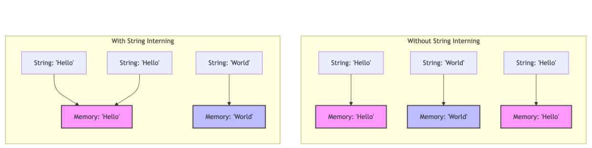
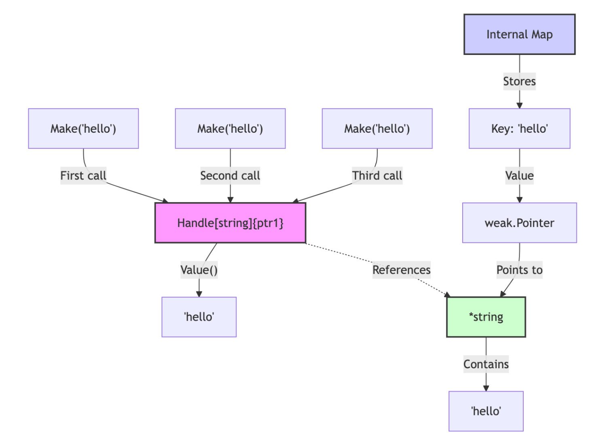

<!-- START doctoc generated TOC please keep comment here to allow auto update -->
<!-- DON'T EDIT THIS SECTION, INSTEAD RE-RUN doctoc TO UPDATE -->
**Table of Contents**  *generated with [DocToc](https://github.com/thlorenz/doctoc)*

- [字符串驻留（string interning）](#%E5%AD%97%E7%AC%A6%E4%B8%B2%E9%A9%BB%E7%95%99string-interning)
  - [原理](#%E5%8E%9F%E7%90%86)
  - [传统实现](#%E4%BC%A0%E7%BB%9F%E5%AE%9E%E7%8E%B0)
  - [unique 包](#unique-%E5%8C%85)
    - [优势](#%E4%BC%98%E5%8A%BF)
  - [参考](#%E5%8F%82%E8%80%83)

<!-- END doctoc generated TOC please keep comment here to allow auto update -->

# 字符串驻留（string interning）


Go的1.23版本中引入了一个新的标准库包unique，为Go开发者带来了高效的值interning能力。
这种能力不仅适用于字符串类型值，还可应用于任何可比较(comparable)类型的值.


传统的字符串驻留（string interning）技术。它是一种优化方法，旨在减少程序中重复字符串的内存占用，并提高字符串比较操作的效率。


## 原理
其基本原理是将相同的字符串值在内存中只存储一次，所有对该字符串的引用都指向同一内存地址，而不是为每个相同字符串创建单独的副本。




在不使用string interning的情况下，每个字符串都有自己的内存分配，即使内容相同，比如”Hello”字符串出现两次，占用了两块不同的内存空间。而在使用string interning的情况下，相同内容的字符串只存储一次，比如：两个”Hello”字符串引用指向同一个内存位置。


string interning在多种场景下非常有用，比如在解析文本格式(如XML、JSON)时，interning能高效处理标签名称经常重复的问题；在编译器或解释器的实现时，interning能够减少符号表中的重复项等。

传统的string interning通常使用哈希表或字典来存储字符串的唯一实例。每次出现新字符串时，程序首先会检查哈希表中是否已有相同的字符串，若存在则返回其引用，若不存在则将其存储在表中


## 传统实现

```go
var internPool map[string]string

// Intern returns a string that is equal to s but that may share storage with
// a string previously passed to Intern.
func Intern(s string) string {
    pooled, ok := internPool[s]
    if !ok {
        // Clone the string in case it's part of some much bigger string.
        // This should be rare, if interning is being used well.
        pooled = strings.Clone(s)
        internPool[pooled] = pooled
    }
    return pooled
}
```

问题
- 一旦字符串被intern，就永远不会被释放。
- 在多goroutine环境下使用需要额外的同步机制。
- 仅限于字符串类型值，不能用于其他类型的值。


2021年，tailscale为了实现可以高效表示ip地址的netaddr包，构建和开源了 github.com/go4org/intern 包，这是一个可用于量产级别的interning实现


## unique 包 

unique包的实现涉及到hashtrimap、细粒度锁以及与runtime内gc相关函数结合

### 优势
- 泛型支持: unique包可以处理任何可比较的类型，大大扩展了其应用范围
- 高效的内存管理: 包使用了运行时级别的弱指针实现，确保当所有相关的Handle[T](即强指针)都不再被使用时，内部map中的值可以被垃圾回收，这既避免了内存长期占用，也避免了内存泄漏问题
- 快速比较操作: 比较操作被优化为简单的指针比较，这比直接比较值(特别是对于大型结构体或长字符串内容)要快得多


```go
//  go1.23.0/src/unique/handle.go

type Handle[T comparable] struct {
	value *T
}

// Value returns a shallow copy of the T value that produced the Handle.
func (h Handle[T]) Value() T {
	return *h.value
}

// Make函数就是unique包的”Intern”函数，它接受一个可比较类型的值，返回一个intern后的值，
func Make[T comparable](value T) Handle[T] {
	// Find the map for type T.
	typ := abi.TypeOf(value)
	ma, ok := uniqueMaps.Load(typ)
	if !ok {
		// 如果不存在,则创建 uniqMap
		// This is a good time to initialize cleanup, since we must go through
		// this path on the first use of Make, and it's not on the hot path.
		setupMake.Do(registerCleanup)
		ma = addUniqueMap[T](typ)
	}
	m := ma.(*uniqueMap[T])

	// Keep around any values we allocate for insertion. There
	// are a few different ways we can race with other threads
	// and create values that we might discard. By keeping
	// the first one we make around, we can avoid generating
	// more than one per racing thread.
	var (
		toInsert     *T // Keep this around to keep it alive.
		toInsertWeak weak.Pointer[T]
	)
	newValue := func() weak.Pointer[T] {
		if toInsert == nil {
			toInsert = new(T)
			*toInsert = clone(value, &m.cloneSeq)
			toInsertWeak = weak.Make(toInsert)
		}
		return toInsertWeak
	}
	var ptr *T
	for {
		// Check the map.
		wp, ok := m.Load(value)
		if !ok {
			// Try to insert a new value into the map.
			wp, _ = m.LoadOrStore(value, newValue())
		}
		// Now that we're sure there's a value in the map, let's
		// try to get the pointer we need out of it.
		ptr = wp.Strong()
		if ptr != nil {
			break
		}
		// The weak pointer is nil, so the old value is truly dead.
		// Try to remove it and start over.
		m.CompareAndDelete(value, wp)
	}
	runtime.KeepAlive(toInsert)
	return Handle[T]{ptr}
}

```


## 参考

- [Go unique包：突破字符串局限的通用值Interning技术实现](https://tonybai.com/2024/09/18/understand-go-unique-package-by-example/)