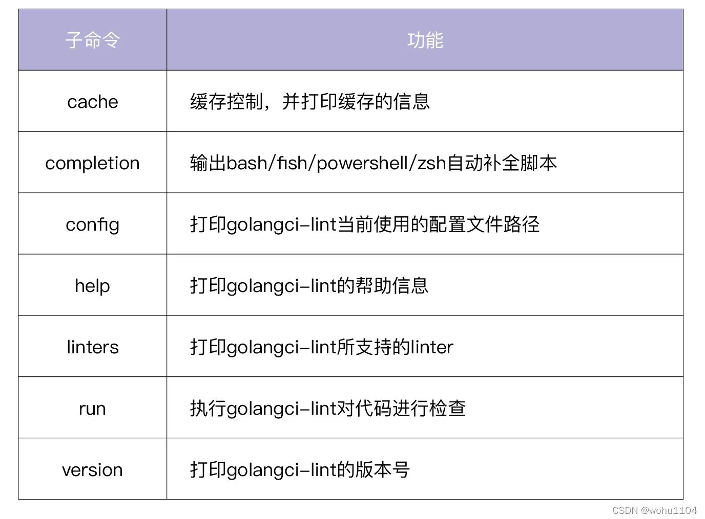
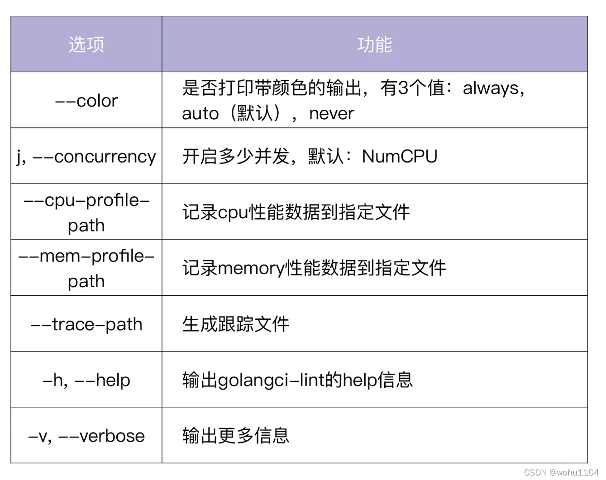
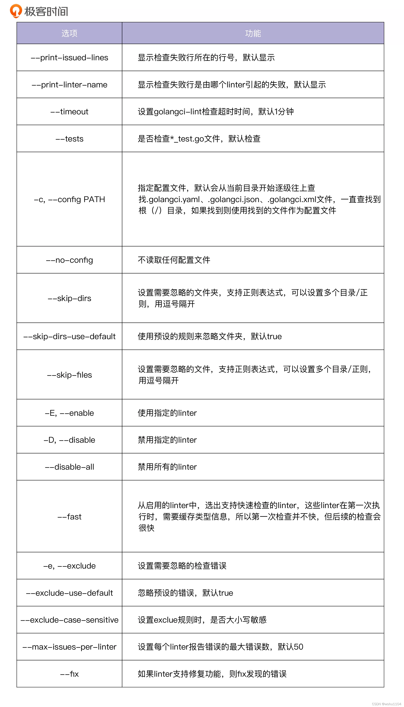

# golangci-lint

GolangCI-Lint是一个lint聚合器，它的速度很快，平均速度是gometalinter的5倍。
它易于集成和使用，具有良好的输出并且具有最小数量的误报。而且它还支持go modules。最重要的是免费开源

速度快的原因有三个：可以并行检查代码；可以复用 go build 缓存；会缓存分析结果

## 应用

golangci-lint用于许多开源项目中，比如kubernetes、Prometheus、TiDB等都使用golangci-lint用于代码检查，TIDB的makefile中的check-static使用golangci-lint进行代码检查


## 常用的Linter介绍

```yaml
  - deadcode, 检查根本没用的代码片段，不包括没使用的函数
  - depguard, 通过自定义依赖包白、黑名单，确保import的包都是可控的
  - errcheck, 用于检查未检查的error返回值, 能防止一些严重的bug case 
  - goconst， 查找代码中出现的重复常量字符串，给出可以定义为常量的优化建议
  - gocritic， The most opinionated Go source code linter
  - gofmt，go 格式化工具
  - goimports， 检查没使用的imports
  - golint，不同于fmt，主要检查代码风格问题
  - gomnd， 检测幻数的工具，什么是幻数？幻数是一种数字文字，没有定义为常量，但可能会更改，因此可能难以更新。 直接在任何源代码中使用数字而不进行解释被认为是不好的编程习惯。 它使程序更难以阅读，理解和维护。
  - goprintffuncname，PrintF 类的函数，应该已f结尾
  - gosec， 检查源码安全问题，包括https://github.com/securego/gosec#available-rules
  - gosimple, 简化代码工具
  - govet， 检查Go 代码正确性的工具
  - ineffassign, 检查无效赋值
  - interfacer, interface 建议
  - lll， 每行代码长度检查，不超过150字符
  - misspell， 拼写检查，防止线上出现拼写出错导致的bug
  - noctx，http request 的context 检查
  - nolintlint， 用于查找格式错误或解释不充分的内容。nolint 必须按格式加以解释：//nolint:gosec // this is not used in a secure application
  - rowserrcheck，检查sql.Rows.Err是否被成功检查到
  - scopelint，检查没固定的变量可能引发的问题
  - staticcheck， 静态检查工具
  - structcheck， 检查没有使用的结构体filed
  - stylecheck, 风格检查工具
  - typecheck, 类型检查工具
  - unconvert, 去掉不必要的类型转换
  - unparam, 报告没使用的函数入参
  - unused,  检查没使用的常量，变量，函数和类型
  - varcheck, 检查没使用的全量变量和常量
  - whitespace, 检查函数前后没必要的空行
```


gosimple 代码中有需要优化的地方
```go
err = errors.New(fmt.Sprintf("%s", val))  // 代码检查会直接推荐你使用fmt.Errorf(...)

strChan := make(chan string,0) // 代码检查会提示你直接使用 make(chan string)

// select中只有一个case 代码检查会提示你去掉select

```

ineffassign：检测变量的赋值
```go
var index byte = 0

//以上代码会提示   ineffectual assignment to index(无效的分配，因为index的默认值为0)
```

### linter 分两类
这些 linter 分为两类，一类是默认启用的，另一类是默认禁用的。每个 linter 都有两个属性：

- fast：true/false，如果为 true，说明该 linter 可以缓存类型信息，支持快速检查。因为第一次缓存了这些信息，所以后续的运行会非常快。
- auto-fix：true/false，如果为 true 说明该 linter 支持自动修复发现的错误；如果为 false 说明不支持自动修复。

## 命令介绍


```shell
golangci-lint run --tests=false --timeout=5m --new-from-rev=master -c .golangci.yml ./... 相对master分支增量扫描

```

全局配置


### run 命令



### cache 命令

cache 命令用来进行缓存控制，并打印缓存的信息。它包含两个子命令：

clean 用来清除 cache，当我们觉得 cache 的内容异常，或者 cache 占用空间过大时，可以通过golangci-lint cache clean 清除 cache。
status 用来打印 cache 的状态，比如 cache 的存放目录和 cache 的大小，例如：


## nolint 用法：
1. 忽略某一行所有 linter 的检查
```go
var bad_name int //nolint
```

2. 忽略某一行指定 linter 的检查，可以指定多个 linter，用逗号 , 隔开
```go
var bad_name int //nolint:golint,unused
```

3. 忽略某个代码块的检查。
```go
//nolint
func allIssuesInThisFunctionAreExcluded() *string {
  // ...
}

//nolint:govet
var (
  a int
  b int
)
```

4. 忽略某个文件的指定 linter 检查:在 package xx 上面一行添加 //nolint 注释。
```go
//nolint:unparam
package pkg
...
```

## 建议在根目录下放一个通用的 golangci-lint 配置文件
在 / 目录下存放通用的 golangci-lint 配置文件，可以让你不用为每一个项目都配置 golangci-lint。当你需要为某个项目单独配置 golangci-lint 时，只需在该项目根目录下增加一个项目级别的 golangci-lint 配置文件即可。


## 结合 pre-commit应用

在项目开发中，我们都会使用到 git，因此我们可以将代码静态检查放在一个 git 触发点上，而不用每次写完代码手动去执行 golangci-lint run 命令。这里，我们就需要用到 git hooks。


### git hooks
```shell
/Users/python/Desktop/github.com/Danny5487401/go_advanced_code/.git/hooks
```
git hooks 是 git 的一种钩子机制，可以让用户在 git 操作的各个阶段执行自定义的逻辑。
git hooks  在项目根目录的 .git/hooks 下面配置，配置文件的名称是固定的，实质上就是一个个 shell 脚本。根据 git 执行体，钩子被分为客户端钩子和服务端钩子两类。

- 客户端钩子包括：pre-commit、prepare-commit-msg、commit-msg、post-commit等，主要用于控制客户端git的提交工作流。
- 服务端钩子：pre-receive、post-receive、update，主要在服务端接收提交对象时、推送到服务器之前调用


## 参考地址
1. [官网](https://github.com/golangci/golangci-lint)
2. [pre-commit结合golang-ci](https://mp.weixin.qq.com/s/h6cez-1E-WumjI7FetlpFQ)