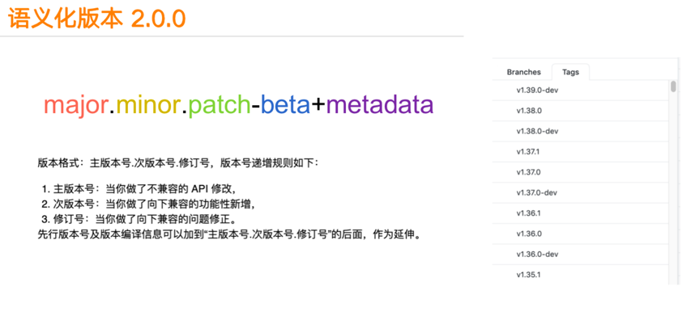
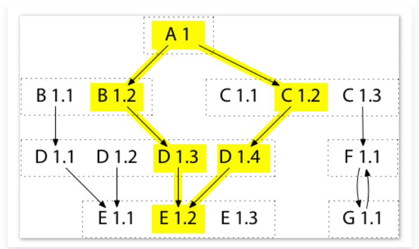
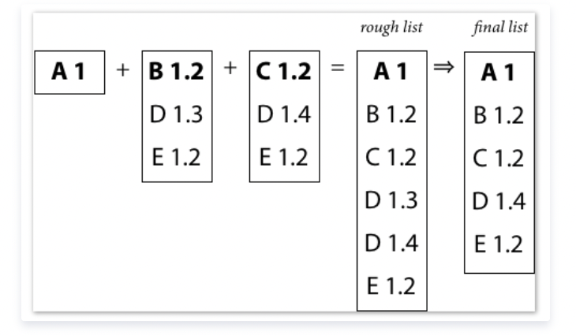
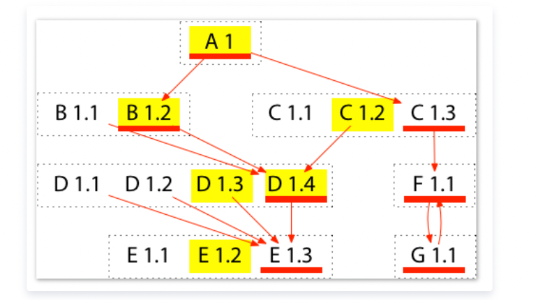
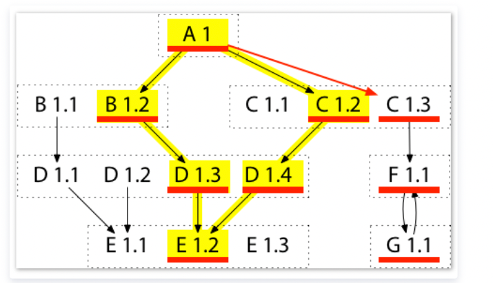
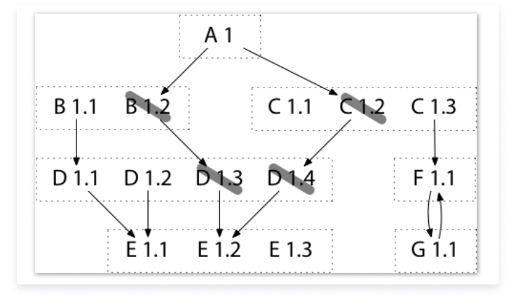
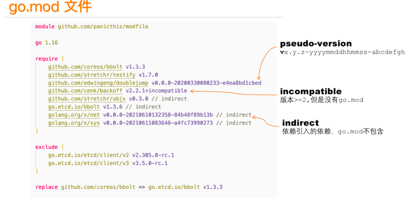

# module包管理

go官方库管理方式叫做go module。 先前，我们的库都是以package来组织的，package以一个文件或者多个文件实现单一的功能，一个项目包含一个package或者多个package。
Go module就是一组统一打版和发布的package的集合，在根文件下有go.mod文件定义module path和依赖库的版本，package以子文件夹的形式存在module中，对package path就是 module path +"/"+ package name的形式。

一般我们项目都是单module的形式，项目主文件夹下包含go.mod,子文件夹定义package，或者主文件夹也是一个package。但是一个项目也可以包含多个module,只不过这种方式不常用而已。

## 背景
- vendor(2015.06)；Go 1.5版本引入vendor(类似godep)，存放于项目根目录，编译时优先使用vendor目录，之后再去GOPATH，GOROOT目录查找(解决GOPATH无法管控依赖变更和丢失的问题)
- dep(2016.08)：dep期望统一Go依赖管理，虽然提供了兼容其它依赖管理工具的功能，但是本质上还是利用GOPATH和vendor解决依赖管理
- Go Modules(2018.08)：Go 1.11发布的官方依赖管理解决方案，并最终统一了Go依赖管理(by Russ Cox)。Go Modules以semantic version(语义版本化)和Minimal Version Selection, MVS(最小版本选择)为核心，相比dep更具稳定性；同时也解决了vendor代码库依赖过于庞大，造成存储浪费的问题

## 原理

### semantic version语义化版本 2.0.0

Go module遵循语义化版本规范 2.0.0。语义化版本规范 2.0.0规定了版本号的格式，每个字段的意义以及版本号比较的规则等等.

如果你想为你的项目发版，你可以设置tag为上面的格式，比如v1.3.0、v2.0.0-rc.1等等。metadata中在Go版本比较时是不参与运算的，只是一个辅助信息。
- MAJOR version when you make incompatible API changes(不兼容的修改)
- MINOR version when you add functionality in a backwards compatible manner(特性添加，版本兼容)
- PATCH version when you make backwards compatible bug fixes(bug修复，版本兼容)

### Minimal Version Selection最小版本选择算法

在Minimal version selection之前，Go的选择算法很简单，且提供了 2 种不同的版本选择算法，但都不正确：
1. go get 的默认行为：若本地有一个版本，则使用此版本；否则下载使用最新的版本。这种模式将导致使用的版本太老：假设已经安装了B 1.1，并执行 go get 下载，那么go get 不会更新到B 1.2，这样就会导致因为B 1.1太老构建失败或有bug
2. go get -u 的行为：下载并使用所有模块的最新版本。这种模式可能会因为版本太新而失败：若你运行 go get -u 来下载A依赖模块，会正确地更新到B 1.2。同时也会更新到C 1.3 和E 1.3，但这可能不是 A 想要的，因为这些版本可能未经测试，无法正常工作

这 2 种算法的构建是低保真构建（Low-Fidelity Builds）：虽然都想复现模块 A 的作者所使用的构建，但这些构建都因某些不明确的原因而变得有些偏差

我对最小版本选择算法中'最小'的理解如下：

- 最小的修改操作
- 最小的需求列表
- 最小的模块版本。这里比较的对象是该模块的最新版本：如果项目需要依赖的模块版本是v1.2，而该模块实际最新的版本是v1.3，那么最小版本选择算法会选取v1.2版本而非v1.3(为了尽可能提高构建的稳定性和重复性)。也即'最小版本'表示项目所需要依赖模块的最小版本号(v1.2)，而不是该模块实际的最小版本号(v1.1)，也并非该模块实际的最大版本号(v1.3)

最小版本选择算法涉及下面四个方面
1. Construct the current build list. 构建项目当前build list
2. Upgrade all modules to their latest versions. 升级所有依赖模块到它们的最新版本
3. Upgrade one module to a specific newer version. 升级某个依赖模块到指定版本
4. Downgrade one module to a specific older version. 将某个依赖模块降级到指定版本

####  Algorithm 1: Construct Build List●


以通过图遍历以及递归算法(图递归遍历)来构建依赖列表。从根节点出发依次遍历直接依赖B1.2以及C1.2，然后递归遍历。这样根据初始的依赖关系(指定版本：A1->B1.2，A1->C1.2)，会按照如下路径选取依赖：


首先构建empty build list，然后从根节点出发递归遍历依赖模块获取rough build list，这样rough build list中可能会存在同一个依赖模块的不同版本(如D1.3与D1.4)，通过选取最新版本构建final build list(最终的构建列表一个模块只取一个版本，即这些版本中的最新版)，如下：




#### Algorithm 2. Upgrade All Modules



这里面添加了新的依赖模块：E1.3，G1.1，F1.1以及C1.3。新rough build list会将新引入的依赖模块和旧的rough build list模块(黄色部分)进行合并，并从中选取最大版本，最终构建final build list(上图红线标识模块)。

上述例子中A1的go.mod文件会构建如下：
```go
module A1
go 1.14
require (
	B1.2
	C1.3
	D1.4 // indirect
	E1.3 // indirect)
```
可以看到上述go.mod文件中，没有出现F1.1以及G1.1，这是因为F1.1存在于C1.3的go.mod文件中，而G1.1存在于F1.1的go.mod文件中，因此没有必要将这两个模块填写到A1的go.mod文件中；


#### Algorithm 3. Upgrade One Module
```shell
go get C@1.3
```

当我们升级某个模块时，会在构建图中将指向这个模块的箭头挪向新版本(A1->C1.2挪向A1->C1.3)并递归引入新的依赖模块。例如在升级C1.2->C1.3时，会新引入F1.1以及G1.1模块(对一个模块的升级或者降级可能会引入其他依赖模块)，而新的rough build list(红线)将由旧rough build list(黄色部分)与新模块(C1.3，F1.1以及G1.1)构成，并最终选取其中最大版本合成新的final build list(A1，B1.2，C1.3，D1.4，E1.2，F1.1以及G1.1)


注意最终构建列表中模块D为D1.4而非D1.3，这是因为当升级某个模块时，只会添加箭头，引入新模块；而不会减少箭头，从而删除或者降级某些模块；

比如若从 A 至 C 1.3 的新箭头替换了从 A 至 C 1.2 的旧箭头，升级后的构建列表将会丢掉 D 1.4。也即是这种对 C 的升级将导致 D 的降级(降级为D1.3)，这明显是预料之外的，且不是最小修改

一旦我们完成了构建列表的升级，就可运行前面的算法 R 来决定如何升级需求列表(go.mod)。这种情况下，我们最终将以C1.3替换C 1.2，但同时也会添加一个对D1.4的新需求，以避免D的意外降级(因为按照算法1，D1.3才会出现在最终构建列表中)。如下

```go
module A1
go 1.14
require (
	B1.2
	C1.3
	D1.4 // indirect)
```

#### Algorithm 4. Downgrade One Module


```shell
go get D@1.2
```
这里将D降级为D1.2，会先删除D1.3以及D1.4模块，然后回溯删除B1.2以及C1.2模块，最终确定到B1.1以及C1.1版本(它们分别是B和C不依赖>=D1.3模块的最新版本了)，

在确定直接依赖是B1.1以及C1.1之后，会递归将其依赖模块引入，并添加指定版本D1.2，那么按照算法1可以很容易得出构建列表为：A1，B1.1，D1.2(D1.1 vs D1.2)，E1.1以及C1.1

同时，为了保证最小修改，其它不需要降级的模块我们需要尽可能保留，比如：E1.2。这样，final build list就为：A1，B1.1，D1.2(D1.1 vs D1.2)，E1.2(E1.1 vs E1.2)以及C1.1

```go
module A1
go 1.14
require (
	B1.1
	C1.1
	D1.2 // indirect
	E1.2 // indirect)
```


## go mod&sum格式
go.mod以及go.sum一般会成对出现在项目根目录中。其中，go.mod负责记录需求列表(用于构建依赖模块)；而go.sum用于记录安全性以及完整性校验

## go.sum

```go
 <模块> <版本>[/go.mod] <哈希>
```

- 带有/go.mod代表该版本模块的go.mod文件hash值

- 不带/go.mod代表该版本模块源代码的hash值

```go
   cloud.google.com/go v0.26.0/go.mod h1:aQUYkXzVsufM+DwF1aE+0xfcU+56JwCaLick0ClmMTw=   cloud.google.com/go v0.34.0/go.mod h1:aQUYkXzVsufM+DwF1aE+0xfcU+56JwCaLick0ClmMTw=   cloud.google.com/go v0.38.0 h1:ROfEUZz+Gh5pa62DJWXSaonyu3StP6EA6lPEXPI6mCo=   cloud.google.com/go v0.38.0/go.mod h1:990N+gfupTy94rShfmMCWGDn0LpTmnzTp2qbd1dvSRU=   cloud.google.com/go v0.41.0 h1:NFvqUTDnSNYPX5oReekmB+D+90jrJIcVImxQ3qrBVgM=   cloud.google.com/go v0.41.0/go.mod h1:OauMR7DV8fzvZIl2qg6rkaIhD/vmgk4iwEw/h6ercmg=   contrib.go.opencensus.io/exporter/ocagent v0.4.12/go.mod h1:450APlNTSR6FrvC3CTRqYosuDstRB9un7SOx2k/9ckA=   github.com/AlekSi/pointer v1.1.0 h1:SSDMPcXD9jSl8FPy9cRzoRaMJtm9g9ggGTxecRUbQoI=   github.com/AlekSi/pointer v1.1.0/go.mod h1:y7BvfRI3wXPWKXEBhU71nbnIEEZX0QTSB2Bj48UJIZE=   github.com/Azure/azure-sdk-for-go v16.2.1+incompatible/go.mod h1:9XXNKU+eRnpl9moKnB4QOLf1HestfXbmab5FXxiDBjc=   github.com/Azure/azure-sdk-for-go v31.1.0+incompatible h1:5SzgnfAvUBdBwNTN23WLfZoCt/rGhLvd7QdCAaFXgY4=   github.com/Azure/azure-sdk-for-go v31.1.0+incompatible/go.mod h1:9XXNKU+eRnpl9moKnB4QOLf1HestfXbmab5FXxiDBjc=   github.com/Azure/azure-sdk-for-go v35.0.0+incompatible h1:PkmdmQUmeSdQQ5258f4SyCf2Zcz0w67qztEg37cOR7U=   github.com/Azure/azure-sdk-for-go v35.0.0+incompatible/go.mod h1:9XXNKU+eRnpl9moKnB4QOLf1HestfXbmab5FXxiDBjc=
```
go.sum文件可以不存在，当go.sum文件不存在时默认会到远程校验数据库进行校验(通过GOSUMDB设置地址)，当然也可以设置为不校验(GONOSUMDB)


## go.mod
go module最重要的是go.mod文件的定义，它用来标记一个module和它的依赖库以及依赖库的版本。会放在module的主文件夹下，一般以go.mod命名。

一个go.mod内容类似下面的格式:
```go
module github.com/panicthis/modfile
go 1.16
require (
	github.com/cenk/backoff v2.2.1+incompatible
	github.com/coreos/bbolt v1.3.3
	github.com/edwingeng/doublejump v0.0.0-20200330080233-e4ea8bd1cbed
	github.com/stretchr/objx v0.3.0 // indirect
	github.com/stretchr/testify v1.7.0
	go.etcd.io/bbolt v1.3.6 // indirect
	go.etcd.io/etcd/client/v2 v2.305.0-rc.1
	go.etcd.io/etcd/client/v3 v3.5.0-rc.1
	golang.org/x/net v0.0.0-20210610132358-84b48f89b13b // indirect
	golang.org/x/sys v0.0.0-20210611083646-a4fc73990273 // indirect
)
exclude (
	go.etcd.io/etcd/client/v2 v2.305.0-rc.0
	go.etcd.io/etcd/client/v3 v3.5.0-rc.0
)
retract (
    v1.0.0 // 废弃的版本，请使用v1.1.0
)
```


### module path
go.mod的第一行是module path, 一般采用仓库+module name的方式定义。这样我们获取一个module的时候，就可以到它的仓库中去查询，或者让go proxy到仓库中去查询。
```go
	
module github.com/panicthis/modfile
```

如果你的版本已经大于等于2.0.0，按照Go的规范，你应该加上major的后缀，module path改成下面的方式:
```go
module github.com/panicthis/modfile/v2
//或则
module github.com/panicthis/modfile/v3
```
而且引用代码的时候，也要加上v2、v3、vx后缀，以便和其它major版本进行区分。

这是一个很奇怪的约定，带来的好处是你一个项目中可以使用依赖库的不同的major版本，它们可以共存。


### go directive

第二行是go directive。格式是 go 1.xx,它并不是指你当前使用的Go版本，而是指名你的代码所需要的Go的最低版本。
```go
go 1.16
```
因为Go的标准库也有所变化，一些新的API也被增加进来，如果你的代码用到了这些新的API,你可能需要指名它依赖的go版本。

这一行不是必须的，你可以不写。


### require
require段中列出了项目所需要的各个依赖库以及它们的版本，除了正规的v1.3.0这样的版本外，还有一些奇奇怪怪的版本和注释，
```go
github.com/coreos/bbolt v1.3.3
```

伪版本号

```go
github.com/edwingeng/doublejump v0.0.0-20200330080233-e4ea8bd1cbed
```
上面这个库中的版本号就是一个伪版本号v0.0.0-20200330080233-e4ea8bd1cbed,这是go module为它生成的一个类似符合语义化版本2.0.0版本，实际这个库并没有发布这个版本

正式因为这个依赖库没有发布版本，而go module需要指定这个库的一个确定的版本，所以才创建的这样一个伪版本号。

go module的目的就是在go.mod中标记出这个项目所有的依赖以及它们确定的某个版本。

这里的20200330080233是这次提交的时间，格式是yyyyMMddhhmmss, 而e4ea8bd1cbed就是这个版本的commit id,通过这个字段，就可以确定这个库的特定的版本

而前面的v0.0.0可能有多种生成方式，主要看你这个commit的base version:

- vX.0.0-yyyymmddhhmmss-abcdefabcdef: 如果没有base version,那么就是vX.0.0的形式
- vX.Y.Z-pre.0.yyyymmddhhmmss-abcdefabcdef： 如果base version是一个预发布的版本，比如vX.Y.Z-pre,那么它就用vX.Y.Z-pre.0的形式
- vX.Y.(Z+1)-0.yyyymmddhhmmss-abcdefabcdef: 如果base version是一个正式发布的版本，那么它就patch号加1，如vX.Y.(Z+1)-0


### indirect注释
```go
go.etcd.io/bbolt v1.3.6 // indirect
golang.org/x/net v0.0.0-20210610132358-84b48f89b13b // indirect
golang.org/x/sys v0.0.0-20210611083646-a4fc73990273 // indirect
```

如果用一句话总结，间接的使用了这个库，但是又没有被列到某个go.mod中，当然这句话也不算太准确，更精确的说法是下面的情况之一就会对这个库加indirect后缀：

- 当前项目依赖A,但是A的go.mod遗漏了B, 那么就会在当前项目的go.mod中补充B, 加indirect注释
- 当前项目依赖A,但是A没有go.mod,同样就会在当前项目的go.mod中补充B, 加indirect注释
- 当前项目依赖A,A又依赖B,当对A降级的时候，降级的A不再依赖B,这个时候B就标记indirect注释


### incompatible

有些库后面加了incompatible后缀，但是你如果看这些项目，它们只是发布了v2.2.1的tag,并没有+incompatible后缀。
```go
	
github.com/cenk/backoff v2.2.1+incompatible
```

这些库采用了go.mod的管理，但是不幸的是，虽然这些库的版major版本已经大于等于2了，但是他们的module path中依然没有添加v2、v3这样的后缀。

所以go module把它们标记为incompatible的，虽然可以引用，但是实际它们是不符合规范的。


### exclude
```go
exclude (
	go.etcd.io/etcd/client/v2 v2.305.0-rc.0
	go.etcd.io/etcd/client/v3 v3.5.0-rc.0
)
```
这样，Go在版本选择的时候，就会主动跳过这些版本，比如你使用go get -u ......或者go get github.com/xxx/xxx@latest等命令时，会执行version query的动作，这些版本不在考虑的范围之内


### replace 
replace也是常用的一个手段，用来解决一些错误的依赖库的引用或者调试依赖库。
```go
replace github.com/coreos/bbolt => go.etcd.io/bbolt v1.3.3
replace github.com/panicthis/A v1.1.0 => github.com/panicthis/R v1.8.0
replace github.com/coreos/bbolt => ../R
```

比如etcd v3.3.x的版本中错误的使用了github.com/coreos/bbolt作为bbolt的module path,其实这个库在它自己的go.mod中声明的module path是go.etcd.io/bbolt，又比如etcd使用的grpc版本有问题，你也可以通过replace替换成所需的grpc版本。

甚至你觉得某个依赖库有问题，自己fork到本地做修改，想调试一下，你也可以替换成本地的文件夹。

replace可以替换某个库的所有版本到另一个库的特定版本，也可以替换某个库的特定版本到另一个库的特定版本。


### retract

retract是go 1.16中新增加的内容，借用学术界期刊撤稿的术语，宣布撤回库的某个版本。

如果你误发布了某个版本，或者事后发现某个版本不成熟，那么你可以推一个新的版本，在新的版本中，声明前面的某个版本被撤回，提示大家都不要用了。

撤回的版本tag依然还存在，go proxy也存在这个版本，所以你如果强制使用，还是可以使用的，否则这些版本就会被跳过。

和exclude的区别是retract是这个库的owner定义的， 而exclude是库的使用者在自己的go.mod中定义的


## 最佳实践

- 尽量不要手动修改go.mod文件，通过go命令来操作go.mod文件

- 尽量遵守semantic version(语义化版本)发布和管理模块

- 利用go mod tidy进行自动整理操作。该模块会清理需求列表：删除不需要的需求项，添加需要的需求项

- 本地调试：如果本地有依赖模块还未发布，则可以利用如下方法进行调试：
    - replace：将依赖模块修改成本地依赖包地址，这样就可以在本地修改依赖包的同时进行编译调试了(需要注意go.mod文件内容发生修改，注意不要提交)
    - vendor：默认情况下go build会忽略vendor目录；当添加-mod=vendor选项时，go build会优先查找vendor目录下的依赖模块。因此可以将本地开发的依赖包放置在vendor目录，并将vendor通过.gitignore文件设置在版本控制之外，这样既可以满足本地调试，同时也不影响版本提交